# QQQ 买入信号与资产配置推荐监控系统 (v8.0)

一个面向 QQQ/QLD/Cash 的生产级推荐引擎，基于 **v8.0 线性决策流水线架构**。

v8.0 明确了系统边界：
- 只推荐 **组合级目标 Beta**
- 只推荐 **增量资金入场节奏**
- **不计算金额**
- **不管理账户**
- **不自动执行交易**

## 🚀 v8.0 核心变化：线性指令链

### Tier-0 宏观结构层
`assess_structural_regime()` 基于信用利差和 ERP 输出：
`EUPHORIC | NEUTRAL | RICH_TIGHTENING | TRANSITION_STRESS | CRISIS`

其中：
- 对 **Risk Controller** 是硬约束
- 对 **Deployment Controller** 是软约束

### Risk Controller
基于 Class A 宏观特征和 Tier-0 regime，输出：
- `risk_state`
- `target_exposure_ceiling`
- `target_cash_floor`
- `tier0_applied`

### Deployment Controller
在 Tier-0 软约束下，输出增量资金部署节奏：
`DEPLOY_IDLE | DEPLOY_SLOW | DEPLOY_BASE | DEPLOY_FAST | DEPLOY_PAUSE`

关键语义：
- `DEPLOY_IDLE`：没有新增资金
- `RICH_TIGHTENING`：默认降速，但强超跌时允许提到 `DEPLOY_BASE`
- `CRISIS`：增量部署完全暂停

### Beta Recommendation
`build_beta_recommendation()` 取代旧的金额执行接口。

系统现在只输出：
- `target_beta`
- 推荐 `QQQ / QLD / Cash`
- `should_adjust`
- `adjustment_reason`

## 📊 性能与韧性 (v8.0 回测)
最新全样本回测（`docker compose run --rm backtest`，1999-2026）：
- **策略最大回撤：** `-6.6%`
- **Baseline DCA 最大回撤：** `-35.1%`
- **MDD 改善：** 绝对改善 `28.6%`
- **Realized Beta：** `0.04`
- **Turnover Ratio：** `2.13`
- **NAV Integrity：** `1.000000`
- **RICH_TIGHTENING 左侧窗口：** `513`
- **CRISIS 违规部署次数：** `0`

## 🧭 认证候选参考 (v8.0)
v8.0 运行时不再使用旧 `AllocationState` 默认矩阵，而是从认证注册表中选择：

- `RISK_NEUTRAL`：`neutral-base-001`（`70/10/20`, beta `0.90`）或 `neutral-low-drift`（`80/5/15`, beta `0.90`）
- `RISK_REDUCED`：`reduced-tight-001`（`30/0/70`, beta `0.30`）或 `reduced-base-001`（`50/0/50`, beta `0.50`）
- `RISK_DEFENSE`：`defense-001`（`30/0/70`, beta `0.30`）
- `RISK_EXIT`：若无合规候选，显式退回 `100% Cash`

## 🛠 核心层级 (Core Tiers)
1.  **Tier 0 (宏观指挥官):** 监控信用加速、净流动性和融资压力。定义 **结构性制度 (Structural Regime)**。
2.  **Tier 1 (战术情绪):** VIX Z-Score、恐慌与贪婪指数、多因子估值/价格背离分析。
3.  **Tier 2 (市场结构):** 实时期权墙 (Put/Call Walls) 和 Gamma Flip 探测。
4.  **战略层 (Strategic Layer):** 加载认证候选，遵守 beta ceiling，并输出纯推荐结果。

## 🧭 决策架构深度解析 (历史 v6.4 附录)

当前生效的是上面的 v8.0 线性流水线，以及 `docs/v8.0_linear_pipeline_*` 文档。
下面的图保留为 pre-v8 版本的历史背景说明。

系统作为一个 **多层确定性状态机** 运行，通过“宏观定调、战术择时、结构确认”的三层过滤机制，将复杂的海量指标解析为清晰的投资动作。

```mermaid
flowchart TD
    %% 输入层
    subgraph Raw_Inputs [1. 指标输入层：系统的“感知神经”]
        direction LR
        subgraph Macro_Data [宏观与流动性]
            WALCL[美联储资产: WALCL]
            TGA[财政部账户: WDTGAL]
            RRP[隔夜逆回购: RRPONTSYD]
            CS[信用利差: BAMLH0A0HYM2]
            RY[实际利率: DFII10]
            FPE[前瞻市盈率: Forward P/E]
        end
        subgraph Market_Data [价格与情绪]
            PX[QQQ 价格 / OHLCV]
            VIX[VIX 水平 / Z-Score]
            FG[恐慌与贪婪指数]
            BR[涨跌家数比: Breadth]
            MA[MA50 & MA200 均线]
            MFI[资金流向指数: MFI]
            RSI[相对强弱指数: RSI]
        end
        subgraph Options_Data [市场结构]
            OI[期权未平仓量]
            G_FLIP[Gamma Flip 水平]
            PW[看跌期权墙: Put Wall]
            CW[看涨期权墙: Call Wall]
            POC[成交量控制点: POC]
        end
        subgraph Fundamental_Lead [基本面前瞻]
            ERB[盈利修订宽度: ERB]
            FCF[自由现金流收益率: FCF]
        end
    end

    %% TIER 0: 宏观指挥官
    subgraph Tier0 [2. Tier 0 结构层：系统的“天气预报”]
        direction TB
        WALCL & TGA & RRP --> LIQ_ROC[流动性变化率]
        CS --> CS_ACCEL[信用利差加速]
        FPE & RY --> ERP[股权风险溢价]
        FS[融资压力] --> BYPASS{防御性旁路?}
        
        CS_ACCEL & LIQ_ROC --> BYPASS
        BYPASS -- 高压 --> L3["L3: 现金避险 (CASH_FLIGHT)"]
        BYPASS -- 中压 --> L2["L2: 去杠杆 (DELEVERAGE)"]
        BYPASS -- 低压 --> L1["L1: 防御观察 (WATCH_DEFENSE)"]
        
        CS & ERP --> REGIME[结构性制度决策]
        REGIME --> S_STATES["危机 (CRISIS) | 转型压力 | 中性 | 亢奋"]
    end

    %% TIER 1: 战术引擎
    subgraph Tier1 [3. Tier 1 战术层：系统的“实战格斗”]
        direction TB
        PX & MA --> S1[52周回撤 & MA200 偏离]
        VIX & FG & BR --> S2[情绪与宽度梯度]
        
        %% 背离子引擎
        PX & MFI & RSI & ERB --> DIV[背离分析子引擎]
        DIV --> DIV_BONUS[加分: +5 到 +20]
        
        %% 估值子引擎
        FPE & FCF --> VAL[估值分析子引擎]
        VAL --> VAL_ADJ[调整: -10 到 +15]

        S1 & S2 & DIV_BONUS & VAL_ADJ --> T1_SCORE[Tier 1 总分: 0-100]
        
        PX --> VELOCITY["下行速度: 恐慌 (PANIC) | 阴跌 | 冷静"]
        T1_SCORE & VELOCITY --> TACTICAL_STATE["战术状态: 恐慌 | 投降 | 压力 | 冷静"]
    end

    %% TIER 2: 市场结构
    subgraph Tier2 [4. Tier 2 确认层：系统的“雷达扫描”]
        PW & CW & POC --> WALLS[支撑确认 / 破位 / POC 奖金]
        G_FLIP & PX --> GAMMA[Gamma 正值 / 负值]
        WALLS & GAMMA --> T2_ADJ[Tier 2 调整: -30 到 +15]
    end

    %% 聚合与搜索
    subgraph Strategy [5. v6.4 智能配置搜索：系统的“精算师”]
        S_STATES & TACTICAL_STATE --> ALLOC_STATE[配置状态]
        ALLOC_STATE --> CANDIDATES[SRD-6.4 候选比例带]
        
        CANDIDATES --> BACKTEST[实时路径微回测]
        PX --> BACKTEST
        
        BACKTEST --> AC5_GATE{AC-5: 回撤 < 30%?}
        AC5_GATE -- 否 --> SAFE_FALLBACK["全局安全回退: 100% 现金"]
        AC5_GATE -- 是 --> RANKING["排序: CAGR > MDD > 贝塔保真度"]
    end

    %% 最终执行
    RANKING --> FINAL["最终决策: QQQ : QLD : 现金"]
    L3 & L2 & L1 --> FINAL
    SAFE_FALLBACK --> FINAL
    T2_ADJ --> FINAL
```



### 🧠 决策逻辑详细说明

#### 1. 输入层 (Raw Indicators)
这是系统的“感知神经”，负责收集市场全维数据：
*   **宏观与流动性 (Macro & Liquidity):** 关注钱的总量。**WALCL** 是美联储的“印钞机”规模，**TGA** 和 **RRP** 是流动性的“蓄水池”。
*   **市场结构 (Market Structure):** 关注市场的“防线”。**Put/Call Walls (期权墙)** 是大资金博弈出的价格边界。**POC (成交量控制点)** 是历史上交易最密集、大家最认可的价格。
*   **基本面前瞻 (Fundamental Lead):** **ERB (盈利修订宽度)** 反映了分析师是否在集体调高公司业绩，它是股价的“牵引绳”。

#### 2. Tier 0 结构性制度 (系统的“天气预报”)
决定了大环境是“晴天”还是“暴雨”。
*   **防御性旁路 (Defensive Bypass):** 相当于“火灾报警器”。如果 **信用利差加速 (Credit Accel)**，说明市场借钱变难，即使其他信号再好，系统也会强制关门（避险）。
*   **ERP (股权风险溢价):** 衡量买股票比买美债多赚多少。如果 ERP 太低，说明“风险与收益不成比例”，系统会进入危机预警。

#### 3. Tier 1 战术层 (系统的“实战格斗”)
在确定天气安全后，决定现在是该“进攻”还是“防守”。
*   **背离子引擎 (Divergence Sub-Engine):** 捕捉“价格下跌但资金却在流入”的时刻（**MFI/RSI/ERB 背离**）。这通常是底部的特征。
*   **下行速度 (Descent Velocity):** 区分“恐慌 (Panic)”（快速暴跌，通常是机会）和“阴跌 (Grind)”（慢性失血，不能轻易接飞刀）。

#### 4. Tier 2 确认层 (系统的“雷达扫描”)
利用高频期权数据对战术决定进行微调。
*   **Gamma Positive/Negative:** 如果处于 **Negative Gamma (负 Gamma)** 环境，市场波动会成倍放大，系统会变得更加谨慎。

#### 5. v6.4 智能配置搜索 (系统的“精算师”)
这是 v6.4 的灵魂。它不再给你死板的比例，而是在几千种组合中寻找最优解：
*   **AC-5 硬约束 (Drawdown Budget):** 如果某种配置方案在历史上会导致超过 **30% 的回撤**，哪怕它收益再高也会被直接扔进垃圾桶。
*   **贝塔保真度 (Beta Fidelity):** 确保你的“杠杆”是真实的。如果你想要 1.2 倍杠杆，系统会精确计算 QQQ 和 QLD 的配比，杜绝“名义杠杆”的误差。

## 📦 快速开始

### 1. 环境准备
```bash
cp .env.example .env # 添加你的 FRED_API_KEY
docker-compose build
```

### 2. 实时信号与再平衡审计
```bash
# 获取最新信号、配置建议及贝塔审计报告
docker-compose run --rm app
```

### 3. 机构压力测试与保真度测试
```bash
# 运行多场景压力测试并生成 AC-4 贝塔保真度报告
docker-compose run --rm backtest python scripts/stress_test_runner.py
```

## 📜 相关文档
- [SRD v8.0：线性流水线](docs/v8.0_linear_pipeline_srd.md)
- [ADD v8.0：实现方案](docs/v8.0_linear_pipeline_add.md)
- [SDT v8.0：测试设计](docs/v8.0_linear_pipeline_sdt.md)
- [架构对齐评审](docs/v8_architecture_review.md)
- [回测报告](docs/backtest_report.md)

---
*免责声明：本工具仅用于机构模拟和监控。不构成个人投资建议。*
