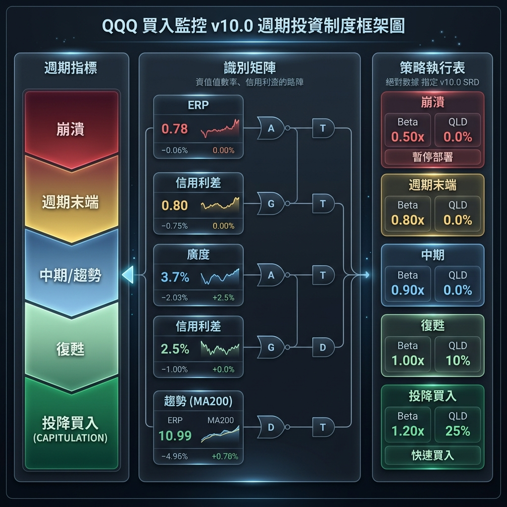
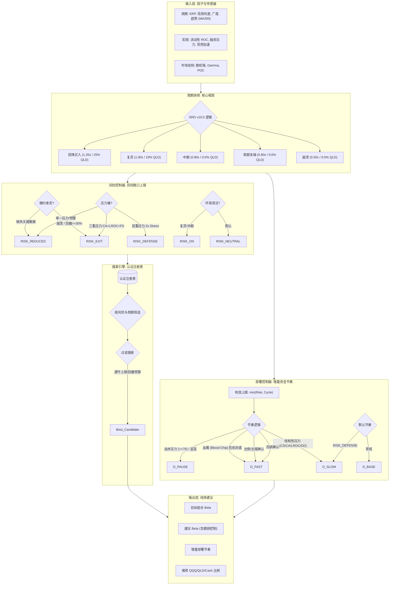

# QQQ 买入信号与周期驱动配置监控系统 (v10.0)

这是一个面向 QQQ / QLD / Cash 的生产级推荐引擎，基于 **v10.0 周期驱动架构 (Cycle-Driven Architecture)**。

系统边界很明确：
- 只推荐 **组合级目标 beta**
- 只推荐 **增量资金入场节奏**
- 根据周期合法性管理 **QLD 杠杆准入**
- **不计算金额**
- **不管理账户**
- **不自动执行交易**

## v10.0 架构

### 周期抉择层 (Cycle Decision)
`CycleDecision` 基于 ERP、信用利差、市场广度和趋势将周期划分为：
`BUST | LATE_CYCLE | MID_CYCLE | RECOVERY | CAPITULATION`

周期驱动逻辑：
- **CAPITULATION (投降买入)**: Beta 1.20x | QLD 25% | 快速买入 (极端底部)
- **RECOVERY (复苏)**: Beta 1.00x | QLD 10% | 常规买入 (趋势修复)
- **MID_CYCLE (中期)**: Beta 0.90x | QLD 0.0% | 常规买入 (健康牛市)
- **LATE_CYCLE (周期末端)**: Beta 0.80x | QLD 0.0% | 减速买入 (估值过高/广度腐烂)
- **BUST (崩溃)**: Beta 0.50x | QLD 0.0% | 暂停部署 (结构性危机)

### Risk Controller (风险控制器)
基于 Class A 宏观数据和周期状态输出：
- `risk_state`
- `target_exposure_ceiling`
- `qld_share_ceiling`
- `target_cash_floor`
- `cycle_applied`

关键语义：
- `EUPHORIC` 可以进入 `RISK_ON`，并允许在候选库合规时达到 `>1.0` beta
- `QLD` 是否参与不再与 `beta > 1.0` 绑定，而是由 `qld_share_ceiling` 控制
- `CRISIS` 和硬回撤触发会映射到 `RISK_EXIT`
- 如果某个风险态切片缺失，运行时会回退到全局 `0.5 beta` 地板候选，而不是静默降为 `0.0`

### Deployment Controller
用于决定新增现金买入 `QQQ` 的部署节奏：
`DEPLOY_SLOW | DEPLOY_BASE | DEPLOY_FAST | DEPLOY_PAUSE`

各状态含义：
- `DEPLOY_SLOW`：谨慎分批入场，保留现金余地，等待更强确认。
- `DEPLOY_BASE`：正常部署节奏；在环境可接受且信号成立时使用。
- `DEPLOY_FAST`：加速部署；通常用于明显错杀或左侧机会较清晰的场景。
- `DEPLOY_PAUSE`：暂停新增部署；新增资金先留在现金端。

关键语义：
- `RICH_TIGHTENING` 会默认降速，但强超跌时仍可进入 `DEPLOY_BASE`
- `CRISIS` 会完全暂停增量部署，除非触发特定的“血筹 (Blood-chip)”超跌反转逻辑
- 它只控制**新增现金**如何买入 `QQQ`
- 它**不参与存量 beta 计算**
- 它**不授予 `QLD`**

### Beta Recommendation
`build_beta_recommendation()` 取代了旧的金额执行接口。

系统只输出：
- `target_beta`
- 推荐实现路径的参考 `QQQ / QLD / Cash`
- `should_adjust`
- `adjustment_reason`

其中：

- `target_beta` 是一等公民 contract
- `QQQ / QLD / Cash` 配比是内部实现路径与回测审计参考，不是用户必须遵守的唯一资产比例

## 关键变化
- **线性流水线**：`Tier-0 → Risk → Search → Recommend`
- **无金额输出**：移除了 `build_execution_actions()` 和全部美元计算
- **硬/软约束分离**：宏观状态同时影响存量 beta 上限和增量入场节奏
- **双硬约束候选搜索**：候选选择先满足 `max_beta_ceiling`、`qld_share_ceiling` 和回撤预算，再输出推荐

## 回测与信号审计

`--mode portfolio` 的旧路径保留为研究工具，不作为生产验收门槛。

最新已验证的真实历史结果：
- `python -m src.backtest --mode portfolio`
  - Tactical Max Drawdown: `-28.5%`
  - Baseline DCA Max Drawdown: `-35.1%`
  - MDD Improvement (vs Fully Invested): `6.6%`
  - Realized Beta: `0.19`
  - Signal Target Beta (Active): `0.77`
  - Turnover Ratio (Advised): `34.64`
  - Turnover Ratio (Raw Daily Align): `614.91`
  - Estimated Friction Drag: `0.5197`
  - `RICH_TIGHTENING` left-side windows: `664`
  - `CRISIS` blood-chip overrides: `1`
  - `CRISIS` unauthorized breaches: `0`
- `python scripts/run_signal_acceptance_report.py --save-dir artifacts/v9_review`
  - Target beta alignment: `MAE=0.0269`, `RMSE=0.0763`, `within_tol=87.00%`
  - Deployment alignment: `exact=100.00%`, `within_one_step=100.00%`
  - Beta envelope: `floor_respected=true`, `cap_respected=true`
  - `CRISIS` override paths: `liquidity_reversal=1`

回测报告见：
- [回测报告](docs/backtest_report.md)
- [DCA 图表](docs/images/v8.1_dca_performance.png)

生产验收以两条信号审计为准，而不是混合 NAV 回测。

## 认证候选参考（v9.0）

v8.2 运行时不再使用旧的 `AllocationState` 默认矩阵，而是从认证注册表中选择：

- `RISK_NEUTRAL`：`neutral-base-001`（`70/10/20`, beta `0.90`）或 `neutral-low-drift`（`80/5/15`, beta `0.90`）
- `RISK_REDUCED`：`reduced-limited-001`（`60/10/30`, beta `0.80`）或 `reduced-base-001`（`50/0/50`, beta `0.50`）
- `RISK_DEFENSE`：`defense-limited-001`（`60/5/35`, beta `0.70`）或 `defense-001`（`50/0/50`, beta `0.50`）
- `RISK_EXIT`：`exit-floor-001`（`50/0/50`, beta `0.50`）
- `RISK_ON`：`euphoric-base-001`（`60/25/15`, beta `1.10`）或 `euphoric-max-001`（`80/20/0`, beta `1.20`）

## 核心层级

1. **Tier 0（宏观指挥官）**：监控信用加速、净流动性和融资压力，定义结构性状态。
2. **Tier 1（战术情绪）**：VIX Z-Score、恐慌与贪婪指数、估值与价格背离。
3. **Tier 2（市场结构）**：实时期权墙和 Gamma Flip 探测。
4. **战略层**：加载认证候选，遵守 beta ceiling，只输出推荐结果。

## 历史附录

当前生产架构建立在 v8.2 线性流水线之上，但对外 contract 已收口为 v9.0 的 `target_beta + deployment_state`。`docs/v8.0_linear_pipeline_*` 文件已标记为归档基线，仅用于追溯 v8.0 / v8.1 / v8.2 的设计演进。
下圖展示的是該線性決策鏈的結構骨架，v9.0 對其做的是 contract 與約束語義重構，而不是重寫整條流水線。

### 🖼️ v10.0 週期投資制度框架圖 (Regime Framework)




## 快速开始

### 1. 环境准备
```bash
cp .env.example .env # 添加你的 FRED_API_KEY
docker-compose build
```

### 2. 实时信号与再平衡审计
```bash
python -m src.main
```

### 3. 信号审计与回测
```bash
python -m src.backtest
python scripts/run_signal_acceptance_report.py
python scripts/plot_dca_performance.py
```

## 相关文档
-  [用户手册 v8.2](https://github.com/yutaofr/qqq-buyer-monitor/wiki/User-Manual-(v8.2))
- [SRD v8.0 基线：线性流水线](docs/v8.0_linear_pipeline_srd.md)
- [ADD v8.0 基线：实现方案](docs/v8.0_linear_pipeline_add.md)
- [SDT v8.0 基线：测试设计](docs/v8.0_linear_pipeline_sdt.md)
- [架构对齐评审](docs/v8_architecture_review.md)
- [回测报告](docs/backtest_report.md)

---
*免责声明：本工具仅用于机构模拟和监控，不构成个人投资建议。*
