# QQQ 买入信号与战略资产配置监控系统 (v6.4)

一个专为 QQQ ETF 设计的机构级市场监控系统，旨在为长期主权财富基金和养老基金的配置策略提供决策支持。v6.4 版本引入了 **个人资产配置搜索 (Personal Allocation Search)** 层。

## 🚀 v6.4 新特性：个人资产配置搜索
继 v6.3 战略配置层之后，本版本将重点从机构镜像转向 **30% 个人回撤预算 (Personal Drawdown Budget)**：
- **状态感知候选搜索 (State-Conditioned Candidate Search)：** 根据不同的 `AllocationState`（配置状态），动态评估获批的 QQQ/QLD/现金比例带。
- **每日 T+0 风险再平衡：** 将每周现金流部署与每日风险对齐分离，确保贝塔保真度 (Beta Fidelity)。
- **个人贝塔审计 (AC-4)：** 实现基于收益率的实际贝塔跟踪，全样本回测中的平均绝对偏差 (MAD) 仅为 **0.0069**。
- **QLD 杠杆模拟：** 精确建模 ProShares Ultra QQQ (QLD)，包括符合 SRD 4.2 标准的每日费用率损耗。
- **30% MDD 预算硬约束 (AC-5)：** 对不安全的候选配置进行硬过滤，并在必要时回退至 100% 现金。

## 📊 性能与韧性 (v6.4 回测)
基于全周期历史模拟 (1999-2026)：
- **MDD 优化：** 与纯 QQQ 定投 (DCA) 相比，个人配置方案将最大回撤 (MDD) 绝对值降低了 **5.0%**。
- **防御覆盖：** 在全样本中保持了防御制度 (`CASH_FLIGHT` / `DELEVERAGE`) 的有效性，并在触发 AC-5 约束时表现出可靠的安全回退行为。
- **统计优势：** 战术加仓信号触发后，T+60 的平均远期收益率保持为正。

## 🧭 推荐默认矩阵
v6.4 系统使用以下默认的 `QQQ:QLD:Cash` 运营矩阵，同时允许运行时的选择器在 SRD 获批的比例带内进行搜索：

- `FAST_ACCUMULATE` (快速累积): `4:4:2`
- `BASE_DCA` (基准定投): `6:1:3`
- `SLOW_ACCUMULATE` (缓慢累积): `6:0:4`
- `WATCH_DEFENSE` (防御观察): `7:0:3`
- `DELEVERAGE` (去杠杆): `6:0:4`
- `CASH_FLIGHT` (现金避险): `7:0:3` 或在硬约束触发时切换为 `100% Cash`

## 🛠 核心层级 (Core Tiers)
1.  **Tier 0 (宏观指挥官):** 监控信用加速、净流动性和融资压力。定义 **结构性制度 (Structural Regime)**。
2.  **Tier 1 (战术情绪):** VIX Z-Score、恐慌与贪婪指数、多因子估值/价格背离分析。
3.  **Tier 2 (市场结构):** 实时期权墙 (Put/Call Walls) 和 Gamma Flip 探测。
4.  **战略层 (Strategic Layer):** 搜索获批的比例带并执行每日原子级再平衡。

## 🧭 决策架构 (v6.4)

系统作为一个 **多层确定性状态机** 运行，其中高阶宏观“结构性”状态作为低阶“战术性”状态的约束，最终通过过滤后的搜索空间解析为最优的资产配置。

```mermaid
flowchart TD
    %% 输入层
    subgraph Raw_Inputs [指标与数据层]
        direction LR
        subgraph Macro_Data [宏观与流动性]
            WALCL[美联储资产: WALCL]
            TGA[财政部账户: WDTGAL]
            RRP[隔夜逆回购: RRPONTSYD]
            CS[信用利差: BAMLH0A0HYM2]
            RY[实际利率: DFII10]
            FPE[前瞻市盈率: Forward P/E]
        end
        subgraph Market_Data [价格与情绪]
            PX[QQQ 价格 / OHLCV]
            VIX[VIX 水平 / Z-Score]
            FG[恐慌与贪婪指数]
            BR[涨跌家数比: Breadth]
            MA[MA50 & MA200 均线]
            MFI[资金流向指数: MFI]
            RSI[相对强弱指数: RSI]
        end
        subgraph Options_Data [市场结构]
            OI[期权未平仓量]
            G_FLIP[Gamma Flip 水平]
            PW[看跌期权墙: Put Wall]
            CW[看涨期权墙: Call Wall]
            POC[成交量控制点: POC]
        end
        subgraph Fundamental_Lead [基本面前瞻]
            ERB[盈利修订宽度: ERB]
            FCF[自由现金流收益率: FCF]
        end
    end

    %% TIER 0: 宏观指挥官
    subgraph Tier0 [Tier 0: 结构性制度]
        direction TB
        WALCL & TGA & RRP --> LIQ_ROC[流动性变化率]
        CS --> CS_ACCEL[信用利差加速]
        FPE & RY --> ERP[股权风险溢价]
        FS[融资压力] --> BYPASS{防御性旁路?}
        
        CS_ACCEL & LIQ_ROC --> BYPASS
        BYPASS -- 高压 --> L3["L3: 现金避险 (CASH_FLIGHT)"]
        BYPASS -- 中压 --> L2["L2: 去杠杆 (DELEVERAGE)"]
        BYPASS -- 低压 --> L1["L1: 防御观察 (WATCH_DEFENSE)"]
        
        CS & ERP --> REGIME[结构性制度决策]
        REGIME --> S_STATES["危机 (CRISIS) | 转型压力 | 中性 | 亢奋"]
    end

    %% TIER 1: 战术引擎
    subgraph Tier1 [Tier 1: 战术评分]
        direction TB
        PX & MA --> S1[52周回撤 & MA200 偏离]
        VIX & FG & BR --> S2[情绪与宽度梯度]
        
        %% 背离子引擎
        PX & MFI & RSI & ERB --> DIV[背离分析子引擎]
        DIV --> DIV_BONUS[加分: +5 到 +20]
        
        %% 估值子引擎
        FPE & FCF --> VAL[估值分析子引擎]
        VAL --> VAL_ADJ[调整: -10 到 +15]

        S1 & S2 & DIV_BONUS & VAL_ADJ --> T1_SCORE[Tier 1 总分: 0-100]
        
        PX --> VELOCITY["下行速度: 恐慌 (PANIC) | 阴跌 | 冷静"]
        T1_SCORE & VELOCITY --> TACTICAL_STATE["战术状态: 恐慌 | 投降 | 压力 | 冷静"]
    end

    %% TIER 2: 市场结构
    subgraph Tier2 [Tier 2: 确认层]
        PW & CW & POC --> WALLS[支撑确认 / 破位 / POC 奖金]
        G_FLIP & PX --> GAMMA[Gamma 正值 / 负值]
        WALLS & GAMMA --> T2_ADJ[Tier 2 调整: -30 到 +15]
    end

    %% 聚合与搜索
    subgraph Strategy [v6.4 个人配置搜索]
        S_STATES & TACTICAL_STATE --> ALLOC_STATE[配置状态]
        ALLOC_STATE --> CANDIDATES[SRD-6.4 候选比例带]
        
        CANDIDATES --> BACKTEST[实时路径微回测]
        PX --> BACKTEST
        
        BACKTEST --> AC5_GATE{AC-5: 回撤 < 30%?}
        AC5_GATE -- 否 --> SAFE_FALLBACK["全局安全回退: 100% 现金"]
        AC5_GATE -- 是 --> RANKING["排序: CAGR > MDD > 贝塔保真度"]
    end

    %% 最终执行
    RANKING --> FINAL["最终决策: QQQ : QLD : 现金"]
    L3 & L2 & L1 --> FINAL
    SAFE_FALLBACK --> FINAL
    T2_ADJ --> FINAL
```



### 核心架构转换逻辑
1.  **防御性旁路 (杀毒开关):** 在执行任何逻辑分析前，系统首先检查 **信用加速** (高收益债利差速度)、**流动性枯竭** (美联储资产 - TGA - RRP) 和 **融资压力**。如果探测到高流速压力，系统将立即进入 `CASH_FLIGHT` 或 `DELEVERAGE` 状态。
2.  **结构性制度 (宏观指挥官):** 信用利差和 **股权风险溢价 (ERP)** 定义了结构性制度。`CRISIS` 状态 (利差 > 500bps 或 ERP < 1.0%) 会无视战术指标，强制执行风险抑制。
3.  **战术状态 (情绪过滤器):** 结合标准指标与 **背离分析 (RSI/MFI/ERB)** 及 **估值子引擎 (PE/FCF)**，以区分“阴跌”与“恐慌”。
4.  **v6.4 选择引擎 (个人层):** 使用微回测执行实时 **候选评分**。任何在回测中超过 **30% 最大回撤 (AC-5)** 的配置候选都将被剔除。在幸存者中，优先选择 **CAGR** 最高且 **贝塔保真度 (AC-4)** 最优的方案。

## 📦 快速开始

### 1. 环境准备
```bash
cp .env.example .env # 添加你的 FRED_API_KEY
docker-compose build
```

### 2. 实时信号与再平衡审计
```bash
# 获取最新信号、配置建议及贝塔审计报告
docker-compose run --rm app
```

### 3. 机构压力测试与保真度测试
```bash
# 运行多场景压力测试并生成 AC-4 贝塔保真度报告
docker-compose run --rm backtest python scripts/stress_test_runner.py
```

## 📜 相关文档
- [SRD v6.4: 个人资产配置](docs/v6.4_personal_allocation_srd.md)
- [ADD v6.4: 个人资产配置实现方案](docs/v6.4_personal_allocation_add.md)
- [配置官风格回测报告 (v6.4)](docs/backtest_report.md)
- [架构设计文档 (v6.4)](docs/architecture.md)

---
*免责声明：本工具仅用于机构模拟和监控。不构成个人投资建议。*
