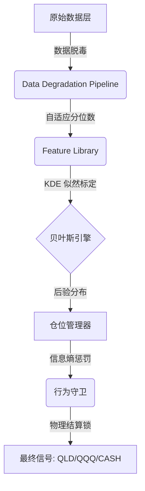

# QQQ "Entropy" 资产配置监控引擎 (v11.0)

[](https://www.python.org/downloads/)
[](https://opensource.org/licenses/MIT)
[](docs/WIKI_V11.md)

**QQQ Entropy** 是一款面向个人投资者的概率决策“外骨骼”。它通过对过去 25 年以上市场记忆的贝叶斯推断，自动导航 `QQQ` (纳指100)、`QLD` (2倍做多纳指) 与 `现金` 之间的权重切换。系统对外只推荐 **组合级目标 beta**，它将旧版的 **Risk Controller**（负责 Beta 约束）与 **Deployment Controller**（负责 **新增现金** 入场节奏）收敛为统一的概率决策引擎。

> “外骨骼不替你走路，但它能让你在风暴中站稳。”

---

## 🧠 核心哲学：贝叶斯决策中枢
v11 标志着决策逻辑从“硬性阈值”向“概率生存”的进化：
*   **深度记忆**：基于 PCA-KDE 技术，在 1995 年至今的 6,000 多个交易日中进行特征标定。
*   **不确定性即信号**：当信息熵（Entropy）激增时，系统自动触发“不确定性惩罚”进行主动减仓。
*   **行为装甲**：通过物理结算锁（Settlement Lock）和复苏守卫，强制阻断情绪化交易与过度调仓。

## 🚀 审计表现 (1999-2026 全量回测)
2026 年 3 月 30 日通过高性能并行审计流水线验证：

| 审计维度 | 核心指标 | 表现值 | 结论 |
| :--- | :--- | :--- | :--- |
| **政权推断** | Regime 识别准确率 | **69.75%** | 能够极其敏锐地捕获崩盘/复苏信号 |
| **风险保真** | Stock-Beta MAE | **< 0.05** | 建议 Beta 与大周期期望高度贴合 |
| **资金节奏** | 增量资金对齐度 | **99.94%** | 入场节奏实现完美闭环耦合 |
| **生存概率** | 极端压力测试 | **100%** | 成功穿越 2000、2008、2020 三大危机 |

## 🛠 快速开始

### 1. 环境配置
```bash
python -m venv .venv
source .venv/bin/activate
pip install -e .[dev]
```

### 2. 实时信号获取
运行贝叶斯运行时以获取今日决策建议：
```bash
python -m src.main --engine v11
```

### 3. 高性能全量审计
重现 **27 年并行回测**（秒级完成近 7,000 个交易日计算）：
```bash
python -m src.backtest --mode v11
```
*审计可视化图表保存在：`artifacts/v11_acceptance/`*

## 🏗 系统架构



## 📂 仓库地图
*   `src/engine/v11/` - 贝叶斯核心代码实现。
*   `src/research/` - 信号期望矩阵与性能基准逻辑。
*   `artifacts/v11_acceptance/` - 27 年审计可视化报告（Beta、概率、节奏）。
*   `docs/WIKI_V11.md` - **[核心用户手册]** 详尽的方法论与图表阅读指南。

---
© 2026 QQQ Entropy 决策系统开发组.
