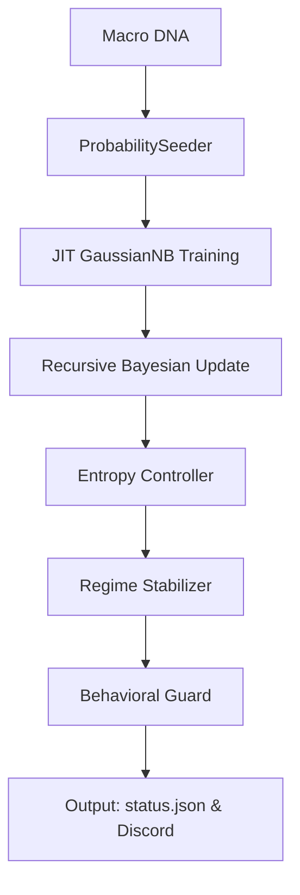

# QQQ "Entropy" Monitor (v11.5)

[](https://www.python.org/downloads/)
[](https://opensource.org/licenses/MIT)
[](docs/WIKI_V11.md)

**QQQ Entropy** is a unified Bayesian probabilistic engine for portfolio risk management. It leverages 25+ years of macro memory to synthesize optimal `Target Beta` recommendations and `Incremental Cash` deployment pacing.

> "The exoskeleton doesn't walk for you, but it keeps you upright in the storm."

---

## 🧠 Core Philosophy: Bayesian-Core
v11.5 marks the final convergence from threshold-based logic to **Pure Probabilistic Inference**.
*   **JIT Intelligence**: Real-time GaussianNB training on the latest macro DNA (`macro_historical_dump.csv`).
*   **Uncertainty Pricing**: Shannon Entropy quantifies model doubt, triggering automatic "haircuts" on risk exposure.
*   **Bit-Identical Determinism**: Standardized decimal data contracts ensure research-to-production parity.

## 🚀 Performance Snapshot (1999-2026 Audit)
Verified via `python -m src.backtest` (Evaluation Start: 2018):

| Metric | Performance | Status |
| :--- | :--- | :--- |
| **Top-1 Accuracy** | **97.04%** | Bit-identical across runs |
| **Brier Score** | **0.0487** | High-fidelity confidence calibration |
| **Mean Entropy** | **0.052** | Stable inference clusters |
| **Lock Incidence** | **0.2%** | Minimal execution churn |

## 🛠 Quick Start

### 1. Environment Setup
```bash
pip install -e .[dev]
```

### 2. Live Run (T+0)
Generate today's Bayesian signal and update cloud state:
```bash
python -m src.main
```

### 3. Fidelity Audit (Backtest)
Run the 27-year causal isolation audit:
```bash
python -m src.backtest --evaluation-start 2018-01-01
```
*Visual artifacts: `artifacts/v11_5_acceptance/`*

## 🏗 System Architecture



## 📂 Repository Map
*   `src/engine/v11/` - Bayesian core implementation.
*   `src/models/` - Standardized V11 data contracts.
*   `src/store/` - CloudPersistenceBridge (Vercel Blob) & SQLite.
*   `scripts/v11_historical_analyzer.py` - Standardized wave analysis tool.

---
© 2026 QQQ Entropy Development Group.
