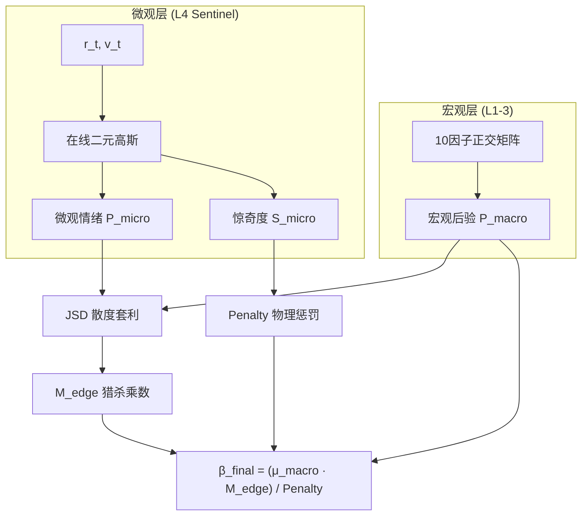

# QQQ "Entropy" 贝叶斯哨兵监控引擎 (v12.1)

**QQQ Entropy v12.1** 是一款融合了**宏观贝叶斯正交推断**与**微观量价离群检测 (Sentinel)** 的资产配置引擎。系统通过 10 个宏观正交因子锁定大趋势，并通过 Layer 4 哨兵实时捕捉量价背离与市场恐慌，实现“宏观守拙、微观猎杀”的非对称博弈。

---

## 🧠 核心架构：大一统动力学 (v12.1)

v12.1 在 v12.0 正交因子的基础上，引入了基于信息论的 **Sentinel (哨兵)** 模块，实现了宏微观决策的深度融合：

*   **Layers 1-3: 宏观正交层** - 提供低频基座。通过贴现、实体、情绪三大矩阵进行贝叶斯后验推断。
*   **Layer 4: 微观哨兵层 (Sentinel)** - 提供高频修正。利用二元高斯分布监控 QQQ 的 [收益率, 成交量] 拓扑，通过 **JSD 散度** 识别宏微观共识破裂。

### 关键技术特性
*   **ALFRED PIT 隔离**：接入美联储 ALFRED 数据库，回测强制使用**历史初值 (Initial Release)**，杜绝数据修正带来的未来函数。
*   **广义凯利大一统**：利用连续可导的拓扑映射，将微观惊奇度 (Surprisal) 转化为方差惩罚，将 JSD 散度转化为猎杀乘数。
*   **物理风控 (Tikhonov)**：协方差求逆引入吉洪诺夫正则化，确保在流动性枯竭的“奇异矩阵”状态下依然保持痛觉。

## 🚀 审计准则 (v12.1 验收标准)

| 审计维度 | 核心指标 | 预期值 | 架构意义 |
| :--- | :--- | :--- | :--- |
| **相对生存** | Annual IR Diff | **>= -0.05** | L4 的叠加在任何自然年不得显著拖累基础策略 |
| **证伪测试** | 白噪声 Alpha | **Real > Noise** | 证明猎杀信号源于物理真实的量价结构而非噪音 |
| **预测校准** | Brier 分数 | **<= 0.15** | 宏观推断的统计一致性 |
| **物理鲁棒** | 矩阵免疫 | **100%** | 彻底免疫 LinAlgError 崩溃 |

## 🏗 系统拓扑

## 📂 仓库地图
*   `src/engine/v11/sentinel.py` - **v12.1 Sentinel 核心逻辑**。
*   `src/research/auditor.py` - **相对生存约束审计器**。
*   `docs/core/v12_sentinel.md` - **v12.1 哨兵 specs 说明书**。
*   `scripts/falsify_sentinel_white_noise.py` - 数学证伪脚本。

---
© 2026 QQQ Entropy 决策系统开发组.
