# QQQ Buy-Signal & Strategic Allocation Monitor (v6.4)

An institutional-grade market monitoring system for the QQQ ETF, designed for long-term sovereign wealth and pension fund allocation strategies. v6.4 introduces the **Personal Allocation Search** layer.

## 🚀 What's New in v6.4: Personal Allocation Search
Following the v6.3 strategic allocation layer, this version shifts focus from institutional mirroring to a **30% personal drawdown budget**:
- **State-Conditioned Candidate Search:** Dynamically scores allowed QQQ/QLD/Cash bands per `AllocationState`.
- **Daily T+0 Risk Rebalancing:** Separates weekly cash-flow deployment from daily risk alignment, preserving beta fidelity.
- **Personal Beta Audit (AC-4):** Implements returns-based realized beta tracking with a Mean Absolute Deviation of **0.0069** in the full backtest.
- **QLD Leverage Simulation:** Accurate modeling of ProShares Ultra QQQ (QLD) including SRD 4.2 compliant daily expense ratio drag.
- **30% MDD Budget (AC-5):** Hard-gates unsafe candidates and falls back to 100% cash when required.

## 📊 Performance & Resilience (v6.4 Backtest)
Based on full-cycle historical simulations (1999-2026):
- **MDD Improvement:** Personal allocation reduced Maximum Drawdown by **5.0% (absolute)** compared to pure QQQ DCA.
- **Defense Coverage:** Maintained defensive regimes (`CASH_FLIGHT` / `DELEVERAGE`) across the full sample, with hard-gated safe fallback behavior when needed.
- **Statistical Edge:** Average T+60 forward returns remain positive after tactical add signals.

## 🧭 Recommended Default Matrix
The v6.4 system uses the following default `QQQ:QLD:Cash` operating matrix, while still allowing the runtime selector to search within the SRD-approved band:

- `FAST_ACCUMULATE`: `4:4:2`
- `BASE_DCA`: `6:1:3`
- `SLOW_ACCUMULATE`: `6:0:4`
- `WATCH_DEFENSE`: `7:0:3`
- `DELEVERAGE`: `6:0:4`
- `CASH_FLIGHT`: `7:0:3` or `100% Cash` in hard-gate rejection

## 🛠 Core Tiers
1.  **Tier 0 (Macro Commander):** Monitors Credit Acceleration, Net Liquidity, and Funding Stress. Defines the **Structural Regime**.
2.  **Tier 1 (Tactical Sentiment):** VIX Z-Scores, Fear & Greed, and multi-factor valuation/price divergences.
3.  **Tier 2 (Market Structure):** Real-time Options Walls (Put/Call Walls) and Gamma Flip detection.
4.  **Strategic Layer:** Search the approved `QQQ:QLD:Cash` bands and execute daily atomic rebalancing.

## 🧭 Decision Architecture (v6.4)

The system operates as a **Multi-Tiered Deterministic State Machine**, where high-order macroeconomic "Structural" states act as constraints on lower-order "Tactical" states, eventually resolving into an optimized asset allocation through a filtered search space.

```mermaid
flowchart TD
    %% INPUT LAYER
    subgraph Raw_Inputs [Indicator & Data Layer]
        direction LR
        subgraph Macro_Data [Macro & Liquidity]
            WALCL[Fed Assets: WALCL]
            TGA[Treasury: WDTGAL]
            RRP[Reverse Repo: RRPONTSYD]
            CS[Credit Spread: BAMLH0A0HYM2]
            RY[Real Yield: DFII10]
            FPE[Forward P/E Ratio]
        end
        subgraph Market_Data [Price & Sentiment]
            PX[QQQ Price / OHLCV]
            VIX[VIX Level / Z-Score]
            FG[Fear & Greed Index]
            BR[A/D Breadth Ratio]
            MA[MA50 & MA200 SMAs]
            MFI[Money Flow Index - MFI]
            RSI[Relative Strength Index - RSI]
        end
        subgraph Options_Data [Market Structure]
            OI[Options Open Interest]
            G_FLIP[Gamma Flip Level]
            PW[Put Wall Strike]
            CW[Call Wall Strike]
            POC[Volume Point of Control - POC]
        end
        subgraph Fundamental_Lead [Fundamental Lead]
            ERB[Earnings Revision Breadth]
            FCF[FCF Yield]
        end
    end

    %% TIER 0: MACRO COMMANDER
    subgraph Tier0 [Tier 0: Structural Regime]
        direction TB
        WALCL & TGA & RRP --> LIQ_ROC[Liquidity Rate of Change]
        CS --> CS_ACCEL[Credit Spread Acceleration]
        FPE & RY --> ERP[Equity Risk Premium]
        FS[Funding Stress] --> BYPASS{Defensive Bypass?}
        
        CS_ACCEL & LIQ_ROC --> BYPASS
        BYPASS -- High Stress --> L3[L3: CASH_FLIGHT]
        BYPASS -- Med Stress --> L2[L2: DELEVERAGE]
        BYPASS -- Low Stress --> L1[L1: WATCH_DEFENSE]
        
        CS & ERP --> REGIME[Structural Regime Decision]
        REGIME --> S_STATES["CRISIS | TRANSITION_STRESS | NEUTRAL | EUPHORIC"]
    end

    %% TIER 1: TACTICAL ENGINE
    subgraph Tier1 [Tier 1: Tactical Scoring]
        direction TB
        PX & MA --> S1[52w Drawdown & MA200 Dev]
        VIX & FG & BR --> S2[Sentiment & Breadth Gradient]
        
        %% Divergence Sub-Engine
        PX & MFI & RSI & ERB --> DIV[Divergence Sub-Engine]
        DIV --> DIV_BONUS[Bonus Score: +5 to +20]
        
        %% Valuation Sub-Engine
        FPE & FCF --> VAL[Valuation Sub-Engine]
        VAL --> VAL_ADJ[Adjustment: -10 to +15]

        S1 & S2 & DIV_BONUS & VAL_ADJ --> T1_SCORE[Tier 1 Score: 0-100]
        
        PX --> VELOCITY["Descent Velocity: PANIC | GRIND | CALM"]
        T1_SCORE & VELOCITY --> TACTICAL_STATE["Tactical: PANIC | CAPITULATION | STRESS | CALM"]
    end

    %% TIER 2: MARKET STRUCTURE
    subgraph Tier2 [Tier 2: Confirmation Layer]
        PW & CW & POC --> WALLS[Support Confirmed / Broken / POC Bonus]
        G_FLIP & PX --> GAMMA[Gamma Positive / Negative]
        WALLS & GAMMA --> T2_ADJ[Tier 2 Adjustment: -30 to +15]
    end

    %% AGGREGATION & SEARCH
    subgraph Strategy [v6.4 Personal Allocation Search]
        S_STATES & TACTICAL_STATE --> ALLOC_STATE[Allocation State]
        ALLOC_STATE --> CANDIDATES[SRD-6.4 QQQ:QLD:Cash Bands]
        
        CANDIDATES --> BACKTEST[Live Path Mini-Backtest]
        PX --> BACKTEST
        
        BACKTEST --> AC5_GATE{AC-5: MDD < 30%?}
        AC5_GATE -- NO --> SAFE_FALLBACK["Global Safe: 100% Cash"]
        AC5_GATE -- YES --> RANKING["Ranking: CAGR > MDD > Beta Fidelity"]
    end

    %% FINAL EXECUTION
    RANKING --> FINAL["Final Decision: QQQ : QLD : Cash"]
    L3 & L2 & L1 --> FINAL
    SAFE_FALLBACK --> FINAL
    T2_ADJ --> FINAL
```



### Key Architectural Transitions
1.  **Defensive Bypass (The Kill Switch):** Before any logical processing, the system checks for **Credit Acceleration** (HY OAS velocity), **Liquidity Drains** (Fed Assets - TGA - RRP), and **Funding Stress**. If high-velocity stress is detected, it enters `CASH_FLIGHT` or `DELEVERAGE` immediately.
2.  **Structural Regime (The Macro Commander):** Credit Spreads and **Equity Risk Premium (ERP)** define the structural regime. A `CRISIS` state (Spread > 500bps or ERP < 1.0%) forces risk containment regardless of tactical indicators.
3.  **Tactical State (The Sentiment Filter):** Combines standard metrics with **Divergence (RSI/MFI/ERB)** and **Valuation (PE/FCF)** sub-engines to distinguish between a "Grind Down" and a "Panic."
4.  **v6.4 Selection Engine (The Personal Layer):** Performs a real-time **Candidate Scoring** mechanism using mini-backtests. Any allocation that has historically exceeded a **30% Drawdown (AC-5)** is discarded. Among survivors, it selects for the highest **CAGR** while ensuring **Beta Fidelity (AC-4)**.

## 📦 Getting Started

### 1. Setup
```bash
cp .env.example .env # Add your FRED_API_KEY
docker-compose build
```

### 2. Live Signal & Rebalance Audit
```bash
# Get the latest signal, TAA mirroring guidance, and Beta Audit
docker-compose run --rm app
```

### 3. Institutional Stress & Fidelity Testing
```bash
# Run multi-scenario stress tests with AC-4 Beta Fidelity reports
docker-compose run --rm backtest python scripts/stress_test_runner.py
```

## 📜 Documentation
- [SRD v6.4: Personal Allocation](docs/v6.4_personal_allocation_srd.md)
- [ADD v6.4: Personal Allocation Implementation](docs/v6.4_personal_allocation_add.md)
- [Allocator-Style Backtest Report (v6.4)](docs/backtest_report.md)
- [Architecture Design Document (v6.4)](docs/architecture.md)

---
*Disclaimer: This tool is for institutional simulation and monitoring purposes. Not individual investment advice.*
