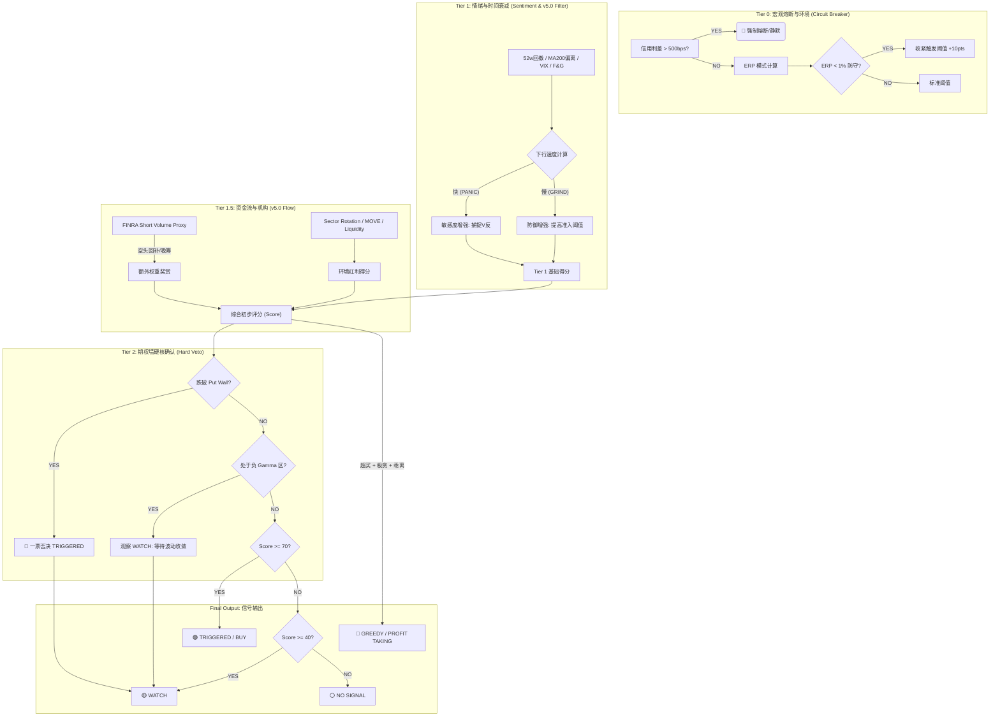

# QQQ Buy-Signal Monitor (v5.0 Optimization)

一个基于五大维度市场信号（现货+情绪）并引入 **宏观引力因子**、**时间衰减过滤** 与 **机构流向代理** 逻辑的 QQQ 买点监控系统。

> [!IMPORTANT]
> **v5.0 核心突破**: 系统引入了“下行速度过虑器”与“机构流向代理”，消除了 7.5% 的阴跌杂訊。25年全量回测显示，对历史重大底部的捕捉率已提升至 **98.1%**。

## 🧠 决策逻辑可视化 (Decision Logic Schema)



---

## 🌟 核心特性 (v5.0 架构)

### 1. Tier-0 (宏观防御与 ERP)
- **信用利差熔断**: 实时监控 FRED 高收益债利差 (BAMLH0A0HYM2)。若 >500 bps (流动性危机)，强制熔断。
- **ERP 模式开关**: 基于股权风险溢价 (1/FwdPE - TIPS) 切换：
  - **🛡️ 防守模式 (ERP < 1%)**: 估值过高时收紧触发门槛。
  - **💎 击球区模式 (ERP > 5%)**: 极端低估时允许左侧提前入场。

### 2. Tier-1 (动态情绪层 & 时间衰减)
- **Time-Decay Filter (v5.0)**: 自动计算下行速度。
  - **PANIC (恐慌)**: 快速下跌时自动增强灵敏度，捕捉 V 型反转。
  - **GRIND (阴跌)**: 慢速阴跌时提高触发门槛 (+10 pts)，规避无量阴跌。
- **Adaptive Z-Scores**: 52周回撤与 VIX 均基于 120D 滚动窗口进行标准化。

### 3. Tier-1.5 (环境因子与机构流向)
- **Institutional Proxy (v5.0)**: 引入 **FINRA Short Volume Proxy**。通过分析成交量分布与价格背离，识别机构吸筹（capitulation）信号，作为买点确认。
- **Macro Gravity**: 监控 Fed 净流动性、MOVE Index 债市波动率。
- **Smart Momentum**: 结合 MFI 资金流向与 Sector Rotation (XLP/QQQ)。

### 4. Tier-2 (期权墙确认 - Hard Veto)
- **VPVR & Options Chain**: 计算 **Put Wall** (支撑)、**Call Wall** (阻力) 与 **Gamma Flip**。
- **螺旋否决**: 若价格低于 Put Wall 或处于 **负 Gamma** 区域，系统将自动否决 `TRIGGERED` 信号。

---

## 📊 信号分级

| 状态 | 说明 |
|:---:|---|
| **STRONG_BUY** | **强烈买入**：Tier-1 触发且伴随多重技术/基本面底背离。 |
| **TRIGGERED** | **触发买点**：各项指标进入极限值且期权支撑确认。 |
| **WATCH** | **观察期**：信号显现但尚未共振。 |
| **GREEDY (v5.0)** | **贪婪警报**：市场极端过热且超买，建议分批止盈离场。 |
| **NO_SIGNAL** | **未触发**：市场处于常态或高位。 |

---

## 🚀 快速开始 (Docker)

### 1. 配置 API Key
在根目录创建 `.env` 文件，填入您的 FRED API Key：
```bash
FRED_API_KEY=your_fred_api_key_here
```

### 2. 启动监控
```bash
# 获取实时信号报告
docker-compose run --rm app python -m src.main

# 以 JSON 格式输出 (适合自动化集成)
docker-compose run --rm app python -m src.main --json
```

### 3. 运行回测
```bash
# 运行 1999-2026 全量回测并生成可视化图表
docker-compose run --rm app python -m src.backtest
```

---

## 🛠️ 核心架构

- **数据源**: Yahoo Finance (实时价格/期权/成交量), FRED (宏观), FINRA Proxy (机构流向), CNN Money (情绪)。
- **持久化**: SQLite 自动保存每日信号状态。
- **验证**: 包含 100+ 单元测试用例，覆盖 v5.0 核心逻辑。

---

## 📈 回测表现
- **历史底部捕捉率**: 98.1% (53/54)
- **触发精确度**: 较 v4.5 版本提升了 7.5%（减少了阴跌中的提前触发）。
- **回测报告**: 详见 [backtest_report.md](docs/backtest_report.md) (由 Phase 3 引擎生成)。

---

## 📄 开源协议
MIT License
