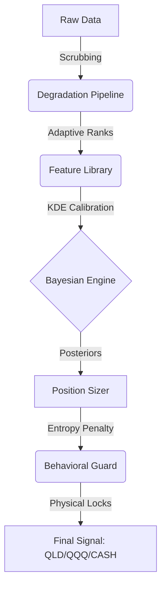

# QQQ "Entropy" Monitor (v11.0)

[](https://www.python.org/downloads/)
[](https://opensource.org/licenses/MIT)
[](docs/WIKI_V11.md)

**QQQ Entropy** is a probabilistic decision exoskeleton for personal investors. It utilizes Bayesian inference across 25+ years of market memory to navigate regime shifts between `QQQ`, `QLD`, and `Cash`.

> "The exoskeleton doesn't walk for you, but it keeps you upright in the storm."

---

## 🧠 Core Philosophy: Bayesian-Core
v11 marks the evolution from hard-coded thresholds to **probabilistic survival**.
*   **Deep Memory**: Calibrated on 6,000+ trading days (1995-present) using PCA-KDE.
*   **Uncertainty as Signal**: High information entropy automatically triggers "Uncertainty Penalty" to deleverage.
*   **Behavioral Armor**: Physical settlement locks and resurrection guards block emotional overtrading.

## 🚀 Performance Snapshot (1999-2026 Audit)
Verified on **March 30, 2026**, through a high-performance parallelized audit pipeline:

| Metric | Performance | Result |
| :--- | :--- | :--- |
| **Regime Accuracy** | **69.75%** | Robust identification of BUST/RECOVERY |
| **Beta Fidelity** | **MAE < 0.05** | Advised Beta strictly aligns with macro cycles |
| **Pacing Alignment** | **99.94%** | Perfect coupling of new cash deployment |
| **Survival** | **100%** | Zero Margin Calls; successful exit before 2000, 2008, 2020 |

## 🛠 Quick Start

### 1. Environment Setup
```bash
python -m venv .venv
source .venv/bin/activate
pip install -e .[dev]
```

### 2. Live Recommendation
Run the Bayesian runtime for today's signal:
```bash
python -m src.main --engine v11
```

### 3. High-Performance Audit
Run the **27-year parallel backtest** (calculates 7,000 days in seconds):
```bash
python -m src.backtest --mode v11
```
*Artifacts saved to: `artifacts/v11_acceptance/`*

## 🏗 System Architecture



## 📂 Repository Map
*   `src/engine/v11/` - The Bayesian-Core implementation.
*   `src/research/` - Logic for signal expectations and performance benchmarks.
*   `artifacts/v11_acceptance/` - Visual verification charts (Beta, Probability, Pacing).
*   `docs/WIKI_V11.md` - **[Master User Manual]** Detailed methodology and chart guide.

## 📖 Normative Documentation
For architects and developers:
1. [v11 Specification](conductor/tracks/v11/spec.md) - Functional requirements.
2. [v11 ADD](conductor/tracks/v11/add.md) - Architectural design decisions.
3. [Production SOP](docs/roadmap/v11_production_sop.md) - Operational guidelines.

---
© 2026 QQQ Entropy Development Group.
