# QQQ Buy-Signal & Strategic Allocation Monitor (v8.0)

A production-grade QQQ/QLD/Cash recommendation engine built around the **v8.0 Linear Pipeline Architecture**.

The system now has a strict boundary:
- It recommends **target portfolio beta**.
- It recommends **incremental cash deployment pace**.
- It does **not** calculate dollar amounts.
- It does **not** manage a wallet or execute trades.

## v8.0 Architecture

### Tier-0 Macro Regime
`assess_structural_regime()` classifies the structural regime from credit spreads and ERP:
`EUPHORIC | NEUTRAL | RICH_TIGHTENING | TRANSITION_STRESS | CRISIS`.

Tier-0 is the top-level constraint:
- Hard constraint on the **Risk Controller** beta ceiling.
- Soft constraint on the **Deployment Controller** pace.

### Risk Controller
Determines the allowed exposure ceiling from **Class A macro data** plus the Tier-0 regime.
Outputs `RiskDecision` with:
- `risk_state`
- `target_exposure_ceiling`
- `target_cash_floor`
- `tier0_applied`

### Deployment Controller
Determines how to deploy **new incoming cash** under Tier-0 soft ceilings.
Outputs one of:
`DEPLOY_SLOW | DEPLOY_BASE | DEPLOY_FAST | DEPLOY_PAUSE`.

Key v8.0 semantics:
- `RICH_TIGHTENING` slows default deployment but still allows left-side entry when capitulation is strong.
- `CRISIS` fully pauses incremental deployment.

### Beta Recommendation
`build_beta_recommendation()` replaces the old amount-based execution surface.

The output is recommendation-only:
- `target_beta`
- recommended `QQQ / QLD / Cash`
- `should_adjust`
- `adjustment_reason`

## Key Changes vs v7.0
- **Linear pipeline:** `Tier-0 → Risk → Search → Recommend`
- **No amount output:** removed `build_execution_actions()` and all dollar deployment calculations
- **Tier-0 hard/soft constraints:** structural regime now directly shapes both stock beta and cash deployment pace
- **Pure math candidate search:** v8 selection respects `max_beta_ceiling` and drawdown budget before recommendation

## 📊 Performance & Resilience (v8.0 Backtest)
Latest full-sample backtest (`docker compose run --rm backtest`, 1999-2026):
- **Tactical Max Drawdown:** `-6.6%`
- **Baseline DCA Max Drawdown:** `-35.1%`
- **MDD Improvement:** `28.6%` absolute improvement
- **Realized Beta:** `0.04`
- **Turnover Ratio:** `2.13`
- **NAV Integrity:** `1.000000`
- **Left-side windows preserved:** `RICH_TIGHTENING left-side windows = 513`
- **CRISIS deployment breaches:** `0`

## 🧭 Certified Candidate Reference (v8.0)
v8.0 no longer uses the old `AllocationState` operating matrix at runtime. It selects from the certified registry:

- `RISK_NEUTRAL`: `neutral-base-001` (`70/10/20`, beta `0.90`) or `neutral-low-drift` (`80/5/15`, beta `0.90`)
- `RISK_REDUCED`: `reduced-tight-001` (`30/0/70`, beta `0.30`) or `reduced-base-001` (`50/0/50`, beta `0.50`)
- `RISK_DEFENSE`: `defense-001` (`30/0/70`, beta `0.30`)
- `RISK_EXIT`: explicit `100% Cash` fallback when no compliant candidate survives the beta ceiling

## 🛠 Core Tiers
1.  **Tier 0 (Macro Commander):** Monitors Credit Acceleration, Net Liquidity, and Funding Stress. Defines the **Structural Regime**.
2.  **Tier 1 (Tactical Sentiment):** VIX Z-Scores, Fear & Greed, and multi-factor valuation/price divergences.
3.  **Tier 2 (Market Structure):** Real-time Options Walls (Put/Call Walls) and Gamma Flip detection.
4.  **Strategic Layer:** Load certified candidates, respect the beta ceiling, and emit recommendation-only outputs.

## 🧭 Decision Architecture (Historical v6.4 Appendix)

The current production architecture is the v8.0 linear pipeline documented above and in `docs/v8.0_linear_pipeline_*`.
The diagram below is retained only as legacy background for the pre-v8 multi-tier state-machine implementation.

The system operates as a **Multi-Tiered Deterministic State Machine**, where high-order macroeconomic "Structural" states act as constraints on lower-order "Tactical" states, eventually resolving into an optimized asset allocation through a filtered search space.

```mermaid
flowchart TD
    %% INPUT LAYER
    subgraph Raw_Inputs [Indicator & Data Layer]
        direction LR
        subgraph Macro_Data [Macro & Liquidity]
            WALCL[Fed Assets: WALCL]
            TGA[Treasury: WDTGAL]
            RRP[Reverse Repo: RRPONTSYD]
            CS[Credit Spread: BAMLH0A0HYM2]
            RY[Real Yield: DFII10]
            FPE[Forward P/E Ratio]
        end
        subgraph Market_Data [Price & Sentiment]
            PX[QQQ Price / OHLCV]
            VIX[VIX Level / Z-Score]
            FG[Fear & Greed Index]
            BR[A/D Breadth Ratio]
            MA[MA50 & MA200 SMAs]
            MFI[Money Flow Index - MFI]
            RSI[Relative Strength Index - RSI]
        end
        subgraph Options_Data [Market Structure]
            OI[Options Open Interest]
            G_FLIP[Gamma Flip Level]
            PW[Put Wall Strike]
            CW[Call Wall Strike]
            POC[Volume Point of Control - POC]
        end
        subgraph Fundamental_Lead [Fundamental Lead]
            ERB[Earnings Revision Breadth]
            FCF[FCF Yield]
        end
    end

    %% TIER 0: MACRO COMMANDER
    subgraph Tier0 [Tier 0: Structural Regime]
        direction TB
        WALCL & TGA & RRP --> LIQ_ROC[Liquidity Rate of Change]
        CS --> CS_ACCEL[Credit Spread Acceleration]
        FPE & RY --> ERP[Equity Risk Premium]
        FS[Funding Stress] --> BYPASS{Defensive Bypass?}
        
        CS_ACCEL & LIQ_ROC --> BYPASS
        BYPASS -- High Stress --> L3[L3: CASH_FLIGHT]
        BYPASS -- Med Stress --> L2[L2: DELEVERAGE]
        BYPASS -- Low Stress --> L1[L1: WATCH_DEFENSE]
        
        CS & ERP --> REGIME[Structural Regime Decision]
        REGIME --> S_STATES["CRISIS | TRANSITION_STRESS | NEUTRAL | EUPHORIC"]
    end

    %% TIER 1: TACTICAL ENGINE
    subgraph Tier1 [Tier 1: Tactical Scoring]
        direction TB
        PX & MA --> S1[52w Drawdown & MA200 Dev]
        VIX & FG & BR --> S2[Sentiment & Breadth Gradient]
        
        %% Divergence Sub-Engine
        PX & MFI & RSI & ERB --> DIV[Divergence Sub-Engine]
        DIV --> DIV_BONUS[Bonus Score: +5 to +20]
        
        %% Valuation Sub-Engine
        FPE & FCF --> VAL[Valuation Sub-Engine]
        VAL --> VAL_ADJ[Adjustment: -10 to +15]

        S1 & S2 & DIV_BONUS & VAL_ADJ --> T1_SCORE[Tier 1 Score: 0-100]
        
        PX --> VELOCITY["Descent Velocity: PANIC | GRIND | CALM"]
        T1_SCORE & VELOCITY --> TACTICAL_STATE["Tactical: PANIC | CAPITULATION | STRESS | CALM"]
    end

    %% TIER 2: MARKET STRUCTURE
    subgraph Tier2 [Tier 2: Confirmation Layer]
        PW & CW & POC --> WALLS[Support Confirmed / Broken / POC Bonus]
        G_FLIP & PX --> GAMMA[Gamma Positive / Negative]
        WALLS & GAMMA --> T2_ADJ[Tier 2 Adjustment: -30 to +15]
    end

    %% AGGREGATION & SEARCH
    subgraph Strategy [v6.4 Personal Allocation Search]
        S_STATES & TACTICAL_STATE --> ALLOC_STATE[Allocation State]
        ALLOC_STATE --> CANDIDATES[SRD-6.4 QQQ:QLD:Cash Bands]
        
        CANDIDATES --> BACKTEST[Live Path Mini-Backtest]
        PX --> BACKTEST
        
        BACKTEST --> AC5_GATE{AC-5: MDD < 30%?}
        AC5_GATE -- NO --> SAFE_FALLBACK["Global Safe: 100% Cash"]
        AC5_GATE -- YES --> RANKING["Ranking: CAGR > MDD > Beta Fidelity"]
    end

    %% FINAL EXECUTION
    RANKING --> FINAL["Final Decision: QQQ : QLD : Cash"]
    L3 & L2 & L1 --> FINAL
    SAFE_FALLBACK --> FINAL
    T2_ADJ --> FINAL
```



### Key Architectural Transitions
1.  **Defensive Bypass (The Kill Switch):** Before any logical processing, the system checks for **Credit Acceleration** (HY OAS velocity), **Liquidity Drains** (Fed Assets - TGA - RRP), and **Funding Stress**. If high-velocity stress is detected, it enters `CASH_FLIGHT` or `DELEVERAGE` immediately.
2.  **Structural Regime (The Macro Commander):** Credit Spreads and **Equity Risk Premium (ERP)** define the structural regime. A `CRISIS` state (Spread > 500bps or ERP < 1.0%) forces risk containment regardless of tactical indicators.
3.  **Tactical State (The Sentiment Filter):** Combines standard metrics with **Divergence (RSI/MFI/ERB)** and **Valuation (PE/FCF)** sub-engines to distinguish between a "Grind Down" and a "Panic."
4.  **v6.4 Selection Engine (The Personal Layer):** Performs a real-time **Candidate Scoring** mechanism using mini-backtests. Any allocation that has historically exceeded a **30% Drawdown (AC-5)** is discarded. Among survivors, it selects for the highest **CAGR** while ensuring **Beta Fidelity (AC-4)**.

## 📦 Getting Started

### 1. Setup
```bash
cp .env.example .env # Add your FRED_API_KEY
docker-compose build
```

### 2. Live Signal & Rebalance Audit
```bash
# Get the latest signal, TAA mirroring guidance, and Beta Audit
docker-compose run --rm app
```

### 3. Institutional Stress & Fidelity Testing
```bash
# Run multi-scenario stress tests with AC-4 Beta Fidelity reports
docker-compose run --rm backtest python scripts/stress_test_runner.py
```

## 📜 Documentation
- [SRD v8.0: Linear Pipeline](docs/v8.0_linear_pipeline_srd.md)
- [ADD v8.0: Implementation Design](docs/v8.0_linear_pipeline_add.md)
- [SDT v8.0: Test Design](docs/v8.0_linear_pipeline_sdt.md)
- [Architecture Review: SRD vs ADD](docs/v8_architecture_review.md)
- [Allocator-Style Backtest Report](docs/backtest_report.md)

---
*Disclaimer: This tool is for institutional simulation and monitoring purposes. Not individual investment advice.*
