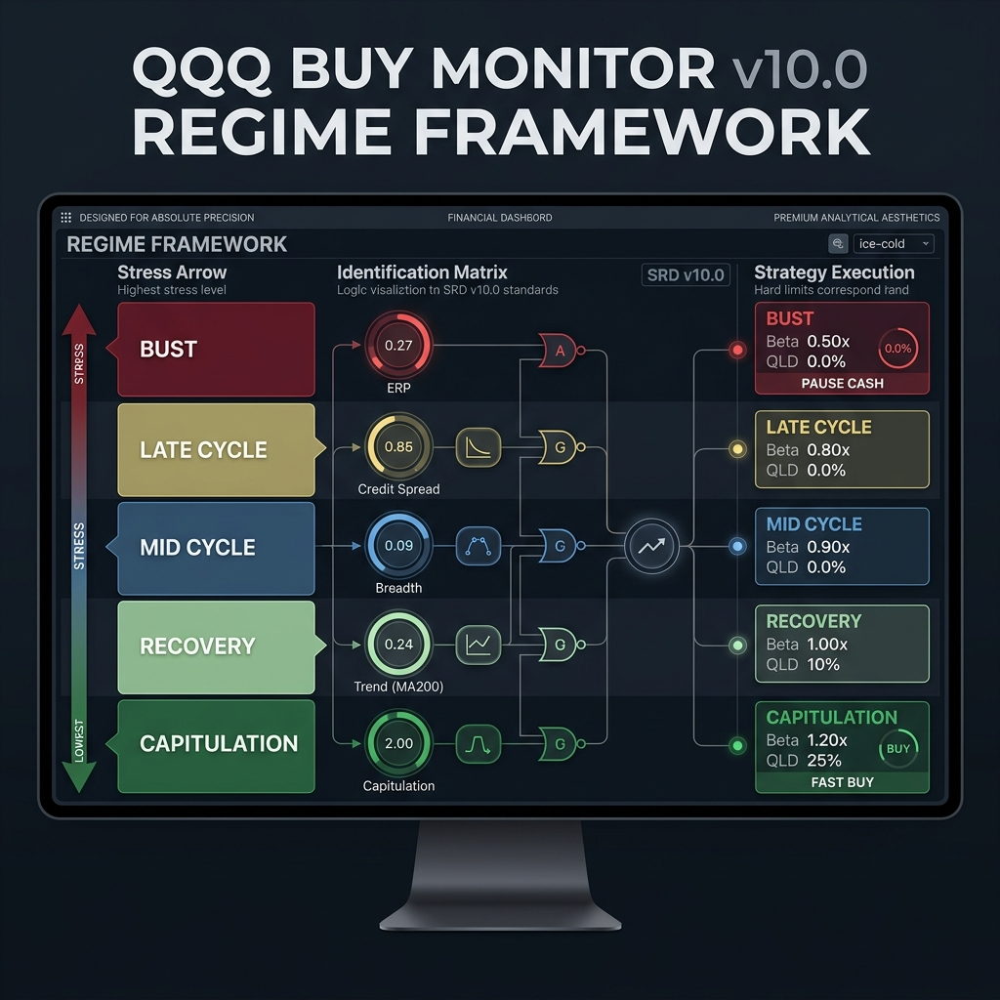
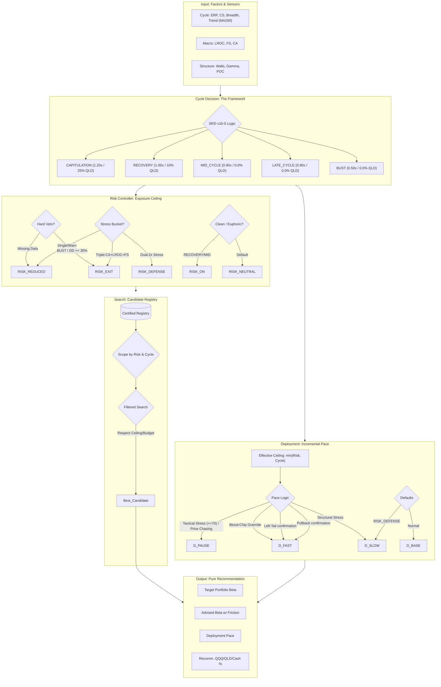

# QQQ Buy-Signal & Cycle-Driven Allocation Monitor (v10.0)

A production-grade QQQ/QLD/Cash recommendation engine built around the **v10.0 Cycle-Driven Architecture**.

The system now has a strict boundary:
- It recommends **target portfolio beta**.
- It recommends **incremental cash deployment pace**.
- It governs **QLD leverage selection** based on cycle eligibility.
- It does **not** manage a wallet or execute trades.

## v10.0 Architecture

### Cycle Decision (The Engine)
`CycleDecision` classifies the market cycle from ERP, credit spreads, breadth, and trend:
`BUST | LATE_CYCLE | MID_CYCLE | RECOVERY | CAPITULATION`.

Cycle-Driven logic:
- **CAPITULATION**: Beta 1.20x | QLD 25% | FAST BUY (Extreme bottoms)
- **RECOVERY**: Beta 1.00x | QLD 10% | BASE BUY (Trend healing)
- **MID_CYCLE**: Beta 0.90x | QLD 0.0% | BASE BUY (Normal bull)
- **LATE_CYCLE**: Beta 0.80x | QLD 0.0% | SLOW BUY (Overvalued/Failing)
- **BUST**: Beta 0.50x | QLD 0.0% | PAUSE (Structural crisis)

### Risk Controller
Determines the allowed exposure ceiling from **Class A macro data** plus the Cycle regime.
Outputs `RiskDecision` with:
- `risk_state`
- `target_exposure_ceiling`
- `qld_share_ceiling`
- `target_cash_floor`
- `cycle_applied`

Key semantics:
- `EUPHORIC` unlocks `RISK_ON` and allows `>1.0` target beta when the registry has compliant candidates.
- `CRISIS` and hard drawdown breaches map to `RISK_EXIT`, but the stock beta floor remains `0.5`.
- If a scoped risk-state registry slice is misconfigured, runtime falls back to the global `0.5 beta` floor candidate instead of silently collapsing to `0.0`.

### Deployment Controller
Determines how to deploy **new incoming cash** under Tier-0 soft ceilings.
Outputs one of:
`DEPLOY_SLOW | DEPLOY_BASE | DEPLOY_FAST | DEPLOY_PAUSE`.

Deployment meanings:
- `DEPLOY_SLOW`: cautious drip deployment; preserve dry powder and wait for better confirmation.
- `DEPLOY_BASE`: normal deployment pace; use when the regime is acceptable and the signal is constructive.
- `DEPLOY_FAST`: aggressive deployment pace; use after a strong dislocation or clear left-side opportunity.
- `DEPLOY_PAUSE`: no new deployment; keep incremental cash on hold.

Key v8.2 semantics:
- `RICH_TIGHTENING` slows default deployment but still allows left-side entry when capitulation is strong.
- `CRISIS` fully pauses incremental deployment unless specific "Blood-chip" capitulation is detected.

### Beta Recommendation
`build_beta_recommendation()` replaces the old amount-based execution surface.

The output is recommendation-only:
- `target_beta`
- recommended `QQQ / QLD / Cash`
- `should_adjust`
- `adjustment_reason`

## Key Changes vs v7.0
- **Linear pipeline:** `Tier-0 → Risk → Search → Recommend`
- **No amount output:** removed `build_execution_actions()` and all dollar deployment calculations
- **Tier-0 hard/soft constraints:** structural regime now directly shapes both stock beta and cash deployment pace
- **Pure math candidate search:** v8 selection respects `max_beta_ceiling` and drawdown budget before recommendation

## 📊 Research Backtest Snapshot
The legacy `--mode portfolio` path is retained as a mixed research tool, not as the production acceptance gate.

Latest verified real-history runs:
- `python -m src.backtest --mode portfolio`
  - Tactical Max Drawdown: `-28.2%`
  - Baseline DCA Max Drawdown: `-35.1%`
  - MDD Improvement: `6.9%` absolute improvement
  - Realized Beta: `0.19`
  - Turnover Ratio: `119.58`
  - Left-side windows preserved: `RICH_TIGHTENING left-side windows = 647`
  - CRISIS deployment breaches: `0`
- `python scripts/run_signal_acceptance_report.py`
  - Target beta alignment: `MAE=0.0559`, `RMSE=0.1688`, `within_tol=88.97%`
  - Deployment alignment: `exact=99.96%`, `within_one_step=99.99%`

Production acceptance should instead be based on the two signal-alignment audits below.

## 🧭 Certified Candidate Reference (v8.2)
v8.2 no longer uses the old `AllocationState` operating matrix at runtime. It selects from the certified registry:

- `RISK_NEUTRAL`: `neutral-base-001` (`70/10/20`, beta `0.90`) or `neutral-low-drift` (`80/5/15`, beta `0.90`)
- `RISK_REDUCED`: `reduced-tight-001` (`80/0/20`, beta `0.80`) or `reduced-base-001` (`50/0/50`, beta `0.50`)
- `RISK_DEFENSE`: `defense-001` (`50/0/50`, beta `0.50`) or `defense-002` (`50/15/35`, beta `0.80`)
- `RISK_EXIT`: `exit-floor-001` (`50/0/50`, beta `0.50`)
- `RISK_ON`: `euphoric-base-001` (`60/25/15`, beta `1.10`) or `euphoric-max-001` (`80/20/0`, beta `1.20`)

## 🛠 Core Tiers
1.  **Tier 0 (Macro Commander):** Monitors Credit Acceleration, Net Liquidity, and Funding Stress. Defines the **Structural Regime**.
2.  **Tier 1 (Tactical Sentiment):** VIX Z-Scores, Fear & Greed, and multi-factor valuation/price divergences.
3.  **Tier 2 (Market Structure):** Real-time Options Walls (Put/Call Walls) and Gamma Flip detection.
4.  **Strategic Layer:** Load certified candidates, respect the beta ceiling, and emit recommendation-only outputs.

## 🧭 Decision Architecture (v8.2)

The current production architecture is the v8.2 linear pipeline documented above. The `docs/v8.0_linear_pipeline_*` files are archived baseline references for the v8.0/v8.1/v8.2 redesign progression.
The diagram below reflects the exhaustive v8.2 decision logic, including Tier-0 regimes, multi-factor risk stress, and deployment overrides.

### 🖼️ v10.0 Regime Framework




### Key Architectural Transitions
1.  **Defensive Bypass (The Kill Switch):** Before any logical processing, the system checks for **Credit Acceleration** (HY OAS velocity), **Liquidity Drains** (Fed Assets - TGA - RRP), and **Funding Stress**. If high-velocity stress is detected, it enters `CASH_FLIGHT` or `DELEVERAGE` immediately.
2.  **Structural Regime (The Macro Commander):** Credit Spreads and **Equity Risk Premium (ERP)** define the structural regime. In the current research build, historical Tier-0 is primarily driven by canonical credit-spread history, with ERP used when available. A `CRISIS` state (Spread > 650bps or ERP < 1.0%) forces risk containment regardless of tactical indicators.
3.  **Tactical State (The Sentiment Filter):** Combines standard metrics with **Divergence (RSI/MFI/ERB)** and **Valuation (PE/FCF)** sub-engines to distinguish between a "Grind Down" and a "Panic."
4.  **v6.4 Selection Engine (The Personal Layer):** Performs a real-time **Candidate Scoring** mechanism using mini-backtests. Any allocation that has historically exceeded a **30% Drawdown (AC-5)** is discarded. Among survivors, it selects for the highest **CAGR** while ensuring **Beta Fidelity (AC-4)**.

## 📦 Getting Started

### 1. Setup
```bash
cp .env.example .env # Add your FRED_API_KEY
docker-compose build
```

### 2. Live Signal & Rebalance Audit
```bash
# Get the latest signal, TAA mirroring guidance, and Beta Audit
docker-compose run --rm app
```

### 3. Institutional Stress & Fidelity Testing
```bash
# Run multi-scenario stress tests with AC-4 Beta Fidelity reports
docker-compose run --rm backtest python scripts/stress_test_runner.py
```

## Signal Audit Workflow

The production system has two independent decision surfaces and they should be audited separately:

1. `target_beta`: stock of assets risk-budget recommendation
2. `deployment_state`: incremental cash entry timing and pace

Use an expectation matrix CSV with a `date` column plus one or both of:
- `expected_target_beta`
- `expected_deployment_state`

Optional runtime-state inputs may also be supplied in the same file. This allows state-conditioned expectation surfaces instead of naive date-only labels:
- `rolling_drawdown`
- `available_new_cash`
- `erp`
- `capitulation_score`
- `tactical_stress_score`

Run the audits:

```bash
# Audit both decision surfaces against an expected signal matrix
python -m src.backtest --mode both --expectations data/expected_signals.csv

# Audit only target-beta alignment
python -m src.backtest --mode beta --expectations data/expected_beta.csv

# Audit only deployment alignment
python -m src.backtest --mode deployment --expectations data/expected_deployment.csv
```

The workflow prints canonical macro coverage and expectation-matrix coverage before the audit summaries.

Acceptance audits should use the canonical research macro dataset. Synthetic `dev-fixture` macro data is blocked by default and only allowed with `--allow-synthetic-macro` for smoke tests. The legacy `--mode portfolio` path remains available for research, but production acceptance should be based on the two signal-alignment audits above.

For a fully reproducible real-history acceptance run, build the expectation matrix from raw market conditions and score both decision surfaces in one step:

```bash
python scripts/run_signal_acceptance_report.py \
  --cache-path data/qqq_history_cache.csv \
  --macro-path data/macro_historical_dump.csv \
  --registry-path data/candidate_registry_v7.json \
  --save-dir /tmp/qqq-monitor-acceptance
```

The script:
- builds a realistic expectation matrix from actual market drawdown, credit spread, credit acceleration, liquidity, and funding stress
- audits `target_beta` and `deployment_state` against that matrix
- asserts the production envelope stays within `0.5 <= beta <= 1.2`
- can save the expectation matrix, joined daily alignment, and JSON summary for review

## 📜 Documentation
- [SRD v8.0 baseline: Linear Pipeline](docs/v8.0_linear_pipeline_srd.md)
- [ADD v8.0 baseline: Implementation Design](docs/v8.0_linear_pipeline_add.md)
- [SDT v8.0 baseline: Test Design](docs/v8.0_linear_pipeline_sdt.md)
- [Architecture Review: SRD vs ADD](docs/v8_architecture_review.md)
- [Allocator-Style Backtest Report](docs/backtest_report.md)

---
*Disclaimer: This tool is for institutional simulation and monitoring purposes. Not individual investment advice.*
