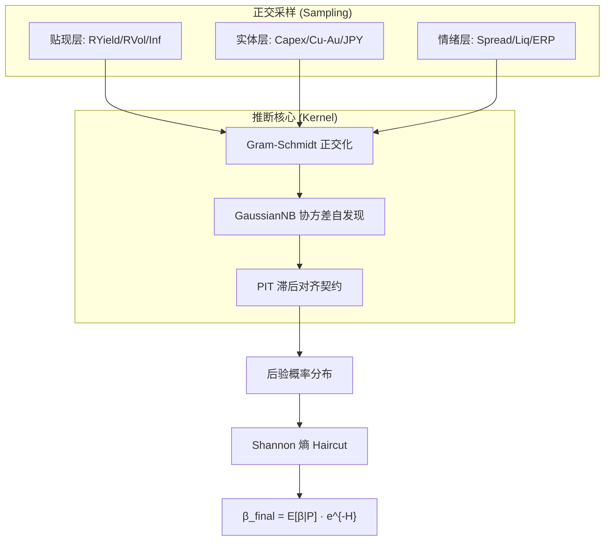

# QQQ "Entropy" 贝叶斯正交因子监控引擎 (v12.0)

[](https://www.python.org/downloads/)
[](https://opensource.org/licenses/MIT)
[](docs/V12_ORTHOGONAL_FACTOR_SPEC.md)

**QQQ Entropy v12.0** 是一款基于**贝叶斯正交因子重构 (Orthogonal Factor Reconstruction)** 的资产配置决策引擎。系统通过 10 个在时域与物理意义上相互正交的宏观齿轮，利用 GaussianNB 协方差自发现算法，为 QQQ 提供全天候的风险定价与防御性 Beta 建议。

> “正交化不是为了消除不确定性，而是为了诚实地映射它。”

---

## 🧠 核心架构：三层正交推断 (v12.0)

v12.0 彻底解决了 v11.5 因子库中存在的“信息近亲繁殖”问题，建立了严密的三层正交体系：

*   **Layer 1: 贴现层 (Discount)** - 捕捉货币与通胀周期。核心因子：真实收益率趋势、**国债已实现波动率 (MOVE 代理)**、通胀预期加速度。
*   **Layer 2: 实体层 (Real Economy)** - 捕捉资本开支与跨境融资压力。核心因子：**核心资本支出动能 (Core Capex)**、铜金比 ROC、日元套息交易 (USD/JPY)。
*   **Layer 3: 情绪层 (Sentiment)** - 捕捉信用与流动性周期。核心因子：信用利差绝对水位/脉冲、净流动性、**基于 Shiller TTM EPS 的股权风险溢价 (ERP)**。

### 关键技术特性
*   **PIT (Point-in-Time) 完整性**：严格执行**发布滞后对齐协议 (Lag Alignment)**。系统在回测中强制模拟历史真实信息流，严禁使用事后修正的宏观终值，确保回测收益零水分。
*   **Gram-Schmidt 正交化引擎**：对共线性极高的因子（如 MOVE 与信用利差）执行无条件在线正交化，确保每一张“贝叶斯选票”都代表独立的物理维度。
*   **信息诚实性 (Entropy-First)**：承认高维空间的稀疏性。系统不再追求虚高的 Top-1 准确率，而是通过 **Shannon 熵** 诚实反映市场混沌度，在高不确定性下自动触发 **Entropy Haircut** 保护仓位。

## 🚀 审计准则 (v12.0 验收标准)

| 审计维度 | 核心指标 | 预期值 | 架构意义 |
| :--- | :--- | :--- | :--- |
| **代码规范** | Ruff Lint 检查 | **0 报错/警告** | 维持工程基线的整洁度，避免格式与引用导致 CI 失败 |
| **制度召回** | 极端 Regime 召回率 | **>= 90%** | 确保 2008/2020/2022 等危机被精准识别 |
| **预测校准** | Brier 分数 | **<= 0.15** | 概率分布的统计一致性优于绝对准确率 |
| **信息诚实** | 平均信息熵 | **0.15 - 0.40** | 承认高维推断的混沌属性，拒绝虚假确信 |
| **防伪验证** | PIT 合规性 | **100%** | 全部宏观因子必须通过物理发布滞后审计 |

## 🛠 快速开始

### 1. 环境配置 (Docker 推荐)
```bash
docker build -t qqq-monitor .
```

### 2. 实时生产运行 (T+0)
```bash
# 获取 v12 正交推断建议
python -m src.main
```

### 3. v12 法医级全量回测 (Backtest)
执行包含 PIT 滞后模拟的 16 年全量因果审计：
```bash
python -m src.backtest --evaluation-start 2010-01-01
```

## 🏗 系统拓扑



## 📂 仓库地图
*   `src/engine/v11/` - 贝叶斯推断引擎核心（v12 沿用并增强）。
*   `src/collector/` - **v12 全球正交因子采集器** (DGS10/Shiller/FRED)。
*   `docs/V12_ORTHOGONAL_FACTOR_SPEC.md` - **v12 锁版架构说明书**。
*   `scripts/v12_historical_data_builder.py` - PIT 合规历史 DNA 构建器。

---
© 2026 QQQ Entropy 决策系统开发组.
