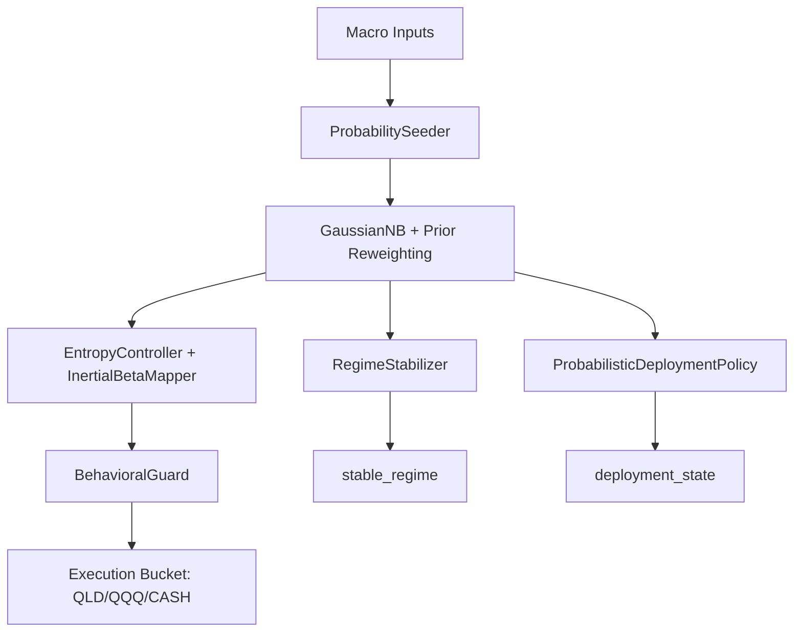

# QQQ "Entropy" Monitor (v11)

[](https://www.python.org/downloads/)
[](https://opensource.org/licenses/MIT)
[](docs/WIKI_V11.md)

**QQQ Entropy** is a probabilistic regime engine for personal investors. The current production path is deterministic in engineering terms: persistent priors/posteriors, explicit posterior reweighting, a curated six-factor regime core, and separate surfaces for `target_beta` and `deployment_state`.

> "The exoskeleton doesn't walk for you, but it keeps you upright in the storm."

---

## 🧠 Core Philosophy: Bayesian-Core
v11 marks the evolution from hard-coded thresholds to **probabilistic survival**.
*   **Deterministic Memory**: `data/v11_prior_state.json` persists prior, posterior, regime state, beta inertia, deployment state, and execution evidence.
*   **Uncertainty as Signal**: High entropy delays regime and bucket flips instead of hiding uncertainty behind hard-coded thresholds.
*   **Dual-Surface Contract**: `target_beta` manages portfolio risk; `deployment_state` manages incremental cash pacing.

## 🚀 Performance Snapshot (1999-2026 Audit)
Verified on **March 30, 2026**, via `python -m src.backtest --mode v11`:

| Metric | Performance | Result |
| :--- | :--- | :--- |
| **Regime Accuracy** | **97.05%** | Current checked-in audit corpus |
| **Brier Score** | **0.0487** | Lower is better |
| **Mean Entropy** | **0.052** | Low posterior uncertainty on the current corpus |
| **Lock Incidence** | **0.2%** | Minimal churn after stabilization |

## 🛠 Quick Start

### 1. Environment Setup
```bash
python -m venv .venv
source .venv/bin/activate
pip install -e .[dev]
```

### 2. Live Recommendation
Run the Bayesian runtime for today's signal:
```bash
python -m src.main --engine v11
```

### 3. High-Performance Audit
Run the current v11 audit:
```bash
python -m src.backtest --mode v11
```
Artifacts are written to `artifacts/v11_5_acceptance/`.

## 🏗 System Architecture



## 📂 Repository Map
*   `src/engine/v11/` - Current probabilistic production engine.
*   `src/research/` - Logic for signal expectations and performance benchmarks.
*   `artifacts/v11_5_acceptance/` - Current audit charts.
*   `docs/WIKI_V11.md` - **[Master User Manual]** Detailed methodology and chart guide.

## 📖 Normative Documentation
For architects and developers:
1. [Production Baseline](docs/v11_bayesian_production_baseline_2026-03-30.md) - Current v11 contract.
2. [Production SOP](docs/roadmap/v11_production_sop.md) - Operational runbook.
3. [Universal Factor Registry](docs/v11_universal_factor_registry.md) - Research/archive factor inventory.

`conductor/tracks/v11/spec.md` and `conductor/tracks/v11/add.md` are preserved as historical design snapshots, not the live production baseline.

## ⚙️ GitHub Actions
The repository now separates automation into:

1. `ci-v11.yml` for deterministic verification: lint, v11 tests, and audit backtest.
2. `deploy-web.yml` for scheduled dashboard export.
3. `discord-signal.yml` for scheduled Discord notification.

Production workflows share the same reusable runtime base and no longer duplicate environment/bootstrap logic.

---
© 2026 QQQ Entropy Development Group.
