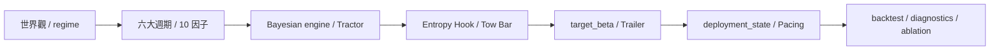
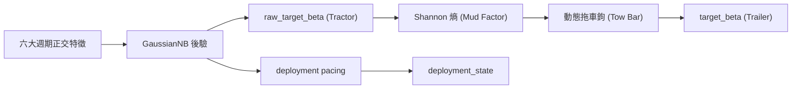

# QQQ 貝氏正交因子觀測站 (v14.0)

## 「在不確定性的迷霧中，我們不追求神諭，我們只做更誠實的校準。」

QQQ Monitor 的 v14 不再試圖把市場壓縮成一個「更聰明的單軸判斷」。它把自己重構成一套**六大週期的正交觀測系統**：既看貨幣，也看信用；既看通膨，也看實體資本支出；既看商品與風險偏好，也看跨境融資壓力。

在 v14 中，我們引入了核心的**泥地拖拉機與掛車 (Mud Tractor & Trailer)** 耦合原理。系統的目標不變，但方法更嚴酷：**用互相盡量獨立的總經物理量，去推斷目前處在哪一種制度裡；並根據當前環境的「抓地力」（後驗信心），動態決定動力源（訊號）與負載（部位）的連接強度，據此校準風險。**

對一般使用者來說，可以把它理解為：

- 它不是預測明天漲跌的水晶球。
- 它是一台在總經泥地裡爬行的**防禦型拖拉機**。
- 當訊號清晰（地面乾燥）時，它會更果斷地拖動掛車；當訊號混雜（進入泥地）時，它會自動讓拖車鉤變鬆，防止拖拉機的打滑導致整台掛車甩尾。

## 閱讀路線

這篇文章依照「從世界觀到執行」的順序組織，建議這樣讀：

1. `0` 決策輸出：動力、負載與鉤子
2. `1` 制度態與四階段：抓地力的來源
3. `2` 六大週期與 10 因子：引擎的氣缸
4. `3` 正交化與因果標準化：過濾重複的噪音
5. `4` 貝氏引擎與泥地耦合：拖車鉤的物理學
6. `5` 回測與診斷：泥地裡的足跡
7. `6` 受控 ablation
8. `7` 面向使用者的直覺說明
9. `8` 可視化
10. `9` 結語：外骨骼與平衡
11. `10` 稽核與產物

---

## 0. 三個輸出，不是一件事：動力、負載與節奏

v14 裡有三條不同的決策軌道，它們彼此相關，但透過 **MT&T 邏輯** 進行了物理隔離。

1. `raw_target_beta` (The Tractor Engine)
2. `target_beta` (The Trailer Position)
3. `deployment_state` (The Mud Pacing)

### 它們分別是什麼？

- **`raw_target_beta` (拖拉機動力輸出)：** 是**貝氏後驗期望**，回答「如果不考慮執行摩擦、慣性與泥地打滑，系統今天最想要多少 Beta」。它是引擎的純粹扭力。
- **`target_beta` (掛車實際位置)：** 是**執行層結果**，回答「考慮到地面抓地力（熵）、拖車鉤慣性與系統穩定性之後，今天掛車真正應該被拖到什麼位置」。
- **`deployment_state` (新錢進場節奏)：** 是**增量資金的泥地策略**，回答「在目前的地面濕度下，新錢該快、慢、停，還是先等等」。

> **白話版：**  
> `raw_target_beta` 是拖拉機引擎想轉的方向，`target_beta` 是後方掛車最後停在哪，`deployment_state` 是新錢這包沉重的行李該分幾次搬上車。

---

## 1. 制度態先行：系統先壓縮狀態，再解釋週期

v14 的第一件事不是「辨識某個指標」，而是判斷目前總經組合屬於哪一種**經濟-風險制度態 (Regime)**。這一步決定了拖拉機在地面上的**基本抓地力預設**。

### 1.1 什麼是 regime，為什麼不是「另一個因子」

在本文裡，`regime` 指的是**經濟-風險制度態**。它不是輸入變數，而是系統對「目前總經物理狀態」的**壓縮標籤**。它回答一個更高層的問題：「這些變數組合起來，目前更像哪一種行車環境？」

### 1.2 四個 regime 的經濟含義與抓地力特徵

| Regime | 經濟階段 | 直覺含義 | 對掛車 (Trailer) 的物理影響 |
| :--- | :--- | :--- | :--- |
| `RECOVERY` | 復甦 | 最壞的衝擊已過，風險偏好回歸 | 地面開始變乾，允許掛車快速跟進拖拉機 |
| `MID_CYCLE` | 擴張 | 經濟和盈利平穩，沒有過熱 | 柏油路面，維持常規跟隨，穩定性優先 |
| `LATE_CYCLE` | 末期 | 動能衰減，通膨信用壓力抬頭 | 地面變濕（泥地化），拖車鉤變鬆，掛車減速 |
| `BUST` | 衰退 | 信用流動性同時惡化，系統性風險 | 陷入深海泥沼，掛車強制煞車，與動力源暫時脫鉤 |

### 1.3 第一性原理：為什麼這四態對 QQQ/QLD 足夠

因為 QQQ/QLD 的收益本質上是「貼現率、盈利預期、流動性」三者的函數。系統不需要預測經濟學的所有名詞，只需要判斷：**這是可以踩油門的硬地，還是必須鬆開掛車防甩尾的泥地？**

---

## 2. 從週期到制度態：v14 的宏觀骨架

v14 將市場拆成六個正交物理層。每一層都要回答一個獨立問題，為拖拉機提供不同的氣缸動力。

### 2.1 六大週期物理軸

| 週期 | 物理問題 | v14 主要因子 | 為什麼選它 |
| :--- | :--- | :--- | :--- |
| 貨幣週期 | 真實融資成本環境 | `real_yield_structural_z`, `move_21d` | 結構利率是引力，公債波動率是爆炸點 |
| 信用週期 | 金融系統的痛感 | `spread_21d`, `spread_absolute` | 信用利差是風險偏好的直接溫度計 |
| 通膨週期 | 貨幣政策的自由度 | `breakeven_accel` | 加速度比水平值更能抓到政策邊際轉向 |
| 實體資本支出週期 | 真實產能擴張動能 | `core_capex_momentum` | 這是經濟的「底層硬體」更新速度 |
| 商品與全球偏好週期 | 製造業與恐慌的對比 | `copper_gold_roc_126d` | 實體需求與貨幣避險的分叉點 |
| 跨境融資週期 | 全球槓桿去化壓力 | `usdjpy_roc_126d` | 日圓套息回撤是全球融資壓力的最高靈敏代理 |

### 2.2 v14 的 10 因子矩陣（全細節保留）

| 因子 | 變數本體 | 類型 | 作用 |
| :--- | :--- | :--- | :--- |
| `real_yield_structural_z` | 10Y TIPS 收益率 | 結構層級 | 抓融資成本的中長期重心 |
| `move_21d` | DGS10 21日已實現波動率 | 貼現率衝擊 | 抓公債收益率波動的失控 |
| `breakeven_accel` | 10Y 通膨預期 21日二階變化 | 通膨加速度 | 抓通膨預期是否突然升溫 |
| `core_capex_momentum` | 非國防資本財新訂單月度變化 | 實體動能 | 抓企業資本支出是否掉速 |
| `copper_gold_roc_126d` | 銅/金比 126日 ROC | 商品動量 | 抓全球實體需求與避險情緒 |
| `usdjpy_roc_126d` | 美元兌日圓匯率 126日 ROC | 跨境融資動量 | 抓 carry trade 的去槓桿 |
| `spread_21d` | 高收益信用利差 21日滾動 | 信用脈衝 | 抓信用壓力的短期抬升 |
| `liquidity_252d` | 淨流動性 (Fed B/S 派生) | 流動性結構 | 抓貨幣環境的年尺度趨勢 |
| `erp_absolute` | 股權風險溢酬 (TTM) | 估值錨點 | 抓 ERP 的真實物理高度 |
| `spread_absolute` | 信用利差絕對歷史坐標 | 價格錨點 | 抓信用壓力的絕對水位 |

---

## 3. 從制度態到特徵：如何避免「同一訊號聽兩遍」

### 3.1 Causal Self-Calibrating Normalization
所有輸入執行嚴格因果標準化，確保拖拉機不會偷看「未來的地圖」。

### 3.2 無條件 Gram-Schmidt 正交化（主鏈核心改動）
v14 強制執行 `move_21d` 與 `spread_21d` 的殘差化處理。
這確保了當公債波動與信用壓力同時上升時，系統不會重複計票。**在泥地裡，重複的訊號會導致不必要的急煞，破壞掛車的平衡。** 正交化是讓拖拉機轉向更「平順」的關鍵。

---

## 4. 貝氏引擎與泥地耦合：拖車鉤的物理學

這是 v14 的核心創新：將**資訊熵 (Entropy)** 轉化為**機械連接強度**。

### 4.1 貝氏引擎：大腦在算什麼
系統計算觀測向量 $x_t$ 離哪個制度的「特徵指紋中心」最近。
$$P(x_t \mid R_k) = \prod_i \mathcal{N}(x_{t,i}; \mu_{k,i}, \sigma^2_{k,i})$$

### 4.2 泥地耦合原理 (The Entropy Hook)
當系統計算出後驗分佈後，會立即計算 **Shannon 熵 $H(P)$**。
- **低熵 ($H \to 0$)：** 地面乾燥，抓地力強。拖車鉤變為「硬連接」。`target_beta` 迅速對齊 `raw_target_beta`。
- **高熵 ($H \to 1$)：** 進入泥地，證據混雜。拖車鉤變為「彈性連接」甚至「脫鉤」。
  $$\beta_{protected} = \beta_{raw} \cdot e^{-H(P)}$$
  **這就是系統的「誠實」：當我不確定時，我雖然知道引擎想加速，但我選擇不拖動掛車。**

### 4.3 穩定器：Raw Regime vs Stable Regime
- `raw_regime`：拖拉機龍頭的指向。
- `stable_regime`：掛車整體的朝向。
只有當龍頭指向同一個方向的時間足夠長、證據穿透力足夠強時，才允許掛車切換 Regime。

---

## 5. 回測與診斷：泥地裡的足跡

v14 的診斷系統不再只看績效，而是看「動力與負載的協同性」。

### 5.1 診斷三劍客
1. `src/backtest.py`：生成因果稽核鏈。
2. `scripts/run_v12_diagnostics.py`：彙總 Crisis Slice（危機切片）表現。
3. `scripts/run_v12_ablation.py`：驗證每一個氣缸（因子）是否真的提供了獨立動力。

### 5.2 已驗證結果（v14 鎖版數據）
| 指標 | 結果 | 物理含義 |
| :--- | :--- | :--- |
| `top1_accuracy` | `67.38%` | 拖拉機方向辨識率 |
| `mean_entropy` | `0.3332` | 系統整體的「清醒度」 |
| `lock_incidence` | `1.21%` | 在極端泥地中強制鎖死掛車的頻率 |
| `crisis_recall` | `74.41%` | 在大災難（深海泥沼）中的辨識成功率 |

---

## 9. 結語：更少的幻覺，更多的生存

v14 的哲學不再是「預測」，而是**「耦合的藝術」**。

它承認：引擎（訊號）可以很快，但掛車（部位）必須穩。當我們在總經的泥地裡前行時，最重要的不是跑得最快，而是確保在每一次打滑時，拖車鉤都能精準地吸收震盪，不讓整台車崩潰。

## 「外骨骼（拖拉機）不替你判斷方向，但它會在風暴（泥地）裡替你守住掛車的平衡。」

---

## 10. 稽核與產物索引
- `artifacts/v14_mainline_audit/full_audit.csv`
- `artifacts/v14_mainline_diagnostics/diagnostic_report.json`

---
© 2026 QQQ Entropy 決策系統架構組 | v14.0 Baseline Locked.