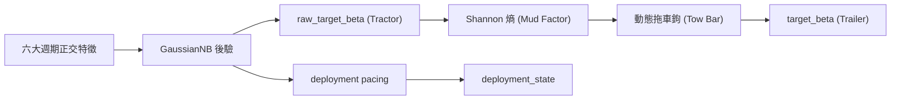
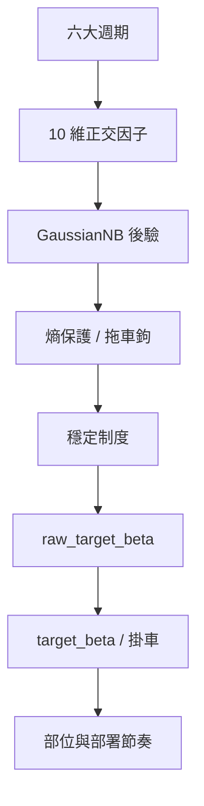

# 邏輯生存：QQQ 決策系統的週期哲學與可視化指揮手冊 (v14.0 MT&T 增強版)

## 「在不確定性的迷霧中，我們不追求神諭，我們只做更誠實的校準。」

QQQ Monitor 的 v14 不再試圖把市場壓縮成一個「更聰明的單軸判斷」。它把自己重構成一套**六大週期的正交觀測系統**：既看貨幣，也看信用；既看通膨，也看實體資本支出；既看商品與風險偏好，也看跨境融資壓力。系統的目標不變，但方法更嚴格：**用互相盡量獨立的總經物理量，去推斷目前處在哪一種制度裡，並根據當前環境的「抓地力」（後驗信心）決定動力源（訊號）與負載（部位）的連接強度。**

在 v14 中，我們引入了核心的**泥地拖拉機與掛車 (Mud Tractor & Trailer, MT&T)** 耦合原理：
- **拖拉機 (Tractor)：** 是引擎的動力輸出，即系統理論上最想達到的 Beta。
- **掛車 (Trailer)：** 是實際承擔的風險負載。
- **泥地 (Mud)：** 當資訊熵 (Entropy) 升高時，代表地面變成了泥地，抓地力下降。
- **耦合 (Coupling)：** 系統自動調降連接強度，防止拖拉機的打滑導致掛車甩尾。

對一般使用者來說，可以把它理解為：
- 它不是預測明天漲跌的水晶球。
- 它是一套會自己承認「看不清」的**防禦型導航儀**。
- 當訊號清晰時，它會更果斷；當訊號混雜（進入泥地）時，它會自動變保守，讓掛車與引擎暫時「脫鉤」。

## 閱讀路線

這篇文章依照「從世界觀到執行」的順序組織，建議這樣讀：

1. `0` 決策輸出：動力、負載與節奏
2. `1` 制度態與四階段：環境的物理標籤
3. `2` 六大週期與 10 因子：氣缸的正交組合
4. `3` 正交化與因果標準化：過濾重複的證據
5. `4` 貝氏引擎與泥地耦合：拖車鉤的物理學
6. `5` 回測與診斷：泥地裡的因果足跡
7. `6` 受控 ablation：氣缸的獨立貢獻驗證
8. `7` 面向使用者的直覺說明
9. `8` 可視化：心智地圖
10. `9` 結語：生存勝於預測
11. `10` 稽核與產物

---

## 0. 三個輸出，不是一件事：動力、負載與節奏

v14 裡有三條不同的決策軌道，它們透過 **MT&T 耦合邏輯** 進行了物理隔離。

1. `raw_target_beta` (The Tractor Engine)
2. `target_beta` (The Trailer Position)
3. `deployment_state` (The Mud Pacing)

### 它們分別是什麼？

- **`raw_target_beta` (拖拉機動力輸出)：** 是**貝氏後驗期望**，回答「如果不考慮執行摩擦、慣性與泥地打滑，系統今天最想要多少 Beta」。它是引擎的純粹扭力。
- **`target_beta` (掛車實際位置)：** 是**執行層結果**，回答「考慮到地面抓地力（熵）、拖車鉤慣性與系統穩定性之後，今天掛車真正應該被執行多少 Beta」。
- **`deployment_state` (新錢進場節奏)：** 是**增量資金的泥地策略**，回答「在目前的地面濕度下，新錢該快、慢、停，還是先等等」。

> **白話版：**  
> `raw_target_beta` 是腦袋裡的想法（動力），`target_beta` 是最後下單（載重），`deployment_state` 是薪水和獎金該怎麼分批進場（搬行李節奏）。

---

## 1. 制度態先行：系統先壓縮狀態，再解釋週期

v14 的第一件事不是「辨識某個指標」，而是判斷目前總經組合屬於哪一種**經濟-風險制度態**。這一步先於因子、先於熵、也先於部位。

### 1.1 什麼是 REGIME，為什麼不是「另一個因子」

在本文裡，`regime` 指的是**經濟-風險制度態**。它不是輸入變數，也不是單一經濟指標，而是系統對「目前總經物理狀態」的**壓縮標籤**。系統先看很多原始變數，再問一個更高層的問題：「這些變數組合起來，目前更像哪一種經濟與風險環境？」

### 1.2 v14 為什麼要把很多週期壓縮成四個 REGIME

第一性原理上，QQQ/QLD 不是在交易 GDP 這個抽象概念，而是在交易三件更直接的東西：
1. 估值折現是否變貴
2. 盈利預期是否還在擴張
3. 流動性與信用條件是否允許高 Beta 繼續存在

對目標資產來說，真正重要的不是「總經到底有多少個維度」，而是「這些維度最後會不會把組合推向同一種風險動作」。如果多個週期最後都會讓系統做同一件事（例如去槓桿），那系統就要把它們壓縮成少數幾個可執行制度。

### 1.3 四個 REGIME 的經濟含義

| Regime | 經濟階段 | 直覺含義 | 對 QQQ/QLD 的主要含義 |
| :--- | :--- | :--- | :--- |
| `RECOVERY` | 復甦 / 修復 | 最壞的流動性衝擊已經過去，風險偏好開始回歸 | 允許重新加碼，QLD 可逐步回歸，地面變乾 |
| `MID_CYCLE` | 擴張 / 中期平穩 | 經濟和盈利仍在擴張，但沒有進入過熱末端 | QQQ 為主，維持常規 beta，柏油路面 |
| `LATE_CYCLE` | 末期 / 衰退前段 | 成長動能衰減，通膨和信用壓力開始抬頭 | 逐步減弱進攻性，QLD 降權，地面變濕 |
| `BUST` | 衰退 / 休克 | 信用和流動性同時惡化，系統性風險優先 | 保護本金，避開 QLD，進入深海泥沼 |

### 1.4 第一性原理：為什麼這四態對 QQQ/QLD 足夠

QQQ 和 QLD 的收益本質上都來自對同一條鏈路的放大：
- 貼現率下降時，成長股估值會被抬高
- 盈利擴張時，高 Beta 資產更容易放大漲幅
- 流動性寬鬆、信用平穩時，槓桿產品才有空間發揮
- 一旦信用斷裂或真實利率上行，槓桿會反向放大下跌

所以系統不需要預測「經濟學名詞」，而是判斷：這是可以繼續承擔風險的階段嗎？還是該鬆開拖車鉤？

---

## 2. 從週期到制度態：v14 的宏觀骨架

v14 的核心是把市場重新拆成六個互相盡量獨立的物理層。每一層都要回答一個獨立問題。

### 2.1 六大週期不是六個預測器，而是六個物理軸

| 週期 | 物理問題 | v14 主要因子 | 時間域 | 為什麼選它 |
| :--- | :--- | :--- | :--- | :--- |
| 貨幣週期 | 真實融資成本環境 | `real_yield_structural_z`, `move_21d` | 126d / 21d | 結構利率決定估值底盤，公債波動率抓「貼現率失控」 |
| 信用週期 | 金融系統的痛感 | `spread_21d`, `spread_absolute` | 21d / expanding | 信用利差是風險偏好的直接溫度計 |
| 通膨週期 | Fed 救市空間 | `breakeven_accel` | 21d acceleration | 通膨預期的「速度」比水平值更關鍵 |
| 實體資本支出週期 | 真實產能擴張動能 | `core_capex_momentum` | monthly delta | 資本支出幅度比擴散指數更接近真實經濟體量 |
| 商品與全球風險偏好週期 | 製造業與恐慌的對比 | `copper_gold_roc_126d` | 126d momentum | 銅/金比能抓到實體需求和避險情緒的分叉 |
| 跨境融資週期 | 全球槓桿去化壓力 | `usdjpy_roc_126d` | 126d momentum | 日圓套息回撤是全球融資壓力的最高靈敏代理 |

### 2.2 v14 的 10 因子矩陣 (Locked Matrix)

| 因子 | 變數本體 | 類型 | 時域 | 作用 |
| :--- | :--- | :--- | :--- | :--- |
| `real_yield_structural_z` | 10Y TIPS 收益率 | 結構層級 | 126d EWMA | 抓融資成本的中長期重心 |
| `move_21d` | DGS10 21日已實現波動率 | 貼現率衝擊 | 21d exp z | 抓公債收益率波動的失控 |
| `breakeven_accel` | 10Y 通膨預期 21日二階變化 | 通膨加速度 | 21d accel | 抓通膨預期是否突然升溫 |
| `core_capex_momentum` | 非國防資本財新訂單月度變化 | 實體動能 | monthly delta | 抓企業資本支出是否掉速 |
| `copper_gold_roc_126d` | 銅/金比 | 商品動量 | 126d ROC | 抓全球實體需求與避險情緒 |
| `usdjpy_roc_126d` | 美元兌日圓匯率 | 跨境融資動量 | 126d ROC | 抓 carry trade 的去槓桿 |
| `spread_21d` | 高收益信用利差 21日滾動 | 信用脈衝 | 21d rolling | 抓信用壓力的短期抬升 |
| `liquidity_252d` | 淨流動性 (Fed B/S) | 流動性結構 | 252d rolling | 抓貨幣環境的年尺度趨勢 |
| `erp_absolute` | 股權風險溢酬 (TTM) | 估值錨點 | monthly | 抓 ERP 的真實物理高度 |
| `spread_absolute` | 信用利差絕對坐標 | 價格錨點 | expanding z | 抓信用利差的絕對水位 |

### 2.3 為什麼要同時保留 LEVEL、MOMENTUM 和 ACCELERATION

v14 不再相信「單一時點」能描述市場。
- **Level** 像體溫計（已經多緊、多貴）。
- **Momentum** 像體溫變化速度。
- **Acceleration** 像醫師判斷病情是否失控。

### 2.4 哪些候選因子被計畫過，但最後被回測丟棄 (History of Rejection)

| 候選因子 | 最終結論 | 原因 |
| :--- | :--- | :--- |
| `yield_absolute` | 丟棄 | 與 `real_yield_structural_z` 高度共線 |
| `drawdown_pct` | 丟棄 | 主要是滯後描述，不提供前瞻資訊 |
| `DXY` | 丟棄 | 傳導不如 USD/JPY 直接，Carry 資訊密度更低 |
| 歐元區 PMI | 丟棄 | 與美國經濟因子冗餘 |
| BTP-Bund 利差 | 丟棄 | 被信用利差層覆蓋，資料鏈不穩 |
| 直接使用 JGB 10Y | 丟棄 | 頻率太低，實戰不如 USD/JPY 有效 |

---

## 3. 從制度態到特徵：系統如何避免「同一個訊號被聽兩遍」

### 3.1 CAUSAL SELF-CALIBRATING NORMALIZATION
所有輸入執行嚴格因果標準化，確保模型不會偷看未來。

### 3.2 MOVE/SPREAD 的無條件 GRAM-SCHMIDT (The Orthogonalizer)
v14 強制剝掉 `move_21d` 裡和 `spread_21d` 重疊的部分。
$$move^{orth}_t = move_z - \beta_t \cdot spread_z$$
這不是「相關才處理」，而是「永遠處理」。這防止了當公債與信用同時出事時，拖拉機因為聽到兩次同樣的證據而產生不必要的急煞。

---

## 4. 貝氏引擎與泥地耦合：拖車鉤的物理學

v14 的核心引擎將**資訊熵 (Entropy)** 轉化為**機械連接強度**。

### 4.1 每一天，系統先問一個機率問題
計算觀測向量離哪個制度的「特徵指紋中心」最近。
$$P(x_t \mid R_k) = \prod_i \mathcal{N}(x_{t,i}; \mu_{k,i}, \sigma^2_{k,i})$$

### 4.2 遞迴貝氏：帶慣性的更新
$$P(R_{k,t} \mid \mathbf{e}_t) = \eta \cdot P(\mathbf{e}_t \mid R_{k,t}) \cdot \sum_j P(R_{k,t} \mid R_{j,t-1}) \cdot P(R_{j,t-1} \mid \mathbf{e}_{t-1})$$
這讓系統不可能因為一天噪音就瞬間跳變。

### 4.3 泥地耦合原理 (Entropy Haircut)
系統計算 **Shannon 熵 $H(P)$**。當熵高時，說明進入了泥地。
$$\beta_{protected} = \beta_{raw} \cdot e^{-H(P)}$$
**這就是系統的「誠實」：當我不確定時，我雖然知道引擎想轉向，但我選擇不拖動掛車。**

---

## 5. 回測與診斷：泥地裡的因果足跡

### 5.1 正式 DIAGNOSTIC HARNESS
診斷鏈由 `src/backtest.py`、`scripts/run_v12_diagnostics.py` 與 `scripts/run_v12_ablation.py` 組成。

### 5.2 已驗證結果 (v14 Mainline)
| 指標 | 結果 | 物理含義 |
| :--- | :--- | :--- |
| `top1_accuracy` | `67.38%` | 拖拉機方向辨識率 |
| `mean_entropy` | `0.3332` | 地面平均濕度（誠實度） |
| `crisis_recall` | `74.41%` | 在深海泥沼中的逃生率 |

### 5.3 危機切片的真實表現
- **2018Q4:** 信用壓力抬升，系統穩定辨識壓力，不硬造連續 BUST。
- **2020 COVID:** 極端衝擊，100% 觸發 BUST 防禦。
- **2022 H1:** 通膨加速度惡化，提前承認救市空間變小。

---

## 6. 受控 ABLATION：氣缸的獨立貢獻驗證

### 6.1 已接受的預設改動
- `GaussianNB var_smoothing=1e-4`：在區辨度與穩定性間取得平衡。
- `core_capex_momentum (ewma_span=3)`：過濾月度雜訊。
- `classifier_only` 模式：拒絕主觀權重，保持後驗誠實。

### 6.2 哪些被拒絕
- `roc_63d`：因準確率下降被拒。
- `move_orth_none`：因重複計票導致系統失穩被拒。

---

## 7. 給廣域使用者的一版解釋

1. **它在幹什麼？** 像一個經驗豐富的風控經理。平時看很多指標，但只有獨立方向都變壞時，才會明顯降低掛車負載。
2. **為什麼要正交？** 防止同一份證據聽兩次。剔除重複，只聽「新資訊」。
3. **為什麼熵高時要減倉？** 因為當系統自己都不確定時，最糟的動作是瞎猜。縮小部位，先活下來。

---

## 8. 關鍵可視化：v14 的心智地圖

### 8.1 從宏觀到執行

---

## 9. 結語：生存勝於預測

v14 的哲學不再是「神諭」，而是**「耦合的藝術」**。它承認市場有迷霧，承認引擎會打滑。如果你想要的是「在複雜世界裡持續生存」，v14 的 MT&T 架構比任何單純的預測器都更可靠。

## 「外骨骼（拖拉機）不替你判斷方向，但它會在風暴（泥地）裡替你守住掛車的平衡。」

---

## 10. 稽核與產物索引
- `artifacts/v14_mainline_audit/full_audit.csv`
- `artifacts/v14_mainline_diagnostics/diagnostic_report.json`

---
© 2026 QQQ Entropy 決策系統架構組 | v14.0 Baseline Locked.