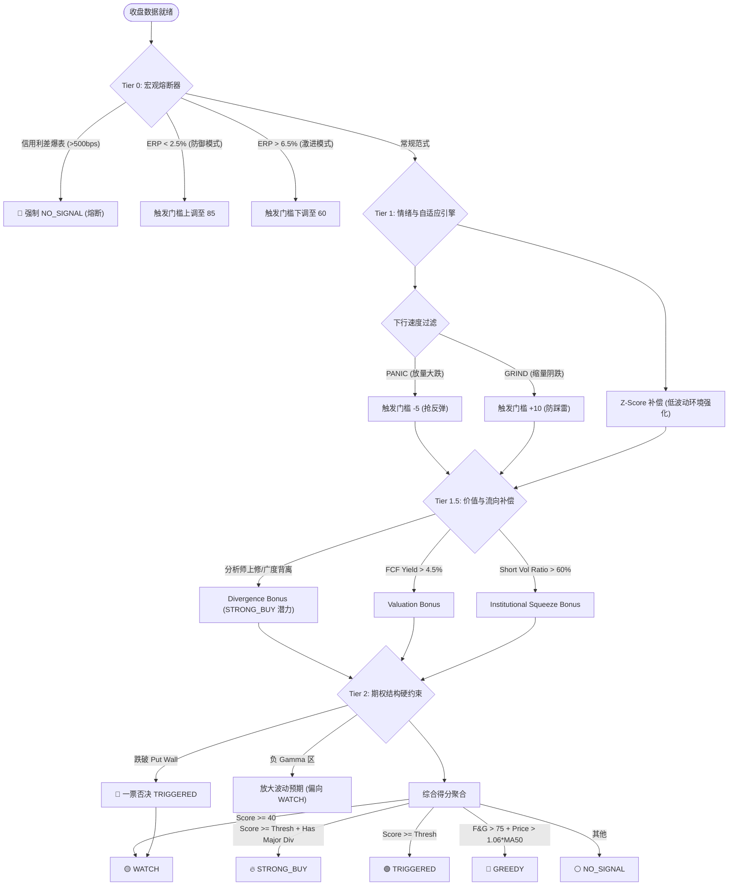

# PRD: QQQ 买点信号监控系统 (v5.0 全维量化版)

> **版本**: 5.0 (Enterprise Architecture)  
> **状态**: Released  
> **日期**: 2026-03-13  
> **负责人**: Wei Zhang

---

## 1. 背景与动机

### 1.1 系统进化路径

`qqq-monitor` 从最初的情绪捕捉器演进为如今的多层级宏观量化决策系统：

*   **v1.0 (MVP)**: 基于 VIX 和回撤幅度的简单恐慌买入模型。
*   **v2.0 (Divergence)**: 引入技术背离（Price-RSI/Breadth），识别动能衰竭。
*   **v3.0 (Macro/Fundamental)**: 引入 ERP 和估值锚点，识别绝对价值。
*   **v4.x (Adaptive & Liquidity)**: 引入 Z-Score 自适应阈值、流动性（Net Liquidity）和波动率环境分类（Regime）。
*   **v5.0 (The Final Frontier)**: 整合 **Tier 0 宏观熔断**、**Tier 1.5 机构流向确认** 和 **速度过滤器 (Velocity Filter)**，实现“阴跌 vs 超跌”的智能化区分。

### 1.2 核心问题

在复杂市场中，单一维度的抄底往往面临三类风险：
1.  **宏观崩塌**：系统性流动性危机（如雷曼时刻）时，技术指标全面失效。
2.  **阴跌陷阱 (Grind Down)**：缺乏恐慌的持续缓跌会不断消耗资金，且难以形成强反弹。
3.  **结构性破位**：跌破期权 `Put Wall` 导致的做市商被迫卖出压力。

### 1.3 解决思路

构建一个四层嵌套的过滤与确认逻辑：
*   **Tier 0**: 宏观生死线（信用利差、股权风险溢价）。
*   **Tier 1**: 情绪与动能自适应引擎（带 Z-Score 补偿）。
*   **Tier 1.5**: 价值补偿与背离红利（估值、分析师修正、短线流向）。
*   **Tier 2**: 期权微观结构硬约束（Put Wall / Gamma Flip）。

---

## 2. 产品目标

| 编号 | 目标 | 衡量标准 |
|------|------|---------|
| G1 | **宏观风险规避** | 成功过滤类似 2008/2020 级别的信用危机初期 |
| G2 | **区分阴跌与超跌** | 对 "Grind Down" 阶段维持 NO_SIGNAL 或观察，对 "Panic" 触发信号 |
| G3 | **提高买点性价比** | 信号触发后的 T+20 胜率优于单纯的回撤策略 ≥25% |
| G4 | **三态升级为五态** | 增加 `STRONG_BUY`（背离共振）和 `GREEDY`（风险规避） |

---

## 3. 决策逻辑流水线 (Architecture v5.0)

---

## 4. 详细信号引擎设计

### 4.1 Tier 0: 宏观与系统性风险 (Macro Regime)

| 指标 | 逻辑 | 动作 |
|------|------|------|
| **Credit Spread** | 监测高收益债利差 (BAMLH0A0HYM2) | > 500bps 时触发 **Macro Meltdown**，无视所有信号强制不触发 |
| **Real ERP** | `1/FwdPE - 10Y Real Yield` | < 2.5% 进入 **Defense** (门槛=85)；> 6.5% 进入 **Aggressive** (门槛=60) |

### 4.2 Tier 1: 核心情绪引擎 (Sentiment & Adaptive)

采用梯度打分 (0/10/20)，并引入 Z-Score 自适应逻辑：

1.  **52w Drawdown**: 绝对阈值 (5%, 10%)。*自适应*: 若 Drawdown Z-Score > 2.0，直接计 20 分。
2.  **MA200 Deviation**: 绝对阈值 (-3%, -7%)。
3.  **VIX Level**: 绝对阈值 (22, 30)。*自适应*: 若 VIX Z-Score > 2.5，直接计 20 分。
4.  **Fear & Greed**: 绝对阈值 (30, 20)。
5.  **Market Breadth**: 综合 NYSE 涨跌比和 50 日线上方占比。

**环境自适应 (Regime Boost)**:
*   **STORM (VIX Z > 1.5)**: 波动率极高，系统提高防守门槛，避免在第一波下杀中接飞刀。
*   **QUIET (VIX Z < -0.5)**: 低波动环境，稍微的回撤或情绪波动即具有显著统计意义，系统 **Boost** 情绪和广度信号。

### 4.3 Tier 1.5: 补偿与背离红利 (Bonuses)

这一层决定了信号是否能从 `TRIGGERED` 升级为 `STRONG_BUY`。

*   **技术背离 (Divergence)**:
    *   Price vs Breadth: 价格创新低但广度指标回升 (+15~20)。
    *   Price vs VIX: 价格创新低但 VIX 峰值降低 (+10)。
    *   Price vs RSI/MFI: 标准动能底背离 (+5~10)。
*   **基本面与流向**:
    *   **Earnings Revision**: 分析师上修广度 > 50% 时触发基本面底背离。
    *   **FCF Yield**: 绝对估值折扣 (>4.5% 加 15 分)。
    *   **Institutional Flow**: FINRA Short Vol Ratio > 60% 指示机构极端抛售后的潜在空头挤压区域。
    *   **Liquidity ROC**: 净流动性变化率为正时，提供额外支撑感。

### 4.4 Tier 2: 期权确认层 (Options Constraints)

*   **Put Wall**: 核心支撑位。**Hard Veto 逻辑**: 价格低于 Put Wall 时，信号只能为 `WATCH`，严禁 `TRIGGERED`。
*   **Gamma Flip**: 波动率分水岭。
    *   Price > Flip: 正 Gamma，波动收敛，买点更稳健。
    *   Price < Flip: 负 Gamma，波动放大，买点需更谨慎（通常伴随较低仓位建议）。
*   **Pivot Wall**: 当 Put Wall = Call Wall 时，标志着极端的波动率挤压点，破位或企稳具有极强方向性意义。

---

## 5. 输出状态定义 (Signal States)

| 状态 | 含义 | 动作建议 |
|------|------|---------|
| **STRONG_BUY** | 技术/情绪满分 + 至少两重显著背离共振 | **重仓/积极建仓** |
| **TRIGGERED** | 综合得分突破自适应阈值，且期权支撑有效 | **分批加仓** (Standard Buy) |
| **WATCH** | 得分尚可或处于负 Gamma/破墙状态 | **观望/小量试探** (等待结构修复) |
| **NO_SIGNAL** | 市场处于常态或宏观熔断 | **持有现金/维持现状** |
| **GREEDY** | 极端贪婪 + 价格严重乖离 | **分批止盈/减仓防守** |

---

## 6. 技术实现细节

### 6.1 下行速度过滤器 (Velocity Filter)

系统根据 `Drawdown / DaysSincePeak` 判定下行速度：
*   **PANIC**: 10% 跌幅在 <15 天内完成，或 5% 跌幅在 <7 天内完成。
*   **GRIND**: 10% 跌幅耗时 >45 天。
*   **NORMAL**: 介于两者之间。

### 6.2 滞后干预机制 (Hysteresis)

为了防止得分在阈值边缘反复横跳导致信号抖动，系统引入 **Schmitt Trigger** 逻辑：
*   若上一日为 `TRIGGERED`，今日触发门槛自动降低 5 分以维持状态。
*   若上一日为 `WATCH`，今日进入 `WATCH` 的门槛更宽松。

---

## 7. 验收标准 (v5.0)

1.  **Tier 0 有效性**: 模拟 2008/2020 利差爆表数据，系统必须强制输出 NO_SIGNAL。
2.  **背离升级**: 在价格新低且广度回升的模拟数据下，信号必须能正确升级为 `STRONG_BUY`。
3.  **Put Wall 否决**: 模拟价格跌破 Put Wall 但情绪得分 100 的场景，系统严禁输出 `TRIGGERED`。
4.  **速度过滤**: 验证 2022 年阴跌阶段 (GRIND) 的信号频率必须显著低于 2020 年 Panic 阶段。
5.  **贪婪预警**: 模拟价格偏离 MA50 超过 6% 且 F&G > 75 的场景，系统必须输出 `GREEDY`。

---

## 8. 设计决策记录 (DRs)

*   **D6: ERP 动态门槛**: 考虑到加息周期中绝对估值的失真，引入 ERP (股权风险溢价) 作为 Regime 开关，而非固定的 PE 阈值。
*   **D7: 负 Gamma 容忍度**: 虽然负 Gamma 放大波动，但并不直接否决买点（除非破墙）。因为很多 V 反转的大底正是发生在负 Gamma 区域。
*   **D8: 多重奖励叠加**: 允许 `Divergence Bonus` 导致总分溢出 (超过 100)，这代表了极其罕见的确定性汇合，用以区分普通买点与“百年一遇”买点。
