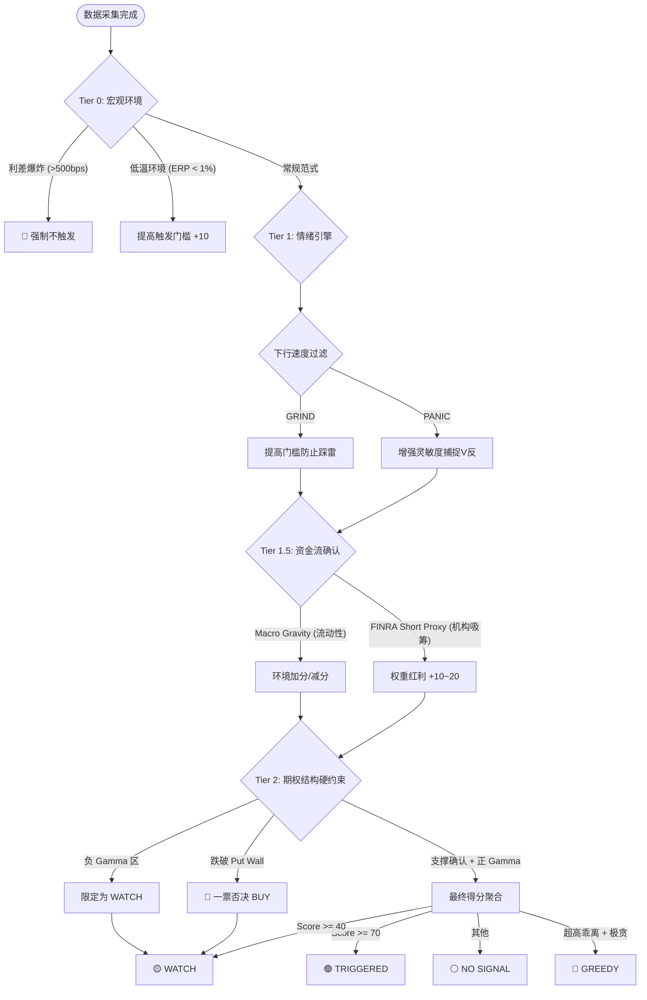
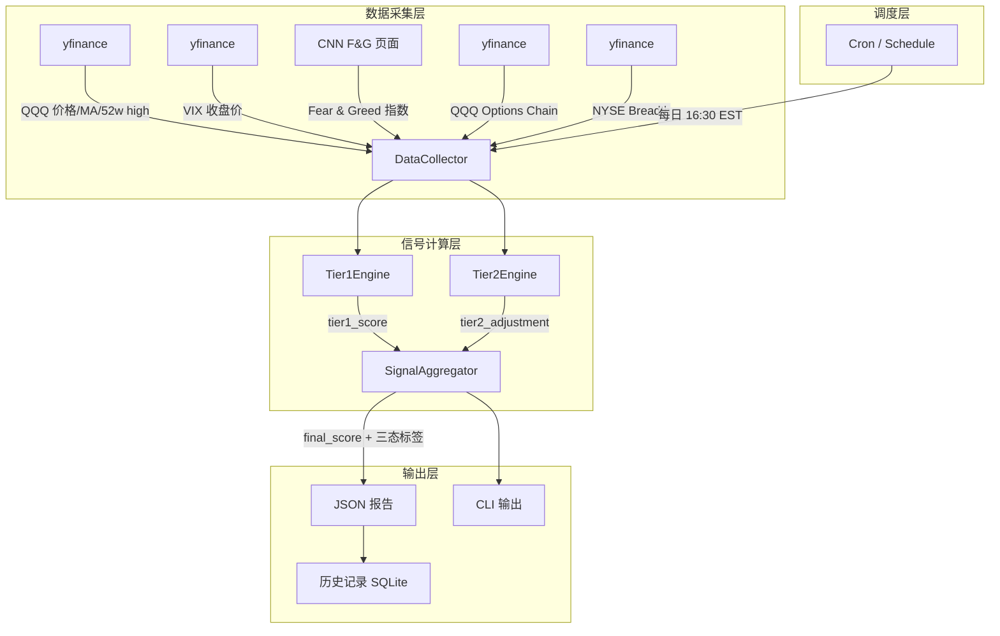

# PRD: QQQ 买点信号监控系统（含期权墙确认层）

> **版本**: 1.2 (v5.0 Optimization)  
> **状态**: Approved  
> **日期**: 2026-03-13  
> **负责人**: Wei Zhang

---

## 1. 背景与动机

### 1.1 现状

当前已有一套基于 5 个维度的 QQQ 买点判断框架（v5.0 引入了环境自适应过滤）：

| # | 信号维度 | 衡量内容 | v5.0 更新 |
|---|---------|---------|----------|
| 1 | 距 52 周高点回撤幅度 | 价格是否便宜 | 引入 **Time-Decay** 区分阴跌与超跌 |
| 2 | 距 200 日均线偏离幅度 | 趋势偏离程度 | - |
| 3 | VIX 是否抬升 | 市场恐慌程度 | - |
| 4 | Fear & Greed 指数 | 情绪极端程度 | - |
| 5 | 机构流向代理 (Proxy) | 资金分布与背离 | 引入 **FINRA Short Volume** 替代商业数据 |
| 6 | 市场参与度 (Breadth) | 涨跌广度 | - |

这套规则覆盖了"价格是否便宜"和"市场是否恐慌"两个核心问题，但缺少**期权市场结构是否支持当前位置形成有效支撑**这一关键维度。

### 1.2 问题

缺少期权墙信息导致两类误判：

1. **假阳性**：现货和情绪信号偏多，但价格已跌破关键 `put wall`，下方支撑失效，贸然给出买点提高了抄底失败率。
2. **遗漏真机会**：市场进入恐慌，但价格正好站在强 `put wall` 上方，同时上方 `call wall` 留有空间——这类高性价比买点被忽略了。

### 1.3 解决思路

把期权墙（`put wall`、`call wall`、`gamma flip`）引入 QQQ 买点模型，作为**确认层和否决层**，实现三态判断。

---

## 2. 产品目标

### 2.1 目标

| 编号 | 目标 | 衡量标准 |
|------|------|---------|
| G1 | 实现 QQQ 买点框架并加入期权墙确认层，降低抄底型误报 | 回测误报率相比纯信号版降低 ≥30% |
| G2 | 将二元判断升级为三态判断：`触发` / `观察` / `未触发` | 输出结果包含明确的三态标签 |
| G3 | 保持结果可解释 | 每次输出必须说明 `put wall`、`call wall`、`gamma flip` 对结论的影响 |

### 2.2 非目标

- **不做期权交易建议**，只服务于 QQQ 现货/ETF 买点判断
- **不做分钟级或 tick 级盘中择时**，MVP 以日频为主
- **不引入运行时自由搜索**，不允许 LLM 在执行期自行寻找数据源
- **不在 MVP 直接支持自动下单**
- **只使用免费数据源**

---

## 3. 用户角色与场景

### 3.1 用户角色

| 角色 | 描述 |
|------|------|
| 个人投资者（自己） | 管理个人账户，需要在市场调整时识别 QQQ 的高性价比买点 |

### 3.2 用户场景

#### US-1：每日信号检查

> **作为** 个人投资者  
> **我想要** 每天收盘后查看 QQQ 当前的买点状态  
> **以便** 快速判断是否需要关注当前价位

**验收标准**：
- [ ] 系统在美东每个交易日 16:30 后自动运行并更新结果
- [ ] 输出一个明确的三态标签：`触发` / `观察` / `未触发`
- [ ] 包含各维度信号的当前值和阈值对比

#### US-2：期权墙确认/否决

> **作为** 个人投资者  
> **我想要** 看到期权墙（put wall / call wall / gamma flip）对买点信号的确认或否决说明  
> **以便** 理解当前支撑/阻力结构，避免抄底失败

**验收标准**：
- [ ] 输出包含当前 QQQ 价格相对于 `put wall`、`call wall`、`gamma flip` 的位置关系
- [ ] 明确标注期权墙对买点信号的影响：确认（加分）、否决（减分）、中性
- [ ] 提供可读的文字解释，说明为什么期权墙支持或否决当前买点

#### US-3：查看历史信号记录

> **作为** 个人投资者  
> **我想要** 查看过去 N 天的信号变化轨迹  
> **以便** 观察信号演变趋势，辅助判断当前信号的可信度

**验收标准**：
- [ ] 提供过去 30 个交易日的信号记录（JSON / CSV）
- [ ] 每条记录包含：日期、三态标签、各维度打分、期权墙位置

---

## 4. 信号体系设计

### 4.1 现货与情绪信号（Tier 1）

这些信号回答前两个问题：**价格是否便宜** 和 **市场是否恐慌**。

每个信号采用**梯度打分**（0 / 10 / 20），避免硬阈值导致信号跳跃，同时区分"开始有意思了"和"明确进入买区"两个层次。

#### 信号 1：52 周高点回撤

| 区间 | 得分 | 历史依据 |
|------|------|----------|
| < 8% | 0 | 正常波动范围，QQQ 年度内回撤 5-8% 非常常见 |
| 8%-12% | 10 | 进入修正区域（2018Q4 初期、2023Q3 属于这个区间） |
| >= 12% | 20 | 深度修正 / 熊市前段（2020 COVID 峰值 27%、2022 峰值 35%） |

> **选择依据**：QQQ 近 10 年有记录的六次显著回撤（2015Q3、2018Q4、2020Q1、2022H1、2023Q3、2024Q3），10% 以上的回撤在事后看均为值得关注的买入区域。8% 作为观察起点，过滤掉常规 5-7% 的季节性波动。

#### 信号 2：200 日均线偏离

| 区间 | 得分 | 历史依据 |
|------|------|----------|
| > -3% | 0 | 趋势内正常回踩 |
| -3% 至 -7% | 10 | 均值回归开始有价值 |
| <= -7% | 20 | 严重偏离，历史上 QQQ 跌破 MA200 超过 7% 后 6 个月正收益概率 > 80% |

> **选择依据**：MA200 是机构交易者广泛使用的趋势分界线。QQQ 跌破 MA200 本身就是值得关注的事件，超过 -7% 偏离在过去十年仅出现在 2020Q1 和 2022H1 两次深度调整中。-3% 作为起点，能覆盖到比如 2023 年 10 月那种 MA200 附近震荡但未深度跌穿的情景。

#### 信号 3：VIX 水平

| 区间 | 得分 | 历史依据 |
|------|------|----------|
| < 22 | 0 | VIX 长期中位数约 17-18，22 以下属于正常偏高 |
| 22-30 | 10 | 恐慌开始蔓延（2018Q4 峰值 36、2024Q3 峰值 65） |
| > 30 | 20 | 高恐慌区域，历史上 VIX > 30 持续时间通常较短，是逆向的关键窗口 |

> **选择依据**：VIX 的长期均值约 19，标准差约 8。22 约为均值 + 0.5 sigma（恐慌萌芽），30 约为均值 + 1.5 sigma（明确恐慌）。选 22 而非 25 作为起点，是因为 QQQ 作为科技股集中的 ETF，VIX 在 22-25 时纳指往往已有 5%+ 以上跌幅，值得开始关注。

#### 信号 4：Fear & Greed Index

| 区间 | 得分 | 历史依据 |
|------|------|----------|
| > 30 | 0 | 中性或偏贪婪 |
| 20-30 | 10 | Fear 区域 |
| <= 20 | 20 | Extreme Fear，CNN F&G 历史上低于 20 的时期与主要市场底部高度重合 |

> **选择依据**：CNN F&G Index 从 0 到 100，25 以下被官方标记为"Extreme Fear"。这里把门槛收紧到 <= 20 作为满分条件，因为 25 附近会有大量"假恐慌"（修正 5-8% 时 F&G 经常短暂跌到 22-28 然后快速反弹），真正有价值的买点对应 F&G <= 20。30 作为起点可以覆盖到 Fear 区域的早期信号。

#### 信号 5：市场广度（NYSE Breadth）

| 区间 | 得分 | 历史依据 |
|------|------|----------|
| 涨跌比 > 0.7 且 50日线占比 > 40% | 0 | 市场参与度正常 |
| 涨跌比 <= 0.7 或 50日线占比 <= 40% | 10 | 广度开始恶化，部分板块分化 |
| 涨跌比 <= 0.4 且 50日线占比 <= 25% | 20 | 极端悲观，投降式卖出特征 |

> **选择依据**：市场广度衡量的是"多少股票在跌"，而不是"跌了多少"。当 NYSE 只有不到 25% 的股票站在 50 日均线上方、涨跌比低于 0.4 时，通常意味着市场进入了投降式卖出阶段——这在 2020 年 3 月、2022 年 6 月和 10 月都出现过，事后证明都是很好的买入窗口。

#### Tier 1 汇总

| 总分范围 | 状态 | 含义 |
|---------|------|------|
| >= 60 | **Tier 1 触发** | 至少 3 个信号达到满分级别，或所有 5 个信号都在观察级别以上 |
| 40-59 | **Tier 1 观察** | 部分信号开始发出预警 |
| < 40 | **Tier 1 未触发** | 市场环境尚未进入值得关注的区域 |

### 4.2 期权墙确认层（Tier 2）

这一层回答第三个问题：**期权市场是否允许当前位置形成可交易的反弹支点**。

#### 4.2.1 核心指标

| 指标 | 定义 | 计算方式 |
|------|------|---------|
| **Put Wall** | 最大 put OI 集中的行权价 | 取近 2 个到期日全链 put OI 最高的 strike |
| **Call Wall** | 最大 call OI 集中的行权价 | 取近 2 个到期日全链 call OI 最高的 strike |
| **Gamma Flip** | 做市商 net gamma 从正翻负的价格 | 逐 strike 计算 `call_gamma * call_OI - put_gamma * put_OI`，找到符号翻转点 |

#### 4.2.2 Gamma 计算策略

`yfinance` 期权链返回的 Greeks 数据（delta、gamma、theta、vega）来源于 Yahoo Finance，数据质量可能不稳定。因此采用**双源策略**：

1. **首选**：直接使用 `yfinance` 返回的 `gamma` 字段
2. **Fallback**：当 `gamma` 字段为空或可疑时，使用 Black-Scholes 模型自行计算

自行计算 Gamma 的公式：

```
Gamma = N'(d1) / (S * sigma * sqrt(T))

其中:
  d1 = [ln(S/K) + (r + sigma^2/2) * T] / (sigma * sqrt(T))
  N'(x) = 标准正态分布概率密度函数
  S = 标的现价（QQQ 收盘价）
  K = 行权价
  r = 无风险利率（取 3 个月美国国债收益率，通过 yfinance ^IRX 获取）
  sigma = 隐含波动率（yfinance 期权链的 impliedVolatility 字段，该字段可靠性较高）
  T = 距到期日的年化时间
```

> **为什么这个 fallback 可行**：Black-Scholes 计算 gamma 需要的核心输入——隐含波动率（IV）——`yfinance` 是有提供的。IV 是从期权市场价格反推出来的，`yfinance` 的 IV 即使不是 tick 级别精确，日终级别用来计算 gamma 分布和定位 gamma flip 是够的。

#### 4.2.3 确认/否决规则

```
输入: price, put_wall, call_wall, gamma_flip

规则 1 - 支撑确认:
  IF price > put_wall AND (price - put_wall) / price <= 3%
  THEN support_confirmed = true   # 价格站在 put wall 上方且距离近，支撑有效

规则 2 - 支撑失效:
  IF price < put_wall
  THEN support_broken = true      # 价格已跌破 put wall，支撑失效

规则 3 - 上方空间:
  IF (call_wall - price) / price >= 5%
  THEN upside_open = true         # 上方 call wall 距离够远，有反弹空间

规则 4 - gamma 环境:
  IF price > gamma_flip
  THEN gamma_positive = true      # 做市商正 gamma 区域，价格波动趋于收敛
```

#### 4.2.4 Tier 2 评分

| 条件 | 得分调整 |
|------|---------|
| `support_confirmed` = true | +15 |
| `support_broken` = true | -30 |
| `upside_open` = true | +10 |
| `gamma_positive` = true | +5 |
| `gamma_positive` = false 且 `support_broken` = true | 额外 -10 |

> Tier 2 调整分范围：**-40 到 +30**

### 4.4 决策逻辑流水线 (v5.0 Schema)



### 4.5 綜合三態輸出
>
> **否决权的金融逻辑**：当 QQQ 跌破 put wall，持有大量 put 头寸的做市商必须进行 delta 对冲——卖出标的资产。这种被迫卖出会形成级联效应（gamma squeeze to the downside），导致下跌自我加速。在这种市场微观结构下，即使现货和情绪指标全部达标，支撑位已经从结构上失效了。新的支撑要等下一个 put OI 集中区建立后才成立。这就是为什么 put wall 破位必须一票否决买入信号。

---

## 5. 技术架构

### 5.1 系统架构



### 5.2 技术选型

| 组件 | 技术 | 说明 |
|------|------|------|
| 语言 | Python 3.12 | 数据生态成熟 |
| 数据获取 | `yfinance` | 免费，覆盖价格、技术指标、期权链 |
| F&G 指数 | `requests` + `beautifulsoup4` 抓取 CNN | 免费，无官方 API |
| Gamma 计算 | `scipy` / `numpy` | 自行实现 GEX 计算（BS 模型 fallback） |
| 数据存储 | SQLite | 轻量，单机足够 |
| 调度 | `cron` (Linux/Mac) | MVP 不需要复杂调度 |
| 容器化 | Docker | 按用户规范，所有构建/测试通过容器执行 |
| 测试 | `pytest` | 单元测试 + 集成测试 |

### 5.3 目录结构

```
qqq-monitor/
├── Dockerfile
├── docker-compose.yml
├── pyproject.toml
├── src/
│   ├── __init__.py
│   ├── collector/           # 数据采集
│   │   ├── __init__.py
│   │   ├── price.py         # QQQ 价格、MA200、52w high
│   │   ├── vix.py           # VIX 数据
│   │   ├── fear_greed.py    # CNN Fear & Greed 抓取
│   │   ├── options.py       # QQQ 期权链（OI, Greeks）
│   │   └── breadth.py       # 市场广度
│   ├── engine/              # 信号计算
│   │   ├── __init__.py
│   │   ├── tier1.py         # Tier 1 信号引擎
│   │   ├── tier2.py         # Tier 2 期权墙引擎
│   │   └── aggregator.py    # 综合评分 + 三态输出
│   ├── models/              # 数据模型
│   │   ├── __init__.py
│   │   └── signal.py        # Signal, Tier1Result, Tier2Result 等
│   ├── store/               # 数据持久化
│   │   ├── __init__.py
│   │   └── db.py            # SQLite 读写
│   ├── output/              # 输出格式化
│   │   ├── __init__.py
│   │   ├── cli.py           # 命令行输出
│   │   └── report.py        # JSON 报告生成
│   └── main.py              # 入口
├── tests/
│   ├── unit/
│   │   ├── test_tier1.py
│   │   ├── test_tier2.py
│   │   └── test_aggregator.py
│   ├── integration/
│   │   └── test_pipeline.py
│   └── conftest.py
└── docs/
    ├── requires.md
    └── PRD.md
```

### 5.4 数据源详情

| 数据 | 来源 | 接口方式 | 频率 | 延迟 |
|------|------|---------|------|------|
| QQQ 收盘价 / 52 周高点 / MA200 | yfinance | Python API | 日频 | 收盘后可用 |
| VIX 收盘价 | yfinance (`^VIX`) | Python API | 日频 | 收盘后可用 |
| CNN Fear & Greed Index | `money.cnn.com` | HTTP 抓取 + 解析 | 日频 | 实时 |
| QQQ Options Chain (OI + Greeks) | yfinance | Python API | 日频 | 收盘后可用 |
| NYSE 市场广度 | yfinance | Python API | 日频 | 收盘后可用 |
| 无风险利率 | yfinance (`^IRX`) | Python API | 日频 | 收盘后可用 |

> [!WARNING]
> `yfinance` 是非官方 API，Yahoo Finance 可能随时变更接口。需要在 collector 层做好异常处理和降级逻辑。CNN F&G 页面结构变化时需要更新解析器。

---

## 6. 输出格式

### 6.1 CLI 输出示例

```
============================================================
  QQQ 买点信号监控  |  2026-03-08  |  状态: 观察 (WATCH)
============================================================

  QQQ 收盘价: $412.35

  -- Tier 1: 现货与情绪 ------------------- 得分: 60/100 --
  [####.] 52周回撤: 12.3% (>=12% FULL)          +20
  [###..] 200日线偏离: -6.1% (-3%~-7% HALF)     +10
  [###..] VIX: 28.5 (22~30 HALF)                 +10
  [##...] F&G: 22 (20~30 HALF)                   +10
  [##...] 市场广度: 涨跌比 0.6 (<=0.7 HALF)      +10

  -- Tier 2: 期权墙确认 ------------- 调整: +10 ----------
  Put Wall:  $408  | 价格在上方 1.1% -> 支撑确认    +15
  Call Wall: $440  | 距离 6.7% -> 上方空间充足      +10
  Gamma Flip: $415 | 价格在下方 -> 负 gamma 区       -5
  负gamma+未破支撑 -> 无额外扣分                     +0

  -- 最终得分: 70  状态: 观察 (WATCH) -------------------
  说明: Tier 1 多个信号处于半触发区间，Push Wall 支撑
  确认有效，但价格处于负 gamma 区域，做市商对冲方向
  可能放大波动，建议继续观察，等待更多信号满分触发或
  回到正 gamma 区域再考虑入场。

============================================================
```

### 6.2 JSON 报告结构

```json
{
  "date": "2026-03-08",
  "price": 412.35,
  "signal": "WATCH",
  "final_score": 70,
  "tier1": {
    "score": 60,
    "details": {
      "drawdown_52w": { "value": 0.123, "thresholds": [0.08, 0.12], "points": 20 },
      "ma200_deviation": { "value": -0.061, "thresholds": [-0.03, -0.07], "points": 10 },
      "vix": { "value": 28.5, "thresholds": [22, 30], "points": 10 },
      "fear_greed": { "value": 22, "thresholds": [30, 20], "points": 10 },
      "breadth": {
        "adv_dec_ratio": 0.6,
        "pct_above_50d": 0.35,
        "thresholds": { "ratio": [0.7, 0.4], "pct_50d": [0.40, 0.25] },
        "points": 10
      }
    }
  },
  "tier2": {
    "adjustment": 10,
    "put_wall": { "strike": 408, "distance_pct": 0.011, "support_confirmed": true, "support_broken": false },
    "call_wall": { "strike": 440, "distance_pct": 0.067, "upside_open": true },
    "gamma_flip": { "level": 415, "gamma_positive": false },
    "gamma_source": "yfinance"
  },
  "explanation": "Tier 1 多个信号处于半触发区间，Put Wall 支撑确认有效，但价格处于负 gamma 区域，做市商对冲方向可能放大波动，建议继续观察。"
}
```

---

## 7. 里程碑

### M1: 数据采集层 + 单元测试（3 天）

- [ ] 实现 `collector/price.py`：获取 QQQ 收盘价、52 周高点、MA200
- [ ] 实现 `collector/vix.py`：获取 VIX 收盘价
- [ ] 实现 `collector/fear_greed.py`：抓取 CNN F&G 指数
- [ ] 实现 `collector/options.py`：获取 QQQ 期权链（OI、Greeks）+ BS fallback
- [ ] 实现 `collector/breadth.py`：获取市场广度数据
- [ ] 编写各 collector 的单元测试（mock 外部调用）
- [ ] Dockerfile + docker-compose.yml 能成功构建和运行测试

### M2: 信号引擎 + 单元测试（3 天）

- [ ] 实现 `engine/tier1.py`：5 个信号的梯度打分逻辑
- [ ] 实现 `engine/tier2.py`：put wall / call wall / gamma flip 计算 + 确认否决规则
- [ ] 实现 `engine/aggregator.py`：综合打分 + 三态输出 + put wall 否决权
- [ ] 实现 `models/signal.py`：数据模型
- [ ] 编写引擎层的单元测试（测试各种边界情况，特别是否决权场景）

### M3: 输出 + 持久化 + 集成测试（2 天）

- [ ] 实现 `output/cli.py`：CLI 输出格式化
- [ ] 实现 `output/report.py`：JSON 报告生成
- [ ] 实现 `store/db.py`：SQLite 存储历史记录
- [ ] 实现 `main.py`：主入口串联全流程
- [ ] 编写集成测试：端到端验证
- [ ] 配置 cron 任务

### M4: 回测验证（2 天）

- [ ] 用 2022-2025 历史数据回测信号表现
- [ ] 对比有/无期权墙确认层的误报率差异
- [ ] 根据回测结果调优梯度阈值切分点

---

## 8. 风险与缓解

| 风险 | 影响 | 缓解措施 |
|------|------|---------|
| `yfinance` API 不稳定或被限流 | 数据采集失败 | collector 层加重试 + 指数退避；预留切换到 Tradier 免费 API 的适配接口 |
| CNN F&G 页面结构变更 | Fear & Greed 数据中断 | 解析器做好异常捕获；该信号失效时降级为 0 分处理 |
| 期权链 OI 数据质量不一致 | Gamma 计算偏差 | 取多个近月到期日做加权平均，减少单一到期日的噪声 |
| 梯度阈值切分点不合理 | 信号频率过高或过低 | M4 回测阶段系统性校准 |
| Yahoo Finance 期权链不含 Greeks | 无法直接计算 Gamma Flip | Black-Scholes fallback，使用 IV + 无风险利率自行计算 |

---

## 9. 验收标准

### 9.1 功能验收

- [ ] 系统能自动获取全部数据（QQQ 价格 / MA200 / 52w high / VIX / F&G / Options Chain / Breadth / Risk-free rate）
- [ ] Tier 1 梯度打分逻辑正确，各信号独立计分（0/10/20 三档）
- [ ] Tier 2 期权墙计算正确，确认/否决规则正常工作
- [ ] Gamma 双源策略正常工作（yfinance 首选，BS fallback）
- [ ] 综合评分逻辑正确，三态输出符合设计
- [ ] `support_broken` 否决权正常生效（硬否决"触发"状态）
- [ ] CLI 输出清晰可读，包含完整的解释文本
- [ ] JSON 报告结构完整
- [ ] 历史记录可正确写入和查询

### 9.2 技术验收

- [ ] 全部单元测试通过（通过 Docker 容器运行 `pytest`）
- [ ] 全部集成测试通过
- [ ] 代码通过 linting（`ruff`）
- [ ] Docker 构建成功
- [ ] `docker-compose up --build` 能正常运行完整流程

### 9.3 验证方式

```bash
# 构建并运行全部测试
docker-compose up --build --abort-on-container-exit test

# 运行完整的信号计算流程
docker-compose run --rm app python -m src.main

# 查看历史信号记录
docker-compose run --rm app python -m src.main --history 30
```

---

## 10. 设计决策记录

本节记录 PRD review 过程中确认的关键设计决策。

### D1：Tier 1 阈值采用梯度打分

**决策**：每个 Tier 1 信号改为三档梯度打分（0 / 10 / 20），取代原来的二元触发。

**理由**：
- 市场状态是连续的，二元阈值（触发 vs 未触发）会导致跳跃式信号变化，信号稳定性差
- 梯度设计基于 QQQ 过去 10 年的统计分布，每档切分点都有对应的历史事件支撑
- 10 分区间捕捉"开始变得有意思"的阶段，20 分区间锁定"明确进入买区"的阶段
- M4 回测阶段会进一步验证和微调这些切分点

### D2：Put Wall 破位硬否决

**决策**：`support_broken = true` 时直接否决"触发"状态，最多输出"观察"。

**理由**：
- 期权做市商对冲机制造成跌破 put wall 后的级联卖出，支撑从结构上失效
- 这种微观结构效应独立于宏观估值和情绪，属于不同维度的信息
- 作为否决层（而不是普通扣分项），确保系统不会在结构性缺陷存在时发出买入信号
- 参考 SpotGamma、GEX 等专业期权分析框架的共识：put wall 是做市商头寸最密集的"防线"，一旦跌破，做市商从吸收波动变成放大波动

### D3：Gamma 计算采用双源策略

**决策**：优先使用 `yfinance` 原生 Greeks，fallback 到 Black-Scholes 自行计算。

**理由**：
- `yfinance` 的 Greeks 数据来源于 Yahoo Finance，大部分时间可用但不保证稳定
- Black-Scholes 计算 gamma 需要 IV 作为输入，`yfinance` 的 `impliedVolatility` 字段较为可靠
- 无风险利率通过 `yfinance` 获取 `^IRX`（13 周国债收益率），保持全部数据源免费
- 这种策略既保证了日常运行的效率（直接用原生值），又确保了在数据异常时不会卡住

### D4：SQLite 存储

**决策**：MVP 使用 SQLite 存储历史信号记录。

**理由**：单用户场景，日频写入，无并发需求，SQLite 零运维成本完全满足。

### D5：回测范围 2022-2025

**决策**：M4 回测使用 2022-2025 年数据。

**理由**：覆盖完整的熊市周期（2022）、复苏期（2023）、牛市（2024-2025 前半）和可能的回调，样本覆盖了多种市场环境。

---

## 11. 术语表

| 术语 | 定义 |
|------|------|
| **Put Wall** | Put 期权 Open Interest 最集中的行权价，通常充当支撑位 |
| **Call Wall** | Call 期权 Open Interest 最集中的行权价，通常充当阻力位 |
| **Gamma Flip** | 做市商净 Gamma 从正翻负的价格水平；正 gamma 区域价格波动收敛，负 gamma 区域价格波动放大 |
| **GEX** | Gamma Exposure，衡量期权市场 gamma 暴露的总量 |
| **OI** | Open Interest，未平仓合约数量 |
| **VIX** | CBOE 波动率指数，基于 S&P 500 期权的隐含波动率 |
| **Fear & Greed Index** | CNN 编制的市场情绪综合指数，范围 0-100 |
| **三态判断** | 触发 (BUY SIGNAL) / 观察 (WATCH) / 未触发 (NO SIGNAL) |
| **yfinance** | Yahoo Finance 的非官方 Python API |
| **Delta Hedge** | 做市商通过买卖标的资产来对冲期权头寸的风险管理行为 |
| **Gamma Squeeze** | 做市商对冲行为导致的价格自我加速现象 |
| **Black-Scholes** | 经典期权定价模型，用于计算期权的理论价格和 Greeks |
