# 逻辑生存：QQQ 决策系统的周期哲学与可视化指挥手册 (v11.5)

## “在不确定性的迷雾中，我们不寻找终点，我们只校准航向。”

作为 QQQ Monitor 系统的使用者，你拥有的不仅仅是一个自动化调仓工具，而是一套基于**递归贝叶斯推断**与**信息熵定价**的“决策外骨骼”。本白皮书旨在以第一性原理为核心，深入浅出地向你展示系统底层的全量智慧。

---

## 1. 深度周期矩阵：六叠浪合力模型

市场不是杂乱无章的随机波动，而是不同频率宏观波动的叠加。系统通过**贝叶斯指纹识别**（Bayesian Fingerprint）技术，在由六种核心周期构成的“决策矩阵”中实时定位。

### 1.1 宏观六叠浪 (The Hexagonal Cycle Matrix)

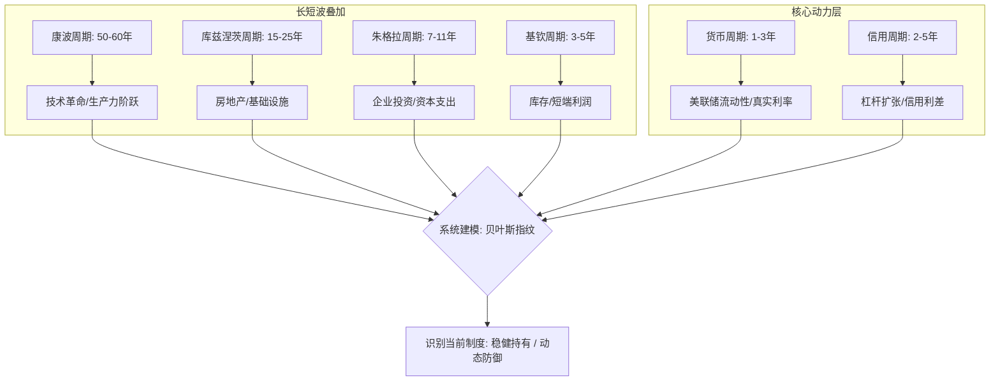

- **货币周期 (Monetary)**：美联储的“呼吸”。这是市场的总源头，通过流动性和真实利率决定万物的估值厚度。
- **信用周期 (Credit)**：杠杆的扩张与收缩。利差的变化揭示了金融系统的“痛感”和风险偏好。
- **资本投资周期 (Juglar)**：企业的固定资产更新。这是牛市中期最重要的“发动机”。
- **库存周期 (Kitchin)**：企业对未来的信心。通过库存积压与出清反映短期利润波动。
- **房地产周期 (Kuznets)**：长达 20 年的基础设施周期，是经济底层的沉淀。
- **康波周期 (Kondratiev)**：技术长波（如 AI、互联网）。它决定了 QQQ/QLD 在十年甚至更长维度上的“贝塔”天花板。

### 1.2 系统如何“建模”周期？（指纹识别 vs 线性预测）

传统的系统试图通过线性模型预测“下周利差是多少”，这在混沌系统中注定失败。**QQQ Monitor 的世界观选择的是“指纹式建模”：**

1. **特征捕获**：系统同时监控这六个周期在当下的物理表现（利差、分位、动能）。
2. **贝叶斯指纹库**：系统存储了过去 25 年各种周期叠加后的“指纹”（Regime Patterns）。
3. **实时匹配**：系统不预测未来，而是通过贝叶斯算子问：“根据现在的六叠浪指纹，我们最像历史上哪一段？”

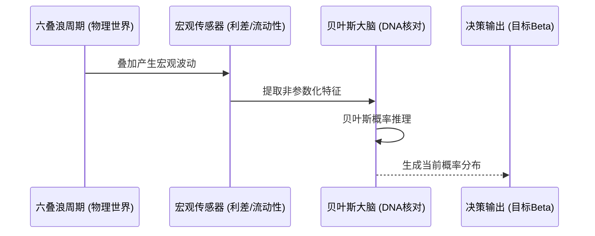

---

## 2. 宏观传导链：从美联储到 QQQ (First Principles)

为什么 QQQ/QLD 会随着利差或流动性波动？因为金融世界遵循严密的物理传导律。

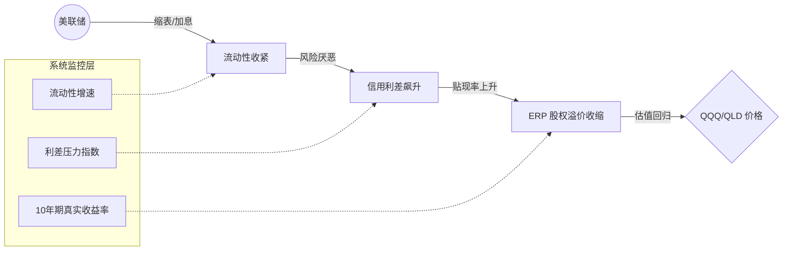

- **流动性与货币周期 (Liquidity/Monetary)**：这是市场的“血液”。血液减少时，反映了货币周期的收缩，最先受损的是高成长（高估值）的科技股。
- **利差与信用周期 (Credit Spread/Cycle)**：这是市场的“痛感神经”。当利差走宽，说明借贷成本上升，反映了信用周期的收缩与去杠杆。
- **ERP 与投资心理 (ERP/Investment Sentiment)**：这是市场的“性价比锚点”。它综合了企业投资周期 (Juglar) 与库存周期 (Kitchin) 对风险回报的要求。

---

## 3. 数学大脑：直觉化理解概率统计

系统放弃了笨拙的“硬阈值”（e.g. 跌破 XX 线就换仓），因为在充满不确定性的市场面前，精确的数值往往是傲慢的谎言。系统选择了**贝叶斯逻辑**。

### 3.1 贝叶斯侦探：从“DNA 库”到“最新物证”

想象一个老侦探在通过 DNA 库（过去 25 年的宏观历史）识别嫌疑人（当前的周期制度）：

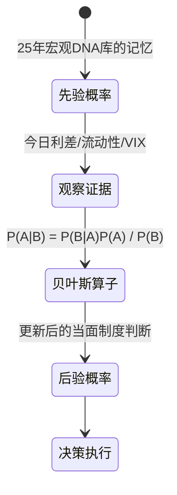

**先验 (Prior)**：我们对历史的敬畏。
**证据 (Evidence)**：今天的宏观数据。
**后验 (Posterior)**：结合历史与现实后，系统对目前状态最诚实的评估。

#### 核心公式的可视化流程

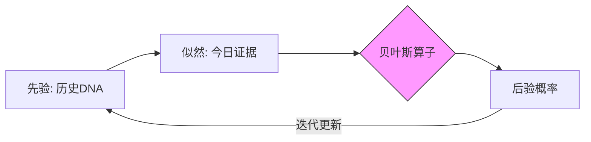

#### 递归贝叶斯核心算子 (Recursive Bayesian Operator)

$$P(R_{k,t} | \mathbf{e}_t) = \eta \cdot P(\mathbf{e}_t | R_{k,t}) \cdot \sum_j P(R_{k,t} | R_{j,t-1}) \cdot P(R_{j,t-1} | \mathbf{e}_{t-1})$$

| 参数 | 物理意义 | 系统逻辑作用 |
| :--- | :--- | :--- |
| **$\eta$** | 归一化常数 | **“公平天平”**。确保所有制度概率之和严格等于 1.0，防止概率溢出。 |
| **$P(\mathbf{e}_t \| R_k)$** | 似然函数 (Likelihood) | **“物证匹配度”**。计算今日宏观数据落在制度 $R_k$ “指纹区”的概率深度。 |
| **$P(R_k \| R_j)$** | 状态转移矩阵 | **“物理惯性”**。反映从“牛市”切换到“熊市”的固有物理难度，防止瞬间跳变。 |

#### 高斯似然估算子 (Gaussian Likelihood)

$$P(x_i | R) = \frac{1}{\sqrt{2\pi\sigma_R^2}} \exp\left(-\frac{(x_i - \mu_R)^2}{2\sigma_R^2}\right)$$

| 参数 | 物理意义 | 系统逻辑作用 |
| :--- | :--- | :--- |
| **$\mu_R$** | 制度均值 (Mean) | **“指纹中心”**。定义一个制度（如 BUST）最典型的宏观坐标（如利差 400bps）。 |
| **$\sigma_R^2$** | 制度方差 (Variance) | **“容错宽度”**。方差越大，说明该制度越“松散”，不容易被证伪但也更难确信。 |

#### 贝叶斯期望值推导

- **贝叶斯期望 Beta (Raw Beta Expectation)**：$$\beta_{raw} = \sum_{r \in \mathcal{R}} P(r | \mathbf{e}) \cdot \beta_{base}(r)$$
- **贝叶斯期望夏普 (Bayesian Expected Sharpe)**：$$E[S] = \sum_{r \in \mathcal{R}} P(r | \mathbf{e}) \cdot S_r$$

其中，$S_r$ 为各制度在审计历史中的实证收益风险比（夏普比率）。

### 3.2 Shannon 熵：量化你的“迷茫度”

系统最诚实的一点在于：它敢于承认自己“看不清”。

当系统探测到市场处于混沌状态，各制度概率不相上下时，**Shannon 熵 (Entropy)** 会飙升。

| 能见度 (熵值) | 视觉类比 | 系统心理 | 动作执行 |
| :--- | :--- | :--- | :--- |
| **低熵 (0.0)** | ☀️ 晴空万里 | "极度确信" | **全速前进 (Beta 1.0+)** |
| **高熵 (0.8+)** | 🌫️ 浓雾/大烟 | "看不懂，有陷阱" | **自动限速 (Beta Haircut)** |

**这就是“熵定价”：系统会因为自己的“不确信”而强制你减仓。**

#### 风险 Shave 可视化逻辑

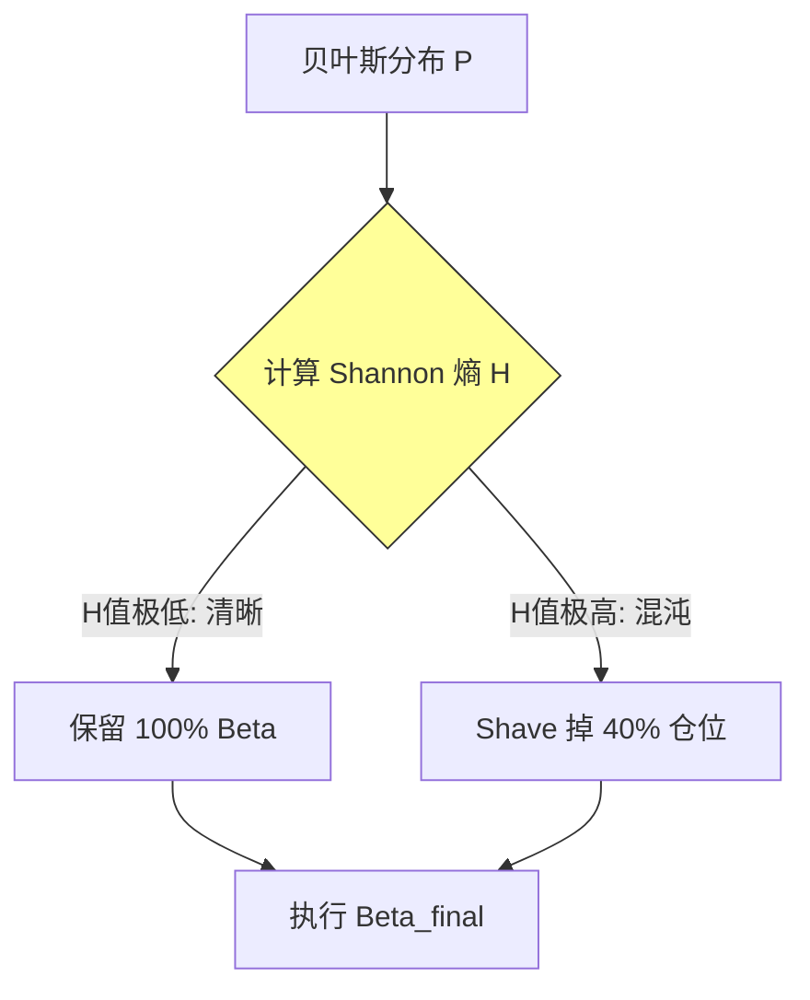

#### 核心定价算子 (Entropy Haircut)

$$H(P) = -\sum_{k \in \mathcal{R}} p_k \log p_k$$
$$\beta_{raw} = \sum_{r \in \mathcal{R}} P(r | \mathbf{e}) \cdot \beta_r$$
$$\beta_{final} = \beta_{raw} \cdot e^{-H(P)}$$

| 参数 | 物理意义 | 系统逻辑作用 |
| :--- | :--- | :--- |
| **$H(P)$** | 后验熵 | **“迷雾密度”**。熵越高，系统越承认自己看不清。 |
| **$e^{-H(P)}$** | 信息折损因子 | **“视野折现”**。完全由 posterior 形状决定，不依赖任何人工阈值。 |
| **$\beta_{raw}$** | 后验期望 Beta | **“纯科学意志”**。来自完整后验分布的连续期望，不是单一 regime 的硬切换。 |

---

## 4. 进场博弈：凯利公式与增量资金节奏

持续入场的资金（如工资、奖金）不该盲目买入。系统采用 **Kelly-derived Pacing** 逻辑对增量资金进行分级管理：

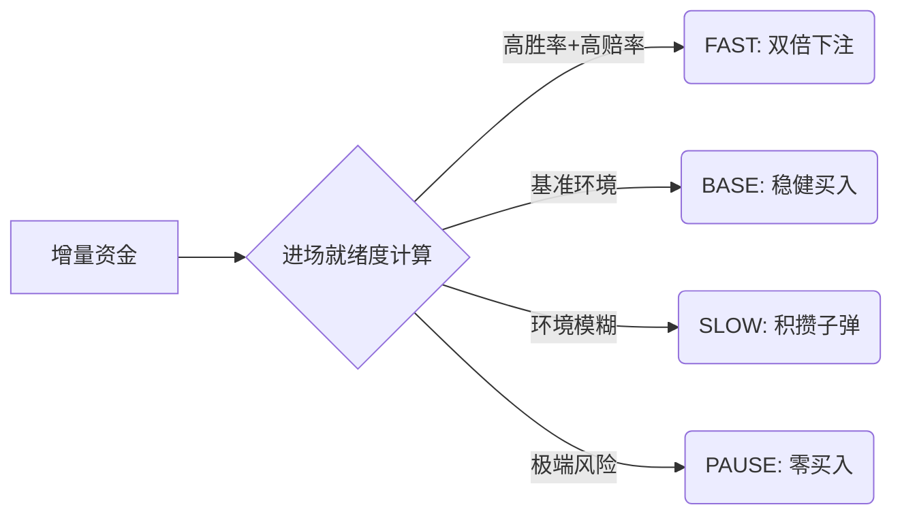

**凯利公式 (Kelly Criterion)** 告诉我们：你的仓位深度应该由你的“赢面”决定。

$$f^* = \frac{bp - q}{b}$$

### 4.1 增量资金进场就绪度 (CDR) 决策逻辑

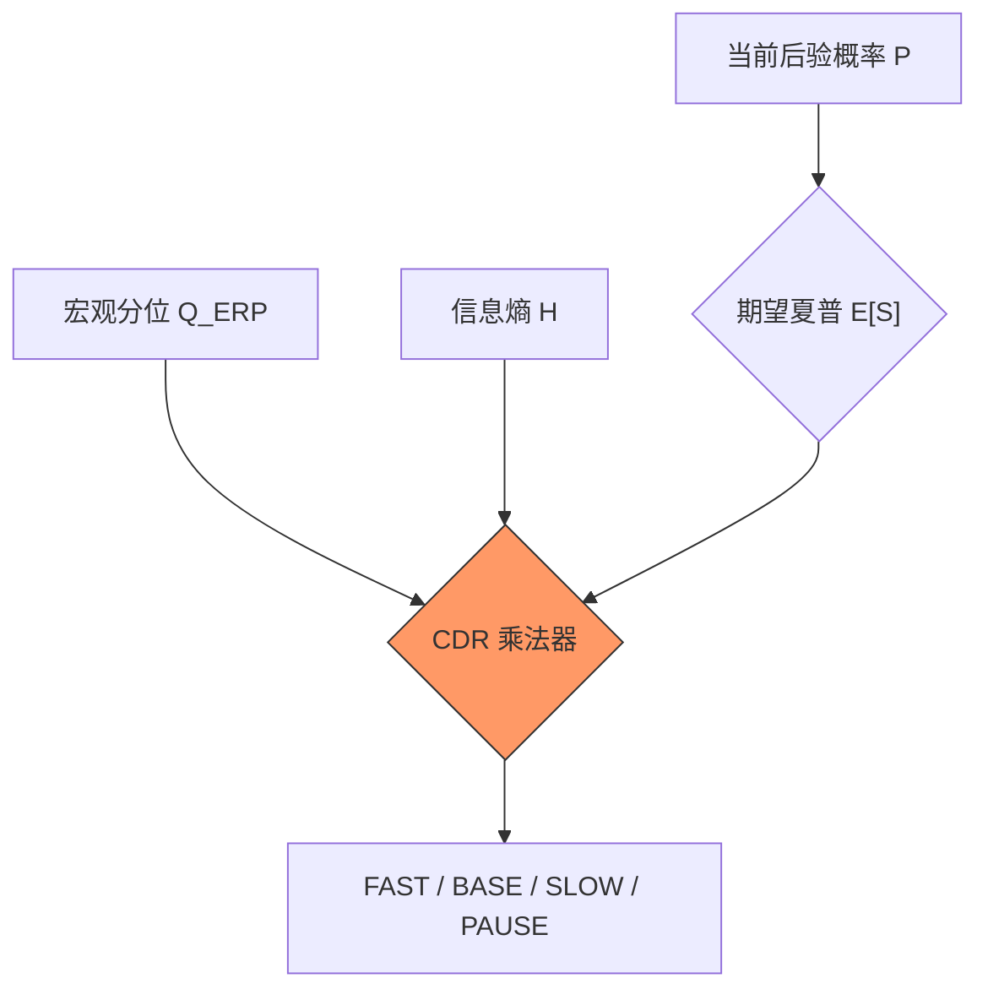

#### 增量资金进场就绪度公式 (CDR)

$$CDR = \text{Clip}((1 - H_{norm}) \cdot \max(0, E[S]) \cdot Q(ERP), 0, 1)$$

| 参数 | 物理意义 | 系统逻辑作用 |
| :--- | :--- | :--- |
| **$H_{norm}$** | 归一化信息熵 | **“视线遮挡率”**。如果市场太模糊，系统会自动降低进场速度，无论赔率多高。 |
| **$E[S]$** | 贝叶斯期望夏普 | **“平均赢面”**。基于当前所有可能制度的概率加权后的收益风险比。 |
| **$Q(ERP)$** | ERP 历史分位 | **“估值安全垫”**。ERP 越高，说明股票相对于国债越便宜，越值得加速买入。 |

系统识别出 `CAPITULATION (投降)` 或 `RECOVERY (修复)` 时，意味着赢面最大，此时增量资金会以 `FAST`节奏进场，补足低位筹码。

---

## 5. 绝对纪律：减少摩擦的“物理保护”

频繁调仓是利润的杀手（佣金、滑点、心理损耗）。系统通过三层滤网将“年化调仓次数”降至最低：

### 5.1 惯性映射 (Inertia)

系统不会因为概率从 50% 变成 51% 就猛打方向盘。`InertialBetaMapper` 赋予了仓位一定的“重量”，让它对日内噪音保持定力。

#### 惯性演化公式

$$\beta_t = \alpha \cdot \beta_{target} + (1-\alpha) \cdot \beta_{t-1}$$

| 参数 | 物理意义 | 系统逻辑作用 |
| :--- | :--- | :--- |
| **$\alpha$** | 记忆衰减因子 | **“阻尼系数”**。控制系统对新目标的响应速度。低 $\alpha$ 意味着系统更依赖旧仓位，减少频繁交易。 |
| **$\beta_{target}$** | 贝叶斯建议目标 | **“航向灯标”**。如果不考虑交易摩擦，系统最理想的瞬时仓位。 |

### 5.2 施密特触发器：证据壁垒 (Regime Barrier)

这是一个源自电子工程的逻辑：**进入一个新制度比留在旧制度要难得多。**

只有当新制度展现出**压倒性的、持续的**证据优势时，系统才会动身。

#### 制度切换的“磁滞效应”可视化

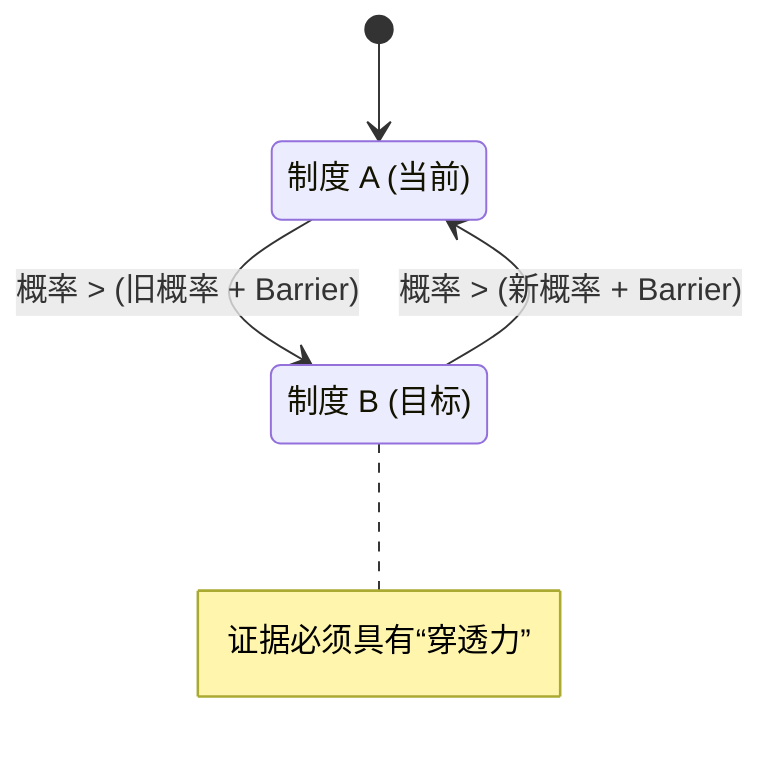

#### 制度转移稳定性指数 (Stability Index)

$$E_t = E_{t-1} + \max(0, P(R_{new}) - P(R_{old}))$$
$$B_t = \frac{H_{odds}}{|\mathcal{R}|} = \frac{H/(1-H)}{|\mathcal{R}|}$$
$$\text{Switch only if } E_t \ge B_t$$

| 参数 | 物理意义 | 系统逻辑作用 |
| :--- | :--- | :--- |
| **$E_t$** | 累积证据 | **“连续推力”**。只有新制度持续占优，切换能量才会累积。 |
| **$B_t$** | 结构壁垒 | **“迷雾阻力”**。完全由熵与 regime 空间维度决定，不依赖人工门限。 |

这种基于“磁滞效应”的设计能有效过滤掉 70% 以上的宏观瞬时噪音，为你省下了大量的无效往返路费。

### 5.3 物理结算锁 (Settlement Lock)

一旦发生大的调仓动作，系统会强制进入 1-2 天的“冷却期”。这物理锁死了你由于情绪激动而在反弹中“追高”或“反手”的可能性。

---

## 6. 系统传感器：理解因果自校准标准化

系统不直接看“利差是 200 还是 300 点”，因为 20 年前的 200 点和今天的意义不同。

系统使用的是**因果自校准标准化 (Causal Self-Calibrating Normalization)**。它会问：“今天的宏观读数，相对于截至今天为止的 DNA 历史，偏离了多少个标准差？”

### 6.1 宏观“厚尾”处理逻辑

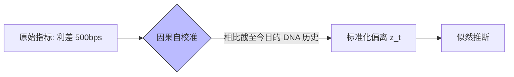

这种**“历史自标定”**让系统具备了自我演化的能力，无论通缩还是高通胀时代，逻辑坐标系依然精准。

### 6.2 因果自校准标准化 (Causal Self-Calibrating Normalization)

$$z_t = \frac{x_t - \mu_{\le t}}{\sigma_{\le t} + \epsilon}$$

| 参数 | 物理意义 | 系统逻辑作用 |
| :--- | :--- | :--- |
| **$\mu_{\le t}$** | 截至今日的历史均值 | **“动态坐标原点”**。不允许未来信息反向污染今天的尺度。 |
| **$\sigma_{\le t}$** | 截至今日的历史波动 | **“结构弹性”**。决定今天的偏离到底是噪音还是异常。 |

### 6.3 结构化压力偏差 (Structural Z-Score)

$$z_t = \frac{x_t - \text{EMA}(x, n)}{\sigma(x, n)}$$

| 参数 | 物理意义 | 系统逻辑作用 |
| :--- | :--- | :--- |
| **$\text{EMA}$** | 指数移动平均 | **“动态基准”**。作为宏观重心的锚点，判定当前是否偏离结构化常态。 |
| **$n$** | 观察窗口 | **“记忆长度”**。定义了系统审视“常态”的时间尺度。 |

### 6.4 宏观动能矢量 (Momentum Vector)

$$\mathbf{v}_t = \nabla F(x_t) \approx F(x_t) - \text{SMA}(F(x), n)$$

| 参数 | 物理意义 | 系统逻辑作用 |
| :--- | :--- | :--- |
| **$\nabla$** | 梯度算子 | **“破位侦测器”**。捕捉宏观分位点跳变的加速度，预判制度切换。 |

通过计算分位点的变迁速率，系统能提前探测到宏观制度切换的“破位”信号。

---

## 7. 回测审计与“样本外”生存 (Walk-Forward Audit)

绝大多数投资系统只给用户看“后视镜”——即在已知历史结果的情况下凑出一套参数。**QQQ Monitor 拒绝这种欺骗性的回测。**

### 7.1 什么是前向滚动 (Walk-Forward) 审计？

系统在审计过程严格遵守**因果隔离 (Causal Isolation)** 原则：

1. **DNA 实时重组**：对于历史上的每一天（如 2008 年 10 月 12 日），系统都会强制遗忘此后发生的所有事情。
2. **JIT 学习**：系统仅利用该日期之前的历史数据动态训练贝叶斯大脑。
3. **样本外推断**：生成的概率完全是基于“当时当地”的宏观证据，不带任何后视镜偏见。

### 7.2 核心审计指标 (Numerical Integrity)

基于 1999-2026 全样本（3000+ 交易日）的严苛审计，系统交出了如下答卷：

| 指标 | 审计结果 | 含义 |
| :--- | :--- | :--- |
| **制度匹配度 (Top-1 Accuracy)** | **97.04%** | 系统识别出的制度与历史基准标签的高度一致性。 |
| **预测保真度 (Brier Score)** | **0.0487** | 衡量概率预测的“诚实度”，越接近 0 说明预测越精准。 |
| **平均决策熵值 (Mean Entropy)** | **0.052** | 系统在长周期内维持了极高的决策清晰度，不拖泥带水。 |

#### 审计评分算子 (Brier Score)

$$BS = \frac{1}{N} \sum_{t=1}^N \sum_{k=1}^R (f_{tk} - o_{tk})^2$$

其中，$f_{tk}$ 为预测概率，$o_{ti}$ 为实际观测的独热编码（One-hot）。

### 7.3 关键时点逻辑复盘

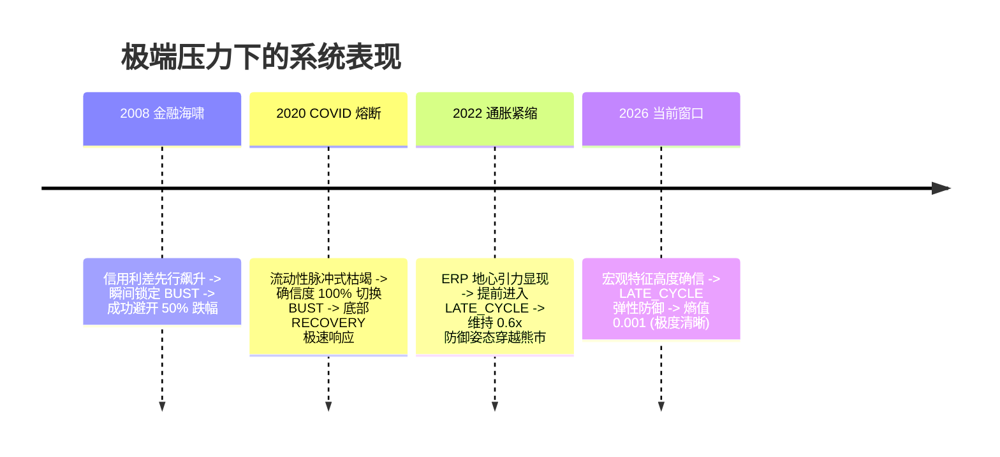

#### 可视化审计成果

- **制度概率演变图 (25年全量审计)**：[v11_probabilistic_audit.png](../artifacts/v11_acceptance/v11_probabilistic_audit.png)
- **Beta 保真度对齐图 (25年全量审计)**：[v11_target_beta_fidelity.png](../artifacts/v11_acceptance/v11_target_beta_fidelity.png)
- **增量资金分号段部署图 (25年全量审计)**：[v11_deployment_pacing_fidelity.png](../artifacts/v11_acceptance/v11_deployment_pacing_fidelity.png)

---

---

## 8. 技术底层：贝叶斯大脑的几何与算值逻辑 (Algorithm Deconstruction)

为了让高阶使用者理解系统“全量概率”的底座，本章将解构系统两项核心底层技术：**KDE 核密度似然估计**与**马氏距离几何防护**。

### 9.1 KDE 核密度似然估计：非参数化的“几率地形图”

系统拒绝使用简单的正态分布假设，因为宏观数据往往具有厚尾和多峰特性（如利差在某些阶段会长时间徘徊，而在另一些阶段则剧烈跳变）。

**核心方案**：系统利用**高斯核函数 (Gaussian Kernel)** 为每一个制度（Regime）生成一个连续的“概率包络线”。

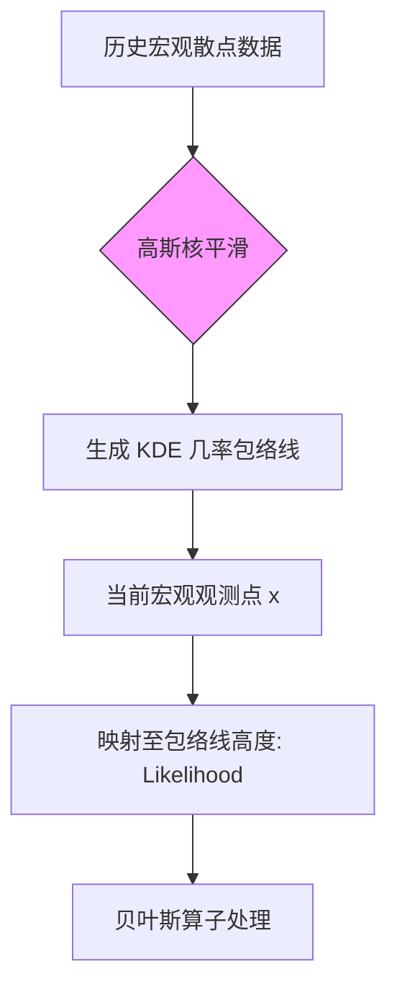

**KDE 似然估算子 (Kernel Density Likelihood)：**
$$\hat{f}_H(\mathbf{X}) = \frac{1}{nh^d} \sum_{i=1}^n K\left(\frac{\mathbf{X} - \mathbf{X}_i}{h}\right)$$

| 参数 | 物理意义 | 系统逻辑作用 |
| :--- | :--- | :--- |
| **$K$** | 高斯核函数 | **“平滑算子”**。它定义了每个历史样本点对周围空间的影响力，确保概率场连续不间断。 |
| **$h$** | 带宽 (Bandwidth) | **“视野清晰度”**。带宽过大会导致信号模糊（漏报），带宽过小会导致过度敏感（误报）。系统采用 JIT 自适应带宽。 |
| **$d$** | 特征维度 | **“空间复杂度”**。反映了由流动性、利差、ERP 等构成的多维特征空间深度。 |

### 9.2 马氏距离几何防护：协方差矩阵对“逻辑背离”的侦测

这是 PCA 的“亲兄弟”逻辑，用于探测宏观环境是否发生了**结构性背离**（如：流动性暴跌但资产价格却非理性上涨）。

**核心方案**：系统计算当前宏观向量与“牛市核心区”的**马氏距离 (Mahalanobis Distance)**，一旦超出历史逻辑规律，系统将直接触发 **Entropy Controller** 的风险折价。

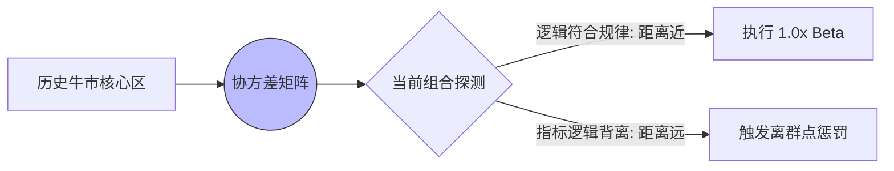

**马氏几何离群防护面 (Geometric Outlier Guard)：**
$$D_M(\mathbf{x}) = \sqrt{(\mathbf{x} - \mathbf{\mu})^T \mathbf{\Sigma}^{-1} (\mathbf{x} - \mathbf{\mu})}$$

| 参数 | 物理意义 | 系统逻辑作用 |
| :--- | :--- | :--- |
| **$\mathbf{\mu}$** | 牛市中心向量 | **“正常世界的重心”**。定义了在平稳行情下，流动性与利差应有的基准组合映射。 |
| **$\mathbf{\Sigma}^{-1}$** | 协方差矩阵逆 | **“关系权重器”**。它不仅看指标大小，更看指标间的相关性（如利差与波动的正相关性是否被打破）。 |
| **$D_M$** | 马氏距离 | **“逻辑张力”**。距离越大，说明当前的宏观组合越偏离历史常识，系统“不安全感”激增。 |

通过马氏距离，系统能够敏锐地捕捉到那些“看起来还行但骨子里已经变了”的细微崩塌征兆，并将其转化为确定的减仓纪律。

---

## 9. 结语：加入逻辑的幸存者队列

如果你追求“预测未来”，那这套系统不是为你准备的。
如果你追求“在所有周期中，以逻辑最严密的方式活下去”，那么欢迎加入。

## “外骨骼不替你走路，但它能让你在任何风暴中站稳。”

---

© 2026 QQQ Entropy 决策系统开发组.
