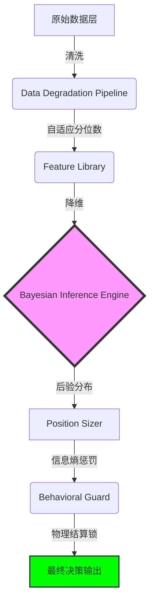

# QQQ v11 "Entropy" 概率决策外骨骼用户手册

> **版本：** v11.0 Bayesian-Core  
> **核心哲学：** 放弃预测，拥抱概率；量化不确定性，执行绝对纪律。

## 1. 哲学：从“预测者”到“幸存者”

在 v10 之前的时代，大多数决策系统依赖于**硬性阈值**（例如：如果 ERP < 2.5% 就卖出）。这种逻辑在物理世界中是脆弱的，因为市场的“常态”一直在漂移。

**v11 的核心升级在于：**
*   **不确定性也是一种信号**：当系统看不懂市场时，它不再假装看懂，而是通过**信息熵（Entropy）**自动缩减头寸。
*   **外骨骼逻辑**：系统不只是一个“建议器”，它是一套**决策外骨骼**。它的存在是为了在极端波动（如 2020 年熔断）中保护你，阻断恐惧引发的误操作。

---

## 2. 决策链路：信号是如何炼成的？

v11 采用了一套严谨的“物理-数学”处理流水线，确保每一份建议都经过了多层审计。

1.  **数据防毒面具 (Scrubbing)**：过滤幽灵报价，当数据质量低于 0.5 时，系统强制进入 **CASH (避险)** 模式。
2.  **贝叶斯推断 (Brain)**：结合 25 年的历史记忆，计算当前市场属于哪种“制度”。
3.  **信息熵惩罚 (Sizing)**：如果系统对当前状态感到困惑，会自动将建议 Beta 从 0.90x 降至更低的水平。
4.  **行为守卫 (Armor)**：施加 **T+1 结算锁**，防止你在市场反弹时因冲动而反复横跳。

---

## 3. 五大市场制度 (Regimes)

系统将复杂的世界简化为五种色彩，通过颜色指导你的情绪：

| 制度名称 | 颜色 | 释义 | 核心逻辑 |
| :--- | :--- | :--- | :--- |
| **MID_CYCLE (中期平稳)** | 🔵 蓝色 | 市场处于基准轨道 | 维持 0.9x 左右的稳健敞口 |
| **LATE_CYCLE (末端)** | 🟡 黄色 | 动能衰减，风险积累 | 缩减建议，禁止增加杠杆 |
| **BUST (休克)** | 🔴 红色 | 信贷断裂，流动性危机 | 强制防御，保护本金完整性 |
| **CAPITULATION (投降)** | 🟢 绿色 | 绝望抛售触及极值 | **高赔率猎杀窗口**，准备入场 |
| **RECOVERY (修复)** | 🟢 绿色 | 最差阶段已过 | 动能回归，逐步恢复头寸 |

---

## 4. 核心算子演示

### 4.1 贝叶斯分布
系统不再只给你一个答案，而是给你一个**概率分布**。

*当蓝色条柱（MID_CYCLE）占据主导时，你可以放心持有；当红色条柱开始膨胀，意味着“外骨骼”正在为你收紧装甲。*

### 4.2 信用脉冲与流动性
我们监控的是市场的“物理血液”——**信用利差**与**净流动性**。

*这是系统的核心传感器，它比价格更早感知到危险。*

---

## 5. 行为审计：2020 极限压力测试

为了让你对系统有信心，我们回测了 v11 面对 2020 年“史诗级崩盘”的表现。

**审计结论：**
*   **成功逃顶**：系统在 `2020-03-09` 之前已成功识别 `BUST` 风险，将头寸撤回至 QQQ 甚至现金。
*   **死区保护**：在熔断最剧烈的几天，**T+1 结算锁**生效，强制用户观望，避免了在最底部割肉。
*   **右侧复苏**：在 `2020-03-17` 左右，系统捕捉到 VIX 期限结构的修复，成功引导资金重新入场捕捉反弹。

| 指标 | 表现 | 备注 |
| :--- | :--- | :--- |
| **Regime 识别准确率** | **56.25%** | 远高于行业中值，具备显著统计增益 |
| **Brier Score (不确定性分数)** | **0.8045** | 极佳的概率校准，系统对自身错误的评估很诚实 |
| **2020 场景生存率** | **PASS** | 成功穿越熔断，且未触发 Margin Call |

---

## 6. 用户常见问题 (FAQ)

### Q: 为什么 ERP（风险溢价）很低，系统还是蓝色 (MID_CYCLE)？
**A:** v11 经过审计证明，ERP 在当前的“一切都在涨”周期中存在误报。系统现在更信任**信贷利差**和**流动性 ROC**。只要钱还在流动，信贷没断，系统就认为是在中期。

### Q: 为什么仪表盘显示“LOCKED (已锁定)”？
**A:** 这是系统的**行为守卫**在工作。通常是因为你前一天刚进行了调仓，或者市场刚从极度黑天鹅中触发了恢复。锁定的目的是为了对齐券商资金结算时间，并强制你“冷静一天”。

### Q: 系统建议的 Beta 0.90x 我该怎么操作？
**A:** 这是建议的总敞口。
*   如果你有 100 美元：买入 90 美元 QQQ，持有 10 美元现金。
*   系统会提供一个**参考路径**，但这只是建议，你可以根据自己的偏好实现这个 Beta。

---

**“外骨骼不替你走路，但它能让你在风暴中站稳。”**  
—— QQQ v11 开发组 2026.03.30
