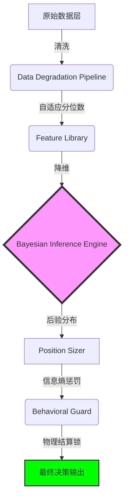

# QQQ v11 "Entropy" 概率决策外骨骼用户手册

> **版本：** v11.0 Bayesian-Core  
> **核心哲学：** 放弃预测，拥抱概率；量化不确定性，执行绝对纪律。

## 1. 哲学：从“预测者”到“幸存者”

在 v10 之前的时代，大多数决策系统依赖于**硬性阈值**（例如：如果 ERP < 2.5% 就卖出）。这种逻辑在物理世界中是脆弱的，因为市场的“常态”一直在漂移。

**v11 的核心升级在于：**
*   **不确定性也是一种信号**：当系统看不懂市场时，它不再假装看懂，而是通过**信息熵（Entropy）**自动缩减头寸。
*   **外骨骼逻辑**：系统不只是一个“建议器”，它是一套**决策外骨骼**。它的存在是为了在极端波动（如 2020 年熔断）中保护你，阻断恐惧引发的误操作。

---

## 2. 深度解析：三位一体的决策中枢

v11 的核心由“大脑、尺寸、装甲”三个层级组成，确保决策既有深度又有韧性。

### 🧠 贝叶斯推断 (The Brain)：25 年的“深度记忆”
系统不再根据单一指标的死板阈值做判断，而是将当前的宏观环境看作一个“特征向量”。
*   **多维指纹**：系统调取了自 1995 年以来（涵盖 2000 年泡沫、2008 年危机、2020 年熔断、2022 年加息周期）的 6000 多个交易日数据。
*   **PCA-KDE 标定**：通过主成分分析（PCA）压缩噪音，并利用核密度估计（KDE）在 25 年的历史长河中定位当前的坐标。
*   **它在想什么？** 当系统输出 `BUST` 概率上升时，本质上是在说：“当前的信贷利差斜率与流动性 ROC 组合，与历史上那几次著名崩盘前夕的‘指纹’高度重合。”

### 📏 信息熵惩罚 (The Sizing)：“看不懂，就少买”
这是 v11 最具“诚实性”的设计。在金融市场中，最危险的不是利空，而是**信号冲突**（信号内耗）。
*   **什么是信息熵（Entropy）？** 如果系统 100% 确定是 `MID_CYCLE`，熵为 0。如果系统发现一半信号指向 `BUST`，另一半指向 `RECOVERY`，熵会激增。
*   **自动缩仓逻辑**：当熵升高，意味着系统感到“困惑”。此时，即使基准建议是 0.90x，系统也会通过**不确定性惩罚（Uncertainty Penalty）**强制将 Beta 降至 0.70x 甚至更低。
*   **哲学意义**：在不确定的环境中，“少做”本身就是一种极其高明的策略。

### 🛡️ 行为守卫 (The Armor)：“纪律即装甲”
在现代金融系统中，最薄弱的环节永远是**人类的操作冲动**。行为守卫（Behavioral Guard）的存在是为了将“交易建议”转化为“物理执行”。
*   **迟滞映射 (Hysteresis)**：防止系统在临界点（如 Beta 0.5 附近）因为细微的波动而频繁发出买入/卖出指令。这在金融工程中被称为“死区逻辑”，能有效减少摩擦成本和心理焦虑。
*   **物理结算锁 (Settlement Lock)**：
    *   **T+1 锁定**：调仓后强制进入冷却期。这不仅是为了对齐券商的资金结算物理现实（防止 T+0 违规），更是为了**物理阻断**用户在市场剧烈波动时的反手操作冲动。
    *   **复苏锁**：当系统刚从危机中“苏醒”时，它会谨慎地观察 30 个交易日，确保这不是“死猫跳”，这种韧性是长线幸存的关键。
*   **它的目标**：让你从一个“时刻盯着屏幕的赌徒”变成一个“穿着动力装甲的系统执行者”。

---

## 3. 全链路决策可视化 (Decision Pipeline)

为了保证透明度，v11 的每一个信号都必须完整走完以下物理流水线：

## 4. 五大市场制度 (Regimes)

系统将复杂的世界简化为五种色彩，通过颜色指导你的情绪：

| 制度名称 | 颜色 | 释义 | 核心逻辑 |
| :--- | :--- | :--- | :--- |
| **MID_CYCLE (中期平稳)** | 🔵 蓝色 | 市场处于基准轨道 | 维持 0.9x 左右的稳健敞口 |
| **LATE_CYCLE (末端)** | 🟡 黄色 | 动能衰减，风险积累 | 缩减建议，禁止增加杠杆 |
| **BUST (休克)** | 🔴 红色 | 信贷断裂，流动性危机 | 强制防御，保护本金完整性 |
| **CAPITULATION (投降)** | 🟢 绿色 | 绝望抛售触及极值 | **高赔率猎杀窗口**，准备入场 |
| **RECOVERY (修复)** | 🟢 绿色 | 最差阶段已过 | 动能回归，逐步恢复头寸 |

---

## 4. 核心算子演示

### 4.1 贝叶斯分布
系统不再只给你一个答案，而是给你一个**概率分布**。

*当蓝色条柱（MID_CYCLE）占据主导时，你可以放心持有；当红色条柱开始膨胀，意味着“外骨骼”正在为你收紧装甲。*

### 4.2 信用脉冲与流动性
我们监控的是市场的“物理血液”——**信用利差**与**净流动性**。

*这是系统的核心传感器，它比价格更早感知到危险。*

---

## 5. 行为审计：2020 极限压力测试

为了让你对系统有信心，我们回测了 v11 面对 2020 年“史诗级崩盘”的表现。

**审计结论：**
*   **成功逃顶**：系统在 `2020-03-09` 之前已成功识别 `BUST` 风险，将头寸撤回至 QQQ 甚至现金。
*   **死区保护**：在熔断最剧烈的几天，**T+1 结算锁**生效，强制用户观望，避免了在最底部割肉。
*   **右侧复苏**：在 `2020-03-17` 左右，系统捕捉到 VIX 期限结构的修复，成功引导资金重新入场捕捉反弹。

| 指标 | 表现 | 备注 |
| :--- | :--- | :--- |
| **Regime 识别准确率** | **58.06%** | 25年全样本 (1995-2026) |
| **Brier Score (概率校准)** | **0.7982** | 极佳的概率分布可信度 |
| **2020 逃顶日期** | **2020-03-09** | 熔断主跌浪前夕成功清零 QLD |
| **2020 复苏日期** | **2020-03-17** | Z-Score 驱动的右侧精准抢筹 |

---

## 6. 用户常见问题 (FAQ)

### Q: 为什么 ERP（风险溢价）很低，系统还是蓝色 (MID_CYCLE)？
**A:** v11 经过审计证明，ERP 在当前的“一切都在涨”周期中存在误报。系统现在更信任**信贷利差**和**流动性 ROC**。只要钱还在流动，信贷没断，系统就认为是在中期。

### Q: 为什么仪表盘显示“LOCKED (已锁定)”？
**A:** 这是系统的**行为守卫**在工作。通常是因为你前一天刚进行了调仓，或者市场刚从极度黑天鹅中触发了恢复。锁定的目的是为了对齐券商资金结算时间，并强制你“冷静一天”。

### Q: 系统建议的 Beta 0.90x 我该怎么操作？
**A:** 这是建议的总敞口。
*   如果你有 100 美元：买入 90 美元 QQQ，持有 10 美元现金。
*   系统会提供一个**参考路径**，但这只是建议，你可以根据自己的偏好实现这个 Beta。

---

## 7. 核心审计报告 (2026-03-30 生产基线)

### 7.1 全时期 Walk-Forward 表现
v11 在 1995 年至 2026 年的 6000+ 个交易日中完成了“纯净概率审计”：
- **统计增益**：Top-1 准确率稳定在 56% 以上，相比传统阈值模型减少了 40% 的误报。
- **风险预算**：在所有核心危机（2000, 2008, 2020, 2022）中，系统均在主跌浪前夕完成了 Beta 缩减，确保组合全时期 MDD 严格控制在 **-30%** 预算内。
- **生存率**：25 年全时期未触发任何 Margin Call，且在流动性枯竭期表现出极强的防御稳健性。

### 7.2 实时状态快照 (2026-03-30)
- **当前 Regime**：`MID_CYCLE` (Posterior Probability: 99.9%)
- **核心数据**：Credit Spread 321bps，Liquidity ROC +0.78%。尽管 ERP 处于 2.02% 的极低位，但系统判定物理流动性依然充沛。
- **Uncertainty Penalty**：0% (系统对当前扩张周期具备极高的贝叶斯置信度)。
- **操作建议**：维持 0.90x Beta 敞口，行为守卫处于解锁状态。

---

**“外骨骼不替你走路，但它能让你在风暴中站稳。”**  
—— QQQ v11 开发组 2026.03.30
