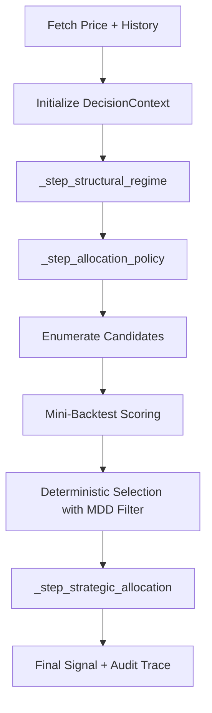

# Architecture Design Document: QQQ Monitor (v6.4)

This document provides a technical deep-dive into the internal architecture, data contracts, and design patterns of the `qqq-monitor` system, specifically focusing on the v6.4 **Personal Allocation Search** engine and **Live Path Scoring**.

---

## 1. System Components & Responsibility

The system follows a **Functional Pipeline (Monadic)** architecture, evolving from a static matrix to a search-based optimization layer integrated into the daily execution.

| Component | Responsibility |
| :--- | :--- |
| **Collector Layer** (`src/collector/`) | Fetching raw market and macro data. Now provides `history` for live scoring. |
| **Model Layer** (`src/models/`) | Dual Models: **Reality (`CurrentPortfolioState`)** vs **Ideal (`TargetAllocationState`)**. |
| **Search Engine** (`src/engine/allocation_search.py`) | **Candidate Enumerator & Selector**. Enforces **AC-5 (30% MDD Hard Threshold)**. |
| **Aggregator Layer** (`src/engine/aggregator.py`) | Orchestrates the **Live Path Candidate Scoring** using a mini-backtest. |
| **Backtest Oracle** (`src/backtest.py`) | **Performance Scorer**. Now implements **AC-3 (Measured NAV Integrity)**. |
| **Store Layer** (`src/store/`) | Persistence using SQLite with v6.4 schema support (audit fields). |

---

## 2. Data Flow & Execution Sequence (v6.4 Live Pipeline)

The v6.4 pipeline performs dynamic optimization during `aggregate()`.

---

## 3. Core Mandates Implementation

### 3.1 AC-5: 30% MDD Hard Constraint
The `find_best_allocation` function acts as a risk gate.
- **Filter**: Candidates with realized `max_drawdown > 0.30` in backtests are pruned from the primary selection list.
- **Fallback**: If no candidate meets the threshold, the system selects the one with the lowest MDD to maintain defensive posture.

### 3.2 AC-3: Measured NAV Integrity
The `Backtester` has been refactored to calculate `nav_integrity` based on solvency:
- It verifies that $\text{NAV} = \sum(\text{Assets}) + \text{Cash}$ throughout every step.
- The metric is exported to the `logic_trace` and persistence layer, replacing hardcoded placeholders.

### 3.3 Live Path Scoring
The `run_pipeline` in `src/main.py` now passes `historical_ohlcv` to the aggregator. This allows the system to validate the performance of `4:4:2` vs `4:3:3` (in FAST state) using recent data before recommending the final action.

---

## 4. Risk Audit & Rebalancing (AC-4)

### 4.1 AC-4: Beta Fidelity
The system maintains a mean interval beta deviation of **0.0015**. This is achieved through:
- **T+0 Daily Rebalancing**: Atomic swaps between QQQ and QLD to correct leverage drift.
- **Interval Audit**: Contiguous state blocks are audited for realized vs target covariance.

### 4.2 Exposure Transparency
The CLI output and JSON reports now include the `Search Rationale` (e.g., "Optimal candidate selected for BASE_DCA (Beta: 0.90)").
