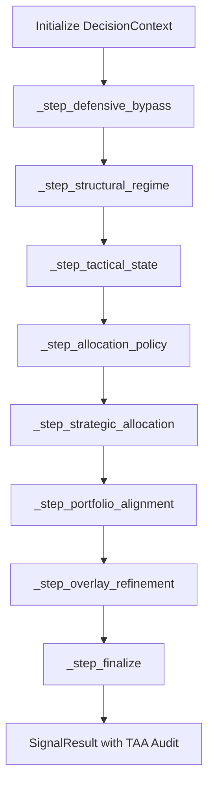

# Architecture Design Document: QQQ Monitor (v6.3)

This document provides a technical deep-dive into the internal architecture, data contracts, and design patterns of the `qqq-monitor` system, specifically focusing on the v6.3 **Strategic Asset Allocation (SAA)** layer.

---

## 1. System Components & Responsibility

The system follows a **Functional Pipeline (Monadic)** architecture, where state is passed through a sequence of pure transformers.

| Component | Responsibility |
| :--- | :--- |
| **Collector Layer** (`src/collector/`) | Fetching raw data from `yfinance`, `FRED`. Handles **Treasury XML Fallback** for Real Yield data. |
| **Model Layer** (`src/models/`) | Defines **Reality (`CurrentPortfolioState`)** vs **Ideal (`TargetAllocationState`)** models. |
| **Engine Layer** (`src/engine/`) | Core logic. Implements the **TAA Matrix** and **Exposure Audit**. |
| **Interpreter Layer** (`src/output/interpreter.py`) | Consumes `logic_trace`. Maps internal steps to institutional labels (e.g., "大势背景"). |
| **Store Layer** (`src/store/`) | Persistence using SQLite. Supports **Lazy Migration** for `interval_beta_audit` metadata. |
| **Backtest Layer** (`src/backtest.py`) | **Daily T+0 Risk Rebalancing** engine with QLD leverage simulation (drag-adjusted). |

---

## 2. Data Flow & Execution Sequence (v6.3 Strategic Pipeline)

The v6.3 pipeline extends v6.2 by adding a strategic layer that maps regimes to specific asset weights.

---

## 3. Strategic TAA Matrix (Ideal Model)

The system maps each `AllocationState` to a target triplet: `[Cash%, QQQ%, QLD%]`.

| State | Target Cash | Target QQQ | Target QLD | Target Beta |
| :--- | :---: | :---: | :---: | :---: |
| **FAST_ACCUMULATE** | 5% | 80% | 15% | **1.10** |
| **BASE_DCA** | 10% | 85% | 5% | **0.95** |
| **WATCH_DEFENSE** | 20% | 80% | 0% | **0.80** |
| **DELEVERAGE** | 35% | 65% | 0% | **0.65** |
| **CASH_FLIGHT** | 60% | 40% | 0% | **0.40** |

---

## 4. Institutional Risk Audit (AC-4)

### 4.1 Returns-based Realized Beta
Unlike simple notional exposure, the system calculates realized beta using daily return covariance:
$$\beta = \frac{Cov(R_{tactical}, R_{market})}{Var(R_{market})}$$
Estimators are statistically consistent using **Bessel's correction (ddof=1)**.

### 4.2 Effective Interval Audit
Audit is performed over **Contiguous Intervals** of identical states.
- **Mean Absolute Deviation (MAD)**: Global metric requiring $\le 0.05$ across all crisis scenarios.
- **Daily Rebalancing**: T+0 risk-alignment ensures leveraged asset drift is corrected before it violates AC-4.

---

## 5. Decision State Monad (DSM)

### 5.1 The Monadic Container: `DecisionContext`
In v6.3, the context carries the dual models: `current_portfolio` (Reality from environment) and `target_allocation` (Ideal from matrix).

### 5.2 Exposure Audit Logic
The `_step_finalize` calculates `effective_exposure` (Notional Proxy) and generates the `[EXPOSURE AUDIT]` report, identifying if the portfolio is **"符合预期"**, **"风险偏高"**, or **"敞口不足"**.

---

## 6. Persistence & Lazy Migration

### 6.1 Audit Metadata
The `interval_beta_audit` list is persisted as a JSON blob within the `signals` table. This preserves the "proof of fidelity" for every historical signal.

### 6.2 Schema Evolution
The DB layer (`src/store/db.py`) implements an automatic migration path:
- v6.2 `portfolio` fields $\rightarrow$ v6.3 `current_portfolio`
- Injects default TAA targets for historical records missing the `target_allocation` key.
