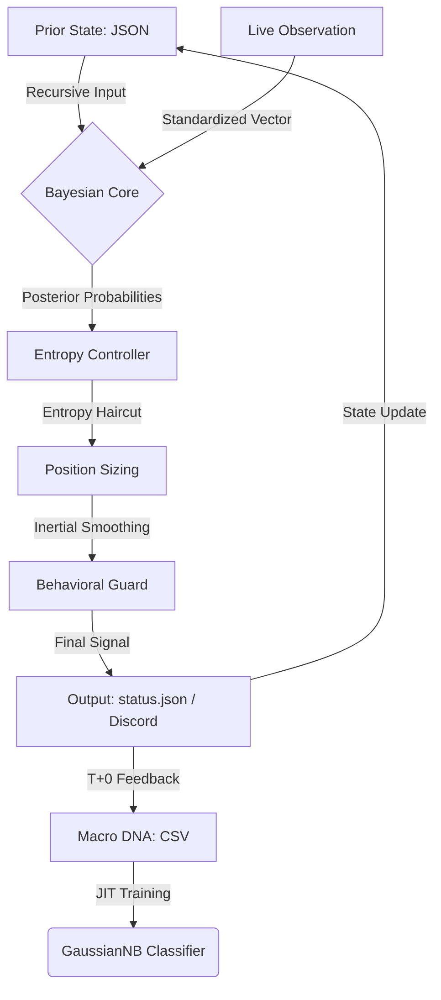

# Architecture Design Document: QQQ Monitor (v11.5 Bayesian-Core)

This document details the **V11.5 Bayesian Probabilistic Architecture**, which represents the system's evolution from threshold-based logic to a unified probabilistic inference engine.

---

## 1. System Philosophy: Probabilistic Survival
The core design shifts responsibility from human-defined rules ("If X then Y") to **Evidence-Based Inference**. Risk is managed by quantifying uncertainty through **Shannon Entropy**.

## 2. Component Responsibility Matrix

| Layer | Component | Responsibility |
| :--- | :--- | :--- |
| **Inference** | `src/engine/v11/` | **The Brain**. Recursive Bayesian inference, Entropy Controller, and JIT GaussianNB training. |
| **Ingestion** | `src/collector/` | **The Sensors**. Multi-source data fetching (FRED, yf) with fail-soft defaults. |
| **Seeding** | `ProbabilitySeeder` | **Feature Engineering**. Normalizing raw macro data into percentile rankings via adaptive EWMA. |
| **Storage** | `src/store/` | **The Memory**. Managing local DNA (CSV), Prior state (JSON), and Cloud sync (Vercel Blob). |
| **Execution** | `BehavioralGuard` | **The Armor**. Enforcing T+1 settlement locks and inertia-based beta smoothing. |
| **Models** | `src/models/` | **Data Contracts**. Unified `SignalResult` and `PortfolioState`. |

---

## 3. Data Flow: The Bayesian Loop

The system operates as a **Recursive Feedback Loop**, enabling the model to "evolve" with every daily run.

---

## 4. Core Implementation Mandates

### 4.1 AC-1: Causal Isolation
The engine enforces strict temporal boundaries. Inference for date $T$ is only exposed to DNA data $\le T$. This is audited via `src/backtest.py` which replicates the JIT training environment for every historical day.

### 4.2 AC-2: Numerical Integrity (Decimal Parity)
To prevent "Distribution Drift", all macro inputs are standardized to **decimal units** (e.g., ERP of 5.0% is represented as `0.05`). This ensures the KDE likelihood clusters remain stable across research and production environments.

### 4.3 Uncertainty-Aware Positioning (Entropy Haircut)
Risk is not binary. The system calculates the **Shannon Entropy ($H$)** of the posterior distribution:
- **Low Entropy**: High confidence; exposure targets base regime betas.
- **High Entropy**: Model doubt; exposure is automatically reduced (Haircut) to protect capital during regime transitions.

---

## 5. Persistence & Cloud Bridge (Stateless Resilience)
The system is designed for **Stateless Execution** (e.g., GitHub Actions):
1. **Pull**: Retrieve DB, DNA, and Prior State from Vercel Blob.
2. **Run**: Execute JIT inference and update local files.
3. **Push**: Upload updated state back to Vercel Blob.

Namespace isolation (e.g., `prod/`, `staging/`) is enforced to prevent development runs from contaminating production memory.

---
© 2026 QQQ Entropy Architecture Group.
