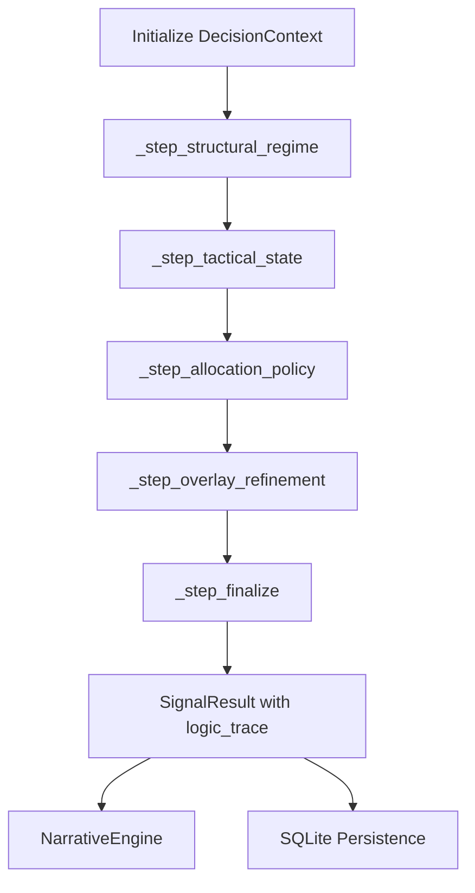

# Architecture Design Document: QQQ Monitor (v6.2)

This document provides a technical deep-dive into the internal architecture, data contracts, and design patterns of the `qqq-monitor` system.

---

## 1. System Components & Responsibility

The system follows a **Functional Pipeline (Monadic)** architecture, where state is passed through a sequence of pure transformers.

| Component | Responsibility |
| :--- | :--- |
| **Collector Layer** (`src/collector/`) | Fetching raw data from `yfinance`, `FRED`, and `CNN`. Handles retries and basic parsing. |
| **Model Layer** (`src/models/`) | Defines the "Data Contract" between collectors and engines (`MarketData`, `SignalResult`). |
| **Engine Layer** (`src/engine/`) | The core logic. Now implemented as a **Decision State Monad** in `aggregator.py`. |
| **Interpreter Layer** (`src/output/interpreter.py`) | Consumes `logic_trace` to generate human rationales and visual decision trees. |
| **Store Layer** (`src/store/`) | Persistence using SQLite. Now serializes `logic_trace` for auditability. |
| **Output Layer** (`src/output/`) | Formatting results for CLI (Human) or JSON (Machine/API). |

---

## 2. Data Flow & Execution Sequence (v6.2 Monadic Pipeline)

---

## 3. Decision State Monad (DSM)

### 3.1 The Monadic Container: `DecisionContext`
Every decision step accepts a `DecisionContext` and returns a new one with updated state and an appended `trace` node. This ensures immutability and full auditability of the execution path.

### 3.2 Logic Trace Schema
Each node in the `logic_trace` list follows this structure:
- `step`: The name of the pipeline stage.
- `decision`: The categorical output of that stage (e.g., `RICH_TIGHTENING`).
- `reason`: A technical description of why the decision was made.
- `evidence`: A dictionary of the raw values used in the decision.

---

## 4. Persistent Logic Trace

Unlike previous versions where internal logic was lost after execution, v6.2 serializes the entire `logic_trace` into the `json_blob` column of the `signals` table. This allows for historical "Logic Audits" to verify if architectural constraints were respected during past market events.

---

## 3. Data Contracts

### 3.1 MarketData (Input Model)
The canonical object passed to all engine functions.
- **Identifiers**: `date`, `price`.
- **Tier 1 Alpha**: `vix`, `fear_greed`, `adv_dec_ratio`, `ma200`, `high_52w`.
- **v5.0 Meta**: `vix_zscore`, `drawdown_zscore`, `days_since_52w_high`.
- **Macro/Flow**: `credit_spread`, `forward_pe`, `net_liquidity`, `short_vol_ratio`.

### 3.2 SignalResult (Output Model)
The immutable record of a single execution.
- **Signal**: Enum (`STRONG_BUY`, `TRIGGERED`, `WATCH`, `GREEDY`, `NO_SIGNAL`).
- **Final Score**: Aggregated Tier-1 score + Tier-2 adjustment.
- **Explanation**: Contextual Chinese-language explanation of why the signal was generated.
- **Nested Results**: Includes full `Tier1Result` and `Tier2Result` for auditability.

---

## 4. Persistence Schema

### 4.1 `signals` Table
Stores the historical result of every run.
- `date`: TEXT PRIMARY KEY (ISO format).
- `signal`: TEXT (The enum value).
- `final_score`: INTEGER.
- `json_blob`: TEXT (The full `SignalResult` serialized as JSON).

### 4.2 `macro_states` Table
Acts as a cache for low-frequency macro data (FRED/Analyst Revisions).
- Allows the system to run in **Degraded Mode** if APIs fail.

---

## 5. Resilience & Error Handling

The system is designed for "Graceful Degradation":

1.  **Source Failures**: If `yfinance` or `FRED` fails, the system uses **Neutral Defaults** (e.g., VIX=20.0, F&G=50) or **Cached Values** from the `macro_states` table.
2.  **Options Fallback**: If the `yfinance` options chain lacks Greeks, the system employs a **Black-Scholes Fallback** to calculate Gamma and identify the Gamma Flip level.
3.  **Hard Vetoes**: Architectural constraints ensure that even if scoring is high, a "Hard Veto" (e.g., Price < Put Wall) will strictly prevent a `TRIGGERED` signal.

---

## 6. Adaptive Thresholding (Schmitt Trigger)

To prevent signal flickering at threshold boundaries, the `Aggregator` implements a **Hysteresis** pattern:
- **Sticky Trigger**: If the previous state was `TRIGGERED`, the threshold to stay in `TRIGGERED` is lowered by 5 points.
- **Regime Shift**: Thresholds are dynamically adjusted based on the `Market Regime` (STORM vs QUIET) identified in Tier 1.
