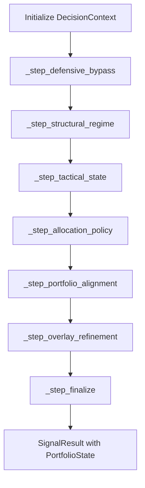

# Architecture Design Document: QQQ Monitor (v6.2)

This document provides a technical deep-dive into the internal architecture, data contracts, and design patterns of the `qqq-monitor` system.

---

## 1. System Components & Responsibility

The system follows a **Functional Pipeline (Monadic)** architecture, where state is passed through a sequence of pure transformers.

| Component | Responsibility |
| :--- | :--- |
| **Collector Layer** (`src/collector/`) | Fetching raw data from `yfinance`, `FRED`, and `CNN`. Handles retries and SSoT (WDTGAL priority). |
| **Model Layer** (`src/models/`) | Defines the "Data Contract" including the new `PortfolioState` (Balance Sheet awareness). |
| **Engine Layer** (`src/engine/`) | The core logic. Implements the **Defensive Bypass Manager** and **Portfolio Alignment**. |
| **Interpreter Layer** (`src/output/interpreter.py`) | Consumes `logic_trace` and enforces **Narrative Guardrails** (Filtering bullish bias). |
| **Store Layer** (`src/store/`) | Persistence using SQLite. Serializes `logic_trace` and `PortfolioState`. |
| **Backtest Layer** (`src/backtest.py`) | Institutional simulator with **Macro Injection** and **NAV Tracking**. |

---

## 2. Data Flow & Execution Sequence (v6.2 Monadic Pipeline)

The v6.2 pipeline introduces a **High-Priority Defensive Bypass** that checks for macro resonance before executing tactical logic.

---

## 3. Triple Confirmation Defense Ladder (Tier 0 Override)

To prevent "catching falling knives" during credit crunches, the system implements a prioritized bypass:

1.  **L1 (WATCH_DEFENSE):** Triggered by Credit Acceleration > 15%. Restricts leverage to 1.0.
2.  **L2 (DELEVERAGE):** Triggered by Credit + Liquidity (ROC < -2%) resonance. Targets 30% Cash.
3.  **L3 (CASH_FLIGHT):** Triggered by Credit + Liquidity + Funding Stress. Targets 50% Cash, Tranche=0.

---

## 4. Decision State Monad (DSM)

### 4.1 The Monadic Container: `DecisionContext`
Every decision step accepts a `DecisionContext` and returns a new one. In v6.2, the context also carries `current_cash_pct` and `credit_accel`.

### 4.2 Portfolio Alignment Logic
The `_step_portfolio_alignment` compares the `current_cash_pct` against the `target_cash_pct` derived from the defensive state. If a gap exists, it generates a `[REBALANCE ACTION]` in the output narrative.

---

## 5. Persistence & Auditability

### 5.1 Logic Trace Audit
The entire `logic_trace` is serialized. This allows post-mortem analysis of why a specific rebalance was triggered (e.g., "Step: defensive_bypass, Evidence: {accel: 18.5%, liq_roc: -2.1%}").

### 5.2 Portfolio Snapshots
Historical signal records now include the `PortfolioState` at the time of execution, enabling long-term tracking of allocation drift.

---

## 6. Resilience & Error Handling

1.  **SSoT Data Integrity**: Prioritizes `WDTGAL` (Daily TGA) over `WTREGEN`. Implements `ffill` resampling to handle weekend data gaps in 4-week ROC calculations.
2.  **Narrative Guardrails**: A regex-based filter in the `NarrativeEngine` automatically substitutes bullish vocabulary (e.g., "Buy the dip") with neutral defensive terminology when in a Macro Defense regime.
