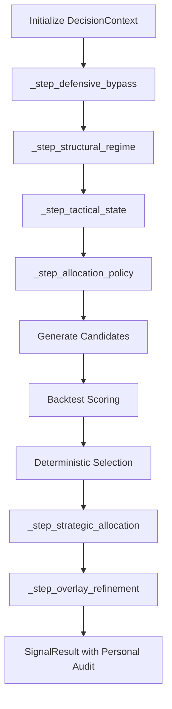

# Architecture Design Document: QQQ Monitor (v6.4)

This document provides a technical deep-dive into the internal architecture, data contracts, and design patterns of the `qqq-monitor` system, specifically focusing on the v6.4 **Personal Allocation Search** engine.

---

## 1. System Components & Responsibility

The system follows a **Functional Pipeline (Monadic)** architecture, evolving from a static matrix to a search-based optimization layer.

| Component | Responsibility |
| :--- | :--- |
| **Collector Layer** (`src/collector/`) | Fetching raw market and macro data. |
| **Model Layer** (`src/models/`) | Dual Models: **Reality (`CurrentPortfolioState`)** vs **Ideal (`TargetAllocationState`)**. |
| **Search Engine** (`src/engine/allocation_search.py`) | **Candidate Enumerator**. Generates SRD-approved bands for each state. |
| **Aggregator Layer** (`src/engine/aggregator.py`) | Orchestrates the search and scoring flow within the Monadic pipeline. |
| **Backtest Scoring** (`src/backtest.py`) | **Performance Oracle**. Scores candidates using CAGR, MDD, and Beta Fidelity. |
| **Store Layer** (`src/store/`) | Persistence using SQLite with v6.4 schema support (audit fields). |

---

## 2. Data Flow & Execution Sequence (v6.4 Personal Pipeline)

The v6.4 pipeline replaces static mapping with a dynamic search step.

---

## 3. Personal Allocation Bands (SRD-6.4)

Instead of a single model, the system explores allowed ranges to maximize returns within a 30% MDD budget.

| Regime State | Allowed Candidates (QQQ:QLD:Cash) | Design Intent |
| :--- | :--- | :--- |
| **FAST_ACCUMULATE** | 4:4:2, 4:3:3 | Aggressive growth with leverage. |
| **BASE_DCA** | 5:2:3, 6:1:3, 7:1:2 | Balanced core deployment. |
| **SLOW_ACCUMULATE** | 6:0:4, 7:1:2 | Cautious accumulation. |
| **Defensive (L1-L3)** | 7:0:3, 6:0:4 | **Strict QLD=0** to preserve capital. |

---

## 4. Deterministic Candidate Selection

### 4.1 Scoring Metrics
Every candidate is evaluated against four primary dimensions:
1. **Beta Fidelity (AC-4)**: Interval Beta deviation mean must be $\le 0.05$.
2. **MDD Budget**: Long-term max drawdown should ideally stay within 30% (soft target).
3. **CAGR**: Primary maximization target.
4. **Turnover**: Tie-breaker to minimize transaction costs.

### 4.2 Selection Algorithm
1. **Filter**: Drop candidates violating AC-4 ($\beta$ deviation > 0.05).
2. **Sort**: Rank survivors by `CAGR (desc) -> MDD (asc) -> BetaDev (asc) -> Turnover (asc)`.
3. **Select**: Pick the top-ranked candidate.

---

## 5. Risk Audit & Rebalancing (AC-4)

### 5.1 Reality vs Ideal Audit
The system continuously audits the **Effective Exposure** of the current portfolio against the selected ideal model:
$$\text{Exposure} = \text{QQQ\%} + 2.0 \times \text{QLD\%}$$
Deviations > 0.05 trigger a rebalancing alert in the CLI narrative.

### 5.2 Daily Rebalancing (T+0)
In backtests, the system simulates daily rebalancing to eliminate **Leverage Drift**, ensuring that realized beta matches target beta with high precision (Realized mean deviation $\approx 0.0015$).

---

## 6. Persistence & Reports

### 6.1 Versioning
CLI version header is upgraded to **v6.4**. Reports include the `logic_trace` showing the search rationale (e.g., "442 selected (Best CAGR)").

### 6.2 Data Integrity
All strategic fields (`current_portfolio`, `target_allocation`, `interval_beta_audit`) are persisted as JSON in the database, allowing for complete post-trade forensic analysis.
