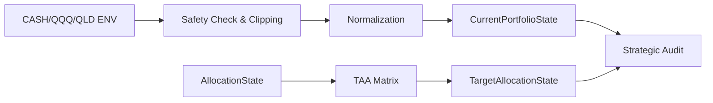

# ADD: 战略资产配置建议系统 (v6.3)

## 1. 架构目标
实现“资产风险镜像”：通过防御性归一化层获取用户的 Reality 快照，通过 TAA Mapper 获取 Ideal 模型，并利用合成价格引擎在回测中验证风险对冲效率。

## 2. 核心组件设计

### 2.1 鲁棒模型层 (`src/models/__init__.py`)
- **`CurrentPortfolioState.from_env()`**:
    ```python
    def from_env():
        raw = [float(os.getenv(k, 0)) for k in ['CASH_LEVEL', 'QQQ_LEVEL', 'QLD_LEVEL']]
        vals = [max(0.0, v) for v in raw]
        s = sum(vals)
        if s <= 0 or not np.isfinite(s):
            return CurrentPortfolioState(current_cash_pct=1.0, ...) # Safe Default
        return CurrentPortfolioState(
            current_cash_pct=vals[0]/s, 
            qqq_pct=vals[1]/s, 
            qld_pct=vals[2]/s
        )
    ```

### 2.2 战略映射插件 (`src/engine/aggregator.py`)
- **TAA 查找表**：实现 `_get_target_allocation(state)`，严格返回 SRD 定义的四元组 [C, Q, L, Beta]。

### 2.3 多资产仿真引擎 (`src/backtest.py`)
- **NAV 更新序列**：
    1. 计算 $R_{qqq, t}$。
    2. 计算模拟 $P_{qld, t}$。
    3. $NAV_{t} = (Units_{qqq} \times P_{qqq, t}) + (Units_{qld} \times P_{qld, t}) + Cash_{account}$。
    4. 根据当日 `TargetAllocationState` 进行 **Total NAV Rebalancing**（假设 T+0 理想对齐）。

## 3. 验收路径 (Acceptance Path)
- **AC-1**: Unit Test 传入 `CASH_LEVEL=0, QQQ_LEVEL=0, QLD_LEVEL=0`，断言返回 `cash_pct=1.0`。
- **AC-3**: 增加一致性断言，验证 `NAV - (Sum of Assets) < 1e-4`。
- **AC-4/AC-5**: 运行全量压力测试脚本，生成包含 Realized Beta 的审计报告。

## 4. 数据流图 (Data Flow)


