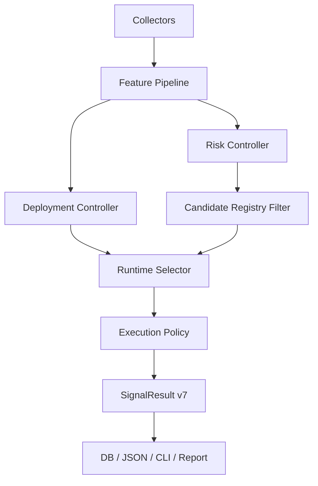

# ADD: v7.0 工业生产级资产配置与增量资金双控制器实现方案

> 版本: v7.0
> 状态: Draft
> 日期: 2026-03-24
> 对应 SRD: `docs/v7.0_industrial_allocation_srd.md`

## 1. 架构目标

v7.0 的实现目标不是“再做一版更复杂的打分器”，而是把当前系统重构为一个可生产运行的双控制器架构：

- `Risk Controller`: 决定目标风险暴露和再平衡动作。
- `Deployment Controller`: 决定新增现金的部署速度和暂停 / 恢复逻辑。

本 ADD 的核心原则：

- `SRD 定边界`: 约束、状态、预算、数据级别由 SRD 定义。
- `ADD 定落地`: 模块、对象、流水线、存储、测试和迁移在 ADD 中明确。
- `Research 先认证, Runtime 再选择`: 运行时不再做重型嵌套回测。

## 2. v7.0 核心实现策略

### 2.1 从“运行时搜索”切换为“离线认证 + 在线确定性选择”

v6.x 的主要问题是 runtime 需要做 mini-backtest 才能选目标仓位。v7.0 改为：

1. 研究面离线生成 `CertifiedCandidateRegistry`
2. 运行时读取 registry
3. `Risk Controller` 给出允许的风险状态
4. `Deployment Controller` 给出新增资金节奏
5. `Execution Policy` 决定是否需要真正执行调仓

收益：

- latency 下降
- 研究与生产口径解耦但不失真
- 证据链可版本化
- 受限环境不再因为并行回测失效而退化

### 2.2 从“单状态机”切换为“双状态机”

#### Risk State

新增枚举：

- `RISK_ON`
- `RISK_NEUTRAL`
- `RISK_REDUCED`
- `RISK_DEFENSE`
- `RISK_EXIT`

#### Deployment State

新增枚举：

- `DEPLOY_BASE`
- `DEPLOY_SLOW`
- `DEPLOY_FAST`
- `DEPLOY_PAUSE`
- `DEPLOY_RECOVER`

两者必须独立建模，禁止复用现有 `AllocationState`。

## 3. 模块设计

### 3.1 模型层 (`src/models/`)

建议新增文件：

- `src/models/risk.py`
- `src/models/deployment.py`
- `src/models/candidate.py`
- `src/models/audit.py`

建议新增对象：

```python
class RiskState(str, Enum):
    RISK_ON = "RISK_ON"
    RISK_NEUTRAL = "RISK_NEUTRAL"
    RISK_REDUCED = "RISK_REDUCED"
    RISK_DEFENSE = "RISK_DEFENSE"
    RISK_EXIT = "RISK_EXIT"


class DeploymentState(str, Enum):
    DEPLOY_BASE = "DEPLOY_BASE"
    DEPLOY_SLOW = "DEPLOY_SLOW"
    DEPLOY_FAST = "DEPLOY_FAST"
    DEPLOY_PAUSE = "DEPLOY_PAUSE"
    DEPLOY_RECOVER = "DEPLOY_RECOVER"
```

```python
@dataclass(frozen=True)
class CertifiedCandidate:
    candidate_id: str
    registry_version: str
    allowed_risk_state: RiskState
    qqq_pct: float
    qld_pct: float
    cash_pct: float
    target_effective_exposure: float
    certification_status: str
    research_metrics: dict[str, float]
```

```python
@dataclass(frozen=True)
class DecisionAudit:
    market_date: date
    risk_state: RiskState
    deployment_state: DeploymentState
    selected_candidate_id: str | None
    evidence_trace: list[dict]
    data_quality: dict[str, dict]
    rejected_candidates: list[dict]
```

### 3.2 特征层 (`src/engine/feature_pipeline.py`)

新增统一特征装配器，负责：

- 原始输入采集
- 数据级别标记
- live / cache / stale_days 标记
- Class A / B / C 分类
- 缺失降级

建议输出对象：

```python
@dataclass(frozen=True)
class FeatureSnapshot:
    market_date: date
    values: dict[str, float | bool | None]
    quality: dict[str, dict[str, object]]
```

### 3.3 风险控制器 (`src/engine/risk_controller.py`)

职责：

- 使用 Class A 数据输出 `RiskState`
- 定义硬门槛
- 产出目标暴露上限和现金底线

建议接口：

```python
def decide_risk_state(
    snapshot: FeatureSnapshot,
    portfolio: CurrentPortfolioState,
    drawdown_budget: float = 0.30,
) -> RiskDecision:
    ...
```

建议输出对象：

```python
@dataclass(frozen=True)
class RiskDecision:
    risk_state: RiskState
    target_exposure_ceiling: float
    target_cash_floor: float
    reasons: list[dict]
```

### 3.4 部署控制器 (`src/engine/deployment_controller.py`)

职责：

- 使用 Class B 数据和当前 `RiskDecision`
- 输出新增现金部署节奏
- 不直接改变风险上限

建议接口：

```python
def decide_deployment_state(
    snapshot: FeatureSnapshot,
    risk_decision: RiskDecision,
    available_new_cash: float,
) -> DeploymentDecision:
    ...
```

建议输出对象：

```python
@dataclass(frozen=True)
class DeploymentDecision:
    deployment_state: DeploymentState
    dca_multiplier: float
    pause_new_cash: bool
    reasons: list[dict]
```

### 3.5 候选注册表 (`src/engine/candidate_registry.py`)

职责：

- 加载离线认证候选
- 按 `RiskState` 过滤
- 按风险预算、认证状态、turnover 档位过滤
- 向运行时返回有限候选集

建议接口：

```python
def load_registry(path: str) -> CandidateRegistry:
    ...

def select_runtime_candidates(
    registry: CandidateRegistry,
    risk_state: RiskState,
    allow_conditional: bool = False,
) -> list[CertifiedCandidate]:
    ...
```

### 3.6 运行时选择器 (`src/engine/runtime_selector.py`)

职责：

- 不做回测
- 只对已认证候选做确定性排序
- 结合当前组合偏离度、现金缺口、执行成本做排序

建议排序优先级：

1. 满足 `RiskDecision` 的现金底线和暴露上限
2. 最小化当前组合到目标组合的调整成本
3. 最小化 turnover 档位
4. 保持状态平滑，避免跳档

建议接口：

```python
def choose_target_candidate(
    portfolio: CurrentPortfolioState,
    risk_decision: RiskDecision,
    deployment_decision: DeploymentDecision,
    candidates: list[CertifiedCandidate],
) -> RuntimeSelection:
    ...
```

### 3.7 执行策略 (`src/engine/execution_policy.py`)

职责：

- 定义偏离带宽
- 判断是否需要真正执行再平衡
- 拆分“卖出风险资产”和“新增现金部署”两个动作

建议规则：

- `rebalance_if_exposure_gap > threshold`
- `rebalance_if_cash_gap > threshold`
- `rebalance_if_risk_state_changed`
- `do_not_rebalance_if_only_small_noise`

建议输出：

```python
@dataclass(frozen=True)
class RebalanceAction:
    should_rebalance: bool
    reason: str
    target_qqq_pct: float
    target_qld_pct: float
    target_cash_pct: float
```

```python
@dataclass(frozen=True)
class DeploymentAction:
    deploy_cash_amount: float
    deploy_mode: str
    reason: str
```

### 3.8 研究认证器 (`src/research/certifier.py`)

职责：

- 对候选集合跑全样本 / 危机分段 / 滚动窗口 / 样本外
- 输出 registry JSON
- 输出审计报告

建议接口：

```python
def certify_candidates(
    price_history: pd.DataFrame,
    macro_history: pd.DataFrame,
    candidate_space: list[CandidateDefinition],
) -> CandidateRegistry:
    ...
```

### 3.9 持久化 (`src/store/db.py`)

需要新增字段：

- `risk_state`
- `deployment_state`
- `selected_candidate_id`
- `registry_version`
- `rebalance_action`
- `deployment_action`
- `candidate_selection_audit`

旧字段保留兼容期，但新系统一律以双控制器字段为准。

## 4. 数据流实现



## 5. Registry 设计

### 5.1 存储格式

建议使用 JSON 文件或 SQLite 表，字段必须固定，不允许自由拼接。

建议 JSON 顶层结构：

```json
{
  "registry_version": "2026-03-24-v7.0-r1",
  "generated_at": "2026-03-24T12:00:00Z",
  "drawdown_budget": 0.30,
  "candidates": []
}
```

### 5.2 认证状态生成规则

- `CERTIFIED`: 满足所有硬约束
- `CONDITIONAL`: 满足主约束但存在边缘场景缺陷
- `REJECTED`: 任一核心约束不满足

### 5.3 运行时读取规则

- 默认只读 `CERTIFIED`
- registry 版本必须随每日结果落盘
- registry 不存在时，系统不得偷偷回退到运行时搜索，应进入显式降级模式

## 6. 运行时算法细节

### 6.1 风险控制器判定顺序

1. 检查数据质量
2. 检查风险预算硬门槛
3. 检查信用 / 流动性 / 资金压力共振
4. 检查 ERP 与估值约束
5. 输出 `RiskDecision`

### 6.2 部署控制器判定顺序

1. 接收 `RiskDecision`
2. 检查是否已处于 `RISK_DEFENSE / RISK_EXIT`
3. 检查超跌 / 恐慌 / 结构确认
4. 结合新增现金余额输出 `DeploymentDecision`

### 6.3 目标候选选择顺序

1. 过滤不符合 `RiskState` 的候选
2. 过滤认证状态不符合要求的候选
3. 过滤超过现金下限或暴露上限的候选
4. 计算当前组合到目标组合的距离
5. 选择调整成本最低且平滑性最高的候选

## 7. 与现有代码的兼容策略

### 7.1 保留兼容对象

暂时保留：

- `CurrentPortfolioState`
- `TargetAllocationState`
- `SignalResult`

但要新增映射层，把 v7.0 字段投影到旧接口。

### 7.2 弃用对象

以下对象进入弃用路径：

- 以 `AllocationState` 同时表达风险与部署动作
- 运行时 `score_candidates`
- 运行时 `find_best_allocation`
- 依赖 mini-backtest 的 live 选择器

### 7.3 过渡期策略

- 第一阶段允许旧 CLI 同时显示旧字段和新字段
- 第二阶段 CLI 默认只显示新字段
- 第三阶段旧字段仅作为 migration bridge

## 8. 测试设计

### 8.1 单元测试

必须新增：

- `test_risk_controller.py`
- `test_deployment_controller.py`
- `test_candidate_registry.py`
- `test_execution_policy.py`
- `test_feature_pipeline.py`

覆盖点：

- Class A 缺失降级
- Class C 不影响决策
- `RiskState` 转换边界
- `DeploymentState` 在不同风险状态下的上限约束
- registry 过滤逻辑
- 带宽触发而非每日全量调仓

### 8.2 集成测试

必须新增：

- registry 装载 + runtime 选择
- 风险状态变化触发再平衡
- 新增现金部署暂停 / 恢复
- DB 回放一致性

### 8.3 研究测试

必须新增：

- 全样本认证 smoke run
- 危机窗口认证
- 样本外窗口复核
- registry 版本固定快照测试

## 9. 验收路径

- `AC-1`: 双控制器输出对象可独立构造、序列化、回放。
- `AC-2`: registry 缺失时，系统进入显式降级，不回退到 live 搜索。
- `AC-3`: `Risk Controller` 只消费 Class A 数据。
- `AC-4`: `Deployment Controller` 不得突破 `Risk Controller` 暴露上限。
- `AC-5`: 小偏离噪声不触发再平衡。
- `AC-6`: 研究认证可生成版本化 registry。
- `AC-7`: 单个生产决策可在低秒级完成。
- `AC-8`: 生产结果与 DB 回放一致。
- `AC-9`: 报告层能展示候选过滤原因，而非只展示最终结果。

## 10. Claude Code 实现顺序

### Phase 1: 模型与接口骨架

- 新增 `RiskState` / `DeploymentState`
- 新增 `CertifiedCandidate` / `DecisionAudit`
- 扩展 `SignalResult`

### Phase 2: Feature Pipeline

- 统一数据质量结构
- 引入 Class A / B / C 标记

### Phase 3: 双控制器

- 实现 `risk_controller.py`
- 实现 `deployment_controller.py`

### Phase 4: Registry 与 Runtime Selector

- 实现 `candidate_registry.py`
- 实现 `runtime_selector.py`

### Phase 5: Execution Policy

- 带宽触发再平衡
- 分离再平衡动作与新增现金部署动作

### Phase 6: 研究认证器

- 实现 `research/certifier.py`
- 生成首版 registry

### Phase 7: 持久化与输出

- DB schema 扩展
- CLI / JSON / 报告重构

### Phase 8: 迁移与清理

- 禁用 live mini-backtest
- 弃用旧 `AllocationState` 主路径

## 11. 实现约束

- 不允许用占位常数补齐生产硬决策因子。
- 不允许在运行时生成未认证候选。
- 不允许让执行层重新定义风险预算。
- 不允许在回测和生产中对同一指标使用两套定义。

## 12. 最终实现说明

v7.0 ADD 的目的不是把 SRD 翻译成代码目录，而是确保 Claude Code 可以按阶段稳定交付：

- 每一阶段可独立测试
- 每一阶段可回滚
- 每一阶段写边界清晰
- 研究与生产从第一天起就不再互相污染

这份 ADD 的实现结论只有一句话：

> 先把 runtime 从“临时搜索器”改成“已认证控制器”，v7.0 才算真正开始。
