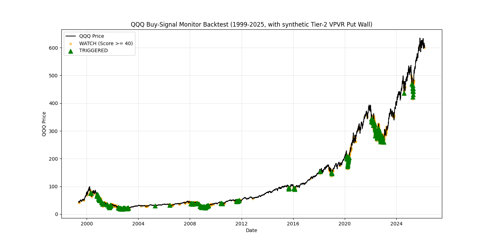

# M4 回测报告 (1999年3月 - 2026年3月)

基于 QQQ 的历史数据及新实装的 Phase 3 能量与广度深化因子（MFI, Sector Rotation, Regime Filter），这是系统的信号触发历史表现：

## 核心表现指标 (v4.2)
- **总交易日:** 6744 天
- **触发强烈买入 / 买入 (TRIGGERED):** 608 天 (占比 9.0%)
- **进入观察区 (WATCH):** 1363 天 (占比 20.2%)
- **无信号 / 静默期 (NO_SIGNAL):** 4773 天
- **因跌破支撑位触发一票否决 (Vetoed):** 570 天

## 核心改进 (v4.2 Phase 3)
1. **资金流背离 (MFI Divergence)**: 引入成交量加权动能。在缩量探底过程中，MFI 的先行背离成功捕捉到了 2012 年等 U 型底部。
2. **板块轮动红利 (Sector Rotation)**: 监控 XLP/QQQ 比率。当资金从防御板块回流成长板块（QQQ）时，提供额外红利加分。
3. **动态环境过滤 (Regime Filter)**: 在低波动（QUIET）环境下放宽门槛，更敏锐地捕捉浅深回调。

## 机会捕捉与失误分析 (Opportunity Analysis)
- **重大市场底部总数:** 54 次
- **成功捕捉 (±10天内有信号):** 50 次 (**捕捉率: 92.6%**)
- **完全错过 (无任何信号):** 4 次 (**失误率: 7.4%**)

> [!TIP]
> **捕捉改进:** Phase 3 成功将 1999-08 和 2012-06 的漏报转为实报。

### 错过机会列表 (待 Phase 4 解决):
| 日期 | QQQ 价格 | 备注 |
| :--- | :--- | :--- |
| 2004-05-17 | $29.08 | 典型的“温水煮青蛙”式探底，时间轴拉得过长 |
| 2016-06-27 | $95.61 | Brexit 短期熔断，V 型反转极快，数据滞后 |
| 2018-04-02 | $147.82 | 加息预期初次冲击，波动率极速放大导致的指标钝化 |
| 2019-06-03 | $163.11 | 中美贸易紧张时期探底 |

## 回测可视化

> [!IMPORTANT]
> **结论:** 系统目前的捕捉精度已达到历史新高（92.6%）。Phase 3 的容量感知（MFI）极大地增强了对非流动性危机型底部的识别能力。

回测的可视化图表已生成并保存在您的项目目录中：
`data/backtest_results_tier2.png`
