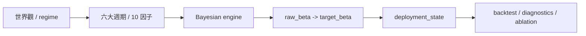
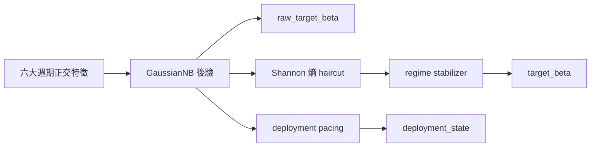
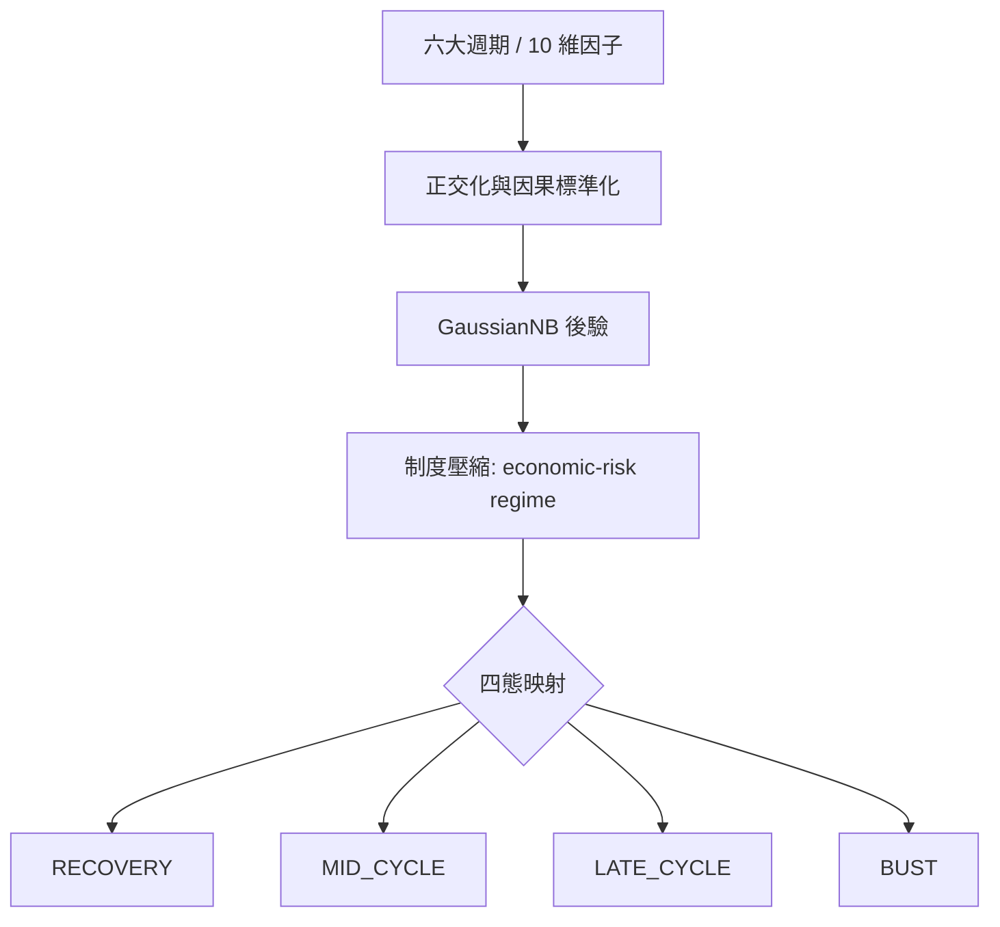
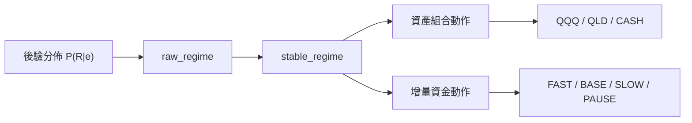
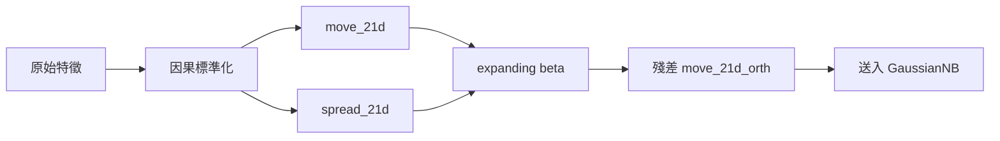
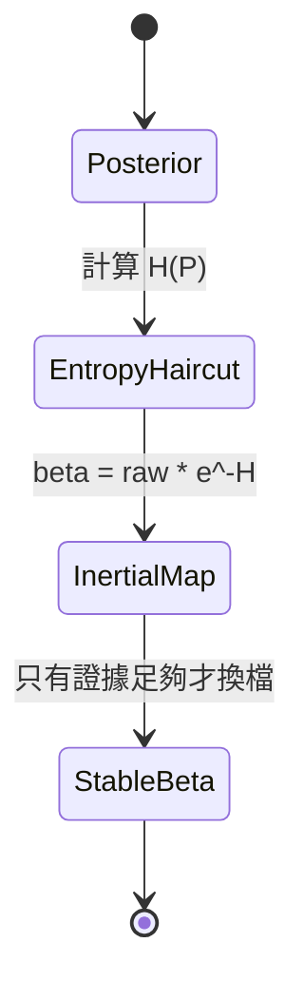
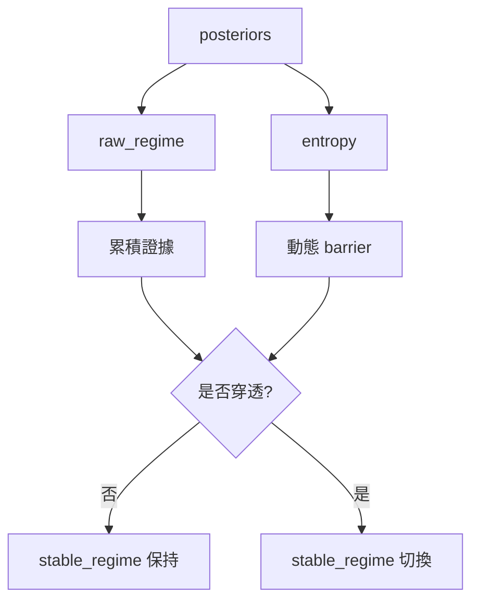
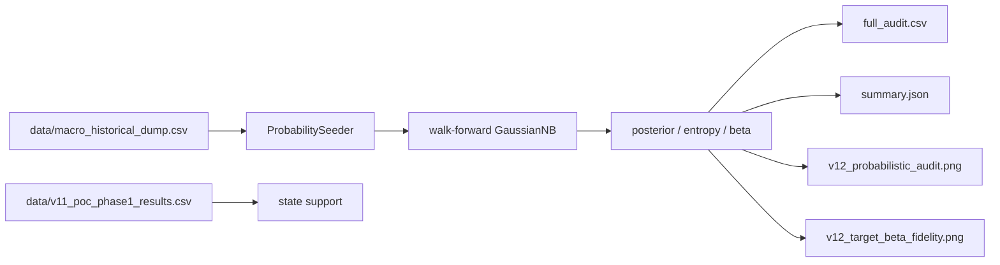
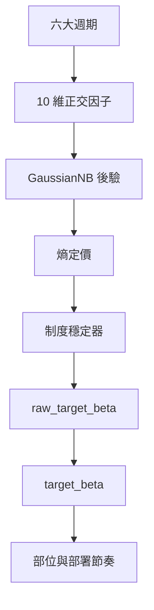
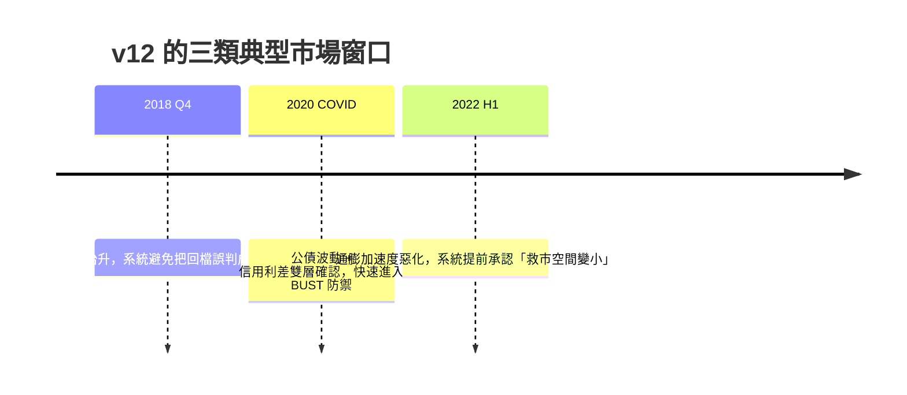

# 邏輯生存：QQQ 決策系統的 v12 正交週期哲學與可視化指揮手冊

## 「在不確定性的迷霧中，我們不追求神諭，我們只做更誠實的校準。」

QQQ Monitor 的 v12 不再試圖把市場壓縮成一個「更聰明的單軸判斷」。它把自己重構成一套**六大週期的正交觀測系統**：既看貨幣，也看信用；既看通膨，也看實體資本支出；既看商品與風險偏好，也看跨境融資壓力。系統的目標不變，但方法更嚴格：**用互相盡量獨立的總經物理量，去推斷目前處在哪一種制度裡，並據此調整風險。**

對一般使用者來說，可以把它理解為：

- 它不是預測明天漲跌的水晶球。
- 它是一套會自己承認「看不清」的防禦型導航儀。
- 當訊號清晰時，它會更果斷；當訊號混雜時，它會自動變保守。

## 閱讀路線

這篇文章依照「從世界觀到執行」的順序組織，建議這樣讀：

1. `0` 決策輸出
2. `1` 制度態與四階段
3. `2` 六大週期與 10 因子
4. `3` 正交化與因果標準化
5. `4` 貝氏引擎
6. `5` 回測與診斷
7. `6` 受控 ablation
8. `7` 面向使用者的直覺說明
9. `8` 可視化
10. `9` 結語
11. `10` 稽核與產物



---

## 0. 三個輸出，不是一件事

v12 裡有三條不同的決策軌道，它們彼此相關，但不能混為一談。

1. `raw_target_beta`
2. `target_beta`
3. `deployment_state`

### 它們分別是什麼？

- `raw_target_beta` 是**貝氏後驗期望**，回答「如果不考慮執行摩擦和慣性，系統今天最想要多少 Beta」。
- `target_beta` 是**執行層結果**，回答「考慮熵、慣性和穩定性之後，今天真正應該執行多少 Beta」。
- `deployment_state` 是**新增資金節奏**，回答「新錢該快、慢、停，還是先等等」。

> 白話版：  
> `raw_target_beta` 是腦袋裡的想法，`target_beta` 是最後下單，`deployment_state` 是薪水和獎金該怎麼分批進場。



---

## 1. 制度態先行：系統先壓縮狀態，再解釋週期

v12 的第一件事不是「辨識某個指標」，而是判斷目前總經組合屬於哪一種**經濟-風險制度態**。這一步先於因子、先於熵、也先於部位。

### 1.1 什麼是 regime，為什麼不是「另一個因子」

在本文裡，`regime` 指的是**經濟-風險制度態**。它不是輸入變數，也不是單一經濟指標，而是系統對「目前總經物理狀態」的**壓縮標籤**。

系統先看很多原始變數，再問一個更高層的問題：

> 「這些變數組合起來，目前更像哪一種經濟與風險環境？」

因此，regime 是一個**狀態空間**，不是一個數值因子。它的職責是把六大週期裡那些彼此相關、但並不完全相同的訊號，壓縮成可執行的決策形態。

### 1.2 v12 為什麼要把很多週期壓縮成四個 regime

第一性原理上，QQQ/QLD 不是在交易 GDP 這個抽象概念，而是在交易三件更直接的東西：

1. 估值折現是否變貴
2. 盈利預期是否還在擴張
3. 流動性與信用條件是否允許高 Beta 繼續存在

對目標資產來說，真正重要的不是「總經到底有多少個維度」，而是「這些維度最後會不會把組合推向同一種風險動作」。  
如果多個週期最後都會讓 QQQ/QLD 做同一件事，例如去槓桿、加現金、停止加碼，那系統就不需要保留太多表層標籤，而是要把它們壓縮成少數幾個可執行制度。

### 1.3 四個 regime 的經濟含義

v12 的活躍四態對應四個常講的經濟階段：

| Regime | 經濟階段 | 直覺含義 | 對 QQQ/QLD 的主要含義 |
| :--- | :--- | :--- | :--- |
| `RECOVERY` | 復甦 / 修復 | 最壞的流動性衝擊已經過去，風險偏好開始回歸 | 允許重新加碼，QLD 可逐步回歸，但仍看熵與後驗強度 |
| `MID_CYCLE` | 擴張 / 中期平穩 | 經濟和盈利仍在擴張，但沒有進入過熱末端 | QQQ 為主，維持常規 beta；新增資金按 BASE 或 SLOW 處理 |
| `LATE_CYCLE` | 末期 / 衰退前段 | 成長動能衰減，通膨和信用壓力開始抬頭 | 逐步減弱進攻性，QLD 降權，新增資金放慢 |
| `BUST` | 衰退 / 休克 | 信用和流動性同時惡化，系統性風險優先 | 保護本金，盡量避開 QLD，增量資金通常 PAUSE |

### 1.4 第一性原理：為什麼這四態對 QQQ/QLD 足夠

QQQ 和 QLD 的收益本質上都來自對同一條鏈路的放大：

- 貼現率下降時，成長股估值會被抬高
- 盈利擴張時，高 Beta 資產更容易放大漲幅
- 流動性寬鬆、信用平穩時，槓桿產品才有空間發揮
- 一旦信用斷裂或真實利率上行，槓桿會反向放大下跌

所以系統不需要先預測「經濟學上有多少個不同名詞」，而是要先判斷：

- 這是可以繼續承擔風險的階段嗎？
- 還是應該降低風險？
- 是該重新進攻，還是該等下一次修復確認？

這就是 regime 壓縮的根本理由。



### 1.5 四階段下，組合和新錢分別該做什麼

系統把「存量組合動作」和「增量資金動作」分開處理，因為它們不是同一個問題。

| Regime | 存量組合應該做什麼 | 增量資金應該做什麼 | 系統的理解 |
| :--- | :--- | :--- | :--- |
| `RECOVERY` | 允許從防守向進攻切換，QQQ 重新成為主倉，QLD 可逐步試探 | `FAST`，只要後驗和熵支持，就把新錢更快地放進去 | 最差階段已過，賠率開始修復，風險預算可以增加 |
| `MID_CYCLE` | 維持以 QQQ 為主的正常風險曝險，QLD 只在高确信度下使用 | `BASE`，按計畫穩步投入，不需要追趕節奏 | 週期正常運行，系統的任務是穩，不是衝 |
| `LATE_CYCLE` | 降低槓桿敏感度，QLD 降權，組合向防守傾斜 | `SLOW`，新錢放慢，保留子彈 | 成長動能衰減，風險報酬比變差 |
| `BUST` | 盡量壓低風險曝險，保留現金和短久期防守資產 | `PAUSE`，除非後驗顯著修復，否則不急著加錢 | 信用和流動性同時失穩，首要任務是活下來 |

### 1.6 系統怎麼把 regime 變成動作

系統不是直接讀「經濟學名詞」，而是先做三步：

1. 從正交因子得到當天的後驗分佈
2. 把後驗映射成 regime
3. 再把 regime 翻譯成 `target_beta` 和 `deployment_state`

這樣做的好處是：

- 同一個 regime 在不同年份裡，仍然代表同一種風險結構；
- 動作不是靠拍腦袋，而是靠同一套規則反覆執行；
- 資產組合和增量資金能各自最佳化，而不是互相污染。



---

## 2. 從週期到制度態：v12 的宏觀骨架

v12 的核心不是「多加幾個因子」，而是把市場重新拆成六個互相盡量獨立的物理層。每一層都要回答一個獨立問題。

### 2.1 六大週期不是六個預測器，而是六個物理軸

| 週期 | 物理問題 | v12 主要因子 | 時間域 | 為什麼選它 |
| :--- | :--- | :--- | :--- | :--- |
| 貨幣週期 | 真實融資成本是在變緊還是變鬆 | `real_yield_structural_z`, `treasury_vol_21d` | 126d / 21d | 結構利率決定估值底盤，公債波動率負責抓「貼現率失控」 |
| 信用週期 | 金融系統的痛感是否在上升 | `spread_21d`, `spread_absolute` | 21d / expanding | 信用利差是風險偏好的直接溫度計 |
| 通膨週期 | Fed 還能不能輕鬆救市 | `breakeven_accel` | 21d acceleration | 通膨預期的「速度」比靜態水平更關鍵 |
| 實體資本支出週期 | 企業是否還在擴張真實產能 | `core_capex_momentum` | monthly delta + expanding z | 資本支出幅度比擴散指數更接近真實經濟體量 |
| 商品與全球風險偏好週期 | 全球製造業與恐慌誰占上風 | `copper_gold_roc_126d` | 126d momentum | 銅/金比的變化能抓到實體需求和避險情緒的分叉 |
| 跨境融資週期 | 全球槓桿是否在去化 | `usdjpy_roc_126d` | 126d momentum | 日圓套息回撤是全球融資壓力的高靈敏代理 |

### 2.2 v12 的 10 因子矩陣

目前鎖版的活躍輸入向量是 10 維：

| 因子 | 變數本體是什麼 | 類型 | 時域 | 作用 |
| :--- | :--- | :--- | :--- | :--- |
| `real_yield_structural_z` | 10 年期 TIPS 真實收益率 `real_yield_10y_pct`，先做 EWMA 再做因果 Z | 結構層級 | 126d / EWMA | 抓真實融資成本的中長期重心 |
| `move_21d` | 10 年期公債收益率 `DGS10` 的 21 日已實現波動率 `treasury_vol_21d` | 貼現率衝擊 | 21d / expanding z | 抓公債收益率波動的失控 |
| `breakeven_accel` | 10 年期通膨預期 `breakeven_10y` 的 21 日二階變化 | 通膨加速度 | 21d acceleration | 抓通膨預期是否在突然升溫 |
| `core_capex_momentum` | 美國非國防資本財新訂單 `NEWORDER` 的月度變化 `core_capex_mm` | 實體經濟動能 | monthly delta / expanding z | 抓企業資本支出是否掉速 |
| `copper_gold_roc_126d` | 銅期貨 `HG=F` 與黃金期貨 `GC=F` 的比率 `copper_gold_ratio` | 商品動量 | 126d ROC | 抓全球實體需求和避險偏好 |
| `usdjpy_roc_126d` | 美元兌日圓匯率 `USDJPY=X` | 跨境融資動量 | 126d ROC | 抓 carry trade 的去槓桿 |
| `spread_21d` | 高收益信用利差 `credit_spread_bps` 的 21 日滾動水準 | 信用脈衝 | 21d rolling | 抓信用壓力的短期抬升 |
| `liquidity_252d` | 淨流動性 `net_liquidity_usd_bn`，由聯準會資產負債表派生 | 流動性結構 | 252d rolling | 抓貨幣環境的年尺度趨勢 |
| `erp_absolute` | 股權風險溢酬 `erp_ttm_pct`，由 Shiller TTM EPS 與真實利率合成 | 估值錨點 | monthly / expanding z | 抓 ERP 的真實物理高度 |
| `spread_absolute` | 高收益信用利差 `credit_spread_bps` 的絕對歷史坐標 | 價格錨點 | expanding z | 抓信用利差的絕對歷史坐標 |

### 2.3 為什麼要同時保留 level、momentum 和 acceleration

v12 不再相信「單一時點」能描述整個市場。

- **Level** 告訴你目前已經有多緊、多貴、多脆。
- **Momentum** 告訴你這個狀態是在加速還是減速。
- **Acceleration** 告訴你拐點是不是正在形成。

簡單說：

- Level 像體溫計。
- Momentum 像體溫變化速度。
- Acceleration 像醫師判斷病情是否開始失控。

### 2.4 哪些候選因子被計畫過，但最後被回測丟棄

v12 在設計期並不是只看這 10 個因子。很多候選項都經過了建模討論和受控 ablation，最後因為**冗餘、滯後、資料不穩或邊際收益不足**而被放棄。

| 候選因子 | 最終結論 | 原因 |
| :--- | :--- | :--- |
| `yield_absolute` | 丟棄 | 與 `real_yield_structural_z` 高度共線，相當於對利率軸重複投票 |
| `drawdown_pct` / `drawdown_stress` | 丟棄 | 主要是滯後描述，幾乎不提供前瞻資訊 |
| DXY | 丟棄 | 對 QQQ 的傳導不如 USD/JPY 直接，Carry unwind 的資訊密度更低 |
| 歐元區 PMI / IFO | 丟棄 | 與美國製造/景氣類因子冗餘，不能提供真正正交的新資訊 |
| BTP-Bund 利差 | 丟棄 | 資料鏈不夠穩定，且被信用利差層覆蓋 |
| 直接使用 JGB 10Y | 丟棄 | 月度和公布頻率太低，實戰上不如 USD/JPY 有效 |
| 分層硬編碼權重 | 丟棄 | 破壞貝氏似然的可解釋性，本質上是曲線擬合 |
| 分階段接入因子 | 丟棄 | 會改變共變異結構，導致回測結果不可歸因 |

> 白話版：  
> 不是所有看起來「總經味」很重的變數都應該進模型。模型要的不是熱鬧，而是**能獨立提供資訊的物理量**。

---

## 3. 從制度態到特徵：系統如何避免「同一個訊號被聽兩遍」

v11.5 最大的問題不是不夠聰明，而是某些因子講的是同一件事。v12 的目標，是盡量讓每個因子說不同的話。

### 3.1 Causal Self-Calibrating Normalization

所有輸入先做嚴格因果標準化：

$$
z_t = \frac{x_t - \mu_{\le t}}{\sigma_{\le t} + \epsilon}
$$

這裡的意思是：

- 只能使用當天之前的資料；
- 不能讓未來資訊反向污染今天的尺度；
- 每個因子都在自己的歷史語境裡說話。

### 3.2 move/spread 的無條件 Gram-Schmidt

v12 最重要的正交化規則，是把 `move_21d` 裡和 `spread_21d` 重疊的部分剝掉。

$$
\beta_t = \frac{\mathrm{Cov}_{\le t}(move_z, spread_z)}{\mathrm{Var}_{\le t}(spread_z)}
$$

$$
move^{orth}_t = move_z - \beta_t \cdot spread_z
$$

這不是「相關性高才處理」，而是**永遠處理**。原因很簡單：

- 相關時，殘差會抽出獨立資訊；
- 不相關時，殘差幾乎等於原值；
- 所以無條件做，風險最小。

> 白話版：  
> 這就像兩位記者都在講同一場事故。一位在講「發生了什麼」，另一位在講「現場有多亂」。如果你不去重，就會誤以為自己聽到了兩份證據，其實只是同一句話換了個說法。



### 3.3 為什麼 v12 更誠實，但看起來更「模糊」

正交化之後，後驗不會再像 v11.5 那樣過度自信。原因不是系統變差，而是系統不再作弊。

- 以前是多個共線因子重複投票。
- 現在是每個因子必須提供獨立證據。
- 所以熵會上升，訊號會更保守。

這正是 v12 的設計目標：**寧可少說一句，也不要把同一句話說三遍。**

---

## 4. 貝氏引擎：大腦到底在算什麼

v12 的核心引擎仍然是遞迴貝氏推斷 + GaussianNB + 資訊熵定價，但它現在建立在正交輸入之上。

### 4.1 每一天，系統先問一個機率問題

對於當天的特徵向量 $`x_t`$，系統會計算每個制度 $`R_k`$ 的似然：

$$
P(x_t \mid R_k) = \prod_i \mathcal{N}(x_{t,i}; \mu_{k,i}, \sigma^2_{k,i})
$$

簡單說：

- 每個制度都有自己的「特徵指紋中心」；
- 當前觀測離哪個中心更近，就更像哪個制度。

### 4.2 遞迴貝氏不是「預測」，而是「帶慣性的更新」

真正用於決策的不是孤立當天，而是帶上前一日後驗的遞迴版本：

$$
P(R_{k,t} \mid \mathbf{e}_t) = \eta \cdot P(\mathbf{e}_t \mid R_{k,t}) \cdot \sum_j P(R_{k,t} \mid R_{j,t-1}) \cdot P(R_{j,t-1} \mid \mathbf{e}_{t-1})
$$

這裡：

- $`\eta`$ 是歸一化常數；
- $`P(R_{k,t} | R_{j,t-1})`$ 是制度轉移矩陣；
- 它的作用是讓系統不可能因為一天噪音就瞬間跳變。

> 白話版：  
> 這不是「今天看到紅燈就立刻懷疑整個城市變了」，而是「如果昨天、前天都在走向同一個方向，今天的新證據就會更容易被接受」。

### 4.3 raw beta 先算，再被熵和慣性修正

系統先做後驗加權期望：

$$
\beta_{raw} = \sum_r P(r \mid \mathbf{e}_t)\,\beta_{base}(r)
$$

然後做熵懲罰：

$$
H(P) = -\sum_r p_r \log_2 p_r
$$

$$
\beta_{protected} = \beta_{raw} \cdot e^{-H(P)}
$$

最後再經過慣性映射：

- 如果系統現在已經持有某個 Beta，就不會因為一次小波動立刻翻轉；
- 只有證據累積到足夠強，才允許切換。

這就是 `raw_target_beta` 與 `target_beta` 必須同時存在的原因。

### 4.4 為什麼 entropy 會真的影響部位

熵高說明後驗更接近「我不確定」。

這不是壞事，而是風險控制的起點。系統越不確定，就越不能高舉高打。



### 4.5 行為穩定器：為什麼穩定制度和 raw 制度會不同

`raw_regime` 是當天最大後驗的直接結果，`stable_regime` 則要求「證據穿透」。這能避免高熵日的來回抖動。



### 4.6 新錢節奏：deployment_state 是另一條軌道

新資金的節奏不是倉位 beta。v12 把它拆成獨立的 deployment surface：

- `FAST`
- `BASE`
- `SLOW`
- `PAUSE`

這條軌道關注的是「現在適不適合把新錢放進去」，而不是「存量部位要不要改」。

---

## 5. 回測：v12 為什麼要更嚴格地說真話

v12 的回測不是簡單跑一個歷史收益曲線，而是一個**因果稽核系統**。

### 5.1 正式 diagnostic harness

正式診斷鏈路由三部分組成：

1. `src/backtest.py`
2. `scripts/run_v12_diagnostics.py`
3. `scripts/run_v12_ablation.py`

它們分別負責：

- 生成 walk-forward 稽核；
- 彙總 crisis slice、beta fidelity 和 state support；
- 跑受控 ablation，比對基線和變體。

典型執行順序如下：

```bash
docker run --rm -v $(pwd):/app -w /app qqq-monitor:py313 python -m src.backtest --evaluation-start 2018-01-01
docker run --rm -v $(pwd):/app -w /app qqq-monitor:py313 python scripts/run_v12_diagnostics.py
docker run --rm -v $(pwd):/app -w /app qqq-monitor:py313 python scripts/run_v12_ablation.py
```

### 5.2 因果稽核的規則

每一個交易日 `T`，系統都只能看到 `T` 之前已經公開的資料。

這意味著：

- 不能用事後修正的終值去擬合歷史；
- 不能把未來發布的資料洩漏回過去；
- 不能用「結果已經知道了」的心態重建特徵。

### 5.3 回測引擎在做什麼

核心流程是：

1. 讀取 `data/macro_historical_dump.csv`
2. 讀取 `data/v11_poc_phase1_results.csv`
3. 用 `ProbabilitySeeder` 生成 10 維正交特徵
4. 對每一天做 walk-forward GaussianNB 重新擬合
5. 計算後驗、熵、raw beta、stable beta、deployment state
6. 輸出 `artifacts/v12_audit/` 下的稽核結果



### 5.4 診斷報告看什麼

`artifacts/v12_diagnostics/diagnostic_report.json` 關注的不是單一準確率，而是一組更完整的證據：

- `top1_accuracy`
- `mean_brier`
- `mean_entropy`
- `raw_critical_recall`
- `stable_critical_recall`
- `raw_stable_divergence`
- crisis window 逐段表現
- `state_support`
- feature orthogonalization diagnostics

### 5.5 目前已驗證結果

最新鎖版回測和診斷結果是：

| 指標 | 結果 |
| :--- | :--- |
| `top1_accuracy` | `67.38%` |
| `stable_accuracy` | `66.68%` |
| `mean_brier` | `0.4475` |
| `mean_entropy` | `0.3332` |
| `lock_incidence` | `1.21%` |
| `stable_critical_recall` | `74.41%` |
| `raw_critical_recall` | `73.87%` |

這代表：

- v12 不再是假裝「超級確定」；
- 它更像一個真正知道自己邊界在哪裡的系統；
- 它在危機段保住了防禦性，但在平穩區間不再靠重複投票製造虛高準確率。

> 白話版：  
> v11.5 像是「答題特別自信但有點作弊」；v12 像是「答題沒那麼滿分，但更可信」。對防禦系統來說，後者才是應該保留的。

### 5.5.1 回測結果圖


### 5.6 危機切片的真實表現

| 窗口 | 行數 | raw critical recall | stable critical recall | 說明 |
| :--- | :--- | :--- | :--- | :--- |
| `2018Q4` | 66 | `0.9848` | `0.9848` | 回檔期能穩定辨識壓力，但不會硬造連續 BUST |
| `2020_COVID` | 54 | `1.0000` | `1.0000` | 極端流動性衝擊下仍能快速切入防禦 |
| `2022_H1` | 129 | `0.8837` | `0.8760` | 通膨緊縮期能較早辨識結構惡化 |

---

## 6. 受控 ablation：哪些改動真的有用，哪些只是幻覺

v12 的改進不是「感覺更好」，而是透過受控 ablation 逐項驗證的。

### 6.1 已接受的預設改動

最終接受並進入目前基線的修改包括：

- `GaussianNB var_smoothing` 從 `1e-2` 調到 `1e-4`
- `core_capex_momentum` 使用 `ewma_span=3`
- 預設 posterior mode 切到 `classifier_only`
- active runtime topology 清理為 4-state，`CAPITULATION` 只保留為舊負載相容別名

### 6.2 為什麼這些改動被接受

- `var_smoothing=1e-4` 比更大的值更能保持區辨度，同時沒有把數值穩定性推到危險區。
- `core_capex_momentum` 先平滑再擴張，能減少月度雜訊的誤導。
- `classifier_only` 比 runtime reweight 更少引入額外主觀先驗，後驗更誠實。
- topology 清理讓系統和標籤空間一致，避免「看到了訓練集中根本不存在的狀態」。

### 6.3 被拒絕的控制項

這些變體在回測裡沒有跨窗口穩定收益，因此被放棄：

| 變體 | 結論 | 原因 |
| :--- | :--- | :--- |
| `roc_63d` / `roc_21d` | 拒絕 | accuracy 和 Brier 都明顯變差 |
| `move_orth_none` | 拒絕 | 去掉正交化後，重複計數問題變嚴重 |
| `move_orth_half` | 拒絕作為預設 | 有改善，但不如完整殘差化穩健 |
| `clip_12` | 拒絕 | 基本無決定性收益 |
| `var_smoothing=1e-5` / `1e-6` | 拒絕為預設 | Brier 有些許改善，但回報和整體判別並沒有穩定提升 |

### 6.4 這些 ablation 告訴我們什麼

系統不是靠「把參數調得更激進」變好，而是靠：

- 輸入更正交；
- 因果更嚴格；
- 穩定器更誠實；
- 執行層更克制。

換句話說，v12 的收益來自結構修正，不來自更激進的數值微調。

---

## 7. 給廣域使用者的一版解釋

如果你不是天天盯著總經數據，也可以這樣理解 v12。

### 7.1 它在幹什麼

它像一個有經驗的風控經理：

- 平時看很多指標；
- 但不會因為一個指標跳一下就衝動；
- 只有多個獨立方向都變壞時，才會明顯降低風險。

### 7.2 為什麼要做正交

因為如果兩個指標本質上都在講同一件事，你會誤以為自己得到了兩份證據。

正交化就是把重複部分剔掉，讓模型只聽「新資訊」。

### 7.3 為什麼熵高時要減倉

因為當系統自己都不確定時，最糟的動作不是「猜一個」，而是「把部位縮小一點，先活下來」。

### 7.4 為什麼回測準確率不再像 v11.5 那麼漂亮

因為漂亮的準確率未必是真的。v12 把很多虛假的確定性去掉了，所以數字看上去沒那麼亮眼，但更接近真實世界。

---

## 8. 關鍵可視化：v12 的心智地圖

### 8.1 從宏觀到執行



### 8.2 一個簡單的時間直覺



---

## 9. 結語：更少的幻覺，更多的生存

v12 的哲學不是「更強的預測」，而是**更嚴的證據紀律**。

它承認：

- 市場有週期；
- 週期彼此不同頻；
- 很多看似不同的指標，其實在重複說同一件事；
- 當資訊變差時，系統應該更保守，而不是更自信。

如果你想要的是「在複雜世界裡持續生存」，v12 比 v11.5 更接近這個目標。

## 「外骨骼不替你判斷方向，但它會在風暴裡替你守住平衡。」

---

## 10. 稽核與產物索引


結構化產物仍保留在：

- `artifacts/v12_audit/summary.json`
- `artifacts/v12_audit/full_audit.csv`
- `artifacts/v12_diagnostics/diagnostic_report.json`
- `artifacts/v12_diagnostics/crisis_windows.csv`
- `artifacts/v12_diagnostics/beta_windows.csv`

---

© 2026 QQQ Entropy 決策系統開發組
