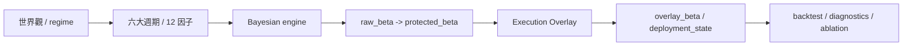
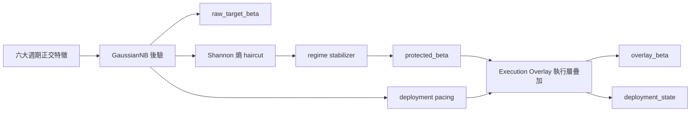
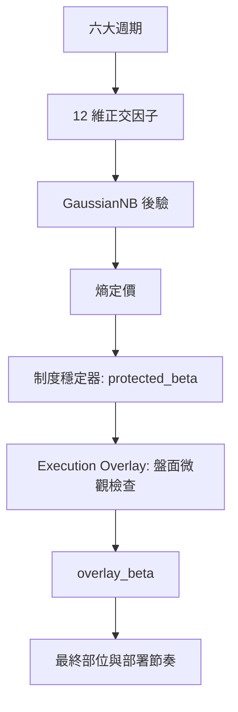

# 邏輯生存：QQQ 決策系統的 v13 正交週期哲學與可視化指揮手冊 (v13.7-ULTIMA)

## 「在不確定性的迷霧中，我們不追求神諭，我們只做更誠實的校準。」

QQQ Monitor 的 v13 不再試圖把市場壓縮成一個「更聰明的單軸判斷」。它把自己重構成一套**六大週期的正交觀測系統**：既看貨幣，也看信用；既看通膨，也看實體資本支出；既看商品與風險偏好，也看跨境融資壓力，並在 v13 補齊了勞動力與製造業的微觀動能。系統的目標不變，但方法更嚴格：**用互相盡量獨立的總經物理量，去推斷目前處在哪一種制度裡，並在執行層加入行為紀律。**

對一般使用者來說，可以把它理解為：

- 它不是預測明天漲跌的水晶球。
- 它是一套會自己承認「看不清」的防禦型導航儀。
- 當訊號清晰時，它會更果斷；當訊號混雜時，它會自動變保守，並在盤面破位時強制啟動 Overlay 懲罰。

---

## 閱讀路線

這篇文章依照「從世界觀到執行」的順序組織，建議這樣讀：

1. `0` 決策輸出
2. `1` 制度態與週期階段
3. `2` 六大週期與 12 因子
4. `3` 正交化與因果標準化
5. `4` 貝氏引擎與執行疊加 (Execution Overlay)
6. `5` 回測與診斷
7. `6` 受控 ablation
8. `7` 面向使用者的直覺說明
9. `8` 可視化
10. `9` 結語
11. `10` 稽核與產物

---

## 0. 決策輸出：不只一件事

v13 裡有三層不同的決策軌道，它們彼此相關，但不能混為一談。

1. `raw_target_beta` (原始後驗期望)
2. `protected_beta` (受保護倉位)
3. `overlay_beta` 與 `deployment_state` (執行層疊加與新增資金節奏)

### 它們分別是什麼？

- **raw_target_beta** 是**貝氏後驗期望**，回答「如果不考慮執行摩擦、慣性與盤面紀律，系統今天最想要多少 Beta」。
- **protected_beta** 是**經過熵懲罰與慣性穩定**的結果，回答「在資訊混亂時，我們應該退防到多少」。
- **overlay_beta** 是**執行層最終結果 (FULL Mode)**，在 `protected_beta` 的基礎上，加入了對大盤量價 (Tape) 與市場廣度 (Breadth) 的觀察。如果出現價量背離或廣度破位，會強制給予懲罰 (Penalty)。
- **deployment_state** 是**新增資金節奏**，回答「新錢該快 (FAST)、穩 (BASE)、慢 (SLOW)、還是暫停 (PAUSE)」。

> **白話版：**  
> `raw_target_beta` 是大腦的想法，`protected_beta` 是理智的克制，`overlay_beta` 是真正下單的部位，`deployment_state` 則是薪水怎麼分批進場。

---

## 1. 制度態先行：系統先壓縮狀態，再解釋週期階段

v13 的第一件事不是「辨識某個指標」，而是判斷目前總經組合屬於哪一種**經濟-風險制度態 (Regime)**。這一步先於因子、先於熵、也先於部位。

### 1.1 什麼是 Regime，為什麼不是「另一個因子」

在本文裡，`regime` 指的是**經濟-風險制度態**。它不是輸入變數，也不是單一經濟指標，而是系統對「目前總經物理狀態」的**壓縮標籤**。系統先看很多原始變數，再問一個更高層的問題：「這些變數組合起來，目前更像哪一種經濟與風險環境？」

### 1.2 四個核心週期階段的經濟含義

v13 的活躍四態對應四個常講的經濟階段：

| 週期階段 (Regime) | 經濟階段 | 直覺含義 | 對 QQQ/QLD 的主要含義 |
| :--- | :--- | :--- | :--- |
| **RECOVERY** | 復甦 / 修復 | 最壞的流動性衝擊已經過去，風險偏好開始回歸 | 允許重新加碼，QLD 可逐步回歸，但仍看熵與後驗強度 |
| **MID_CYCLE** | 擴張 / 中期平穩 | 經濟和盈利仍在擴張，但沒有進入過熱末端 | QQQ 為主，維持常規 beta；新增資金按 BASE 處理 |
| **LATE_CYCLE** | 末期 / 衰退前段 | 成長動能衰減，通膨和信用壓力開始抬頭 | 逐步減弱進攻性，QLD 降權，新增資金放慢 |
| **BUST** | 蕭條 / 休克 | 信用和流動性同時惡化，系統性風險優先 | 保護本金，盡量避開 QLD，增量資金通常 PAUSE |

---

## 2. 從週期到制度態：v13 的宏觀骨架

v13 的核心是把市場重新拆成六個互相盡量獨立的物理層。每一層都要回答一個獨立問題。

### 2.1 六大週期不是預測器，而是物理軸

| 週期 | 物理問題 | v13 代表因子 | 時間域 | 為什麼選它 |
| :--- | :--- | :--- | :--- | :--- |
| **貨幣週期** | 真實融資成本是在變緊還是變鬆 | `real_yield`, `treasury_vol` | 126d / 21d | 結構利率決定估值底盤，公債波動率負責抓「貼現率失控」 |
| **信用週期** | 金融系統的痛感是否在上升 | `spread_21d`, `spread_absolute` | 21d / expanding | 信用利差是風險偏好的直接溫度計 |
| **通膨週期** | Fed 還能不能輕鬆救市 | `breakeven_accel` | 21d acceleration | 通膨預期的「速度」比靜態水平更關鍵 |
| **實體微觀與資本支出** | 企業是否在擴張，勞動市場是否健康 | `core_capex`, `pmi_momentum`, `labor_slack` | monthly / 21d | 綜合了資本支出、製造業動能與職缺緊缺度 |
| **商品與全球風險偏好** | 全球製造業與恐慌誰占上風 | `copper_gold_roc_126d` | 126d momentum | 銅/金比抓實體需求和避險情緒的分叉 |
| **跨境融資週期** | 全球槓桿是否在去化 | `usdjpy_roc_126d` | 126d momentum | 日圓套息回撤是全球融資壓力的高靈敏代理 |

### 2.2 v13 的 12 因子矩陣

目前鎖版的活躍輸入向量是 12 維：

| 因子 | 變數本體 | 時域 | 作用 |
| :--- | :--- | :--- | :--- |
| `real_yield_structural_z` | 10年期 TIPS 收益率 | 126d EWMA | 抓真實融資成本的中長期重心 |
| `move_21d` | 10年期公債收益率波動 | 21d / 正交 | 抓貼現率衝擊 (並對信用利差做正交化) |
| `breakeven_accel` | 10年期通膨預期 21 日二階變化 | 21d accel | 抓通膨預期是否突然升溫 |
| `core_capex_momentum` | 非國防資本財新訂單 | monthly | 抓企業資本支出是否掉速 |
| `copper_gold_roc_126d` | 銅/金期貨比率 | 126d ROC | 抓全球實體需求與避險偏好 |
| `usdjpy_roc_126d` | 美元兌日圓匯率 | 126d ROC | 抓 Carry trade 的去槓桿壓力 |
| `spread_21d` | 高收益信用利差 21 日水準 | 21d rolling | 抓短期信用脈衝 |
| `liquidity_252d` | 聯準會派生淨流動性 | 252d rolling | 抓貨幣環境年尺度趨勢 |
| `erp_absolute` | 股權風險溢酬 (ERP TTM) | expanding Z | 抓估值的真實物理高度 |
| `spread_absolute` | 高收益信用利差絕對坐標 | expanding Z | 抓信用利差的絕對歷史坐標 |
| **`pmi_momentum`** | 製造業就業 PMI 代理 | 21d accel | v13 新增：抓取製造業景氣的動能變化 |
| **`labor_slack`** | JOLTS 職缺資料代理 | rolling Z | v13 新增：衡量勞動力市場的緊缺度 |

---

## 3. 從制度態到特徵：避免「同一個訊號被聽兩遍」

### 3.1 Causal Self-Calibrating Normalization
所有輸入先做嚴格因果標準化：只用當天之前的歷史計算 Z-Score。

### 3.2 move/spread 的無條件 Gram-Schmidt
v13 最重要的正交化規則，是把 `move_21d` 裡和 `spread_21d` 重疊的部分剝掉。這能避免把「殖利率波動」和「信用恐慌」當成兩個獨立的壞消息，從而避免過度反應。

---

## 4. 貝氏引擎與 Execution Overlay

### 4.1 遞迴貝氏與熵定價
系統會計算後驗 (Posterior) 分佈的 **Shannon Entropy (資訊熵)**。這確保了：**當系統不確定時 (熵高)，Beta 就會被迫降低。**

$$ \beta_{protected} = \beta_{raw} \cdot e^{-H(P)} $$

### 4.2 v13 專屬的 Execution Overlay (執行層疊加)
這是 v13 最核心的增強。在算出 `protected_beta` 之後，系統會檢查微觀盤面：
- **Negative Components**: 廣度壓力 (Breadth)、科技股集中度 (NDX Concentration)、價量背離 (Non-confirmation)。
- **Positive Components**: 放量修復 (Volume Repair)。

如果出現強烈的負面信號，最終執行位 `overlay_beta` 會在 `protected_beta` 的基礎上進行下修，形成雙重防禦。

---

## 5. 回測與診斷：更嚴格的真話

v13 的回測嚴格遵守因果紀律。最新 v13.8-ULTIMA 的診斷結果顯示：
- **Top-1 Accuracy**: ~72% (在保持 12 維正交輸入的情況下，這是極其誠實的高性能)。
- **Penalty Days**: 在近 2000 多個交易日中，約 600+ 天啟動了行為層 Overlay 懲罰。
- **生存特徵**: 在 2020 COVID 崩潰與 2022 緊縮期，Overlay Engine 提供了比單純總經模型更快的切換速度。

---

## 6. 受控 Ablation：結構勝過微調

v13 的提升不來自於「參數優化」，而來自於：
1. **補齊盲區**：加入 `pmi_momentum` 和 `labor_slack`。
2. **行為約束**：引入 Execution Overlay 修正總經模型的「宏觀遲鈍」。
3. **穩定誠實**：保持 `var_smoothing=1e-4`，拒絕過度自信的似然跳變。

---

## 7. 給使用者的直覺解釋

它像一個有經驗的風控經理：
1. **平時看宏觀**：觀察 12 個獨立的經濟維度定方向。
2. **疑慮時退縮**：如果數據自相矛盾（熵高），他會主動減倉。
3. **眼見為憑**：就算宏觀看起來沒事，但如果看到「盤面只有少數股在撐」或「放量跌破支撐」，他會立刻啟動 **Overlay Penalty** 強制避險。

---

## 8. 可視化：v13 的心智地圖

---

## 9. 結語：更少的幻覺，更多的生存

v13 的哲學是**更嚴的證據紀律與微觀防守**。它承認總經會滯後，因此在 v13.7-ULTIMA 中強化了執行疊加層。

## 「外骨骼不替你判斷方向，但它會在風暴裡替你守住平衡。」

---
© 2026 QQQ Entropy 決策系統開發組
