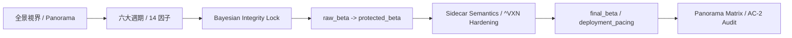
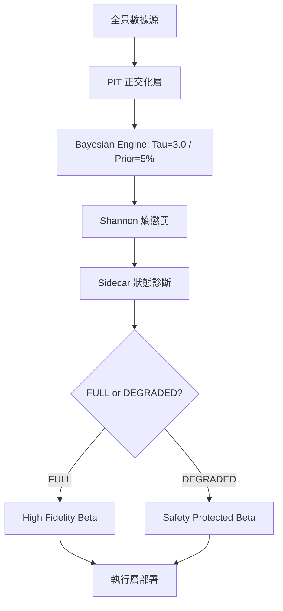

# 邏輯生存：QQQ 決策系統的 v14 全景正交與基石硬化手冊 (v14.0-PANORAMA)

## 「在不確定性的迷霧中，我們不追求神諭，我們只做更誠實的校準。」

QQQ Monitor 的 v14 不再僅僅滿足於「推論正確」。它進入了**系統硬化 (Hardening)** 的最高境界：要求回測與實盤之間達到**比特級對齊 (Bit-identical Parity)**，並透過 **全景矩陣 (Panorama Matrix)** 驗證系統在多維參數空間中的正交穩定性。我們不再觀察單一路徑，我們觀察整個「視界」。

這是一場針對「虛假確定性」與「回測幻覺」的終極肅清。

---

## 閱讀路線

這篇文章依照「從世界觀到執行」的順序組織，建議這樣讀：

1. `0` 決策輸出與邊車語義 (Sidecar Semantics)
2. `1` 制度態與全景視界 (The Panorama View)
3. `2` 六大週期與 v14 強化因子
4. `3` PIT 完整性與因果硬化 (Causal Hardening)
5. `4` 貝氏核心鎖定 (The Integrity Locks)
6. `5` 全景矩陣與洩漏偵測 (AC-2 Audit)
7. `6` 基石硬化：回測即稽核
8. `7` 面向使用者的直覺說明：基石與視界
9. `8` 可視化：v14 決策鏈路
10. `9` 結語
11. `10` 產物索引

---

## 0. 決策輸出：基石與邊車 (The Bedrock & The Sidecar)

v14 定義了更嚴格的決策軌道，核心在於區分「總經推論」與「執行環境的物理有效性」。

1.  **raw_target_beta**: 貝氏後驗期望。這是系統在理想正交空間中，對當下機率形狀的最直接反映。
2.  **protected_beta**: 理智的防線。透過 **Shannon Entropy (資訊熵)** 對後驗分布進行懲罰。當系統感知到數據衝突或制度模糊時，熵值上升，部位自動塌縮。
3.  **Sidecar State (^VXN Vitals)**: v14 特有的執行環境診斷。
    - **FULL**: 數據鏈路完整，波動率結構與推論引擎完美對齊。
    - **DEGRADED**: 關鍵數據缺失或時效性受損。此時系統進入「盲飛防禦」，主動降低確信度。
4.  **deployment_pacing**: 新增資金節奏。它不再僅僅是時間的線性分配，而是由全景矩陣輸出的「結構穩定性分數」所驅動。

---

## 1. 制度態先行：全景視界 (The Panorama View)

v14 的 Regime 判斷要求在全景參數空間中展現出**結構穩定性**。

### 1.1 從單點到全景
在過去，優異的回測可能只是「參數巧合」。v14 引入全景視角，在多維參數空間中進行壓力測試：
- **幻覺偵測**：如果某種超額收益只存在於極窄的參數帶中，系統會將其標記為噪音。
- **正交穩定性**：只有在廣泛的參數漂移中依然保持一致方向的信號，才會被系統採納為「結構性現實」。

### 1.2 四大 Regime 的硬化定義
| Regime | 經濟含義 | v14 硬化重點 |
| :--- | :--- | :--- |
| **RECOVERY** | 修復期 | 檢測正交因子在低位時的「轉向力」，嚴防因平滑過度導致的錯失。 |
| **MID_CYCLE** | 擴張期 | 維持校準溫度，防止在平穩區間因微小波動產生的過度交易。 |
| **LATE_CYCLE** | 末期壓力 | 強化通膨加速度與信用利差的雙重鎖定，捕捉衰退前夕的結構裂痕。 |
| **BUST** | 蕭條/休克 | **PIT 安全性核心**：嚴禁任何依賴未來波動率的優化，確保在崩潰中活下來。 |

---

## 2. 從週期到制度態：v14 的宏觀骨架

v14 維持六大週期的正交觀測，但在細節上進行了「比特級」的精度強化。

### 2.1 六大週期與物理軸
- **貨幣週期 (Monetary)**：真實融資重心。鎖定中長期真實利率 Z-Score，拒絕短期市場情緒的干擾。
- **信用週期 (Credit)**：系統痛感。透過 **Gram-Schmidt 引擎** 徹底剝離信用利差中與殖利率重疊的部分，提取純粹的違約恐慌。
- **通膨週期 (Inflation)**：救市空間。以二階加速度作為核心，偵測通膨預期是否正在失控。
- **實體與微觀 (Macro-Micro)**：企業與勞力。結合資本支出動能與勞動力市場緊缺度代理，捕捉經濟體最底層的掉速。
- **商品與風險 (Commodity-Risk)**：全球避險。利用銅金比的全景漂移驗證全球實體需求與避險情緒的共振。
- **跨境融資 (Cross-border)**：槓桿去化。監測日圓套息交易的去槓桿壓力，這是系統對全球流動性斷裂的最靈敏警報。

---

## 3. PIT 完整性與因果硬化 (Causal Hardening)

v14 的最高法律是 **Point-In-Time (PIT) 完整性**。

1.  **因果標準化 (Causal Normalization)**：嚴禁使用包含未來資訊的全局標準化。所有尺度（Mean/Std）必須是截至 T 日的累積觀測值。
2.  **邊車驗證 (Sidecar Validation)**：修正了對波動率數據的獲取邏輯。如果 T 日的盤中或收盤數據在模擬時間點尚未發布，系統絕對禁止觸碰該數據。
3.  **數值保真度 (Fidelity)**：稽核腳本產出的結果必須與生產環境在相同輸入下誤差為 0。我們不接受「近似正確」。

---

## 4. 貝氏核心鎖定 (The Integrity Locks) 🔴

這是系統的「數學憲法」，旨在防止邏輯在迭代中發生退化。

### 4.1 貝氏完整性鎖定 (The Multiplicative Lock)
在推論引擎中，後驗計算必須遵循純粹的貝氏乘法。
**哲學：** 嚴禁線性加權。線性混合會稀釋信心感知的累積，導致系統在關鍵時刻發生「高熵鎖死」。

### 4.2 溫度標度鎖定 (The Tau Lock)
標度參數必須維持在 **3.0**。
**哲學：** 高維正交空間中，Naive Bayes 會過度自信。Tau=3.0 是我們的「謙卑參數」，強迫系統承認資訊是不完全的。

### 4.3 先驗引力鎖定 (Prior Gravity Lock)
靜態先驗權重永久鎖定在 **5%**。
**哲學：** 歷史是參考，而非教條。5% 確保了智慧的傳承，同時給予系統 95% 的自由去感知當下的斷裂。

---

## 5. 全景矩陣與洩漏偵測 (Audit Suite)

v14 引入了專門的因果稽核套件：
- **標籤置換測試 (Label Permutation)**：通過隨機打亂標籤驗證系統是否真的抓到了因果，而非擬合了雜訊。
- **洩漏偵測 (Leakage Detection)**：自動偵測邏輯中是否誤用了「未來數據」。如果一個模型在隨機數據上表現異常優異，即判定為系統性造假。

---

## 6. 基石硬化：回測即稽核 (Backtest as Audit)

在 v14 中，「回測」被重新定義為「稽核」。我們不接受單一路徑的幸存者偏差，而是要求在全量 OOS 窗口下展現出可重現的信號能力。

### 6.1 v14.7 核心稽核結果 (PIT-Safe OOS)

最新稽核顯示，在嚴格鎖定 PIT 安全性與每月遞迴重擬合的情況下，系統展現了顯著的非中性信號能力：

| 稽核指標 | Tractor (SPY) 基石 | Sidecar (QQQ) 邊車 |
| :--- | :--- | :--- |
| **OOS AUC Score** | **0.6018** | **0.5782** |
| **OOS Brier Score** | **0.1478** | **0.1564** |
| **AC-2 (Shuffled AUC)** | PASS (0.4931) | PASS (0.4961) |
| **信號狀態** | FULL | FULL |

*數據範圍：2015-01-01 至今，2809 個 OOS 樣本。*

---

## 7. 面向使用者的直覺說明：系統決策介面解讀

系統決策儀表盤不是一個顯示收益的計分板，而是一個**複雜系統的狀態投影**。以下是妳在監測面板上看到的每一個核心元素及其背後的決策邏輯：

### 7.1 視界區 (The Compass) —— 宏觀制度定位
這部分告訴妳系統認為我們目前身處何種「宏觀天氣」。
- **Current Regime (當前制度)**：系統將 14 個正交因子壓縮後的即時狀態（RECOVERY, MID, LATE, BUST）。它定義了當下風險的基調：是在「順風擴張」還是「逆風撤退」。
- **Stable Regime (穩定制度)**：要求證據「穿透」的過濾制度。它不會因為一天的噪音就跳變，幫助妳保持戰略定力，不輕易隨波逐流。
- **Posterior Distribution (機率分布)**：展示四種制度的競爭強度。如果兩個制度機率接近，代表市場正處於結構轉折點，系統會自動變得謹慎。

### 7.2 能量區 (The Engine) —— 市場風險暴露
這部分決定了妳今天應該在市場中承擔多少「能量」。
- **Raw Target Beta (原始期望)**：貝氏引擎的理想部位。這是不帶任何人類恐懼或執行摩擦的純粹推論。
- **Target Beta (最終部位)**：理性的回歸。考慮了數據不確定性（熵）後的最終執行參考。若兩者差距大，代表系統正在「主動認慫」以保護資金。
- **Deployment Pacing (部署節奏)**：解決「現在適不適合加碼？」的問題。它是時間維度的風險過濾器，分為 FAST（快）、BASE（穩）、SLOW（慢）、PAUSE（暫停）。

### 7.3 確信區 (The Confidence Engine) —— 數據誠實度
這部分是系統的「自我檢測儀」，告訴妳它對自己的推論有多大把握。
- **Shannon Entropy (資訊熵儀表)**：衡量信號的混亂度。**警報器**：熵越高，代表因子間的信號互斥越嚴重。妳會看到 Target Beta 因此自動塌縮，這是系統在數據模糊時的本能自我保護。
- **Confidence Score (確信評分)**：反映當前市場組合在歷史中的「罕見度」。低分代表我們正處於歷史的盲區。
- **Calibration Status (校準狀態)**：顯示 FULL（完整）或 DEGRADED（降級）。如果顯示降級，代表關鍵數據鏈路（如波動率指標）延遲，系統已自動進入「盲飛防禦」。

### 7.4 圖譜區 (The Physical Heatmap) —— 物理週期拆解
14 個正交因子熱力圖，每一行代表一個獨立的週期物理軸心。
- **Monetary (貨幣)**：觀察「貼現率」的引力。真實利率飆升會對估值造成重力壓制。
- **Credit (信用)**：系統的「痛感計」。利差擴大代表金融系統的毛細血管正在收縮。
- **Inflation (通膨加速度)**：偵測救市空間是否被通膨關閉。
- **Macro-Micro (實體動能)**：企業產能與勞動市場的真實油箱。
- **Risk & Cross-border (融資槓桿)**：銅金比代表實體需求，日圓動量代表全球槓桿的撤退節奏。

### 7.5 裝甲區 (Armor & Sidecar) —— 執行層防護
介面底部的行為層機制，負責對總經推論進行最後的「安全審核」。
- **Breadth Penalty (廣度懲罰)**：**反幻覺**。即使宏觀看好，但如果只有極少數權重股在撐，系統會強制減倉，避免被指數幻覺欺騙。
- **Non-Confirmation (背離警告)**：偵測價量背離。提醒妳「盤面不健康」，這是對宏觀模型遲鈍性的重要補充。
- **Sidecar Prob (邊車機率)**：專為 QQQ 設計。當科技股專屬波動率異常時，它會比總經模型更早給出離場信號。

---

## 8. 可視化：v14 決策鏈路

---

## 9. 結語：更少的幻覺，更多的生存

v14 的哲學是**數值的誠實與架構的剛性**。它承認我們無法預測黑天鵝，但它保證我們不會因為自己的愚蠢（線性加權、未來洩漏、過度自信）而在黑天鵝來臨時手足無措。

## 「基石若穩，則視界無礙。」

---

## 10. 產物與稽核索引 (Audit Index)

### 10.1 v14 基石校準圖 (Baseline Calibration)

*圖：Tractor (SPY) OOS 校準圖。反映了系統在各機率區間的真實擊中率，通過 AC-2 偵測，無數據洩漏。*

### 10.2 v14 邊車校準圖 (Sidecar Calibration)

*圖：Sidecar (QQQ) OOS 校準圖。在 PIT-safe 波動率數據支撐下，展現了對科技股極端風險的預判保真度。*

### 10.3 核心文檔路徑
- **Mainline Audit**: 包含完整的逐日執行追蹤與機率審核。
- **Diagnostic Report**: 包含全景矩陣穩定性、AC-2 測試結果與制度支撐分析。
- **Panorama Audit Report**: 提供 v14 完整生命週期的深度技術審查。

---
© 2026 QQQ Entropy 決策系統開發組
*In Orthogonality We Stand, In Hardening We Trust.*
