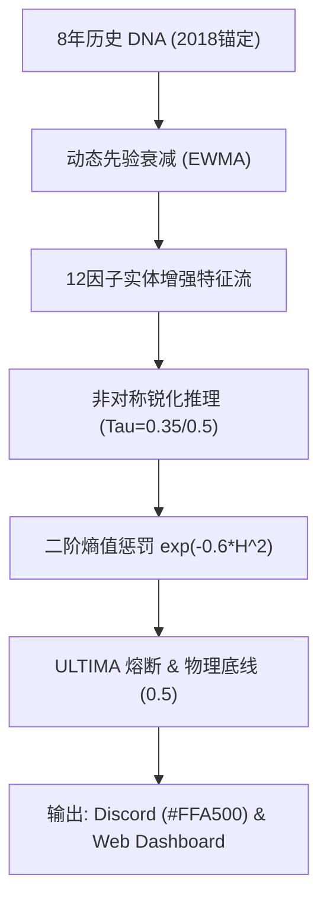

# QQQ v13.7-ULTIMA 决策系统全量百科 (WIKI)

> **版本：** v13.7-ULTIMA (GOLD-FINAL)  
> **核心哲学：** 历史自洽、物理传导、生存红线。

---

## 1. 架构总览：全息防御体系

v13.7-ULTIMA 是一个**具有深厚历史记忆的贝叶斯推断系统**。它通过 8 年的深度回演（Deep Hydration）构建先验，结合 12 因子实体经济重力感知，实现在极端高熵环境下的稳健决策。

### 核心中枢流程

---

## 2. 特征物理学 (Feature Physics)

系统不再盲目通过统计拟合分配权重，而是根据**霍华德·马克斯周期论**分配物理权重。

| 等级 | 权重 | 核心特征 | 物理含义 |
| :--- | :--- | :--- | :--- |
| **Level 1** | 2.5x | `Credit Spread`, `ERP` | **周期的原动机**。利差走阔是金融危机爆发的终极证据。 |
| **Level 2** | 2.0x | `Real Yield`, `Liquidity` | **估值重力**。决定了折现率与货币供应的总量约束。 |
| **Level 3** | 1.5x | `PMI Momentum`, `Labor Slack` | **实体经济重力**。捕捉制造业衰减与劳动力拐点。 |
| **Level 4** | 1.5x | `MOVE`, `Orthogonal Move` | **系统压力**。捕捉固收市场的流动性断裂。 |

### 2.1 异频平滑 (Aliasing Defense)
月度数据（PMI/失业率）必须经过 **21日 EWMA 平滑** 后方可进入日频系统，以防止月初数据发布时的“数值阶梯”干扰决策。

---

## 3. 防御深度 (Defense Depth)

### 3.1 二阶熵值惩罚 (Damped Gaussian Haircut)
系统使用非线性公式 `Confidence = exp(-0.6 * H^2)`：
- **低熵区 (H < 0.5)**：模型高度确信，仓位受保护。
- **高熵冲突区 (H > 0.7)**：惩罚力度指数级增加，系统快速撤收至物理底线。

### 3.2 ULTIMA 熔断机制
当归一化熵持续超过 0.85 且达 21 个交易日，系统判定处于“认知死锁”：
- **动作**：强制切除 Level 2-5 感官（权重降为 0），仅依赖 Level 1 (信贷利差) 生存。

### 3.3 物理红线 (The User Redline)
**0.5 Beta Floor**：无论模型多么恐慌，除非发生流动性冲击（Overlay 触发），最终推荐 Beta 绝不低于 0.5。这是基于 QQQ 长期多头价值的最高生存指令。

---

## 4. 数据血统与溯源 (Provenance)

### 4.1 8 年深度预热 (Deep Hydration)
系统拒绝冷启动。启动前必须回放 **2018-01-01** 起的 PIT 全量序列。
- **动态衰减**：历史记忆（Counts）随时间指数级衰减，确保近 252 日的政权分布对先验贡献最大。

---

## 5. 交互与透明度 (UX)

- **橙色标题 (#FFA500)**：代表 0.5 物理底线正在保护你的仓位。
- **Amber-400 视觉反馈**：Web 仪表盘显示的“物理锁定态”。
- **Prior Anchor**：页脚展示的锚定日期（2018-01-01）是系统记忆可审计性的证明。

---
© 2026 QQQ Entropy 决策系统研发中心。 基于贝叶斯原理，守护物理红线。
