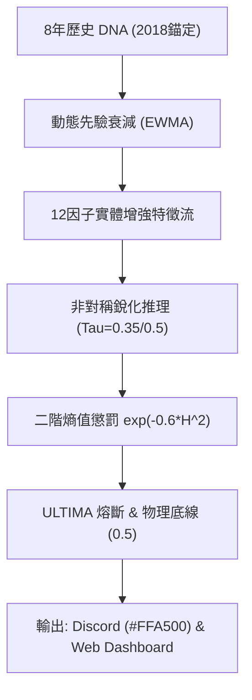

# QQQ v13.7-ULTIMA 決策系統全量百科 (WIKI_TC)

> **版本：** v13.7-ULTIMA (GOLD-FINAL)  
> **核心哲學：** 歷史自洽、物理傳導、生存紅線。

---

## 1. 架構總覽：全息防禦體系

v13.7-ULTIMA 是一個**具有深厚歷史記憶的貝葉斯推斷系統**。它通過 8 年的深度回演（Deep Hydration）構建先驗，結合 12 因子實體經濟重力感知，實現在極端高熵環境下的穩健決策。

### 核心中樞流程

---

## 2. 特徵物理學 (Feature Physics)

系統不再盲目通過統計擬合分配權重，而是根據**霍華德·馬克斯週期論**分配物理權重。

| 等級 | 權重 | 核心特徵 | 物理含義 |
| :--- | :--- | :--- | :--- |
| **Level 1** | 2.5x | `Credit Spread`, `ERP` | **週期的原動力**。利差走闊是金融危機爆發的終極證據。 |
| **Level 2** | 2.0x | `Real Yield`, `Liquidity` | **估值重力**。決定了折現率與貨幣供應的總量約束。 |
| **Level 3** | 1.5x | `PMI Momentum`, `Labor Slack` | **實體經濟重力**。捕捉製造業衰減與勞動力拐點。 |
| **Level 4** | 1.5x | `MOVE`, `Orthogonal Move` | **系統壓力**。捕捉固收市場的流動性斷裂。 |

### 2.1 異頻平滑 (Aliasing Defense)
月度數據（PMI/失業率）必須經過 **21日 EWMA 平滑** 後方可進入日頻系統，以防止月初數據發布時的「數值階梯」干擾決策。

---

## 3. 防禦深度 (Defense Depth)

### 3.1 二階熵值懲罰 (Damped Gaussian Haircut)
系統使用非線性公式 `Confidence = exp(-0.6 * H^2)`：
- **低熵區 (H < 0.5)**：模型高度確信，倉位受保護。
- **高熵衝突區 (H > 0.7)**：懲罰力度呈指數級增加，系統快速撤收至物理底線。

### 3.2 ULTIMA 熔斷機制
當歸一化熵持續超過 0.85 且達 21 個交易日，系統判定處於「認知死鎖」：
- **動作**：強制切除 Level 2-5 感官（權重降為 0），僅依賴 Level 1 (信貸利差) 生存。

### 3.3 物理紅線 (The User Redline)
**0.5 Beta Floor**：無論模型多麼恐慌，除非發生流動性衝擊（Overlay 觸發），最終推薦 Beta 絕不低於 0.5。這是基於 QQQ 長期多頭價值的最高生存指令。

---

## 4. 數據血統與溯源 (Provenance)

### 4.1 8 年深度預熱 (Deep Hydration)
系統拒絕冷啟動。啟動前必須回放 **2018-01-01** 起的 PIT 全量序列。
- **動態衰減**：歷史記憶（Counts）隨時間指數級衰減，確保近 252 日的政權分布對先驗貢獻最大。

---

## 5. 交互與透明度 (UX)

- **橙色標題 (#FFA500)**：代表 0.5 物理底線正在保護您的倉位。
- **Amber-400 視覺反饋**：Web 儀表板顯示的「物理鎖定態」。
- **Prior Anchor**：頁腳展示的錨定日期（2018-01-01）是系統記憶可審計性的證明。

---
© 2026 QQQ Entropy 決策系統研發中心。 基於貝葉斯原理，守護物理紅線。
