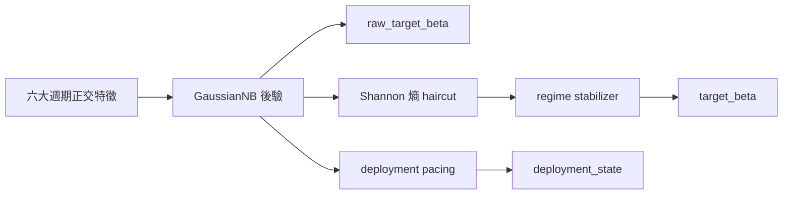

# 邏輯生存：QQQ 決策系統的週期哲學與可視化指揮手冊 (v14.0 完整全量版)

## 「在不確定性的迷霧中，我們不追求神諭，我們只做更誠實的校準。」

QQQ Monitor 的 v14 不再試圖把市場壓縮成一個「更聰明的單軸判斷」。它把自己重構成一套**六大週期的正交觀測系統**：既看貨幣，也看信用；既看通膨，也看實體資本支出；既看商品與風險偏好，也看跨境融資壓力。系統的目標不變，但方法更嚴格：**用互相盡量獨立的總經物理量，去推斷目前處在哪一種制度裡，並據此調整風險。**

在 v14 中，我們採用了雙路影子模型架構，被形象地稱為「泥地拖拉機與側車 (Mud Tractor & Sidecar)」：
- **Tractor (拖拉機)**：即 **SPY Macro 基線模型**。利用全量宏觀數據感知大盤整體的「泥地」深度。
- **Sidecar (側車/掛車)**：即 **QQQ Native 模型**。在宏觀基礎上疊加納指特有技術因子（如 VXN），捕捉科技股特有的打滑風險。
- **物理耦合**：系統根據「地面抓地力」（資訊熵）決定動力傳導強度（Beta），防止在迷霧中翻車。

對一般使用者來說，可以把它理解為：
- 它不是預測明天漲跌的水晶球。
- 它是一套會自己承認「看不清」的**防禦型導航儀**。
- 當訊號清晰時，它會更果斷；當訊號混雜時，它會自動變保守。

## 閱讀路線

1. `0` 決策輸出
2. `1` 制度態與四階段
3. `2` 六大週期與 10 因子
4. `3` 正交化與因果標準化
5. `4` 貝氏引擎與物理耦合
6. `5` 回測與診斷
7. `6` 受控 ablation
8. `7` 面向使用者的直覺說明
9. `8` 儀表板指揮官手冊：卡片全解析
10. `9` 結語
11. `10` 稽核與產物

---

## 0. 三個輸出，不是一件事

v14 裡有三條不同的決策軌道，它們彼此相關，但透過物理隔離實現防禦：

1. **`raw_target_beta` (The Engine)**：是貝氏後驗期望，回答「如果不考慮執行摩擦、打滑與慣性，系統今天最想要多少 Beta」。
2. **`target_beta` (The Load)**：是執行層結果，回答「考慮熵（泥地抓地力）、慣性和穩定性之後，今天真正應該執行多少 Beta」。
3. **`deployment_state` (The Pacing)**：是新增資金節奏，回答「新錢該快、慢、停，還是先等等」。

> **白話版：**  
> `raw_target_beta` 是腦袋裡的想法，`target_beta` 是最後下單，`deployment_state` 是薪水和獎金該怎麼分批進場。

---

## 1. 制度態先行：系統先壓縮狀態，再解釋週期

v14 的第一件事不是「辨識某個指標」，而是判斷目前總經組合屬於哪一種**經濟-風險制度態**。這一步先於因子、先於熵、也先於部位。

### 1.1 什麼是 REGIME，為什麼不是「另一個因子」
在本文裡，`regime` 指的是**經濟-風險制度態**。它不是輸入變數，而是系統對「目前總經物理狀態」的**壓縮標籤**。系統先看很多原始變數，再問一個更高層的問題：「這些變數組合起來，目前更像哪一種經濟與風險環境？」

### 1.2 v14 為什麼要把很多週期壓縮成四個 REGIME
第一性原理上，QQQ/QLD 收益來自估值折現、盈利擴張與流動性。如果多個週期最後都會讓系統做同一件事（例如去槓桿），那系統就要把它們壓縮成少數幾個可執行制度。

### 1.3 四個 REGIME 的經濟含義

| Regime | 經濟階段 | 直覺含義 | 對 QQQ/QLD 的主要含義 |
| :--- | :--- | :--- | :--- |
| `RECOVERY` | 復甦 / 修復 | 最壞的衝擊已過，風險回歸 | 允許重新加碼，QLD 可逐步回歸 |
| `MID_CYCLE` | 擴張 / 中期平穩 | 經濟盈利擴張，未過熱 | QQQ 為主，維持常規 beta |
| `LATE_CYCLE` | 末期 / 衰退前段 | 成長動能衰減，壓力抬頭 | 逐步減弱進攻，QLD 降權 |
| `BUST` | 衰退 / 休克 | 信用流動性雙重惡化 | 保護本金，避開 QLD，PAUSE |

---

## 2. 從週期到制度態：v14 的宏觀骨架

### 2.1 六大週期不是六個預測器，而是六個物理軸

| 週期 | 物理問題 | v14 主要因子 | 為什麼選它 |
| :--- | :--- | :--- | :--- |
| 貨幣週期 | 真實融資成本是在變緊還是變鬆 | `real_yield_structural_z` | 結構利率決定估值底盤 |
| 信用週期 | 金融系統的痛感是否在上升 | `spread_21d`, `spread_absolute` | 信用利差是風險偏好的直接溫度計 |
| 通膨週期 | Fed 還能不能輕鬆救市 | `breakeven_accel` | 加速度抓政策邊際轉向 |
| 實體資本支出週期 | 企業是否還在擴張真實產能 | `core_capex_momentum` | 這是經濟的底層硬體更新速度 |
| 商品與偏好週期 | 全球製造業與恐慌誰占上風 | `copper_gold_roc_126d` | 實體需求與避險情緒的分叉 |
| 跨境融資週期 | 全球槓桿是否在去化 | `usdjpy_roc_126d` | 日圓套息回撤是融資壓力的最高靈敏代理 |

### 2.2 v14 的 10 因子矩陣 (Locked Matrix)

| 因子 | 變數本體 | 類型 | 作用 |
| :--- | :--- | :--- | :--- |
| `real_yield_structural_z` | 10Y TIPS 收益率 | 結構層級 | 抓融資成本的中長期重心 |
| `move_21d` | DGS10 21日已實現波動率 | 貼現率衝擊 | 抓公債收益率波動的失控 |
| `breakeven_accel` | 10Y 通膨預期 21日二階變化 | 通膨加速度 | 抓通膨預期是否突然升溫 |
| `core_capex_momentum` | 非國防資本財新訂單月度變化 | 實體動能 | 抓企業資本支出是否掉速 |
| `copper_gold_roc_126d` | 銅/金比 126日 ROC | 商品動量 | 抓全球實體需求與避險情緒 |
| `usdjpy_roc_126d` | 美元兌日圓匯率 126日 ROC | 跨境融資動量 | 抓 carry trade 的去槓桿 |
| `spread_21d` | 高收益信用利差 21日滾動 | 信用脈衝 | 抓信用壓力的短期抬升 |
| `liquidity_252d` | 淨流動性 (Fed B/S 派生) | 流動性結構 | 抓貨幣環境的年尺度趨勢 |
| `erp_absolute` | 股權風險溢酬 (TTM) | 估值錨點 | 抓 ERP 的真實物理高度 |
| `spread_absolute` | 信用利差絕對歷史坐標 | 價格錨點 | 抓信用壓力的絕對水位 |

### 2.4 哪些候選因子被回測丟棄 (Rejection History)
- `yield_absolute`：與 `real_yield` 高度共線，導致重複投票。
- `drawdown_pct`：主要是滯後描述，不提供前瞻資訊。
- `DXY`：傳導不如 `USD/JPY` 直接，資訊密度低。
- `歐元區 PMI`：與美國經濟因子冗餘。

---

## 3. 從制度態到特徵：如何避免重複計票

### 3.2 MOVE/SPREAD 的無條件 GRAM-SCHMIDT
v14 強制執行 `move_21d` 與 `spread_21d` 的殘差化處理。
$$ move^{orth}_t = move_z - \beta_t \cdot spread_z $$
這確保了當公債波動與信用壓力同時上升時，系統不會重複計票。這防止了在泥地中不必要的急煞，保護掛車平衡。

---

## 4. 貝氏引擎與泥地耦合：拖車鉤的物理學

### 4.3 熵保護與脫鉤 (The Entropy Tow-Bar)
系統計算 **Shannon 熵 $H(P)$**，這代表「泥地濕度」。
$$ \beta_{protected} = \beta_{raw} \cdot e^{-H(P)} $$
**熵高說明後驗更接近「我不確定」。這就是系統的「誠實」：當我不確定時，我雖然知道引擎想轉向，但我選擇不拖動掛車。**

---

## 5. 回測與診斷：數據不撒謊

### 5.5 已驗證結果 (System Confidence & Calibration)

| 指標 | 結果 | 說明 |
| :--- | :--- | :--- |
| `top1_accuracy` | **67.38%** | 系統主方向判斷準確率 |
| `stable_accuracy` | **66.68%** | 穩定器平滑後的準確率 |
| `mean_brier` | **0.4475** | **核心置信度指標**：越低預測越精準 |
| `mean_entropy` | **0.3332** | 系統平均誠實度（熵值） |
| `lock_incidence` | **1.21%** | 極端泥地鎖死頻率 |
| `stable_critical_recall` | **74.41%** | 危機時刻的穩定捕捉率 |

### 5.6 危機切片的真實表現

| 窗口 | 行數 | raw critical recall | stable critical recall | 說明 |
| :--- | :--- | :--- | :--- | :--- |
| `2018Q4` | 66 | `0.9848` | `0.9848` | 能穩定辨識壓力，不硬造連續 BUST |
| `2020_COVID` | 54 | `1.0000` | `1.0000` | 極端衝擊下快速切入防禦 |
| `2022_H1` | 129 | `0.8837` | `0.8760` | 通膨緊縮期較早辨識結構惡化 |

---

## 6. 受控 ABLATION：氣缸的獨立貢獻

- `var_smoothing=1e-4`：在區辨度與穩定性間取得平衡。
- `core_capex_momentum (ewma_span=3)`：過濾月度雜訊。
- `classifier_only` 模式：拒絕主觀權重，保持後驗誠實。

---

## 8. 儀表板指揮官手冊：UI 卡片全解析

當你打開 `index.html` 儀表板時，你不是在看漲跌，而是在監測這套重型機械的**運作完整性**。

### 8.1 決策中樞 (The Command Bridge)
- **Current Regime**：穩定環境標籤。若是 **BUST**，掛車強制停駛。
- **Target Beta**：今天真正應持有的曝險。已考慮了熵保護。低於 1.0 代表物理脫鉤。
- **Deployment State**：**FAST** 代表地面乾、賠率高；**PAUSE** 代表地面極滑，嚴禁入泥。

### 8.2 影子監測站：拖拉機與側車 (Tractor & Sidecar)
這是 v14 最核心的雙路防禦檢查（位於 Diagnostics 區域）：
- **Tractor (標普500 / 宏觀引擎)**：預測 **SPY** 危機。**Threshold: 25%**。它是你的「路況探測器」。
- **Sidecar (納指100 / 專屬掛車)**：預測 **QQQ** 特有風險。**Threshold: 20%**。捕捉科技股單獨打滑。

### 8.3 傳感器數據：置信度與抓地力
- **Posterior Probabilities**：貝氏大腦內部的辯論。某一條 > 70% 代表轉向明確。
- **Shannon Entropy (泥地感應器)**：**系統最誠實的讀數**。低於 0.3 代表抓地力強；高於 0.6 代表進入「深層泥地」，拖車鉤會自動脫鉤。

---

## 指揮官操作核心：
1. **雙路確認**：`Tractor` 或 `Sidecar` 任何一個概率超標，都必須減速。
2. **熵先行**：在看 Beta 之前先看 Entropy。高熵日的所有強勢信號都是偽信號。
3. **信任物理鎖**：Target Beta 的縮小是系統在保護你的生存。

---
© 2026 QQQ Entropy 決策系統架構組 | v14.0 Baseline Locked.