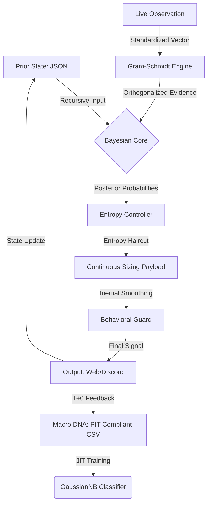

# Architecture Design Document: QQQ Monitor (v12.0 Orthogonal-Core)

This document details the **V12.0 Bayesian Orthogonal Factor Architecture**, which evolves the system from a general probabilistic engine to a high-fidelity, macro-orthogonal inference system.

---

## 1. System Philosophy: Orthogonal Reality & Information Honesty

The v12.0 design is centered on two pillars:
1.  **Physical Orthogonality**: Ensuring each macro factor represents a distinct, non-redundant dimension of the global economy (Discount, Real Economy, Sentiment).
2.  **Information Honesty**: Acknowledging the inherent uncertainty in high-dimensional macro spaces. The system prioritizes **Shannon Entropy** as a first-class citizen to prevent "Spurious Confidence" caused by collinear factors.

## 2. Component Responsibility Matrix

| Layer | Component | Responsibility |
| :--- | :--- | :--- |
| **Inference** | `src/engine/v11/` | **The Brain**. Recursive Bayesian inference, JIT GaussianNB training, and **Orthogonalization Engine**. |
| **Ingestion** | `src/collector/` | **The Sensors**. Multi-source data fetching (FRED, yf, Shiller) with strict **PIT (Point-in-Time) Lag Alignment**. |
| **Seeding** | `ProbabilitySeeder` | **Factor Engineering**. 10-factor orthogonal matrix generation with **Gram-Schmidt post-processing** for MOVE-Spread decoupling. |
| **Storage** | `src/store/` | **The Memory**. Managing local DNA (CSV), Prior state (JSON), and Cloud sync (Vercel Blob). |
| **Execution** | `BehavioralGuard` | **The Armor**. Entropy-aware bucket switching and T+1 settlement locks. |

---

## 3. Data Flow: The Orthogonal Bayesian Loop

The v12.0 loop introduces an explicit **Orthogonalization** step to ensure naive Bayesian independence assumptions are physically met.

---

## 4. Core Implementation Mandates (v12.0)

### 4.1 AC-6: PIT (Point-in-Time) Integrity
The engine enforces strict **Lag Alignment Protocols**. Backtests must use data as it was *initially released*, accounting for physical publication delays:
- **Financial Data**: T+1 Business Day lag.
- **Real Economy (Capex)**: Release Date + 30 BDay lag (to immune revision noise).
- **Earnings (Shiller EPS)**: Month-End + 30 BDay lag.

### 4.2 AC-8: The 10-Factor Orthogonal Matrix
Factors are organized into three non-overlapping layers:
1.  **Discount (贴现层)**: Real Yield, Treasury Realized Vol (MOVE proxy), Breakeven Accel.
2.  **Real Economy (实体层)**: Core Capex Momentum, Copper/Gold ROC, USD/JPY (Carry Trade).
3.  **Sentiment (情绪层)**: Credit Spread (Level/Pulse), Net Liquidity, ERP (TTM-based).

### 4.3 AC-10: Gram-Schmidt Orthogonalization Engine
To satisfy the GaussianNB assumption of conditional independence, the system performs an online **Gram-Schmidt** process. For example, `move_21d` is orthogonalized against `spread_21d` using an expanding-window regression, extracting the residual as the unique "Volatility" signal.

### 4.4 Information Honesty (Entropy Pricing)
As dimensions increase to 10, the probability space becomes sparser. v12.0 embraces higher **Shannon Entropy (H)** (0.15 - 0.40) as a sign of model honesty. The positioning rule remains:

`target_beta = raw_target_beta * exp(-H)`

### 4.5 Numerical Consistency (Standardized Scales)
All factors are normalized using **Expanding Z-scores** or **Rolling Z-scores** with a strict `clip=[-8, 8]` to prevent outliers from distorting the covariance matrix.

---

## 5. Persistence & Cloud Bridge (Stateless Resilience)
The system remains **Stateless** and CI/CD-native:
1. **Pull**: Sync PIT DNA and Prior State from Vercel Blob.
2. **Run**: Execute v12.0 inference with orthogonalized sensors.
3. **Push**: Update state and audit logs.

Audit logs now include `orthogonal_residual` and `moving_beta` for post-run forensic analysis.

---
© 2026 QQQ Entropy Architecture Group.
