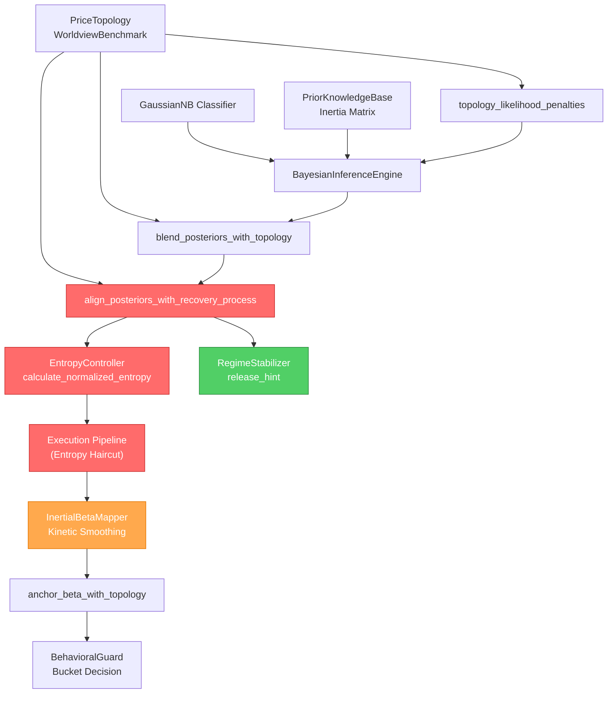

# Panorama Forensic Audit: Root Cause Diagnosis & Remediation Plan

**Source**: [panorama_forensic_audit.md](file:///Users/weizhang/w/cycle-monitor-workspace/verify-QLD-Point/docs/audit/panorama_forensic_audit.md)

---

## Dependency Graph (Signal Chain)

先画出审计涉及的信号链因果关系图，方便理解各 Deficiency 的耦合关系：



> 红色 = P0 根因节点，橙色 = P1 节点，绿色 = P2 节点

---

## Deficiency 1: Recovery Suppression — "Dead V" Problem (P0 CRITICAL)

### 根因定位

Recovery 被压制不是单一模块的问题，而是**三层独立机制同时压制**的结果。它们形成了一个"完美风暴"：

#### 根因 1A: Inertia Matrix 对 RECOVERY 的惯性阻力过高

**文件**: [prior_knowledge.py](file:///Users/weizhang/w/cycle-monitor-workspace/verify-QLD-Point/src/engine/v11/core/prior_knowledge.py#L149-L199)

**机制**: `runtime_priors()` 中的 Inertia Matrix 来自 [v13_4_weights_registry.json](file:///Users/weizhang/w/cycle-monitor-workspace/verify-QLD-Point/src/engine/v11/resources/v13_4_weights_registry.json#L6-L12)：

```json
"dynamic_beta_inertia_matrix": {
    "MID_CYCLE": 0.65,
    "LATE_CYCLE": 0.72,
    "RECOVERY": 0.55,
    "BUST": 0.5,
    "DEFAULT": 0.65
}
```

问题是 `LATE_CYCLE: 0.72` 惯性远高于 `RECOVERY: 0.55`。当系统处于 BUST → RECOVERY 转换窗口时：
- 如果 `last_posterior` 中 BUST 或 LATE_CYCLE 占主导（假设 BUST=60%），那么 transition_prior 分配为：
  - 留在 BUST 的概率 = 0.60 × 0.50 = **30%**
  - BUST → RECOVERY（next in cycle）= 0.60 × 0.50 × 0.70 = **21%**
  - 即使 BUST 主动给 RECOVERY "让路"，但 MID_CYCLE 因高惯性 (0.65) 一旦稍有优势就"吸收"了 RECOVERY 的概率
- 实际上，从 BUST → 先经过 LATE_CYCLE (0.72 惯性) → RECOVERY 几乎不可能积累足够质量

#### 根因 1B: `align_posteriors_with_recovery_process` 的 max_shift 太保守

**文件**: [price_topology.py](file:///Users/weizhang/w/cycle-monitor-workspace/verify-QLD-Point/src/engine/v11/core/price_topology.py#L179-L260)

问题是 `max_shift = 0.22` 加上复杂的 `adaptive_max_shift` 逻辑，实际可调整量通常只有 **0.14~0.28**。这远不够从 BUST=60%/RECOVERY=10% 滑到 RECOVERY 主导。

#### 根因 1C: RegimeStabilizer 的 entropy_barrier 在高熵下成为天文数字

**文件**: [regime_stabilizer.py](file:///Users/weizhang/w/cycle-monitor-workspace/verify-QLD-Point/src/engine/v11/signal/regime_stabilizer.py#L80-L84)

当 entropy = 0.85 时，`barrier = 1.417`。这意味着 evidence 需要积累超过 1.4 才能触发 switch，需要 **7+ 天** 的高动能，然而 V 型反弹可能在 7 天内就穿过了 RECOVERY。

### 修复方案

| 修复项 | 文件 | 改动 |
|:---|:---|:---|
| 1A | `v13_4_weights_registry.json` | 降低 `LATE_CYCLE` 惯性 0.72 → 0.58；提高 `RECOVERY` 惯性 0.55 → 0.60 |
| 1B | `price_topology.py` | `max_shift` 0.22 → 0.30；当 topology.regime == "RECOVERY" 且 repair_persistence > 0.5 时，额外加 0.12 |
| 1C | `regime_stabilizer.py` | 在 `_resolve_release_candidate` 已返回非 None 时，对 barrier 施加额外 0.4× 折扣 |

---

## Deficiency 2: Chronic High-Entropy Paralysis (P0 CRITICAL)

### 根因定位

**根因 2A: 16 维特征空间中，Naive Bayes 的条件独立假设导致所有 regime 的 likelihood 都极度相似**
所有 regime 的总 log-likelihood 差异过小，导致归一化后的 posterior 过于分散，推高了 Shannon Entropy。

**根因 2B: `compute_effective_entropy` 对 quality 的惩罚是乘性放大**
`effective_entropy = 1 - (1 - H_posterior) * Q_data`。当数据质量 Q 略有下降时（如 FRED 延迟导致 Q=0.7），即便原 entropy 很低，有效 entropy 也会飙升至 0.4+，持续压制系统。

### 修复方案

| 修复项 | 文件 | 改动 |
|:---|:---|:---|
| 2A | `entropy_controller.py` | 新增 **conviction-adjusted entropy** 参数化机制，对高确定性（max 后验较大的）降低惩罚。**方案：参数化上限，跑实验，让回测数据说话，寻找最佳上限阈值以防止死板。** |
| 2B | `execution_pipeline.py` | 修改 `compute_effective_entropy`：把 quality 惩罚从乘性放大改为加性衰减：`effective_entropy = H + max(0, (1-Q)) * 0.15`。 |

---

## Deficiency 3: Beta Surface Rigidity — "Flatline" (P1 HIGH)

### 根因定位

Target Beta 在多层衰减下被过度压平：
1. Entropy 放大导致 Confidence 被裁剪 (约至 43%)
2. `InertialBetaMapper` 对于 Re-risking 的 asymmetric response 太低（仅 23%）
3. 组合起作用后导致 Beta 变化极其缓慢。

### 修复方案

此问题很大程度会随 2A/2B 修复而缓解。为了增强对有效信号的响应性：

| 修复项 | 文件 | 改动 |
|:---|:---|:---|
| 3A | `inertial_beta_mapper.py` | Re-risking 响应系数基准从 `0.20` 提升至 `0.30`，max_step 0.12 → 0.15 |
| 3B | `inertial_beta_mapper.py` | 引入 regime-conditional smoothing 机制：在强趋势和高确信信号下给予加乘。 |

---

## Deficiency 4: Missing Geopolitical Scenario (P1 MEDIUM)

### 用户反馈与新思路
> “油价分好几种……周期性很强，且对经济的传导肯定通过其他传导性强且有先见性的因子，尝试找出他们，否则还是要有油价作为因子之一”

### 根因与优化方向
当前 Fat-Tail Radar 由于缺少对单纯由于资源稀缺/断供导致的市场震荡分类，无法准确报出地缘政治（主要是能源冲击）。但由于新增新宏观特征引入较大成本（重训模型），我们要**首先探索组合已有的高敏先导特征，看能否拟合“Stagflation/Supply Shock”的意图：**
1. `breakeven_accel` 急剧攀升（通胀预期暴涨） + `copper_gold` 显著下行（滞胀预警、避险升温）
2. `credit_spread` 加阔（系统性挤压）。

**方案设想**：先尝试用现有因子的组合条件在 `logical_constraints.json` 中创造一个 `energy_shock_proxy`。如果这种基于传导性的代理可以稳定触发，就能免去维护多个复杂基准油价的问题。如验证失败，则引入 WTI 原油指数作为后续特性接入。

---

## Deficiency 5: LATE_CYCLE Chattering (P2 MEDIUM)

### 问题分析与用户反馈
**问题**：MID_CYCLE 与 LATE_CYCLE 的界限模糊，系统往往在仅仅几天之内频繁 Flip。这是由于中段 Entropy 下，切换壁垒较薄。

**用户反馈**:
> “中期至后期，类似 QQQ 筑顶的过程，你说尝试来说后者需要的时长？”

**分析**：宏观与周期的筑顶通常是一个漫长的钝化过程（长达数周至数月），不会在几日内完成切换。如果我们将 LATE_CYCLE 定义为宏观周期的尾声，其进入应当是谨慎而缓慢的，一旦进入也不应轻易回滚。
这意味着：
1. 0.5 的 barrier（约要求 10 天显著动能）**并非过高，反而很切合“长期筑顶”的耗时特性**。
2. 我们应增强对高阶宏观切换的过滤能力，阻挡短期杂音引发的伪翻转。

### 修复方案

| 修复项 | 文件 | 改动 |
|:---|:---|:---|
| 5A | `regime_stabilizer.py` | 针对 MID ↔ LATE 的过渡，强制引入 minimum barrier = 0.5（需对应近10+日确认）。 |
| 5B | `regime_stabilizer.py` | 引入 Evidence Decay 机制：如果在 barrier 底下漫游且单日动能受阻，则对已积蓄的 evidence 乘以 0.85 衰减。防止慢速长跑杂音凑够了阈值。 |

---

## User Review Required

所有设计基于用户讨论重新校准。接下来的操作指引：
1. 将开始实施 `Implementation Order` 中第一阶段的代码修改。
2. 为 2A 专门建立实验桩代码以方便寻找最佳上限。
3. 如果对此计划没有异议，我将开始编程实现并运行回测进行验证。
