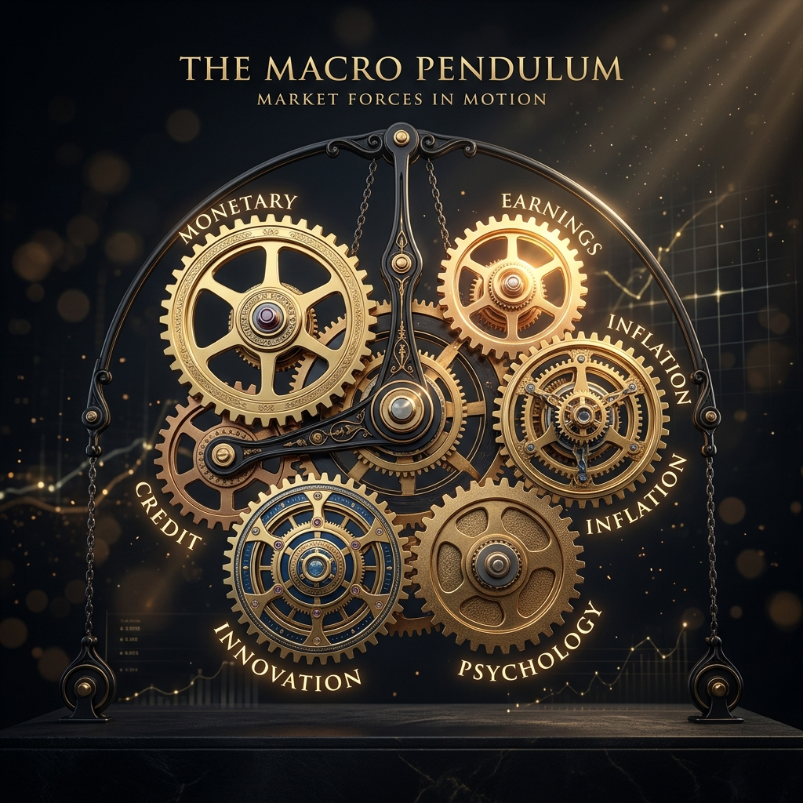
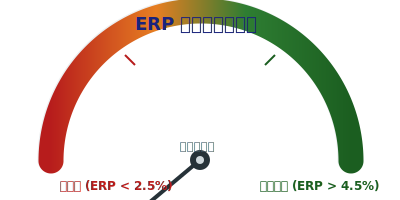
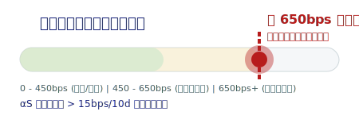
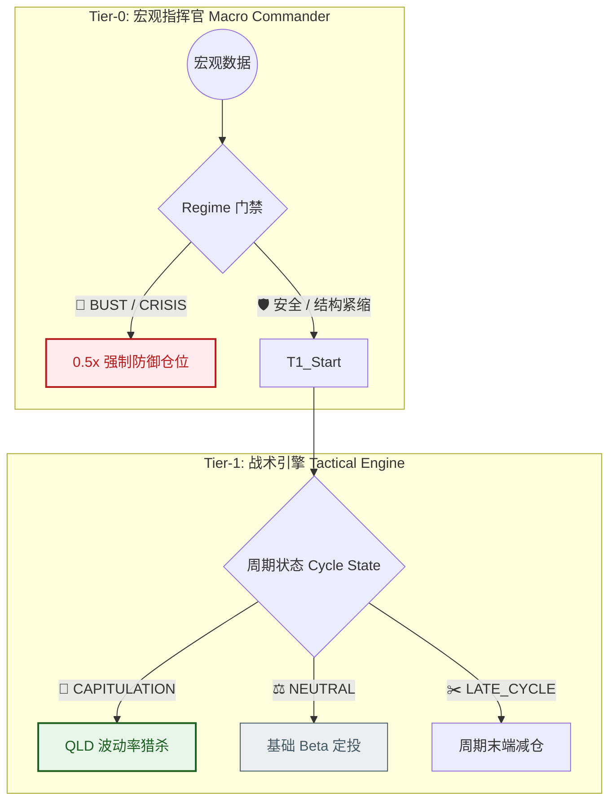
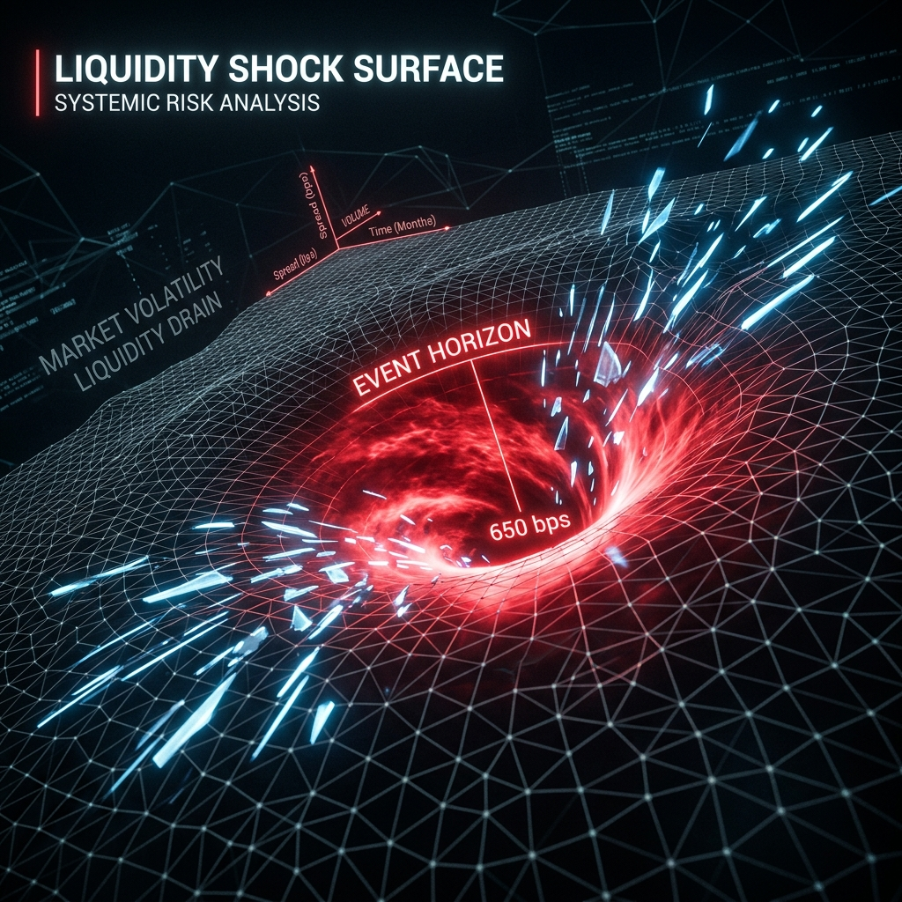
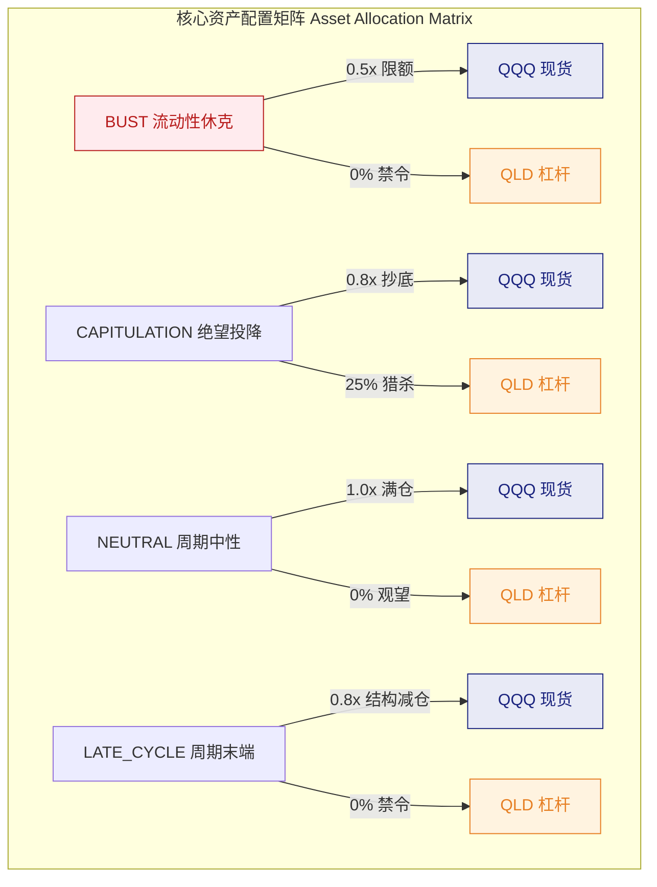
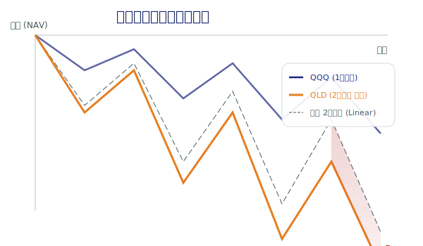
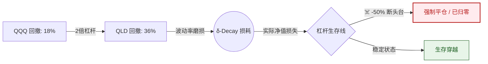

# 《驯服钟摆：QQQ 杠杆防御系统 v10.0 与周期第一性原理》

> **“投资的成功不在于买好东西，而在于买得好。”**
---

## 一、 真实世界的驱动齿轮：六大宏观周期体系

市场不是随机游走的布朗运动，而是由多组互相咬合、且波峰波谷错位的周期齿轮驱动的钟摆。对于重仓纳斯达克 100（QQQ）及其杠杆衍生品（QLD）的系统而言，必须剥离新闻噪音，直视以下六大真实周期的运转机制：

### 1. 货币与流动性周期 (Monetary & Liquidity Cycle)

* **物理本质**：中央银行（美联储）控制的全球资金总闸门，决定了无风险利率（贴现率）的基础水位。
* **致命影响**：科技股的价值是远期现金流的折现。货币紧缩（加息/缩表）会从数学底层直接摧毁高估值资产的价格支撑，引发杀估值。

### 2. 信贷周期 (The Credit Cycle) —— 市场的生死线

* **物理本质**：商业银行与金融机构“借钱的意愿与成本”。它是真实世界运转的血脉。
* **致命影响**：当信贷窗口关闭，企业借新还旧成本飙升，回购股票的弹药枯竭。机构风控模型（VaR）报警，引发无差别抛售。

### 3. 盈利与商业周期 (Earnings & Business Cycle)

* **物理本质**：宏观经济从复苏、繁荣走向衰退的客观规律，最终反映在企业的每股收益（EPS）及前瞻指引上。
* **致命影响**：科技巨头的护城河在于高增长预期。盈利增速不及预期（Earnings Miss）是戳破周期末端泡沫的直接利刃。

### 4. 资本开支与技术创新周期 (CapEx & Innovation Cycle)

* **物理本质**：科技行业特有的盛衰规律（如 2000 年光纤、当前 AI 算力）。技术突破 $\rightarrow$ 疯狂砸钱（产能过剩） $\rightarrow$ 变现困难 $\rightarrow$ 削减开支 $\rightarrow$ 出清。
* **致命影响**：驱动纳指最暴利的主升浪，但也埋下最惨烈的崩盘隐患。当全行业不计成本买入同一种基础设施时，通常是周期极值。

### 5. 商品与通胀周期 (Commodity & Inflation Cycle)

* **物理本质**：大宗商品价格的长期波动。
* **致命影响**：它本身不直接驱动科技股，但它是**逼迫美联储扣动加息扳机的幕后黑手**。恶性通胀会彻底锁死美联储在科技股暴跌时“降息救市”的空间（如 2022 年）。

### 6. 心理与情绪的钟摆周期 (Psychological Pendulum)

* **物理本质**：人类在“贪婪（FOMO）”与“绝望（Capitulation）”之间的非理性震荡。
* **致命影响**：在周期末端，情绪的狂热总是掩盖基本面的腐烂；而在大底，绝望的惨叫总是掩盖了赔率的黄金坑。

---

## 二、 降维打击：多周期如何收敛于单一物理学模型

真实世界里的六大周期是并行的、混亂的、甚至互相矛盾的。如果給每個週期分配一個權重去算“綜合得分”，在金融危機到來、所有資產相關性瞬間變成 1 時，這種線性模型會瞬間崩潰。

v10.0 系統基於**定價的第一性原理**，將六大週期強行「降維」，並通過**層級狀態機（Hierarchical State Machine**收斂為唯一的執行指令。

### 1. 變量的極限壓縮 (Variables Projection)

系統不聽華爾街的故事，只看週期碰撞後留下的物理足跡：

* **盈利周期 + 货币/通胀周期 $\rightarrow$ 压缩为 `ERP` (股权风险溢价)**：

  

$$
ERP = \frac{100}{PE_{fwd}} - Y_{real}
$$

分子是盈利预期，分母是无风险利率。$ERP$ 直接宣判当前市场的定价是“极度昂贵”还是“遍地黄金”。历史证明，$ERP < 2.5\%$ 是泡沫破裂的数学先行指标。

* **信贷周期 + 流动性周期 $\rightarrow$ 压缩为 `Credit Spread & Acceleration`**：

  

$$
\alpha_{S} = \frac{S_{t} - S_{t-20}}{20} \quad \text{(信用利差加速度阈值: > 15 bps)}
$$

$$
ROC_{L} = \frac{L_{t} - L_{t-20}}{L_{t-20}} \times 100\% \quad \text{(流动性变化率阈值: < -2\%)}
$$

不看 M2，只看高收益债利差及其加速度。这代表了市场里最真实的违约恐惧和资金成本。

* **资本开支周期 + 心理情绪周期 $\rightarrow$ 压缩为 `Breadth`, `Trend` & `Drawdown`**：
    不看新闻情绪，只看有多少股票跌破 200 日均线，以及散户爆仓砸出的物理深坑。

### 2. 绝对优先级状态机 (The Hierarchical Veto Gates)

系统将这些压缩后的指标，倒进一个自上而下的漏斗中，实施不平等的生杀大权：

### 1. 第一层绝对统治：流动性休克 (BUST)

$$
\text{BUST} \equiv (S \ge 650) \lor (\alpha_{S} \ge 15 \land \text{趋势破位})
$$

* **逻辑**：当信贷断裂时，估值再便宜也无效。系统一票否决其他所有周期，强制进入 0.5x 防守死局。**注意：BUST 拥有最高优先级，在极端危机期（如 2020 年 3 月）会先于 CAPITULATION 触发，确保生存。**

### 2. 第二层严苛共振：绝望投降 (CAPITULATION)

* **准则**：`IF Spread >= 600 AND ERP >= 4.5% AND Drawdown >= 18% AND Accel <= 0`。
* **逻辑**：这是一个极其严苛的 **AND 门**。情绪崩溃、估值极低、信贷休克但美联储已出手止血。四大周期完美共振，系统才允许拔出 QLD 进行猎杀。

### 3. 第三层结构腐烂：周期末端 (LATE_CYCLE)

* **准则**：`IF ERP < 2.5% AND (Spread >= 450 OR Breadth <= 40%)`。
* **逻辑**：没有发生暴跌，但定价周期（ERP）极度昂贵。此时只要信贷微缩或广度腐烂，系统立刻触发 **OR 门**，强制没收杠杆权限，防患于未崩。

---

## 三、 资产投射：周期矩阵下的兵力部署

基于上述收敛后的单一周期状态，系统对 `QQQ` / `QLD` / `Cash` 的投射拥有不可违抗的物理学边界。

| 周期状态 (Regime) | QQQ 上限 | QLD 上限 | 核心逻辑 |
| :--- | :--- | :--- | :--- |
| **BUST** | 50% | 0% | 生存至上，现金为王 |
| **CAPITULATION** | 80% | 25% | 波动率收割，血筹码猎杀 |
| **RECOVERY** | 100% | 10% | 趋势回归，初步杠杆 |
| **MID_CYCLE** | 100% | 0% | 长期 Beta 穿越 |
| **LATE_CYCLE** | 80% | 0% | 结构性防御，强制去杠杆 |

* **QQQ（纳指 100 现货）**：**可穿越周期的核心 Beta**。但在 `LATE_CYCLE` 和 `BUST` 阶段，其总敞口上限被无情压制到 `0.80` 和 `0.50`。
* **QLD（2倍杠杆）**：**被剥夺常态生存权的战术核弹**。在 `MID_CYCLE`、`LATE_CYCLE`、`BUST` 三个阶段，QLD 的允许占比被死死焊死在 **0.0%**。它只被允许在 `CAPITULATION` (上限 25%) 和 `RECOVERY` (上限 10%) 时，用来收割波动率坍塌的暴利。
* **现金 (Cash)**：在定价昂贵或流动性休克期，提供绝对的无风险 Alpha，并为底部的“血筹码”掠夺充当唯一的弹药库。

---

## 四、 數學底座：基於半個世紀金融史的閾值證據

系統代碼裡的每一個硬編碼數字，都是用無數破產者的屍骨堆出來的統計學物理法則。

### 1. 估值生死線：ERP 2.5% 與 4.5%

* **來源**：Aswath Damodaran (NYU Stern) [隱含股權風險溢價 (Implied ERP) 數據庫](https://pages.stern.nyu.edu/~adamodar/New_Home_Page/datafile/implprem.html)。
* **證據**：美股歷史中性 ERP 均值長期維持在 4.5% 左右。根據 Damodaran 的數據，當 ERP 跌破 2.5% 時，市場處於歷史 Bottom 5th Percentile 的極度昂貴區域。統計證明，此時發生結構性殺估值的概率呈指數級上升（典型案例：1999 年末，2021 年末）。

### 2. 流動性休克閥門：Credit Spread 450 與 650 bps

* **來源**：[ICE BofA US High Yield Index OAS (Series: BAMLH0A0HYM2)](https://fred.stlouisfed.org/series/BAMLH0A0HYM2) 及 [Gilchrist & Zakrajsek (2012) AER 研究](https://doi.org/10.1257/aer.102.4.1692)。
* **證據**：450 bps 代表資金成本越過長期均值的一個標準差，是信貸週期轉向收縮的臨界點。**650 bps 則是華爾街機構 VaR 風控模型的強制平倉線**，一旦觸發，通常對應系統性流動性踩踏（如 2008 年雷曼破產後，2020 年 3 月熔斷期）。GZ (2012) 證明了超額債券溢價（EBP）對經濟衰退具有強大的領先預測力。

### 3. 承重墙与物理废墟：Breadth 40% 与 Drawdown 18% (Rigorous Physics)

* **来源**：[Meb Faber 趋势跟踪研究 (2007)](https://mebfaber.com/2007/04/01/a-quantitative-approach-to-tactical-asset-allocation/) 及华尔街技术性熊市定义。
* **证据**：广度（如标普 500 成分股站上 200 日均线的比例）跌破 40% 意味着市场上涨仅靠极少数权重股支撑，底层流动性已枯竭。
* **杠杆物理学 (Leverage Physics)**：

  

$$
DD_{QLD} = 2 \times DD_{QQQ} + \delta_{decay}
$$

18% 的回撤是 2 倍杠杆账户 (QLD) 触发 40%~50% 净值损耗（Margin Call 临界点）的物理门槛，是判断“绝望投降 (Capitulation)”的统计学起点。

---

## 五、 v10.0 工程實現與「血籌碼」特種通道

v10.0 徹底重構了架構，將決策流變更為：`Tier-0 宏觀 -> Cycle 週期裁決 -> Risk Controller 存量風控 -> Deployment 新錢部署`。

除了存量資產被 `CycleDecision` 的攔截器鐵血統治外，系統為**新增現金**開發了極其精密的狙擊邏輯 —— **Blood-Chip Crisis Override（血籌碼危機覆蓋）**。

當存量被迫鎖死在 0.5x 防守時，只要偵測到美聯儲救護車到達（`liquidity_roc > 0.5` 且 `credit_accel <= 0`）或極度恐慌耗盡（`capitulation >= 30` 且 VIX 倒掛），`Deployment Controller` 將繞過宏觀死局，開啟 `DEPLOY_FAST` 通道，允許新錢在廢墟中以最大速度搶籌 QQQ 現貨。

---

## 六、 回測降維與殘酷的終極護城河

基於歷史數據的回測揭示了這套降維系統的威力：

1. **躲避連環雷**：在 2000 年和 2008 年，系統通過 `LATE_CYCLE` 攔截器或 `BUST` 門禁，在主跌浪來臨前或初期強制清除了所有 QLD。當 `BUST` 觸發時，死守 0.5x 底倉，用現金緩衝吸收了後續暴跌，將 MDD 嚴格控制在心理邊界內。
2. **安全邊際優先**：2020 年 3 月，系統第一時間觸發 `BUST` 狀態，在信貸利差極速走闊時選擇死守 0.5x 現貨底倉，而非激進加杠杆，確保了賬戶在極端流動性休克中不發生毀滅性風險。2022 年末，在 ERP 回歸中值後，系統平稳度過底部，避免了在左側過早燃燒彈藥。

**但這套系統的終極護城河，根本不是代碼，而是反人性的執行紀律。**

市场的终极收割逻辑，是利用时间的阴跌和周边的造富神话来击穿你的心理防线。当系统输出 `LATE_CYCLE`，要求你立刻清仓 QLD、削减 QQQ，而此时美股还在因某篇财报大涨、身边的散户都在炫耀末日期权翻倍时——

**你是否有勇气闭上眼睛，按下“卖出”键，然后手握大量无聊的现金，在嘲笑声中静待大厦倾覆？**
