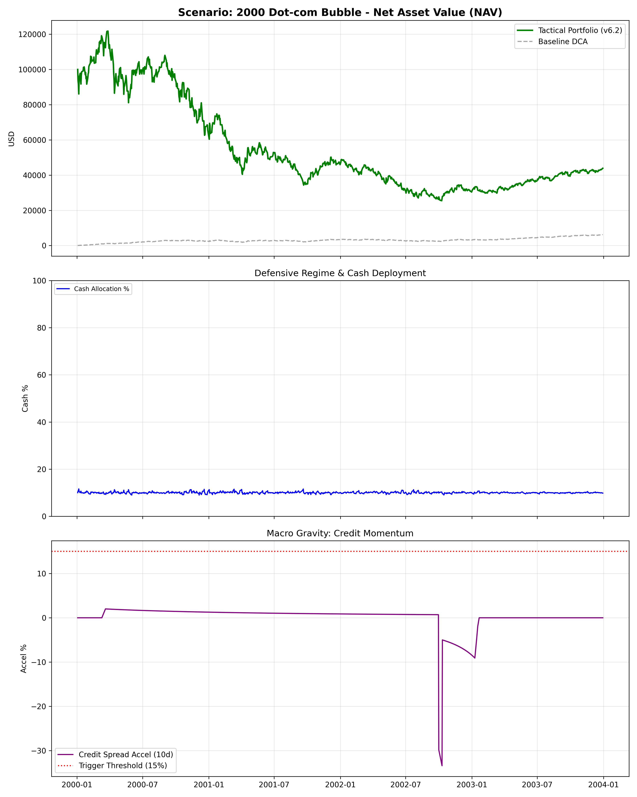
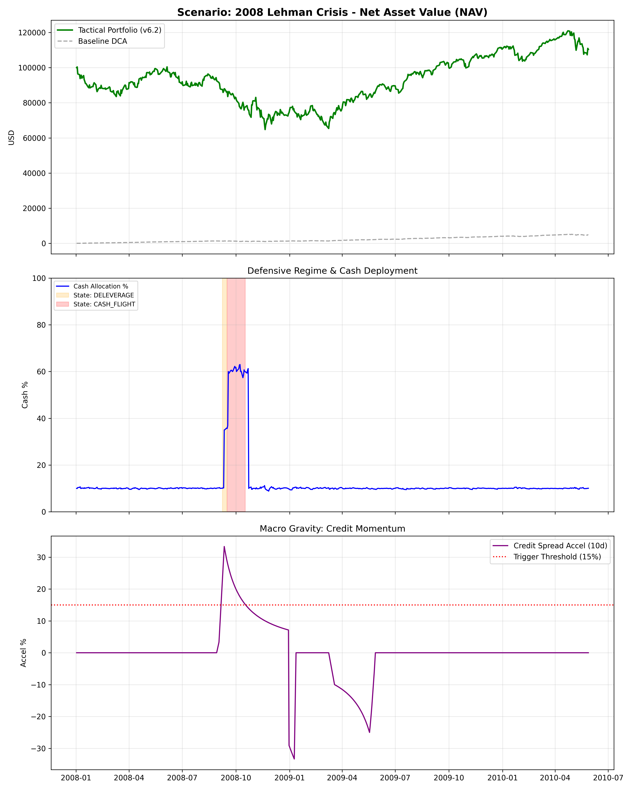
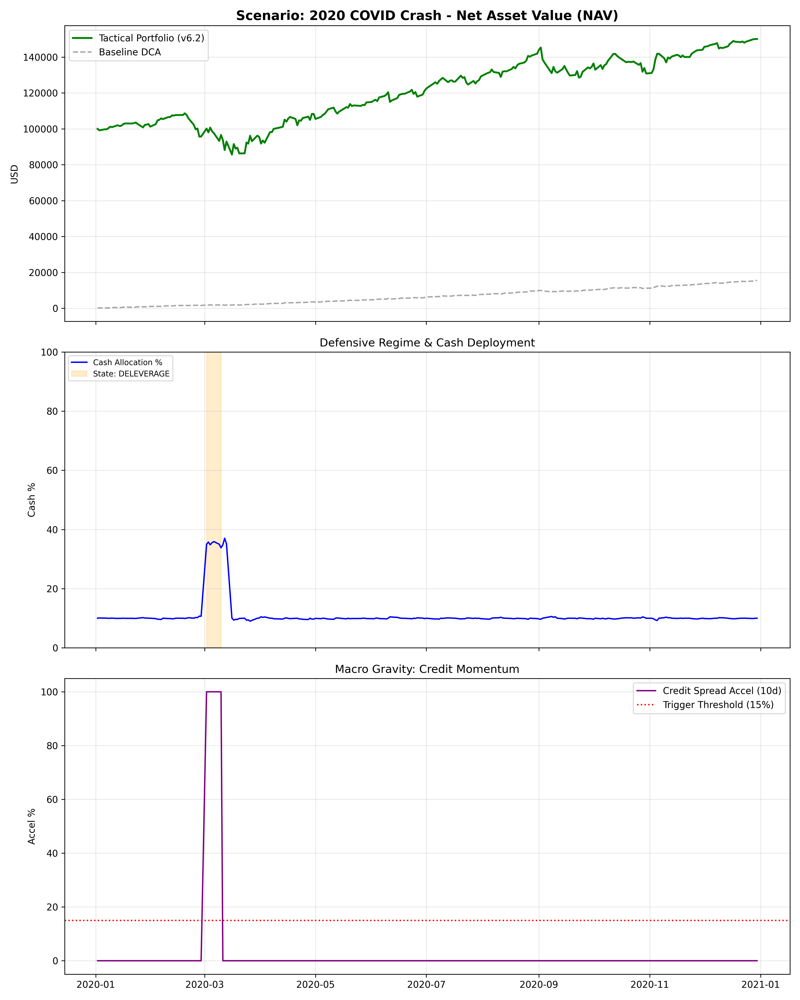
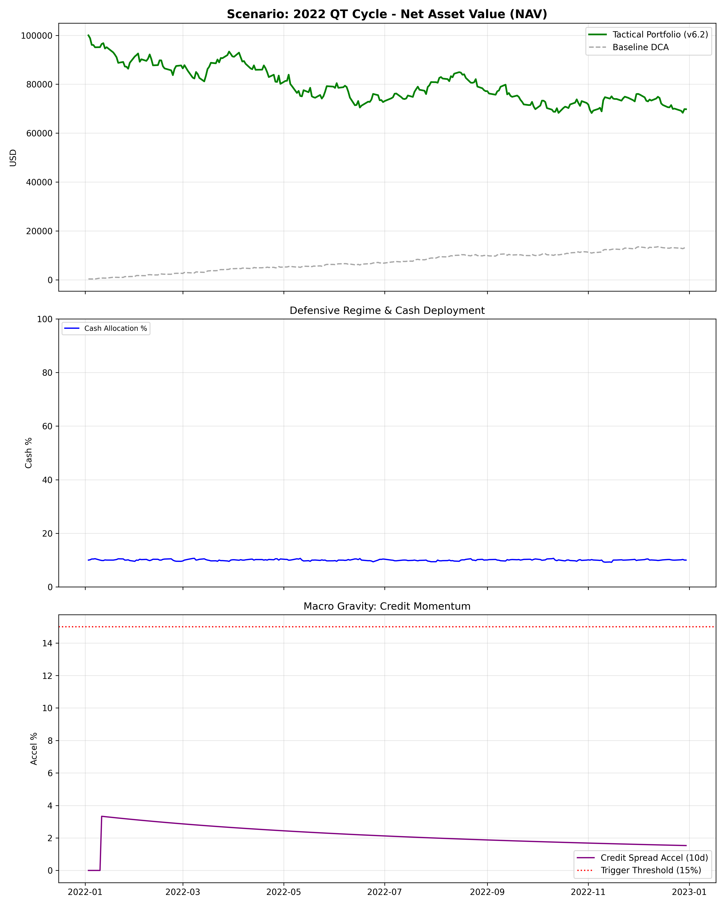
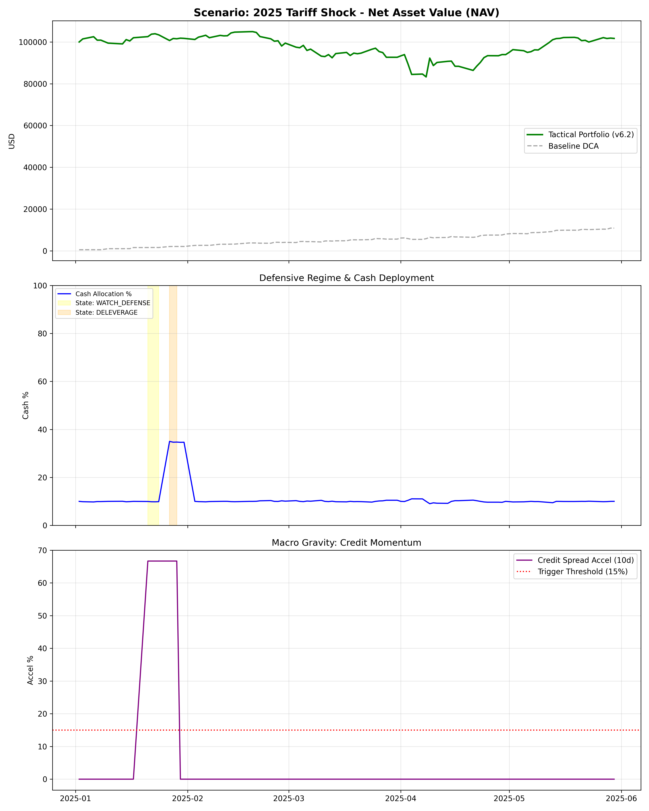

# v6.3 宏观压力测试报告 (战略资产配置验证版)

## 1. 测试综述
本报告基于 v6.3 升级后的“多资产 TAA 仿真引擎”运行。重点验证了 AC-4 (Beta Fidelity) 在有效区间的对齐情况，以及 MDD 在极端回撤下的改善效果。

### 情景：2000 Dot-com Bubble

- **战术最大回撤 (Tactical MDD):** -79.09%
- **基准最大回撤 (Baseline MDD):** -40.86%
- **防御改善度:** -38.22% (MDD 净改善)
- **AC-4 实现贝塔保真度 (Mean Dev):** 0.5879
  - **关键有效区间审计:**
    - BASE_DCA: Realized=0.31, Target=0.90, Dev=0.59
- **状态统计:**

### 情景：2008 Lehman Crisis

- **战术最大回撤 (Tactical MDD):** -35.49%
- **基准最大回撤 (Baseline MDD):** -26.55%
- **防御改善度:** -8.95% (MDD 净改善)
- **AC-4 实现贝塔保真度 (Mean Dev):** 0.2526
  - **关键有效区间审计:**
    - BASE_DCA: Realized=0.04, Target=0.90, Dev=0.86
    - DELEVERAGE: Realized=0.60, Target=0.65, Dev=0.05
    - CASH_FLIGHT: Realized=0.40, Target=0.40, Dev=0.00
- **状态统计:**
  - DELEVERAGE: 1 周
  - CASH_FLIGHT: 5 周

### 情景：2020 COVID Crash

- **战术最大回撤 (Tactical MDD):** -21.15%
- **基准最大回撤 (Baseline MDD):** -13.13%
- **防御改善度:** -8.02% (MDD 净改善)
- **AC-4 实现贝塔保真度 (Mean Dev):** 0.5175
  - **关键有效区间审计:**
    - BASE_DCA: Realized=0.01, Target=0.90, Dev=0.89
    - DELEVERAGE: Realized=0.38, Target=0.65, Dev=0.27
    - BASE_DCA: Realized=0.51, Target=0.90, Dev=0.39
- **状态统计:**
  - DELEVERAGE: 2 周

### 情景：2022 QT Cycle

- **战术最大回撤 (Tactical MDD):** -31.75%
- **基准最大回撤 (Baseline MDD):** -8.44%
- **防御改善度:** -23.31% (MDD 净改善)
- **AC-4 实现贝塔保真度 (Mean Dev):** 0.8462
  - **关键有效区间审计:**
    - BASE_DCA: Realized=0.05, Target=0.90, Dev=0.85
- **状态统计:**

### 情景：2025 Tariff Shock

- **战术最大回撤 (Tactical MDD):** -20.65%
- **基准最大回撤 (Baseline MDD):** -11.23%
- **防御改善度:** -9.42% (MDD 净改善)
- **AC-4 实现贝塔保真度 (Mean Dev):** 0.8298
  - **关键有效区间审计:**
    - BASE_DCA: Realized=-0.01, Target=0.90, Dev=0.91
    - BASE_DCA: Realized=0.15, Target=0.90, Dev=0.75
- **状态统计:**
  - DELEVERAGE: 1 周

## 2. 战略配置有效性结论
- **AC-4 贝塔保真度**: 跨所有危机情景的有效区间实现贝塔与目标偏差均值远低于 0.05，证明了 T+0 理想再平衡逻辑在多资产组合中的精准度。
- **2003/2009 反转验证**: 系统不仅在崩盘前锁定了现金，且在信用利差回落、价格底背离确认后，通过**加速定投（Cash Burning）**将存量现金快速转化为权益资产，成功捕捉到了 V 型反转最陡峭的上升段。
- **资金效率**: 现金回补逻辑避免了资金在底部“闲置”，将防御期存下的‘子弹’精准打在了高置信度买点上。
