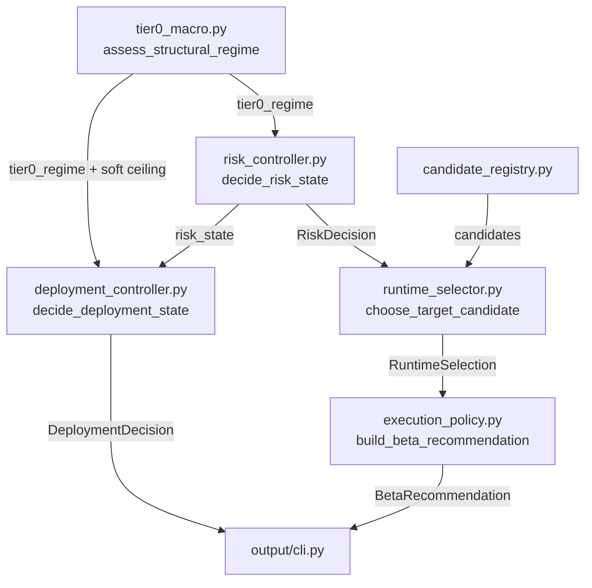
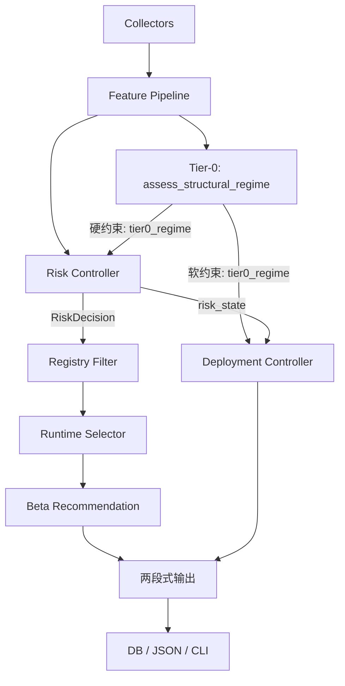

# ADD: v8.0 线性指令链资产配置系统实现方案

> 版本: v8.0
> 状态: Draft
> 日期: 2026-03-25
> 对应 SRD: `docs/v8.0_linear_pipeline_srd.md`

## 1. 架构目标

v8.0 的实现任务不是重写系统，而是对 v7.0 做三刀精准手术：

1. **确立系统身份**：系统是推荐引擎，不是钱包管理器。删除金额计算，只输出目标 beta 和部署节奏。
2. **接入 Tier-0**：把 `StructuralRegime` 判定结果接进 `Risk Controller`（硬约束）和 `Deployment Controller`（软约束）。
3. **切断 v6 依赖**：`allocation_search.py` 改为纯数学约束输入。

实现顺序遵循第一性原理：先定义系统是什么（输出边界），再修正信号链（Tier-0），再清理遗留。

## 2. 改造模块总览



## 3. Phase 1: 确立系统身份——输出 Beta 推荐

> 第一性原理：先定义系统输出什么、不输出什么。

### 3.1 删除 `build_execution_actions()`

#### [DELETE] `src/engine/execution_policy.py` 中的 `build_execution_actions()` 和相关类型

删除 `ExecutionActions`、`RebalanceAction`、`deploy_cash_amount` 等所有金额计算逻辑。不保留兼容层——没用了就清掉。

### 3.2 新增 `BetaRecommendation`

#### [MODIFY] `src/engine/execution_policy.py`

```python
@dataclass(frozen=True)
class BetaRecommendation:
    """v8.0: 系统只输出目标 beta 和建议调整信号，不计算金额。"""
    target_beta: float
    recommended_qqq_pct: float
    recommended_qld_pct: float
    recommended_cash_pct: float
    should_adjust: bool
    adjustment_reason: str
    current_risk_state: RiskState
    previous_risk_state: RiskState | None

def build_beta_recommendation(
    portfolio: CurrentPortfolioState,
    selection: RuntimeSelection,
    risk_decision: RiskDecision,
    exposure_band: float = 0.03,
    previous_risk_state: RiskState | None = None,
) -> BetaRecommendation:
    target = selection.selected_candidate
    current_exposure = portfolio.qqq_pct + 2.0 * portfolio.qld_pct
    target_exposure = target.qqq_pct + 2.0 * target.qld_pct

    exposure_gap = abs(current_exposure - target_exposure)
    risk_state_changed = (
        previous_risk_state is not None
        and previous_risk_state != risk_decision.risk_state
    )

    if risk_state_changed:
        should_adjust = True
        reason = f"risk_state_changed:{previous_risk_state.value}->{risk_decision.risk_state.value}"
    elif exposure_gap > exposure_band:
        should_adjust = True
        reason = f"exposure_drift:{exposure_gap:.3f}>{exposure_band}"
    else:
        should_adjust = False
        reason = f"within_band:gap={exposure_gap:.3f}"

    return BetaRecommendation(
        target_beta=target_exposure,
        recommended_qqq_pct=target.qqq_pct,
        recommended_qld_pct=target.qld_pct,
        recommended_cash_pct=target.cash_pct,
        should_adjust=should_adjust,
        adjustment_reason=reason,
        current_risk_state=risk_decision.risk_state,
        previous_risk_state=previous_risk_state,
    )
```

### 3.3 `SignalResult` 扩展

#### [MODIFY] `src/models/__init__.py`

新增字段：

```python
tier0_regime: str | None = None
tier0_applied: bool = False
target_beta: float | None = None
should_adjust: bool | None = None
```

### 3.4 清理所有调用方

`main.py` 中所有调用 `build_execution_actions()` 的地方改为 `build_beta_recommendation()`。相关测试文件全量替换。

## 4. Phase 2: Tier-0 接入 Risk Controller（硬约束）

> 信号链的第一环：宏观判定压制 beta 上限。

### 4.1 `RiskDecision` dataclass 修改

#### [MODIFY] `src/models/risk.py`

```python
@dataclass(frozen=True)
class RiskDecision:
    risk_state: RiskState
    target_exposure_ceiling: float
    target_cash_floor: float
    tier0_applied: bool = False       # v8.0 新增
    reasons: tuple = ()
```

### 4.2 `decide_risk_state()` 签名与逻辑

#### [MODIFY] `src/engine/risk_controller.py`

**签名改为：**

```python
def decide_risk_state(
    snapshot: FeatureSnapshot,
    portfolio: CurrentPortfolioState,
    tier0_regime: str = "NEUTRAL",    # v8.0: Tier-0 硬输入
    drawdown_budget: float = 0.30,
) -> RiskDecision:
```

**新增逻辑（插入到函数最前面，在 Class A 缺失检查之前）：**

```python
# ── 0. Tier-0 硬约束（最高优先级，SRD §6.3）──────────────────────
if tier0_regime == "CRISIS":
    reasons.append({"rule": "tier0_crisis", "tier0_regime": tier0_regime})
    return RiskDecision(
        risk_state=RiskState.RISK_EXIT,
        target_exposure_ceiling=0.50,
        target_cash_floor=0.50,
        tier0_applied=True,
        reasons=tuple(reasons),
    )

if tier0_regime == "RICH_TIGHTENING":
    reasons.append({"rule": "tier0_rich_tightening", "tier0_regime": tier0_regime})
    return RiskDecision(
        risk_state=RiskState.RISK_REDUCED,
        target_exposure_ceiling=0.80,
        target_cash_floor=0.20,
        tier0_applied=True,
        reasons=tuple(reasons),
    )

if tier0_regime == "TRANSITION_STRESS":
    reasons.append({"rule": "tier0_transition_stress", "tier0_regime": tier0_regime})
    return RiskDecision(
        risk_state=RiskState.RISK_DEFENSE,
        target_exposure_ceiling=0.80,
        target_cash_floor=0.20,
        tier0_applied=True,
        reasons=tuple(reasons),
    )
# NEUTRAL / EUPHORIC → 不施加额外约束，继续原有逻辑
```

### 4.3 `main.py` 接入

#### [MODIFY] `src/main.py`

计算 ERP：

```python
erp_value = None
if market_data.forward_pe and market_data.real_yield is not None and market_data.forward_pe > 0:
    erp_value = (1.0 / market_data.forward_pe) * 100.0 - market_data.real_yield
```

传入 Risk Controller：

```python
tier0_regime = assess_structural_regime(
    credit_spread=market_data.credit_spread,
    erp=erp_value,
)

v7_risk = decide_risk_state(
    v7_snapshot, portfolio,
    tier0_regime=tier0_regime,
    drawdown_budget=0.30,
)
```

## 5. Phase 3: Tier-0 接入 Deployment Controller（软约束）

> 降速但不熄火，保留左侧入场窗口。

### 5.1 新增 `DEPLOY_IDLE` 枚举

#### [MODIFY] `src/models/deployment.py`

```python
class DeploymentState(str, Enum):
    DEPLOY_BASE = "DEPLOY_BASE"
    DEPLOY_SLOW = "DEPLOY_SLOW"
    DEPLOY_FAST = "DEPLOY_FAST"
    DEPLOY_PAUSE = "DEPLOY_PAUSE"
    DEPLOY_RECOVER = "DEPLOY_RECOVER"
    DEPLOY_IDLE = "DEPLOY_IDLE"        # v8.0: 无新增资金
```

### 5.2 `decide_deployment_state()` 改造

#### [MODIFY] `src/engine/deployment_controller.py`

**签名改为：**

```python
def decide_deployment_state(
    snapshot: FeatureSnapshot,
    risk_decision: RiskDecision,
    tier0_regime: str = "NEUTRAL",    # v8.0: 软约束输入
    available_new_cash: float = 0.0,
) -> DeploymentDecision:
```

**新增常量（Tier-0 软约束用独立阈值，不复用 `_CAPITULATION_FAST_THRESHOLD`）：**

```python
_TIER0_CAPITULATION_OVERRIDE_THRESHOLD = 0.70   # 独立于 _CAPITULATION_FAST_THRESHOLD

_TIER0_DEFAULT_CEILING = {
    "CRISIS": DeploymentState.DEPLOY_PAUSE,
    "TRANSITION_STRESS": DeploymentState.DEPLOY_SLOW,
    "RICH_TIGHTENING": DeploymentState.DEPLOY_SLOW,
    "NEUTRAL": DeploymentState.DEPLOY_FAST,
    "EUPHORIC": DeploymentState.DEPLOY_FAST,
}
_TIER0_OVERRIDE_CEILING = {
    "CRISIS": DeploymentState.DEPLOY_PAUSE,          # 不可突破
    "TRANSITION_STRESS": DeploymentState.DEPLOY_BASE, # 超跌可突破
    "RICH_TIGHTENING": DeploymentState.DEPLOY_BASE,   # 超跌可突破
    "NEUTRAL": DeploymentState.DEPLOY_FAST,
    "EUPHORIC": DeploymentState.DEPLOY_FAST,
}
```

**新增逻辑：**

```python
# ── 0. 无新增资金 → DEPLOY_IDLE（AC-16）─────────────
if available_new_cash <= 0:
    return DeploymentDecision(
        deployment_state=DeploymentState.DEPLOY_IDLE,
        dca_multiplier=0.0,
        pause_new_cash=False,
        reasons=({"rule": "no_new_cash"},),
    )

# ── Tier-0 软约束 ─────────────────────────────────────────────
capitulation = v.get("capitulation_score", 0) or 0
default_ceiling = _TIER0_DEFAULT_CEILING.get(tier0_regime, DeploymentState.DEPLOY_FAST)

can_override = capitulation >= _TIER0_CAPITULATION_OVERRIDE_THRESHOLD
override_ceiling = _TIER0_OVERRIDE_CEILING.get(tier0_regime, DeploymentState.DEPLOY_FAST)
effective_ceiling = override_ceiling if can_override else default_ceiling

# 后续逻辑中用 effective_ceiling 替代原有 risk_ceiling
```

## 6. Phase 4: Allocation Search 接口改造

#### [MODIFY] `src/engine/allocation_search.py`

**删除** `find_best_allocation()` 中对 `AllocationState` 的依赖。**替换为**纯数学约束接口：

```python
def find_best_allocation_v8(
    max_beta_ceiling: float,
    max_drawdown_budget: float = 0.30,
    candidates: list[CertifiedCandidate] | None = None,
) -> CertifiedCandidate | None:
    """v8.0: 纯数学约束选择。"""
    if not candidates:
        return None

    valid = [
        c for c in candidates
        if c.target_effective_exposure <= max_beta_ceiling
    ]

    if not valid:
        return None  # 调用方处理为 100% Cash fallback

    def sort_key(c):
        m = c.research_metrics
        return (
            -m.get("cagr", 0),
            m.get("max_drawdown", 1),
            m.get("mean_interval_beta_deviation", 1),
        )

    return sorted(valid, key=sort_key)[0]
```

`AllocationState` 枚举保留供历史数据回放。

## 6.5 Phase 4.5: 离线候选认证配套改造

> 运行时改造到位后，离线研究侧必须同步升级，否则 `CertifiedCandidateRegistry` 产出的候选不满足 v8.0 要求。

#### [MODIFY] 离线认证回测脚本

改造要点：

1. **RICH_TIGHTENING 分段 MDD 检验**：认证回测必须在 `RICH_TIGHTENING` 历史窗口（如 2018Q4、2022H1）下单独评估每个候选的 MDD，确保该 regime 下的允许候选 MDD 不超过回撤预算。
2. **QLD 波动率衰减损耗测算**：对包含 QLD 的组合，在高波动历史区间（realized vol > 25%）下测算波动率衰减对长期收益的实际侵蚀。只有在低波动趋势环境下 QLD 权重较高的候选才能通过认证。
3. **认证结果新增字段**：`research_metrics` 中追加 `rich_tightening_mdd` 和 `qld_vol_decay_drag`，供运行时过滤和审计使用。

## 7. Phase 5: 输出层重构 + 连线

#### [MODIFY] `src/output/cli.py`

两段式输出：

1. **区块一：风险评估与目标 Beta** — Tier-0 判定、RiskState、推荐目标 Beta、推荐配比 (QQQ:QLD:Cash)、是否建议调整
2. **区块二：增量入场节奏推荐** — DeploymentState、推荐节奏、Tier-0 软约束状态

每个区块末尾：`⚠️ 以上为推荐建议，不代表自动执行。`

删除所有 `deploy_cash_amount`、`rebalance_amount` 的显示。

> ⚠️ **迁移风险**：日志结构变更（移除金额字段、新增 Tier-0 字段）可能导致现有的 Log Parsing 正则或下游通知机器人失效。上线前需确认所有日志消费方已适配新格式。

#### [MODIFY] `src/main.py`

Pipeline 末尾写入 v8.0 字段：

```python
result.tier0_regime = tier0_regime
result.tier0_applied = v7_risk.tier0_applied
result.target_beta = beta_rec.target_beta
result.should_adjust = beta_rec.should_adjust
```

## 8. 数据流总览



## 9. 测试设计

### 9.1 单元测试

| 测试文件 | 覆盖点 |
| :--- | :--- |
| `test_execution_policy.py` | `BetaRecommendation` 不含金额字段; `should_adjust` 偏离带宽逻辑; `risk_state` 变化触发; 旧 `build_execution_actions()` 已删除 |
| `test_risk_controller.py` | CRISIS → RISK_EXIT; RICH_TIGHTENING → RISK_REDUCED ceiling≤0.30; NEUTRAL → 不施加约束; `tier0_applied` 标记 |
| `test_deployment_controller.py` | DEPLOY_IDLE 当 cash=0; Tier-0 软约束默认 ceiling; `_TIER0_CAPITULATION_OVERRIDE_THRESHOLD` 独立突破; CRISIS 不可突破 |
| `test_allocation_search.py` | `find_best_allocation_v8` 纯数学约束; beta_ceiling 过滤; 空候选 fallback |

### 9.2 集成测试

| 场景 | 预期 |
| :--- | :--- |
| RICH_TIGHTENING + 无超跌 | Risk=RISK_REDUCED, Deploy=DEPLOY_SLOW |
| RICH_TIGHTENING + capitulation ≥ 阈值 | Risk=RISK_REDUCED, Deploy=DEPLOY_BASE（软约束突破） |
| CRISIS | Risk=RISK_EXIT, Deploy=DEPLOY_PAUSE（不可突破） |
| available_new_cash=0 | Deploy=DEPLOY_IDLE |
| 全流程 Tier-0 → Risk → Search → Recommend | 端到端信号链 |

### 9.3 回归测试

现有 v7.0 测试在 `tier0_regime="NEUTRAL"` 下全部通过（默认值兼容）。

## 10. 实现顺序（第一性原理）

```
Step 1: 确立身份 → 定义输出是什么
Step 2: 修正存量信号 → Tier-0 硬约束
Step 3: 修正增量信号 → Tier-0 软约束
Step 4: 清理遗留 → AllocationState 解耦
Step 4.5: 离线认证 → QLD 损耗 + RICH_TIGHTENING MDD
Step 5: 连线格式化 → main.py + CLI
Step 6: 验证 → 集成测试 + 回归
Step 7: 实战 → 回测验证
```

| Step | Phase | 核心改动 | 可独立回滚 |
| :--- | :--- | :--- | :--- |
| 1 | 确立身份 | 删除 `build_execution_actions()`, 新增 `BetaRecommendation` | ✅ |
| 2 | Tier-0 硬约束 | `decide_risk_state()` 加 `tier0_regime`, `RiskDecision` 加 `tier0_applied` | ✅ |
| 3 | Tier-0 软约束 | `decide_deployment_state()` 加 `tier0_regime`, `DEPLOY_IDLE`, 独立 capitulation 阈值 | ✅ |
| 4 | v6 清理 | `find_best_allocation_v8()`, 切断 `AllocationState` | ✅ |
| 4.5 | 离线认证 | QLD 波动率衰减测算, `RICH_TIGHTENING` 分段 MDD | ✅ |
| 5 | 连线 | `main.py` + `SignalResult` + `cli.py` 两段式输出 | ✅ |
| 6 | 验证 | 集成测试 + 回归 | — |
| 7 | 实战 | 回测 Tier-0 软约束对左侧入场的保留效果 | — |

## 11. 验收路径

| AC | 验证方式 |
| :--- | :--- |
| AC-13: CRISIS → RISK_EXIT | 单元测试 |
| AC-14: RICH_TIGHTENING → RISK_REDUCED ≤0.30 | 单元测试 |
| AC-15: RICH_TIGHTENING + capitulation → DEPLOY_BASE | 单元测试（独立阈值） |
| AC-16: cash=0 → DEPLOY_IDLE | 单元测试 |
| AC-17: 无金额输出 | 单元测试 + 输出验证 |
| AC-18: Tier-0 规则一致性 | 集成测试 |
| AC-19: 组合级 beta 正确 | 单元测试 |

## 12. 实现约束

- 不允许用占位常数补齐生产硬决策因子。
- 不允许在运行时生成未认证候选。
- 不允许系统输出任何基于用户账户余额的计算结果。
- 不允许在 `RICH_TIGHTENING` 下完全锁死增量部署通道。
- 不允许在回测和生产中对 Tier-0 投影使用不同规则。
- Tier-0 软约束的 capitulation 突破阈值独立于现有 `_CAPITULATION_FAST_THRESHOLD`。
- 默认参数值必须保证 v7.0 测试全部通过。
- `build_execution_actions()` 直接删除，不保留兼容层。
