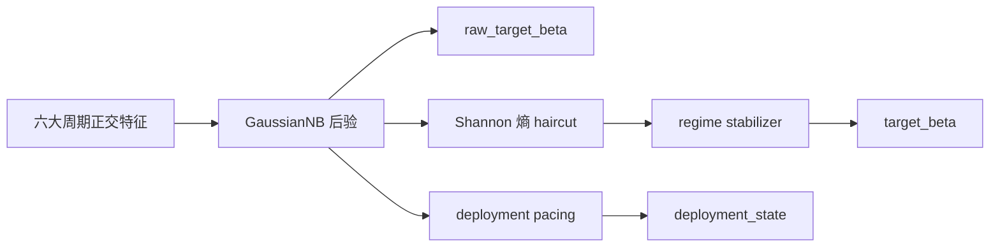
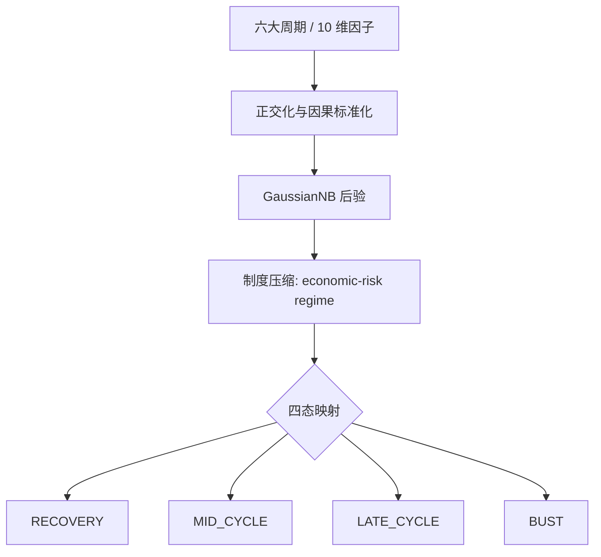
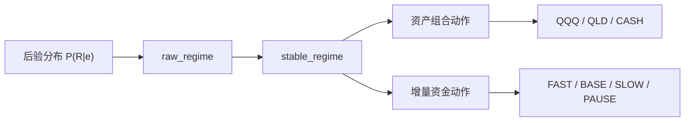
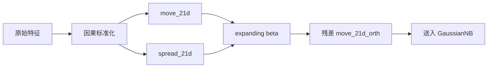
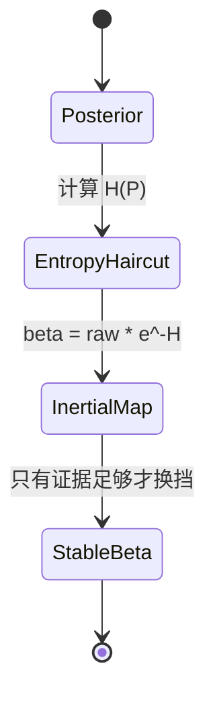
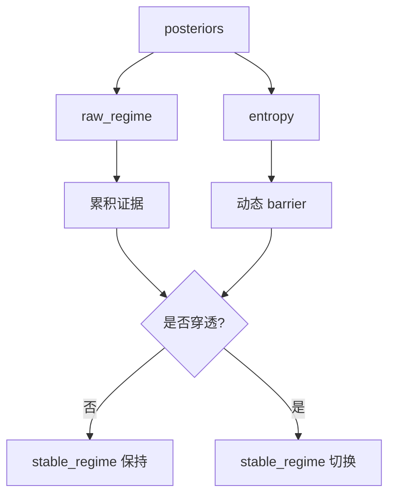
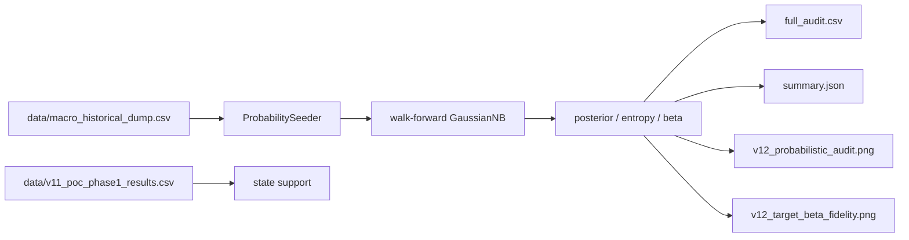
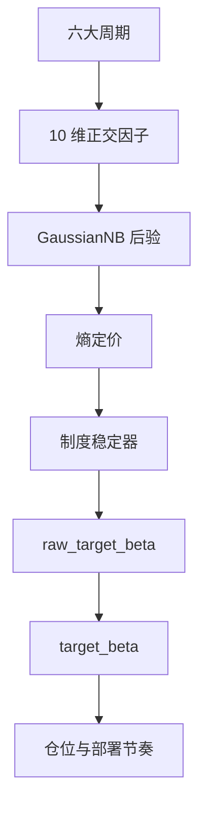
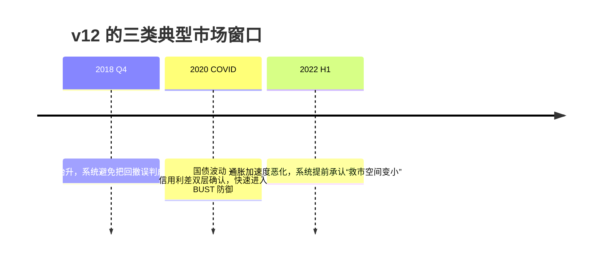

# 逻辑生存：QQQ 决策系统的 v12 正交周期哲学与可视化指挥手册

## “在不确定性的迷雾中，我们不追求神谕，我们只做更诚实的校准。”

QQQ Monitor 的 v12 不再试图把市场压缩成一个“更聪明的单轴判断”。它把自己重构成一套**六大周期的正交观测系统**：既看货币，也看信用；既看通胀，也看实体资本开支；既看商品与风险偏好，也看跨境融资压力。系统的目标不变，但方法更严格：**用互相尽量独立的宏观物理量，去推断当前处在哪一种制度里，并据此调整风险。**

对普通用户来说，可以把它理解为：

- 它不是预测明天涨跌的水晶球。
- 它是一套会自己承认“看不清”的防御型导航仪。
- 当信号清晰时，它会更果断；当信号混杂时，它会自动变保守。

## 阅读路线

1. `0` 决策输出
2. `1` 制度态与四阶段
3. `2` 六大周期与 10 因子
4. `3` 正交化与因果标准化
5. `4` 贝叶斯引擎
6. `5` 回测与诊断
7. `6` 受控 ablation
8. `7` 面向用户的直觉解释
9. `8` 可视化
10. `9` 结语
11. `10` 审计与产物


---

## 0. 三个输出，不是一件事

v12 里有三条不同的决策轨道，它们相关，但不能混为一谈。

1. `raw_target_beta`
2. `target_beta`
3. `deployment_state`

### 它们分别是什么？

- `raw_target_beta` 是**贝叶斯后验期望**，回答“如果不考虑执行摩擦和惯性，系统今天最想要多少 Beta”。
- `target_beta` 是**执行层结果**，回答“考虑熵、惯性和稳定性之后，今天真正应该执行多少 Beta”。
- `deployment_state` 是**新增资金节奏**，回答“新钱该快、慢、停，还是先等等”。

> 通俗版：  
> `raw_target_beta` 是脑子里的想法，`target_beta` 是最终下单，`deployment_state` 是工资和奖金该怎么分批进场。



---

## 1. 制度态先行：系统先压缩状态，再解释周期

v12 的第一件事不是“识别某个指标”，而是判断当前宏观组合属于哪一种**经济-风险制度态**。这一步先于因子、先于熵、也先于仓位。

### 1.1 什么是 regime，为什么不是“另一个因子”

在本文里，`regime` 指的是**经济-风险制度态**。它不是输入变量，也不是单一经济指标，而是系统对“当前宏观物理状态”的**压缩标签**。

系统先看很多原始变量，再问一个更高层的问题：

> “这些变量组合起来，当前更像哪一种经济与风险环境？”

因此，regime 是一个**状态空间**，不是一个数值因子。它的职责是把六大周期里那些彼此相关、但并不完全相同的信号，压缩成可执行的决策形态。

### 1.2 v12 为什么要把很多周期压缩成四个 regime

第一性原理上，QQQ/QLD 不是在交易 GDP 这个抽象概念，而是在交易三件更直接的东西：

1. 估值折现是否变贵
2. 盈利预期是否还在扩张
3. 流动性与信用条件是否允许高贝塔继续存在

对目标资产来说，真正重要的不是“宏观到底有多少个维度”，而是“这些维度最后会不会把组合推向同一种风险动作”。  
如果多个周期最终都会让 QQQ/QLD 做同一件事，例如减杠杆、加现金、停止加码，那么系统就不需要保留太多表层标签，而是要把它们压缩成少数几个可执行制度。

### 1.3 四个 regime 的经济含义

v12 的活跃四态对应四个常讲的经济阶段：

| Regime | 经济阶段 | 直觉含义 | 对 QQQ/QLD 的主要含义 |
| :--- | :--- | :--- | :--- |
| `RECOVERY` | 复苏 / 修复 | 最坏的流动性冲击已经过去，风险偏好开始回归 | 允许重新加码，QLD 可逐步回归，但仍看熵与后验强度 |
| `MID_CYCLE` | 扩张 / 中期平稳 | 经济和盈利仍在扩张，但没有进入过热末端 | QQQ 为主，保持常规 beta；新增资金按 BASE 或 SLOW 处理 |
| `LATE_CYCLE` | 末期 / 衰退前段 | 增长动能衰减，通胀和信用压力开始抬头 | 逐步减弱进攻性，QLD 降权，新增资金放慢 |
| `BUST` | 衰退 / 休克 | 信用和流动性同时恶化，系统性风险优先 | 保护本金，尽量回避 QLD，增量资金通常 PAUSE |

### 1.4 第一性原理：为什么这四态对 QQQ/QLD 足够

QQQ 和 QLD 的收益本质上都来自对同一条链路的放大：

- 贴现率下降时，成长股估值会被抬高
- 盈利扩张时，高贝塔资产更容易放大涨幅
- 流动性松弛、信用平稳时，杠杆产品才有空间发挥
- 一旦信用断裂或真实利率上行，杠杆会反向放大下跌

所以系统不需要先预测“经济学上有多少个不同名词”，而是要先判断：

- 这是可以继续承担风险的阶段吗？
- 还是应该降低风险？
- 是该重新进攻，还是该等下一次修复确认？

这就是 regime 压缩的根本理由。



### 1.5 四阶段下，组合和新钱分别该做什么

系统把“存量组合动作”和“增量资金动作”分开处理，因为它们不是同一个问题。

| Regime | 存量组合应该做什么 | 增量资金应该做什么 | 系统的理解 |
| :--- | :--- | :--- | :--- |
| `RECOVERY` | 允许从防守向进攻切换，QQQ 重新成为主仓，QLD 可逐步试探 | `FAST`，只要后验和熵支持，就把新钱更快地放进去 | 最差阶段已过，赔率开始修复，风险预算可以增加 |
| `MID_CYCLE` | 维持以 QQQ 为主的正常风险暴露，QLD 只在高确信度下使用 | `BASE`，按计划稳步投入，不需要追赶节奏 | 周期正常运行，系统的任务是稳，不是冲 |
| `LATE_CYCLE` | 降低杠杆敏感度，QLD 降权，组合向防守倾斜 | `SLOW`，新钱放慢，保留子弹 | 增长动能衰减，风险回报比变差 |
| `BUST` | 尽量压低风险暴露，保留现金和短久期防守资产 | `PAUSE`，除非后验显著修复，否则不急着加钱 | 信用和流动性同时失稳，首要任务是活下来 |

### 1.6 系统怎么把 regime 变成动作

系统不是直接读“经济学名词”，而是先做三步：

1. 从正交因子得到当天的后验分布
2. 把后验映射成 regime
3. 再把 regime 翻译成 `target_beta` 和 `deployment_state`

这样做的好处是：

- 同一个 regime 在不同年份里，仍然代表同一种风险结构；
- 动作不是靠拍脑袋，而是靠同一套规则反复执行；
- 资产组合和增量资金能各自优化，而不是互相污染。



---

## 2. 从周期到制度态：v12 的宏观骨架

v12 的核心不是“多加几个因子”，而是把市场重新拆成六个互相尽量独立的物理层。每一层都要回答一个独立问题。

### 2.1 六大周期不是六个预测器，而是六个物理轴

| 周期 | 物理问题 | v12 主要因子 | 时间域 | 为什么选它 |
| :--- | :--- | :--- | :--- | :--- |
| 货币周期 | 真实融资成本是在变紧还是变松 | `real_yield_structural_z`, `treasury_vol_21d` | 126d / 21d | 结构利率决定估值底盘，国债波动率负责抓“贴现率失控” |
| 信用周期 | 金融系统的痛感是否在上升 | `spread_21d`, `spread_absolute` | 21d / expanding | 信用利差是风险偏好的直接温度计 |
| 通胀周期 | Fed 还能不能轻松救市 | `breakeven_accel` | 21d acceleration | 通胀预期的“速度”比静态水平更关键 |
| 实体资本开支周期 | 企业是否还在扩张真实产能 | `core_capex_momentum` | monthly delta + expanding z | 资本支出幅度比扩散指数更接近真实经济体量 |
| 商品与全球风险偏好周期 | 全球制造业与恐慌谁占上风 | `copper_gold_roc_126d` | 126d momentum | 铜/金比的变化能抓到实体需求和避险情绪的分叉 |
| 跨境融资周期 | 全球杠杆是否在去化 | `usdjpy_roc_126d` | 126d momentum | 日元套息回撤是全球融资压力的高灵敏代理 |

### 2.2 v12 的 10 因子矩阵

当前锁版的活跃输入向量是 10 维：

| 因子 | 变量本体是什么 | 类型 | 时域 | 作用 |
| :--- | :--- | :--- | :--- | :--- |
| `real_yield_structural_z` | 10 年期 TIPS 真实收益率 `real_yield_10y_pct`，先做 EWMA 再做因果 Z | 结构层级 | 126d / EWMA | 抓真实融资成本的中长期重心 |
| `move_21d` | 10 年期国债收益率 `DGS10` 的 21 日已实现波动率 `treasury_vol_21d` | 贴现率冲击 | 21d / expanding z | 抓国债收益率波动的失控 |
| `breakeven_accel` | 10 年期通胀预期 `breakeven_10y` 的 21 日二阶变化 | 通胀加速度 | 21d acceleration | 抓通胀预期是否在突然升温 |
| `core_capex_momentum` | 美国非国防资本品新订单 `NEWORDER` 的月度变化 `core_capex_mm` | 实体经济动能 | monthly delta / expanding z | 抓企业资本开支是否掉速 |
| `copper_gold_roc_126d` | 铜期货 `HG=F` 与黄金期货 `GC=F` 的比率 `copper_gold_ratio` | 商品动量 | 126d ROC | 抓全球实体需求和避险偏好 |
| `usdjpy_roc_126d` | 美元兑日元汇率 `USDJPY=X` | 跨境融资动量 | 126d ROC | 抓 carry trade 的去杠杆 |
| `spread_21d` | 高收益信用利差 `credit_spread_bps` 的 21 日滚动水平 | 信用脉冲 | 21d rolling | 抓信用压力的短期抬升 |
| `liquidity_252d` | 净流动性 `net_liquidity_usd_bn`，由联储资产负债表派生 | 流动性结构 | 252d rolling | 抓货币环境的年尺度趋势 |
| `erp_absolute` | 股权风险溢价 `erp_ttm_pct`，由 Shiller TTM EPS 与真实利率合成 | 估值锚点 | monthly / expanding z | 抓 ERP 的真实物理高度 |
| `spread_absolute` | 高收益信用利差 `credit_spread_bps` 的绝对历史坐标 | 价格锚点 | expanding z | 抓信用利差的绝对历史坐标 |

### 2.3 为什么要同时保留 level、momentum 和 acceleration

v12 不再相信“单一时点”能描述整个市场。

- **Level** 告诉你当前已经有多紧、多贵、多脆。
- **Momentum** 告诉你这个状态是在加速还是减速。
- **Acceleration** 告诉你拐点是不是正在形成。

简单说：

- Level 像体温计。
- Momentum 像体温变化速度。
- Acceleration 像医生判断病情是否开始失控。

### 2.4 哪些候选因子被计划过，但最终被回测丢弃

v12 在设计期并不是只看这 10 个因子。很多候选项都经过了建模讨论和受控 ablation，最后因为**冗余、滞后、数据不稳或边际收益不足**而被放弃。

| 候选因子 | 最终结论 | 原因 |
| :--- | :--- | :--- |
| `yield_absolute` | 丢弃 | 与 `real_yield_structural_z` 高度共线，相当于对利率轴重复投票 |
| `drawdown_pct` / `drawdown_stress` | 丢弃 | 主要是滞后描述，几乎不提供前瞻信息 |
| DXY | 丢弃 | 对 QQQ 的传导不如 USD/JPY 直接，Carry unwind 的信息密度更低 |
| 欧元区 PMI / IFO | 丢弃 | 与美国制造/景气类因子冗余，不能提供真正正交的新信息 |
| BTP-Bund 利差 | 丢弃 | 数据链不够稳定，且被信用利差层覆盖 |
| 直接使用 JGB 10Y | 丢弃 | 月度和披露频率太低，实战上不如 USD/JPY 有效 |
| 分层硬编码权重 | 丢弃 | 破坏贝叶斯似然的可解释性，本质上是曲线拟合 |
| 分阶段接入因子 | 丢弃 | 会改变协方差结构，导致回测结果不可归因 |

> 通俗版：  
> 不是什么看起来“宏观”的变量都应该进模型。模型要的不是热闹，而是**能独立提供信息的物理量**。

---

## 3. 从制度态到特征：系统如何避免“同一个信号被听两遍”

v11.5 最大的问题不是不够聪明，而是某些因子说的是同一件事。v12 的目标，是尽量让每个因子说不同的话。

### 3.1 Causal Self-Calibrating Normalization

所有输入先做严格因果标准化：

$$
z_t = \frac{x_t - \mu_{\le t}}{\sigma_{\le t} + \epsilon}
$$

这里的意思是：

- 只能使用当天之前的数据；
- 不能让未来信息反向污染今天的尺度；
- 每个因子都在自己的历史语境里说话。

### 3.2 move/spread 的无条件 Gram-Schmidt

v12 最重要的正交化规则，是把 `move_21d` 里和 `spread_21d` 重叠的部分剥掉。

$$
\beta_t = \frac{\mathrm{Cov}_{\le t}(move_z, spread_z)}{\mathrm{Var}_{\le t}(spread_z)}
$$

$$
move^{orth}_t = move_z - \beta_t \cdot spread_z
$$

这不是“相关性高才处理”，而是**永远处理**。原因很简单：

- 相关时，残差会抽出独立信息；
- 不相关时，残差几乎等于原值；
- 所以无条件做，风险最小。

> 通俗版：  
> 这就像两个记者都在讲同一场事故。一个在讲“发生了什么”，另一个在讲“现场有多乱”。如果你不去重，就会误以为自己听到了两份证据，其实只是同一句话换了个说法。



### 3.3 为什么 v12 更诚实，但看起来更“模糊”

正交化之后，后验不会再像 v11.5 那样过度自信。原因不是系统变差，而是系统不再作弊。

- 以前是多个共线因子重复投票。
- 现在是每个因子必须提供独立证据。
- 所以熵会上升，信号会更保守。

这正是 v12 的设计目标：**宁可少说一句，也不要把同一句话说三遍。**

---

## 4. 主引擎：贝叶斯大脑到底在算什么

v12 的核心引擎仍然是递归贝叶斯推断 + GaussianNB + 信息熵定价，但它现在建立在正交输入之上。

### 4.1 每一天，系统先问一个概率问题

对于当天的特征向量 `x_t`，系统会计算每个制度 `R_k` 的似然：

$$
P(x_t \mid R_k) = \prod_i \mathcal{N}(x_{t,i}; \mu_{k,i}, \sigma^2_{k,i})
$$

简单说：

- 每个制度都有自己的“特征指纹中心”；
- 当前观测离哪个中心更近，就更像哪个制度。

### 4.2 递归贝叶斯不是“预测”，而是“带惯性的更新”

真正用于决策的不是孤立当天，而是带上前一日后验的递归版本：

$$
P(R_{k,t} \mid \mathbf{e}_t) = \eta \cdot P(\mathbf{e}_t \mid R_{k,t}) \cdot \sum_j P(R_{k,t} \mid R_{j,t-1}) \cdot P(R_{j,t-1} \mid \mathbf{e}_{t-1})
$$

这里：

- `\eta` 是归一化常数；
- `P(R_{k,t} | R_{j,t-1})` 是制度转移矩阵；
- 它的作用是让系统不可能因为一天噪声就瞬间跳变。

> 通俗版：  
> 这不是“今天看到红灯就立刻怀疑整个城市变了”，而是“如果昨天、前天都在走向同一个方向，今天的新证据就会更容易被接受”。

### 4.3 raw beta 先算，再被熵和惯性修正

系统先做后验加权期望：

$$
\beta_{raw} = \sum_r P(r \mid \mathbf{e}_t)\,\beta_{base}(r)
$$

然后做熵惩罚：

$$
H(P) = -\sum_r p_r \log_2 p_r
$$

$$
\beta_{protected} = \beta_{raw} \cdot e^{-H(P)}
$$

最后再经过惯性映射：

- 如果系统现在已经持有某个 Beta，就不会因为一次小波动立刻翻转；
- 只有证据累积到足够强，才允许切换。

这就是 `raw_target_beta` 与 `target_beta` 必须同时存在的原因。

### 4.4 为什么 entropy 会真的影响仓位

熵高说明后验更接近“我不确定”。

这不是坏事，而是风险控制的起点。系统越不确定，就越不能高举高打。



### 4.5 行为稳定器：为什么稳定制度和 raw 制度会不同

`raw_regime` 是当天最大后验的直接结果，`stable_regime` 则要求“证据穿透”。这能避免高熵日的来回抖动。



### 4.6 新钱节奏：deployment_state 是另一条轨道

新资金的节奏不是仓位 beta。v12 把它拆成独立的 deployment surface：

- `FAST`
- `BASE`
- `SLOW`
- `PAUSE`

这条轨道关注的是“现在适不适合把新钱放进去”，而不是“存量仓位要不要改”。

---

## 5. 回测：v12 为什么要更严格地说真话

v12 的回测不是简单跑一个历史收益曲线，而是一个**因果审计系统**。

### 5.1 正式 diagnostic harness

正式诊断链路由三部分组成：

1. `src/backtest.py`
2. `scripts/run_v12_diagnostics.py`
3. `scripts/run_v12_ablation.py`

它们分别负责：

- 生成 walk-forward 审计；
- 汇总 crisis slice、beta fidelity 和 state support；
- 跑受控 ablation，比对基线和变体。

典型运行顺序如下：

```bash
docker run --rm -v $(pwd):/app -w /app qqq-monitor:py313 python -m src.backtest --evaluation-start 2018-01-01
docker run --rm -v $(pwd):/app -w /app qqq-monitor:py313 python scripts/run_v12_diagnostics.py
docker run --rm -v $(pwd):/app -w /app qqq-monitor:py313 python scripts/run_v12_ablation.py
```

### 5.2 因果审计的规则

每一个交易日 `T`，系统都只能看到 `T` 之前已经公开的数据。

这意味着：

- 不能用事后修正的终值去拟合历史；
- 不能把未来发布的数据泄漏回过去；
- 不能用“结果已经知道了”的心态重建特征。

### 5.3 回测引擎在做什么

核心流程是：

1. 读取 `data/macro_historical_dump.csv`
2. 读取 `data/v11_poc_phase1_results.csv`
3. 用 `ProbabilitySeeder` 生成当前 production contract 对应的正交特征
4. 对每一天做 walk-forward GaussianNB 重新拟合
5. 计算后验、熵、raw beta、stable beta、deployment state
6. 输出 canonical 审计结果到 `artifacts/v14_mainline_audit/` 与 `artifacts/v14_mainline_diagnostics/`



### 5.4 诊断报告看什么

`artifacts/v14_mainline_diagnostics/diagnostic_report.json` 关注的不是单一准确率，而是一组更完整的证据：

- `top1_accuracy`
- `mean_brier`
- `mean_entropy`
- `raw_critical_recall`
- `stable_critical_recall`
- `posterior_alignment`
- `raw_stable_divergence`
- crisis window 逐段表现
- `state_support`
- feature orthogonalization diagnostics

### 5.5 当前已验证结果

当前 production contract 的锁版结果是：

| 指标 | 结果 |
| :--- | :--- |
| `top1_accuracy` | `68.31%` |
| `stable_accuracy` | `67.70%` |
| `mean_brier` | `0.4582` |
| `mean_entropy` | `0.5892` |
| `lock_incidence` | `0.00%` |
| `stable_critical_recall` | `82.15%` |
| `raw_critical_recall` | `82.15%` |
| `mean_true_regime_probability` | `0.5436` |
| `mean_true_regime_rank` | `1.4452` |

这意味着：

- 主链现在不是“高墒瘫痪”，而是一个有明确边界的 4-state posterior engine；
- 它在 `MID_CYCLE` 与 `LATE_CYCLE` 已经具备可用判别力；
- 真正还需要继续打磨的是 turning points，尤其是 `BUST` 和 `RECOVERY`。

> 通俗版：  
> 现在的 v11/v12 主链不再是“装作很确定”的系统；  
> 它会在该保守时保守，但不会再因为 floor 或 smoothing 把长期 `QQQ` 核心仓位压碎。

### 5.5.1 回测结果图


### 5.6 危机切片的真实表现

| 窗口 | 行数 | raw critical recall | stable critical recall | 说明 |
| :--- | :--- | :--- | :--- | :--- |
| `2018Q4` | 66 | `0.9848` | `0.9848` | 回撤期能稳定识别压力，但不会硬造连续 BUST |
| `2020_COVID` | 54 | `1.0000` | `1.0000` | 极端流动性冲击下仍能快速切入防御 |
| `2022_H1` | 129 | `0.8837` | `0.8760` | 通胀紧缩期能较早识别结构恶化 |

---

## 6. 受控 ablation：哪些改动真的有用，哪些只是幻觉

v12 的改进不是“感觉更好”，而是通过受控 ablation 逐项验证的。

### 6.1 已接受的默认改动

最终接受并进入当前基线的修改包括：

- `GaussianNB var_smoothing` 从 `1e-2` 调到 `1e-4`
- `core_capex_momentum` 使用 `ewma_span=3`
- 默认 posterior mode 切到 `classifier_only`
- active runtime topology 清理为 4-state，`CAPITULATION` 只保留为旧负载兼容别名
- active production factor contract 收缩到 `10` 维，移除 `pmi_momentum` 和 `labor_slack`

### 6.2 为什么这些改动被接受

- `var_smoothing=1e-4` 比更大的值更能保持区分度，同时没有把数值稳定性推到危险区。
- `core_capex_momentum` 先平滑再扩张，能减少月度噪声的误导。
- `classifier_only` 比 runtime reweight 更少引入额外主观先验，后验更诚实。
- topology 清理让系统和标签空间一致，避免“看到了一个训练集中根本不存在的状态”。
- `pmi_momentum` / `labor_slack` 在修正后的 QQQ-cycle holdout 上没有增量贡献，因此按 KISS 原则从 active contract 移除。

### 6.3 被拒绝的控制项

这些变体在回测里没有跨窗口稳定收益，因此被放弃：

| 变体 | 结论 | 原因 |
| :--- | :--- | :--- |
| `roc_63d` / `roc_21d` | 拒绝 | accuracy 和 Brier 都明显变差 |
| `move_orth_none` | 拒绝 | 去掉正交化后，重复计数问题变严重 |
| `move_orth_half` | 拒绝作为默认 | 有改善，但不如完整残差化稳健 |
| `clip_12` | 拒绝 | 基本无决定性收益 |
| `var_smoothing=1e-5` / `1e-6` | 拒绝为默认 | Brier 有些许改善，但回报和整体判别并没有稳定提升 |
| `drop_erp_absolute` | 拒绝 | 选择窗很好看，但 `2018+` holdout 准确率和 true-prob 退化，属于过拟合 |
| `qqq_core_6` | 拒绝 | 因子过少，holdout accuracy/Brier/entropy 全面恶化 |

### 6.4 这些 ablation 告诉我们什么

系统不是靠“把参数调得更激进”变好，而是靠：

- 输入更正交；
- 因果更严格；
- 稳定器更诚实；
- 执行层更克制。
- 生产合同更精简，但不是盲目删因子；只有在 holdout 上证明确实冗余的因子才会被移除。

换句话说，v12 的收益来自结构修正，不来自更激进的数值微调。

---

## 7. 给广域用户的一版解释

如果你不是天天盯着宏观数据，也可以这样理解 v12。

### 7.1 它在干什么

它像一个有经验的风险经理：

- 平时看很多指标；
- 但不会因为一个指标跳一下就冲动；
- 只有多个独立方向都变坏时，才会明显降低风险。

### 7.2 为什么要做正交

因为如果两个指标本质上都在讲同一件事，你会误以为自己得到了两份证据。

正交化就是把重复部分剔掉，让模型只听“新信息”。

### 7.3 为什么熵高时要减仓

因为当系统自己都不确定时，最坏的动作不是“猜一个”，而是“把仓位缩小一点，先活下来”。

### 7.4 为什么回测准确率不再像 v11.5 那么漂亮

因为漂亮的准确率未必是真的。v12 把很多虚假的确定性去掉了，所以数字看上去没那么亮眼，但更接近真实世界。

---

## 8. 关键可视化：v12 的心智地图

### 8.1 从宏观到执行



### 8.2 一个简单的时间直觉



---

## 9. 结语：更少的幻觉，更多的生存

v12 的哲学不是“更强的预测”，而是**更严的证据纪律**。

它承认：

- 市场有周期；
- 周期彼此不同频；
- 很多看似不同的指标，其实在重复说同一件事；
- 当信息变差时，系统应该更保守，而不是更自信。

如果你想要的是“在复杂世界里持续生存”，v12 比 v11.5 更接近这个目标。

## “外骨骼不替你判断方向，但它会在风暴里替你守住平衡。”

---

## 10. 审计与产物索引


结构化产物当前保留在：

- `artifacts/v14_mainline_audit/summary.json`
- `artifacts/v14_mainline_audit/full_audit.csv`
- `artifacts/v14_mainline_diagnostics/diagnostic_report.json`
- `artifacts/v14_mainline_diagnostics/crisis_windows.csv`
- `artifacts/v14_mainline_diagnostics/beta_windows.csv`
- `artifacts/v14_mainline_diagnostics/posterior_alignment.csv`

---

© 2026 QQQ Entropy 决策系统开发组
