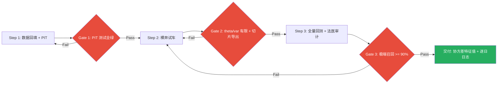
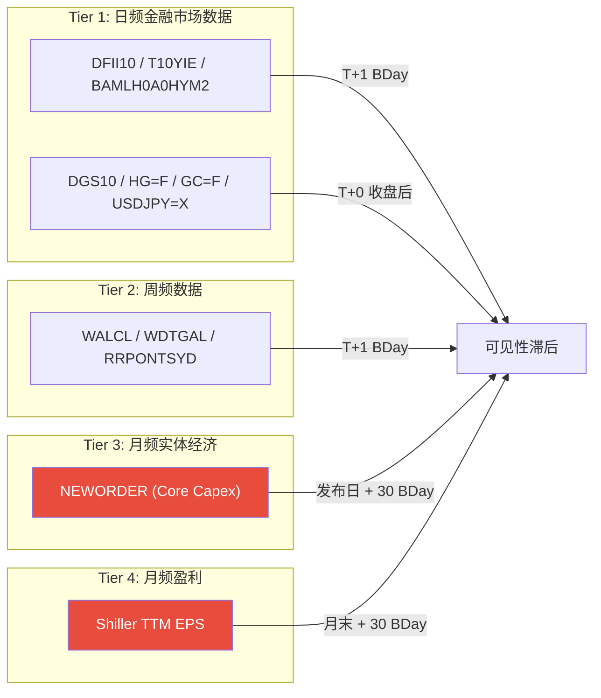

# v12.0 贝叶斯正交因子重构架构规格书 (Locked)

> **版本**: v12.0-SPEC-LOCKED  
> **锁版日期**: 2026-04-01  
> **首席架构师**: Gemini-CLI-Architect  
> **审计专家**: 外部独立审计  
> **状态**: 🔒 架构锁版 (Architecture Sealed)  
> **前序**: v11.5 Probabilistic-Core Convergence

---

## 0. 架构变迁声明

v11.5 完成了从"硬阈值流水线"到"贝叶斯全概率引擎"的进化。但其因子库暴露了严重的**信息近亲繁殖 (Information Inbreeding)** 问题：6 个因子中有 4 个围绕"信用-利率"同一轴线旋转，完全缺失了实体经济、商品通胀和跨境融资压力三个正交维度。

v12.0 的目标是：**在保持贝叶斯推断框架不变的前提下，通过引入具备物理意义且在时域上正交的宏观齿轮，赋予系统真正的全天候视野。**

---

## 1. 设计原则 (Inviolable)

| 编号 | 原则 | 说明 |
| :--- | :--- | :--- |
| **P-0** | 协方差自发现 | GaussianNB 通过历史 DNA 的协方差矩阵自动发现因子解释力。**严禁硬编码层权重。** |
| **P-1** | 先验与似然分离 | 如需主观调整，只能修改先验转移矩阵 (Prior)，严禁篡改似然权重 (Likelihood)。**v12.0 不修改先验。** |
| **P-2** | 因子正交性 | 每个因子必须代表独立的宏观物理维度。共线性因子 (如 `yield_absolute` 与 `real_yield_structural_z`) 必须降维。 |
| **P-3** | 原子切换 | 所有新因子必须一次性接入。分阶段添加因子会在每个阶段产生不同的协方差结构，导致无法归因。 |
| **P-4** | 低频锚高频导 | 月度实体经济数据只取 Level 作为锚点。日频金融数据 (国债已实现波动率/铜金比) 负责捕捉导数 (Momentum/Acceleration)。 |
| **P-5** | 已实现 > 预测 | ERP 的分子必须基于已发生的物理现实 (TTM EPS)，严禁使用华尔街前瞻预测 (Forward PE)。 |
| **P-6** | Point-in-Time 完整性 | 回测中每个交易日 T 只能看到该日期之前已公开发布的数据。严禁使用 FRED 事后修正的终值去计算历史协方差。低频因子必须执行物理发布滞后对齐 (Lag Alignment)。详见 Appendix A。 |
| **P-7** | 熵增诚实性 | 高维正交化必然导致后验概率变得不确定 (0.45-0.55 区间)。系统说"不知道"是信息映射的诚实输出。**严禁为追求清晰信号而回调 `var_smoothing`。** 详见 Appendix B。 |
| **P-8** | NB 独立性预处理 | 朴素贝叶斯假设类别内条件独立。`move_21d` 与 `spread_21d` 在极端危机中高度共线会破坏此假设，导致同一份恐慌信号被似然函数重复计数。**硬性规则**：在 Seeder 计算完 Z-score 后，**无条件**对 `move_21d` 执行 Gram-Schmidt 正交化——用 expanding window 回归 `move_z` 对 `spread_z`，取残差替换原始值。严禁使用任何固定阈值 (如相关性 > 0.8) 做条件触发。当两者不相关时 beta≈0，残差≈原始值，无害；当两者共线时，自动提取独立成分。 |
| **P-9** | 免费数据源约束 | 所有生产和回测使用的数据必须来自免费、公开可访问的数据源。允许的数据源：FRED (API key 免费) / yfinance (股票、ETF、汇率、期货) / Robert Shiller 数据集 (Yale 免费公开)。严禁依赖 Bloomberg、ICE Data Services、S&P Capital IQ 等付费数据源。如果某个指标的原始数据是专有的，必须用免费数据构造等价代理。 |

---

## 2. 因子矩阵 (12 因子 · 三层正交)

### 2.1 全局拓扑

```mermaid
graph TB
    subgraph "Layer 1: 贴现层 Discount"
        direction LR
        R1["real_yield_structural_z<br/>Real Yield 10Y<br/>126d EWMA · Level"]
        M1["move_21d<br/>Treasury Realized Vol<br/>DGS10 21d Std · Level"]
        B1["breakeven_accel<br/>10Y Breakeven<br/>21d Rolling · 二阶导"]
    end

    subgraph "Layer 2: 实体层 Real Economy"
        direction LR
        I1["core_capex_momentum<br/>Core Capex Momentum<br/>NEWORDER M/M Delta · Expanding Z"]
        CG["copper_gold_roc_126d<br/>铜金比<br/>126d · 一阶导"]
        JP["usdjpy_roc_126d<br/>USD/JPY<br/>126d · 一阶导"]
        PM["pmi_momentum<br/>PMI Momentum<br/>MANEMP 21d EWMA · 二阶导"]
        LS["labor_slack<br/>Labor Slack<br/>JTSJOL 21d EWMA · Level"]
    end

    subgraph "Layer 3: 情绪层 Sentiment"
        direction LR
        CS["spread_21d<br/>Credit Spread<br/>21d Rolling · Level"]
        NL["liquidity_252d<br/>Net Liquidity<br/>252d Rolling · Level"]
        EP["erp_absolute<br/>ERP via TTM EPS<br/>Expanding · Level"]
        SA["spread_absolute<br/>Credit Spread<br/>Expanding · Level"]
    end

    R1 & M1 & B1 --> GNB
    I1 & CG & JP & PM & LS --> GNB
    CS & NL & EP & SA --> GNB

    GNB[GaussianNB<br/>正统贝叶斯更新 (Prior x Likelihood)<br/>Tau=3.0 平滑]
    GNB --> POST[后验概率分布]
    POST --> ENT[Shannon 熵 Haircut]
    ENT --> BETA["β_final = E[β|P] · exp(-0.6 * (H_norm * ln(S))^2)"]

    style R1 fill:#e74c3c,color:#fff
    style M1 fill:#e74c3c,color:#fff
    style B1 fill:#e74c3c,color:#fff
    style I1 fill:#27ae60,color:#fff
    style CG fill:#27ae60,color:#fff
    style JP fill:#27ae60,color:#fff
    style PM fill:#27ae60,color:#fff
    style LS fill:#27ae60,color:#fff
    style CS fill:#2980b9,color:#fff
    style NL fill:#2980b9,color:#fff
    style EP fill:#2980b9,color:#fff
    style SA fill:#2980b9,color:#fff
    style GNB fill:#f39c12,color:#fff
```

### 2.2 因子详细规格

| # | 因子 ID | 物理意义 | 源数据列 | 采集方式 | 原始频率 | 时域窗口 | 导数阶 | 标准化 |
| :--- | :--- | :--- | :--- | :--- | :--- | :--- | :--- | :--- |
| 1 | `real_yield_structural_z` | 真实融资成本的结构趋势 | `real_yield_10y_pct` | FRED `DFII10` | 日 | 126d | 0 (Level) | EWMA Z |
| 2 | `move_21d` | 国债收益率已实现波动率：贴现率崩坏的先行哨兵 | `treasury_vol_21d` | FRED `DGS10` → 21d rolling std | 日 | 1 (Raw) | 0 (Level) | **Expanding Z** |
| 3 | `breakeven_accel` | 通胀预期加速度：美联署看跌期权失效探测 | `breakeven_10y` | FRED `T10YIE` | 日 | 21d | **2 (Accel)** | Rolling Z |
| 4 | `core_capex_momentum` | 实体经济动能：资本支出幅度 (Core Capex) | `core_capex_mm` | FRED `NEWORDER` | **月** | 1 (M/M Delta) | 0 (Level) | **Expanding Z** |
| 5 | `copper_gold_roc_126d` | 铜金比动能：全球资本开支 vs 恐慌 | `copper_gold_ratio` | yfinance `HG=F` / `GC=F` | 日 | 126d | 1 (Mom) | Rolling Z |
| 6 | `usdjpy_roc_126d` | 日元套息交易逆转：全球融资压力唯一跨境因子 | `usdjpy` | yfinance `USDJPY=X` | 日 | 126d | 1 (Mom) | Rolling Z |
| 7 | `spread_21d` | 信用利差短期脉冲：BUST 状态机核心 | `credit_spread_bps` | FRED `BAMLH0A0HYM2` | 日 | 21d | 0 (Level) | Rolling Z |
| 8 | `liquidity_252d` | 净流动性结构趋势：货币周期锚 | `net_liquidity_usd_bn` | FRED 多系列衍生 | 周 | 252d | 0 (Level) | Rolling Z |
| 9 | `erp_absolute` | 股权风险溢价 (TTM EPS)：估值地心引力 | `erp_ttm_pct` | Shiller Dataset (Yale) → TTM E/P - Real Yield | 月→日 | 1 (Raw) | 0 (Level) | **Expanding Z** |
| 10 | `spread_absolute` | 信用利差绝对水位：历史自标定锚 | `credit_spread_bps` | FRED `BAMLH0A0HYM2` | 日 | 1 (Raw) | 0 (Level) | **Expanding Z** |
| 11 | `pmi_momentum` | 实体经济扩张速度衰减 | `pmi_proxy_manemp` | FRED `MANEMP` | 月 | 21d EWMA | 2 (Accel) | Rolling Z |
| 12 | `labor_slack` | 劳动力市场松弛拐点 | `job_openings` | FRED `JTSJOL` | 月 | 21d EWMA | 0 (Level) | Rolling Z |

### 2.3 因子−周期映射

```text
贴现层 (Discount)     → 货币周期 + 通胀周期
  ├── Real Yield       : 美联储政策利率的终端影响
  ├── Treasury RVol    : DGS10 收益率的 21 日已实现波动率 → 贴现率假设的恐慌度
  └── Breakeven Accel  : 通胀预期的变化速度 → Fed Put 是否失效

实体层 (Real Economy)  → 基钦库存周期 + 朱格拉资本开支周期 + 跨境融资
  ├── Core Capex Mom.  : 非国防资本品新订单动能 → 企业核心利润的物理先行指标
  ├── Copper/Gold ROC  : 全球实体需求 vs 恐慌避险的比值动能
  └── USD/JPY ROC      : 日元 Carry Trade 平仓 → 全球杠杆解体信号

情绪层 (Sentiment)     → 信用周期 + 流动性周期
  ├── Credit Spread    : 金融系统的"痛感神经"
  ├── Net Liquidity    : 美联储资产负债表的现金流
  ├── ERP (TTM)        : 股票相对于国债的真实性价比
  └── Spread Absolute  : 利差的历史坐标系定位
```

---

## 3. 相比 v11.5 的变更清单

### 3.1 新增因子 (+5)

| 因子 | 填补的周期缺口 | 第一性原理 |
| :--- | :--- | :--- |
| `move_21d` | 贴现层先行预警 | 用 DGS10 的已实现波动率代理 MOVE。国债收益率波动在股市暴跌前 4-6 周先升高 |
| `breakeven_accel` | 通胀周期 | 通胀预期加速上行时，美联储无法降息救市 |
| `core_capex_momentum` | 基钦库存周期 | 纯金额动能。不再使用 ISM 扩散指数，而是通过 Core Capex 的 M/M Delta 锚定资本支出跳水的物理幅度，领先 EPS 下调 3-6 个月 |
| `copper_gold_roc_126d` | 朱格拉资本开支周期 | 铜=全球制造业需求，金=恐慌。比率崩塌=硬着陆 |
| `usdjpy_roc_126d` | 跨境融资压力 | 日元 Carry Trade 是全球杠杆水位的根源。逆转=系统性去杠杆 |

### 3.2 删除因子 (−1)

| 因子 | 删除原因 |
| :--- | :--- |
| `yield_absolute` | 与 `real_yield_structural_z` 共线性极高。在 NB 条件独立假设下等于给"利率轴"加注两倍权重，制造虚假确信度 |

### 3.3 重构因子 (×1)

| 因子 | 变更 | 原因 |
| :--- | :--- | :--- |
| `erp_absolute` | 分子从 `Forward PE` → `Shiller TTM EPS (Yale 免费数据集)` | Forward PE 在周期拐点是致命毒药：分析师线性外推，泡沫破裂初期甚至上调预期。TTM 是已发生的物理现实 |

**ERP 公式变更:**

$$\text{v11.5 (有毒):}\quad ERP = \frac{100}{PE_{forward}} - Y_{real}$$

$$\text{v12.0 (修正):}\quad ERP = \frac{EPS_{TTM,\ SPX}}{Price_{SPX}} - Y_{real}$$

### 3.4 永久否决清单

| 因子 | 否决原因 | 状态 |
| :--- | :--- | :--- |
| `drawdown_pct / drawdown_stress` | 纯滞后噪音，零预测力 | 🔴 代码清除 |
| `yield_absolute` | 与 `real_yield_structural_z` 共线 | 🔴 从 Seeder 删除 |
| DXY 美元指数 | 对 QQQ 的传导不如 USD/JPY 直接；57.6% 权重是欧元，对日元 Carry Trade 的捕捉不如直接用 USDJPY | 🔴 永久否决 |
| 欧元区 PMI / IFO | 与 ISM 相关性 0.7+，冗余。系统目标是 QQQ 防御 | 🔴 永久否决 |
| BTP-Bund 利差 | 数据源不稳定，已被信用利差覆盖 | 🔴 永久否决 |
| JGB 10Y (直接) | 月频太低，被 USD/JPY 日频代理替代 | 🟡 已替代 |
| 分层硬编码权重 | 曲线拟合遮羞布，篡改似然违反贝叶斯正统 | 🔴 永久否决 |
| 分阶段因子接入 | 破坏协方差结构的全局一致性，无法归因 | 🔴 永久否决 |
| WTI/Brent 油价 (Level/ROC) | 与铜金比 ROC 相关性 0.47-0.59 (共线性严重)；供给/需求冲击混合导致方向不稳定；传导路径已被 `breakeven_accel` + `copper_gold_roc` + `spread_21d` 三角覆盖。2022 H1 反证：油涨 +39%、QQQ 跌 -30%、铜金比跌 -16% | 🔴 永久否决 |
| OVX / Oil RVol (作为推断层因子) | 正交性成立 (R²=12.8%) 但无方向性预测力 (Q5 回报反而最高)；条件相关性在利率 regime 间符号翻转 (-0.21 vs +0.32)；GaussianNB 无法处理。保留为 V14 执行层 Meta-Awareness 候选信号 | 🔴 否决进入推断层 |
| GPR 地缘政治风险指数 | 月频 + 每月 10 号发布 = 至少 40 BDay PIT 延迟；传导链终端已被 `spread_21d` + `move_21d` 实时覆盖；对日频防御系统实战价值为零 | 🔴 永久否决 |

---

## 4. 数据架构

### 4.1 新增采集函数 (src/collector/global_macro.py)

| 函数 | 数据源 | 返回 | 降级策略 |
| :--- | :--- | :--- | :--- |
| `fetch_treasury_realized_vol()` | FRED `DGS10` → 21d rolling std | `{value, source, degraded}` | FRED API → CSV fallback |
| `fetch_copper_gold_ratio()` | yfinance `HG=F` / `GC=F` | `{ratio, source, degraded}` | 无合理代理 → degraded |
| `fetch_breakeven_inflation()` | FRED `T10YIE` | `{value, source, degraded}` | FRED API → CSV fallback |
| `fetch_core_capex_momentum()` | FRED `NEWORDER` | `{delta, source, degraded}` | 月度 M/M Delta，季调 |
| `fetch_usdjpy_snapshot()` | yfinance `USDJPY=X` | `{value, source, degraded}` | 无合理代理 → degraded |
| `fetch_shiller_ttm_eps()` | Shiller Dataset (Yale) | `{eps, price, erp, source, degraded}` | 月度 ffill，数据回溯至 1871 |

### 4.2 macro_historical_dump.csv 新增列

```text
treasury_vol_21d    -- 日频, float, DGS10 21d rolling std (MOVE 免费代理)
copper_gold_ratio   -- 日频, float, HG=F 收盘价 / GC=F 收盘价 (向后复权)
breakeven_10y       -- 日频, float, FRED T10YIE
core_capex_mm       -- 月频 ffill, float, NEWORDER (Nondefense Capital Goods) M/M Delta
usdjpy              -- 日频, float, USD/JPY 汇率
erp_ttm_pct         -- 月频 ffill, float, Shiller TTM E/P - Real_Yield
```

### 4.3 Core Capex 月频数据约束

```text
严禁操作:
  ✗ ffill 到日频 → 算 63d Rolling Momentum

允许操作:
  ✓ 取月度原始值的 M/M Delta (在发布日更新) → ffill 到日频 → Expanding Z 标准化
```

**清醒认知**: 彻底放弃了“扩散指数（Breadth）”的物理意义，转向了“资本支出幅度（Magnitude）”。这不是 ISM Spread 的平替，而是 Core Capex 的动能指标。

---

## 5. ProbabilitySeeder 生产配置

```python
class ProbabilitySeeder:
    def __init__(self):
        self.config = {
            # === Layer 1: 贴现层 (Discount) ===
            "real_yield_structural_z": {
                "src": "real_yield_10y_pct",
                "window": 126, "mom": False, "accel": False, "ewma": True,
            },
            "move_21d": {
                "src": "treasury_vol_21d",
                "window": 1, "mom": False, "accel": False, "ewma": False,
                "absolute": True,  # Expanding Z（源列已是 21d rolling std，不能再套 rolling）
                "orthogonalize_against": "spread_21d",  # P-8: 无条件 Gram-Schmidt, expanding window
            },
            "breakeven_accel": {
                "src": "breakeven_10y",
                "window": 21, "mom": False, "accel": True, "ewma": False,
            },
            # === Layer 2: 实体层 (Real Economy) ===
            "core_capex_momentum": {
                "src": "core_capex_mm",
                "window": 1, "mom": False, "accel": False, "ewma": False,
                "absolute": True,  # Expanding Z
            },
            "copper_gold_roc_126d": {
                "src": "copper_gold_ratio",
                "window": 126, "mom": True, "accel": False, "ewma": False,
            },
            "usdjpy_roc_126d": {
                "src": "usdjpy",
                "window": 126, "mom": True, "accel": False, "ewma": False,
            },
            # === Layer 3: 情绪层 (Sentiment) ===
            "spread_21d": {
                "src": "credit_spread_bps",
                "window": 21, "mom": False, "accel": False, "ewma": False,
            },
            "liquidity_252d": {
                "src": "net_liquidity_usd_bn",
                "window": 252, "mom": False, "accel": False, "ewma": False,
            },
            "erp_absolute": {
                "src": "erp_ttm_pct",
                "window": 1, "mom": False, "accel": False, "ewma": False,
                "absolute": True,  # Expanding Z
            },
            "spread_absolute": {
                "src": "credit_spread_bps",
                "window": 1, "mom": False, "accel": False, "ewma": False,
                "absolute": True,  # Expanding Z
            },
        }
```

---

## 6. 代码变更总览

### 6.1 清理 (Immediate)

| 文件 | 变更 | 说明 |
| :--- | :--- | :--- |
| `src/engine/v11/core/feature_library.py` | 删除 `drawdown_stress` (L48, L86-88) | 已废弃因子的僵尸代码清除 |

### 6.2 新建

| 文件 | 说明 |
| :--- | :--- |
| `src/collector/global_macro.py` | 全球正交因子采集器 (DGS10 RVol/铜金比/Breakeven/Core Capex/USD-JPY/Shiller EPS) |
| `scripts/v12_historical_data_builder.py` | 历史 DNA 回填脚本 (2010-2026) |

### 6.3 修改

| 文件 | 变更 |
| :--- | :--- |
| `src/engine/v11/probability_seeder.py` | 全量替换 `self.config` 至 10 因子 (§5) |
| `src/engine/v11/conductor.py` | `v11_cols` 扩展 / `feature_values` 增加新诊断字段 / `_assess_data_quality()` 扩展 |
| `src/engine/v11/resources/regime_audit.json` | `feature_names` → 10 因子 / `seeder_config_hash` → 新 sha256 |
| `src/main.py` | `build_macro_snapshot()` 调用新采集器 / ERP 逻辑重构 (Forward PE → TTM EPS) |
| `data/macro_historical_dump.csv` | 新增 6 列 (treasury_vol_21d / copper_gold_ratio / breakeven_10y / core_capex_mm / usdjpy / erp_ttm_pct) |
| `src/collector/historical_macro_seeder.py` | 支持新列名映射 |

---

## 7. 验证计划

### 7.1 验收标准

| 指标 | v11.5 基线 | v12.0 预期 | 说明 |
| :--- | :--- | :--- | :--- |
| Top-1 Accuracy | 98.71% | >= 80% | 高维正交 + PIT 滞后双重影响，下降是诚实表现 |
| Brier Score | 0.0225 | <= 0.15 | 概率校准比 Accuracy 更重要 |
| Mean Entropy | 0.046 | 0.15-0.40 | 显著上升 = 信息诚实性 (详见 Appendix B) |
| 极端 Regime 召回率 | - | >= 90% | **最终裁决标准。** 比全局 Accuracy 重要 |
| 2018 Q4 行为 | - | 不应触发 BUST | 纯情绪型回调，实体层未恶化 |
| 2020 March | - | 应快速切入 BUST | 国债波动率爆炸 + 信用利差飙升 = 双层确认 |
| 2022 通胀紧缩 | - | 应早期识别 LATE_CYCLE | Breakeven Accel 应先行预警 |

### 7.2 回测命令

```bash
docker run --rm -v $(pwd):/app -w /app python:3.12-slim \
    python -m src.backtest --evaluation-start 2018-01-01
```

---

## 8. 版本路线

| 版本 | 范围 | 约束 |
| :--- | :--- | :--- |
| **v12.0** | 因子接入 + 协方差自发现 + 全量回测 | **严禁修改先验转移矩阵** |
| **v12.1** | 评估是否需要先验矩阵干预 (如: 实体层恶化 → LATE_CYCLE 粘滞) | 基于 v12.0 回测归因结果 |
| **v13 (SRD)** | 四分桶结构正交 + 手写贝叶斯 + 气候态先验 + Meta-Awareness 元监控 | 详见 V13 SRD |
| **v14** | 久期偏差审计 + 执行层增强 + OilVol/VIX Meta 信号 | 详见 V14 架构评审议程 |

---

## 9. 执行协议 (Execution Protocol — Inviolable)

以下三步是从架构到工程的刚性约束。每一步都有明确的门禁条件 (Gate)，**未通过门禁严禁进入下一步**。不允许跳步、合并或"先写逻辑后补测试"。

### Step 1: 脏活与试金石 — 数据回填 + PIT 强制校验

**动作:**

- 编写 `src/collector/global_macro.py` (采集器)
- 编写 `scripts/v12_historical_data_builder.py` (历史回填)
- 扩展 `data/macro_historical_dump.csv` 至 10 因子

**刚性纪律: 测试驱动开发 (TDD)**

在写任何一行真实的数据拼接逻辑之前，必须先把 Appendix A.6 的 PIT 合规测试锁死在自动化测试流水线中：

```python
# 这些测试必须先于任何数据回填代码存在
tests/unit/data/test_pit_compliance.py
  ├── test_pit_compliance_capex()     # Core Capex 发布滞后校验
  ├── test_pit_compliance_eps()       # Shiller EPS 月末+30BDay 校验
  ├── test_pit_tier1_tplus1()         # 日频金融 T+1 校验
  └── test_no_future_function_leak()  # 全局未来函数泄漏扫描
```

> [!CAUTION]
> **校验基准:** 如果初始测试没有大面积报错，说明某个环节泄露了未来函数。你必须亲眼看着代码强迫系统在 2020 年 3 月的暴跌中，依然"愚蠢且诚实"地使用 2 月以前的旧盈利数据计算 ERP。

**Gate 1 通过条件:**

- [ ] 全部 PIT 合规测试绿灯
- [ ] `macro_historical_dump.csv` 新增 6 列完整覆盖 2010-2026
- [ ] 目视确认 2020-03-15 的 `erp_ttm_pct` 值使用的是 2020 年 2 月以前的 Shiller 盈利数据 (而非 3 月)
- [ ] 目视确认 2020-04-03 的 `core_capex_mm` 值 = 2020 年 2 月数据 (而非 3 月)

---

### Step 2: 协方差矩阵裸奔试车 — 无干预训练

**动作:**

- 将 10 个正交因子接入 `ProbabilitySeeder`
- 用 2010-2026 的 PIT 合规历史数据重新训练 GaussianNB
- 更新 `regime_audit.json` 的 `feature_contract` 和 `seeder_config_hash`

**刚性纪律: 拔掉 Entropy Controller**

在这一步，**临时禁用** Entropy Controller 的 Haircut 惩罚，直接观察纯粹的 GaussianNB 原始后验概率分布。目的是在没有任何人为平滑的情况下，诊断 10 维正交空间中的概率密度行为。

**必须导出的诊断切片:**

| 切片 | 时间段 | 诊断目的 |
| :--- | :--- | :--- |
| **2018 Q4** | 2018-10-01 → 2018-12-31 | 纯情绪型回调。实体层应保持平静，模型不应给出 BUST 高置信度 |
| **2020 COVID** | 2020-02-15 → 2020-03-31 | 贴现层 (国债波动率) + 情绪层 (利差) 理应先行爆炸，实体层滞后。观察概率撕裂 |
| **2022 通胀** | 2022-01-01 → 2022-06-30 | Breakeven Accel 应先行预警，铜金比 ROC 应确认实体恶化 |

**导出格式 (每日一行):**

```text
date | regime_posterior[BOOM,MID,LATE,BUST] | raw_feature_vector[10d] | theta_distances[4regime] | max_posterior | entropy
```

> [!WARNING]
> 直面"实体层"与"贴现层"发生背离时，模型产生的概率撕裂和高维困境。这是正交化的代价，也是必须接受的信息诚实性。

**Gate 2 通过条件:**

- [ ] GaussianNB 的 `theta_` 和 `var_` 矩阵有限且非退化 (无 NaN/Inf)
- [ ] 三个诊断切片的逐日原始后验已导出为 CSV
- [ ] per-class variance ratio 已提取并记录——确认无零方差或极端退化维度 (同 Gate 3 标准)
- [ ] 2020-03 切片中 ERP 因子确实在使用 2 月以前的 Shiller 滞后数据 (PIT 合规二次确认)

---

### Step 3: 全量历史回测与极端 Regime 审判

**动作:**

- 恢复 Entropy Controller Haircut
- 执行全量回测:

```bash
docker run --rm -v $(pwd):/app -w /app python:3.12-slim \
    python -m src.backtest --evaluation-start 2018-01-01
```

**刚性纪律: 极端 Regime 逐日法医审计**

全局 Top-1 Accuracy 不是裁决标准。85% 或 78% 都可以接受。

**必须提交的法医证据:**

1. **2020 COVID 逐日推断日志** (2020-02-15 → 2020-03-20):

   逐日记录以下字段，精确定位"双层确认"发生的那一天:

   ```text
   date | move_21d_orth_z | spread_21d_z | core_capex_z | copper_gold_z | usdjpy_z |
         erp_z | posterior_BUST | entropy | haircut | final_beta | regime_label
   ```

   **注意:** `move_21d_orth_z` 是经过 P-8 Gram-Schmidt 正交化后的残差 Z-score，不是原始值。

   **核心问题:** 究竟是哪一天，`move_21d` 的爆炸与 `spread_21d` 的脉冲完成了物理层面的"双层确认"，强制将系统仓位从 MID_CYCLE 锁死到 BUST？

2. **2018 Q4 防误报审计** (2018-10-01 → 2018-12-31):

   如果系统在实体层未恶化的情况下触发了 BUST，说明情绪层权重仍然过高，正交化不充分。

3. **2022 通胀紧缩先行预警审计** (2022-01-01 → 2022-06-30):

   `breakeven_accel` 和 `copper_gold_roc_126d` 应在 SPX 见顶 (2022-01-03) 之前就开始恶化。确认因子的先行性。

4. **GaussianNB 对角方差退化审查:**

   ```python
   for class_idx, class_name in enumerate(gnb.classes_):
       class_vars = gnb.var_[class_idx]  # shape: (10,)
       var_ratio = class_vars.max() / class_vars.min()
       assert class_vars.min() > 0, f"{class_name} has zero variance"
       assert var_ratio < 10000, f"{class_name} variance ratio too extreme"
   ```

   如果某个 Regime 下的特征极度缺乏方差，说明 `var_smoothing` 兜底失败或数据尺度出错。

**Gate 3 通过条件:**

- [ ] 极端 Regime 召回率 >= 90% (BUST/LATE_CYCLE)
- [ ] 2018 Q4 未误报为 BUST
- [ ] 2020-03 逐日日志中可定位到"双层确认"触发日
- [ ] 2022 通胀切片中 `breakeven_accel` 先于 SPX 见顶开始恶化
- [ ] 模型 per-class variance ratio 均 < 10000 且无零方差特征
- [ ] 全部结果以 CSV + 审计报告形式归档至 `artifacts/v12_audit/`

---

### 执行流程总览



> [!CAUTION]
> **Step 3 失败不回到 Step 1，回到 Step 2。** 如果回测结果不符合预期，问题大概率出在协方差矩阵的训练数据或因子缩放上，不太可能是数据回填本身的问题（那在 Gate 1 已经校验过了）。但如果 Step 3 中发现 PIT 泄漏证据，直接回退到 Step 1。

## Appendix A: Point-in-Time 数据完整性合约 (AC-6)

### A.1 问题本质

FRED 下载的历史序列是**事后无数次修正的终值 (Final Revised)**。但在真实交易时点，市场看到的是**初次发布值 (First-Release)**。

举例：

- 2020 年 3 月 ISM 新订单指数，首发值和三个月后的修正值可能差 2-3 个百分点
- Shiller TTM EPS 在财报季初次汇总和一年后终值之间可能有 5-8% 的偏差
- 即使日频数据如 `BAMLH0A0HYM2`，也存在 T+1 或 T+2 的发布延迟

如果用修正后的终值去训练 GaussianNB 的协方差矩阵，回测就是利用上帝视角的作弊。

### A.2 分级 PIT 合约



| Tier | 数据类 | 因子 | 物理发布滞后 | 回测可见性规则 | 实现方式 |
| :--- | :--- | :--- | :--- | :--- | :--- |
| **1** | 日频金融 | DFII10, T10YIE, BAMLH0A0HYM2 | T+1 业务日 | `effective_date = observation_date + BDay(1)` | 沿用现有 `_next_business_day()` |
| **1** | 日频市场 | DGS10, HG=F, GC=F, USDJPY=X | T+0 收盘后 | `effective_date = observation_date + BDay(1)` | FRED/yfinance 收盘价天然是 T 日结束后可知 |
| **2** | 周频 | WALCL, WDTGAL, RRPONTSYD | T+1 业务日 | `effective_date = observation_date + BDay(1)` | 沿用现有逻辑 |
| **3** | 月频实体 | NEWORDER | **发布日 + 30 BDay** | `effective_date = release_date + BDay(30)` | 新增 `_capex_publication_lag()` (保守对齐，免疫事后修正) |
| **4** | 月频财报 | Shiller TTM EPS | **月末 + 30 BDay** | `effective_date = month_end + BDay(30)` | 新增 `_shiller_publication_lag()` |

### A.3 Tier 3/4 详细发布滞后规则

#### Core Capex Momentum (Tier 3)

```text
物理事实：
  - Census Bureau (M3) 制造业出货、库存和新订单报告（Factory Orders）通常在每月的前几个业务日发布
  - 数据会有事后修正，首发值与最终值存在差异

回测规则 (唯一版本)：
  - observation_date = 数据所属月份的最后一天 (如 2020-03-31)
  - effective_date   = observation_date + 30 BDay
  - 例: 2020-03 的数据在 2020-05-12 才可见
  - 此 30 BDay 包含了发布延迟 + 修正免疫的双重保守边际
```

> [!NOTE]
> 这正是放弃 ISM Spread 的工程代价：Census 数据滞后且会修改。我们在回测中通过增加物理滞后强行免疫事后修改。因为它是低频锚，滞后带来的损失可以被贴现层的高频因子（国债波动率）弥补。

#### Shiller TTM EPS (Tier 4)

```text
物理事实：
  - Robert Shiller 的免费数据集每月更新，包含 S&P 500 TTM EPS 和价格
  - 数据回溯至 1871 年，远超我们的训练窗口需求
  - Shiller 数据集的 EPS 是基于已报告财报的汇总，有事后修正
  - 月度更新频率意味着最多滞后 30 天

回测规则 (保守方案)：
  - observation_date = 月度最后一天 (如 2020-03-31)
  - effective_date   = observation_date + 30 BDay (如 2020-05-12)
  - 在 2020-05-11 之前，GaussianNB 只能使用 2020 年 2 月的 EPS 数据
  - 这意味着系统看到的 ERP 永远比“真相”滞后约 1 个月
```

> [!WARNING]
> **这个 30 天滞后是故意的保守偏差。** 它意味着在 2020 年 3 月暴跌时，系统的 ERP 仍然基于 2 月之前的盈利数据——看起来 ERP 很"安全"。但此时贴现层的国债波动率和信用利差已经先行炸裂，系统依然可以通过正交因子的"多数投票"正确识别危机。这正是正交性的价值：不需要每个因子都同时正确。

### A.4 ALFRED 真实 Vintage 数据 (研究级加强)

FRED API 原生支持 ALFRED (ArchivaL FRED) 模式，通过 `realtime_start` 和 `realtime_end` 参数返回特定日期的时间戳快照：

```text
GET /fred/series/observations
  ?series_id=BAMLH0A0HYM2
  &realtime_start=2020-03-15
  &realtime_end=2020-03-15
  &api_key=...

返回 2020-03-15 这天 FRED 数据库中存储的信用利差值
（即当时的首发/早期修正值，而非今天看到的终值）
```

**v12.0 策略分级:**

| 级别 | 方案 | 适用范围 | 成本 |
| :--- | :--- | :--- | :--- |
| **L1 (必做)** | 物理发布滞后对齐 (Lag Alignment) | 全部 Tier 3/4 因子 | 低 |
| **L2 (推荐)** | ALFRED Vintage 抽查 | FRED 因子 (DGS10/T10YIE/BAMLH0A0HYM2) 的关键 Regime 转折点 | 中 |
| **L3 (研究)** | 全量 ALFRED Point-in-Time 回填 | 全部 FRED 因子 | 高 (API 限流) |

**v12.0 要求执行 L1，推荐 L2 作为审计抽查。L3 作为 v13.0 研究方向。**

### A.5 历史数据回填脚本的 PIT 约束

`scripts/v12_historical_data_builder.py` 必须遵循以下约束：

```python
# 伪代码：PIT 合规的数据回填
def build_pit_compliant_dataset(start_date, end_date):
    calendar = pd.bdate_range(start_date, end_date)

    for date in calendar:
        row = {}

        # Tier 1: 日频金融 -- DGS10 的收益率数据在 T 可见 (前一个业务日的数据)
        row["treasury_vol_21d"] = compute_rolling_std("DGS10", date, window=21)
        
        # [强制要求] 铜期货必须做向后复权的 Ratio Adjustment
        hg_f_adj = get_adjusted_copper_available_on("HG=F", date - BDay(1))
        gc_f_close = get_value_available_on("GC=F", date - BDay(1))
        row["copper_gold_ratio"] = hg_f_adj / gc_f_close

        row["breakeven_10y"] = get_value_available_on("T10YIE", date - BDay(1))
        row["usdjpy"] = get_value_available_on("USDJPY=X", date - BDay(1))

        # Tier 3: Core Capex -- 发布日 + Lag 后可见
        row["core_capex_mm"] = get_latest_capex_available_on(date)
        # 内部逻辑：只返回 effective_date <= date 的最新月报

        # Tier 4: Shiller EPS -- 月末 + 30 BDay 后可见
        row["erp_ttm_pct"] = get_latest_shiller_erp_available_on(date)
        # 内部逻辑：只返回 month_end + 30BDay <= date 的最新月报
```

### A.6 PIT 合规验证测试

```python
def test_pit_compliance_capex():
    """验证 Core Capex 数据在发布滞后期内不可见"""
    dataset = load_pit_dataset()
    
    # 假设 2020-03 数据滞后 30 BDay 才可见
    apr15_capex = dataset.loc["2020-04-15", "core_capex_mm"]
    feb_capex = get_capex_for_month("2020-02")
    assert apr15_capex == feb_capex
    
    may20_capex = dataset.loc["2020-05-20", "core_capex_mm"]
    mar_capex = get_capex_for_month("2020-03")
    assert may20_capex == mar_capex

def test_pit_compliance_eps():
    """验证 Shiller EPS 在月末后 30 天内不可见"""
    dataset = load_pit_dataset()

    # 2020-03-31 = 月末
    # effective_date = 2020-03-31 + 30 BDay = approx 2020-05-12
    may5_eps = dataset.loc["2020-05-05", "erp_ttm_pct"]
    feb_erp = get_shiller_erp_for_month("2020-02")
    assert may5_eps == feb_erp  # 还是上月数据

    may15_eps = dataset.loc["2020-05-15", "erp_ttm_pct"]
    mar_erp = get_shiller_erp_for_month("2020-03")
    assert may15_eps == mar_erp  # 新数据可见
```

---

## Appendix B: 高维概率空间坍塌与 `var_smoothing` 禁令 (AC-7)

### B.1 数学必然性

从 6 维扩展到正交的 10 维后，高斯联合概率空间的体量指数级膨胀。在 10 维空间中，历史 DNA 样本点变得极其稀疏——这就是维数灾难 (Curse of Dimensionality) 的最温和形式。

其直接后果：

- GaussianNB 在各 Regime 上的似然值差异将缩小
- 后验概率将频繁落入 **0.35-0.55** 的"不确定区间"
- Shannon 熵平均值将从 v11.5 的 0.046 显著上升
- Entropy Controller 的 Haircut 将更频繁地开火

### B.2 这是正确的

**市场的常态就是混沌。** 系统输出"不知道"是高维正交映射的诚实输出。v11.5 的 98.71% Top-1 Accuracy 之所以虚高，部分原因正是因子同质化导致的虚假确信 (Spurious Confidence)：多个高度共线的因子在同一个方向上给模型重复投票，制造了"我非常确定"的幻觉。

用正交因子替换共线因子后，模型失去了"重复投票"的作弊通道。它必须在真正不同的物理维度上获得独立确认，才能给出高置信度判断。

### B.3 `var_smoothing` 禁令

```text
绝对禁止的操作：
  X 当回测准确率从 98% 降到 85% 时，将 var_smoothing 从 1e-2 调到 1e-4
  X 为了让后验概率更"清晰"而缩小方差平滑项
  X 任何以"提升回测表现"为目标的 var_smoothing 调整

允许的操作：
  V 保持 var_smoothing = 1e-2 不变
  V 如果有数学理由 (如数值溢出)，可以增大 var_smoothing
  V 通过增加更正交的因子来提升判别力 (这是正道)
```

**物理类比:** `var_smoothing` 就像望远镜的对焦旋钮。把望远镜对准一个更大的天区 (10 维) 后自然会看到更模糊的图像。正确做法是加大口径 (增加正交数据)，而不是拧对焦旋钮直到看到自己想看的东西。

### B.4 对回测评估标准的影响

| 指标 | v11.5 基线 | v12.0 调整后预期 | 说明 |
| :--- | :--- | :--- | :--- |
| Top-1 Accuracy | 98.71% | **>= 80%** | 进一步下调。高维正交 + PIT 滞后的双重影响 |
| Brier Score | 0.0225 | <= 0.15 | 概率校准的评估比 Accuracy 更有意义 |
| Mean Entropy | 0.046 | **0.15-0.40** | 显著上升是预期内的诚实表现 |
| 极端 Regime 召回率 | - | >= 90% | BUST/LATE_CYCLE 的召回率比全局 Accuracy 更重要 |
| 信号反转次数 | - | 较 v11.5 减少 | 正交化 + 熵 Haircut 应减少虚假翻转 |

> [!CAUTION]
> **最终裁决标准不是全局 Accuracy，而是极端 Regime 的召回率。** 系统在 80% 的时间里说"不确定"完全可以接受，只要它在 2008/2020/2022 这种系统性危机中正确识别出 BUST/LATE_CYCLE 并给出明确的减仓信号。这才是防御系统的本分。

## Appendix C: Implementation Contract — Canonical Schema (AC-8)

### C.1 v12 Canonical CSV Schema (`macro_historical_dump.csv`)

**新增值列:**

| 列名 | 类型 | 频率 | 单位 | 来源 | 说明 |
| :--- | :--- | :--- | :--- | :--- | :--- |
| `treasury_vol_21d` | float | 日 | 收益率 std (无量纲) | FRED `DGS10` → 21d rolling std | v11 无此列 |
| `copper_gold_ratio` | float | 日 | 无量纲比率 | yfinance `HG=F`/`GC=F` (向后复权) | v11 无此列 |
| `breakeven_10y` | float | 日 | 百分点 (小数) | FRED `T10YIE` | v11 无此列 |
| `core_capex_mm` | float | 月 ffill | 百万美元 (M/M Delta) | FRED `NEWORDER` | v11 无此列 |
| `usdjpy` | float | 日 | 日元/美元 | yfinance `USDJPY=X` | v11 无此列 |
| `erp_ttm_pct` | float | 月 ffill | 小数 (0.05 = 5%) | Shiller TTM E/P - Real Yield | **替代** v11 `erp_pct` |

**新增 source 列 (每个新值列一一对应):**

| 列名 | 说明 |
| :--- | :--- |
| `source_treasury_vol` | `"direct:fred_dgs10"` / `"fallback:csv"` / `"unavailable:treasury_vol"` |
| `source_copper_gold` | `"direct:yfinance"` / `"unavailable:copper_gold"` |
| `source_breakeven` | `"direct:fred_t10yie"` / `"fallback:csv"` / `"unavailable:breakeven"` |
| `source_core_capex` | `"direct:fred_neworder"` / `"unavailable:core_capex"` |
| `source_usdjpy` | `"direct:yfinance"` / `"unavailable:usdjpy"` |
| `source_erp_ttm` | `"direct:shiller"` / `"unavailable:erp_ttm"` |

### C.2 v11 旧字段兼容策略

| v11 旧字段 | v12 状态 | 过渡策略 |
| :--- | :--- | :--- |
| `forward_pe` | 🔴 废弃 | 保留列但填 `NaN`，Seeder 不读取 |
| `erp_pct` | 🔴 替代为 `erp_ttm_pct` | Seeder `erp_absolute.src` 从 `"erp_pct"` → `"erp_ttm_pct"` |
| `source_forward_pe` | 🔴 废弃 | 填 `"deprecated:v12"` |
| `source_erp` | 🔴 替代为 `source_erp_ttm` | Conductor 读新列 |
| `credit_spread_bps` | ✅ 保留 | 无变化 |
| `real_yield_10y_pct` | ✅ 保留 | 无变化 |
| `net_liquidity_usd_bn` | ✅ 保留 | 无变化 |
| `funding_stress_flag` | 🟡 保留但非因子输入 | Conductor 质量审计仍可读 |
| `credit_acceleration_pct_10d` | 🔴 废弃 | v12 不再使用 |
| `liquidity_roc_pct_4w` | 🔴 废弃 | v12 不再使用 |

### C.3 `data_contracts.py` v12 更新合同

```python
# v12 必须更新：
REQUIRED_V12_MACRO_COLUMNS: tuple[str, ...] = (
    "observation_date",
    "effective_date",
    # === 保留 v11 核心 ===
    "credit_spread_bps",
    "real_yield_10y_pct",
    "net_liquidity_usd_bn",
    # === v12 新增 ===
    "treasury_vol_21d",
    "copper_gold_ratio",
    "breakeven_10y",
    "core_capex_mm",
    "usdjpy",
    "erp_ttm_pct",
    # === source 列 ===
    "source_credit_spread",
    "source_real_yield",
    "source_net_liquidity",
    "source_treasury_vol",
    "source_copper_gold",
    "source_breakeven",
    "source_core_capex",
    "source_usdjpy",
    "source_erp_ttm",
    "build_version",
)
```

### C.4 Live Snapshot 合同

`main.py` 的 `_build_v12_live_macro_row()` 必须包含全部 C.1 中的值列和 source 列。v11 旧字段 (`forward_pe`, `erp_pct`) 填 `NaN` / `"deprecated:v12"`。

---

## Appendix D: Per-Factor Formula Table (AC-9)

### D.1 精确计算规格

| # | 因子 ID | 原始单位 | 导数公式 | Z-score 方法 | `z_window` | `min_periods` | `clip` | `ffill` 边界 | live/backtest 一致 |
| :--- | :--- | :--- | :--- | :--- | :--- | :--- | :--- | :--- | :--- |
| 1 | `real_yield_structural_z` | 小数 (0.02 = 2%) | `ewm(span=126).mean()` | Expanding | expanding | 63 | [-8, 8] | 不 ffill 原始，ffill Z | ✅ 同一代码路径 |
| 2 | `move_21d` | 收益率 std (无量纲) | 无 (源列已含窗口) | Expanding | expanding | 63 | [-8, 8] | 不 ffill 原始，ffill Z | ✅ |
| 3 | `breakeven_accel` | 百分点 (小数) | `diff(21).diff(21)` | Rolling | 252 | 42 | [-8, 8] | 不 ffill 原始，ffill Z | ✅ |
| 4 | `core_capex_momentum` | 百万美元 M/M Delta | 无 (源列已含 delta) | Expanding | expanding | 6 | [-8, 8] | 月频 ffill 到日频 | ✅ |
| 5 | `copper_gold_roc_126d` | 无量纲比率 | `diff(126)` | Rolling | 252 | 126 | [-8, 8] | 不 ffill 原始，ffill Z | ✅ |
| 6 | `usdjpy_roc_126d` | 日元/美元 | `diff(126)` | Rolling | 252 | 126 | [-8, 8] | 不 ffill 原始，ffill Z | ✅ |
| 7 | `spread_21d` | bps | 无 | Rolling | 252 | 21 | [-8, 8] | 不 ffill 原始，ffill Z | ✅ |
| 8 | `liquidity_252d` | 十亿美元 | 无 | Rolling | 252 | 63 | [-8, 8] | 周频 ffill 到日频 | ✅ |
| 9 | `erp_absolute` | 小数 (0.05 = 5%) | 无 (源列已含 E/P - RY) | Expanding | expanding | 63 | [-8, 8] | 月频 ffill 到日频 | ✅ |
| 10 | `spread_absolute` | bps | 无 | Expanding | expanding | 63 | [-8, 8] | 不 ffill 原始，ffill Z | ✅ |

### D.2 Z-score 计算伪代码

```python
def compute_z(series, *, method, window, min_periods, clip_range):
    if method == "expanding":
        mean = series.expanding(min_periods=min_periods).mean()
        std = series.expanding(min_periods=max(min_periods, 2)).std()
    elif method == "rolling":
        mean = series.rolling(window, min_periods=min_periods).mean()
        std = series.rolling(window, min_periods=max(min_periods, 2)).std()
    else:
        raise ValueError(f"Unknown method: {method}")

    std_safe = std.fillna(1e-6).replace(0, 1e-6)
    z = (series - mean) / std_safe
    return z.clip(*clip_range)
```

### D.3 EWMA Z 伪代码 (real_yield_structural_z 专用)

```python
def compute_ewma_z(series, *, span, min_periods, clip_range):
    smoothed = series.ewm(span=span).mean()
    mean = smoothed.expanding(min_periods=min_periods).mean()
    std = smoothed.expanding(min_periods=max(min_periods, 2)).std()
    std_safe = std.fillna(1e-6).replace(0, 1e-6)
    z = (smoothed - mean) / std_safe
    return z.clip(*clip_range)
```

> [!IMPORTANT]
> 所有因子统一 `clip=[-8, 8]`。v11 中 `absolute` 因子有 clip 但非 `absolute` 因子无 clip，这是 v11 的遗留 bug。v12 统一为全因子 clip。

---

## Appendix E: Orthogonalization Contract (AC-10)

### E.1 算法精确规格

```python
def orthogonalize_move(features_df: pd.DataFrame) -> pd.DataFrame:
    """
    P-8: 无条件 Gram-Schmidt 正交化。
    输入: 已完成 Z-score 计算的 features_df，包含 move_21d 和 spread_21d 列。
    输出: move_21d 列被替换为 spread_21d 的回归残差。
    """
    move_z = features_df["move_21d"].copy()
    spread_z = features_df["spread_21d"].copy()

    # 无截距 OLS 回归 (expanding window, 严禁前瞻)
    # 无截距：物理含义是 "当 spread=0 时 move 残差=move 本身"
    cov = move_z.expanding(min_periods=63).cov(spread_z)
    var = spread_z.expanding(min_periods=63).var()

    # beta = Cov(move, spread) / Var(spread)
    beta = (cov / var.replace(0, float("nan"))).fillna(0.0)

    # 残差 = move - beta * spread
    residual = move_z - beta * spread_z

    # 残差不再次 Z-score (已经在 Z-score 空间中做的回归,
    # 残差天然是 Z-score 减去另一个 Z-score 的倍数, 量级一致)
    features_df["move_21d"] = residual

    return features_df
```

### E.2 合同约束

| 约束 | 值 | 理由 |
| :--- | :--- | :--- |
| **截距** | False (无截距) | 当 spread=0 时，move 残差应等于 move 本身 |
| **窗口类型** | expanding | 避免 rolling 造成的 beta 跳变，且防止前瞻 |
| **min_periods** | 63 (≈3 个月) | 低于此值 beta 不稳定 |
| **冷启动 (前 63 天)** | beta=0, residual=move_z | expanding 窗口不足时 fillna(0)，退化为原始值 |
| **残差再次 Z-score** | False | 回归在 Z 空间进行，残差量级一致，二次标准化会压缩信号 |
| **live vs backtest 时间边界** | 均使用 `expanding(min_periods=63)`，包含当日 T | live 和 backtest 同一代码路径 |
| **执行顺序** | 在 Seeder 的 `generate_features()` 末尾、return 之前 | 确保所有 Z-score 已计算完毕 |

### E.3 诊断输出

每次执行应记录到 `feature_values` 字典中：

```python
{
    "move_21d_raw_z": float,       # 正交化前的原始值
    "move_21d_orth_z": float,      # 正交化后的残差值
    "move_spread_beta": float,     # 当日 expanding beta
    "move_spread_corr_21d": float, # 21d 滚动相关性 (仅诊断用, 不参与决策)
}
```

---

## Appendix F: Audit Metric Contract (AC-11)

### F.1 指标计算口径

| 指标 | 计算对象 | 精确定义 | 基准 |
| :--- | :--- | :--- | :--- |
| **Top-1 Accuracy** | `stable_regime` (非 `raw_regime`) | `(stable_regime == label).mean()` over evaluation window | `regime_label` from `v11_poc_phase1_results.csv` |
| **Brier Score** | 后验概率向量 | `mean((P[true_class] - 1)² + Σ_{other}(P[class])²)` | 概率校准，越低越好 |
| **Mean Entropy** | Shannon 熵 | `mean(-Σ P·log₂(P))` over evaluation window | 四类均匀分布 entropy = 2.0 |
| **极端 Regime 召回率** | `stable_regime` on BUST/LATE_CYCLE days | `TP / (TP + FN)` where positive = label is BUST or LATE_CYCLE | label → 事件级 (见 F.2) |
| **信号反转次数** | `stable_regime` | 连续两日 `stable_regime` 不同的次数 | 越少越好 |

### F.2 极端 Regime 召回率的精确定义

```python
def extreme_regime_recall(stable_regimes: pd.Series, labels: pd.Series) -> float:
    """
    事件级召回率：
    1. 定义极端事件 = labels 中连续 BUST 或 LATE_CYCLE 的区间
    2. 对每个极端事件，如果该区间内任何一天 stable_regime == BUST 或 LATE_CYCLE，
       则该事件被"召回"
    3. 召回率 = 被召回的事件数 / 总极端事件数

    日级召回率 (辅助参考):
    extreme_days = labels.isin(["BUST", "LATE_CYCLE"])
    recall = (stable_regimes[extreme_days].isin(["BUST", "LATE_CYCLE"])).mean()
    """
    # 事件级是主要指标，日级是辅助参考
    # Gate 3 要求事件级召回率 >= 90%
```

### F.3 2018 Q4 防误报定义

```python
def q4_2018_no_bust(stable_regimes: pd.Series) -> bool:
    """
    2018-10-01 至 2018-12-31 期间：
    - stable_regime 允许: LATE_CYCLE, MID_CYCLE, BOOM
    - stable_regime 禁止: BUST (连续 >= 3 天)

    允许单日闪烁为 BUST (这是概率漂移的正常行为),
    但不允许连续 3 天或以上停留在 BUST (否则说明情绪层权重过高)
    """
```

### F.4 先行性定义

```python
def breakeven_leads_spx(features_df: pd.DataFrame, spx_peak="2022-01-03") -> bool:
    """
    2022 通胀紧缩先行预警审计:
    breakeven_accel 的 z-score 从正值转负 (或跌破 -1.0) 的日期
    必须早于 SPX 见顶日 (2022-01-03)。

    先行天数 = spx_peak - first_day(breakeven_accel_z < -1.0)
    要求: 先行天数 > 0 (至少提前 1 天)
    """
```

### F.5 Gate 3 通过条件 (精确版)

- [ ] 极端 Regime **事件级**召回率 >= 90%
- [ ] 极端 Regime **日级**召回率 >= 70% (辅助)
- [ ] 2018 Q4 无连续 3 天以上 BUST 误报
- [ ] 2020-03 逐日日志中可定位到"双层确认"触发日 (move_21d_orth_z + spread_21d_z 同时 > 2.0)
- [ ] 2022 通胀切片中 `breakeven_accel` 先于 SPX 见顶 (2022-01-03) 开始恶化 (z < -1.0)
- [ ] 模型 per-class variance ratio 均 < 10000 且无零方差特征
- [ ] 全部结果以 CSV + 审计报告形式归档至 `artifacts/v12_audit/`

---

## Appendix G: Conductor Quality Audit Contract (AC-12)

### G.1 v12 `_assess_data_quality()` 字段规格

```python
field_specs_v12 = {
    # === v11 保留 ===
    "credit_spread": ("credit_spread_bps", "source_credit_spread", None),
    "net_liquidity":  ("net_liquidity_usd_bn", "source_net_liquidity", None),
    "real_yield":     ("real_yield_10y_pct", "source_real_yield", None),
    # === v12 新增 ===
    "treasury_vol":   ("treasury_vol_21d", "source_treasury_vol", None),
    "copper_gold":    ("copper_gold_ratio", "source_copper_gold", None),
    "breakeven":      ("breakeven_10y", "source_breakeven", None),
    "core_capex":     ("core_capex_mm", "source_core_capex", None),
    "usdjpy":         ("usdjpy", "source_usdjpy", None),
    "erp_ttm":        ("erp_ttm_pct", "source_erp_ttm", None),
    # === v11 废弃 ===
    # "forward_pe": REMOVED
    # "erp": REPLACED by erp_ttm
    # "breadth": REMOVED from factor input (保留 source column for diagnostics only)
}
```

### G.2 降级策略

| 因子 | 降级值 | 理由 |
| :--- | :--- | :--- |
| `treasury_vol_21d` | 前值 ffill (最多 5 天) → 0.0 | DGS10 极稳定，缺失通常是假日 |
| `copper_gold_ratio` | 前值 ffill (最多 3 天) → `degraded=True` | 商品休市正常，超 3 天标记降级 |
| `breakeven_10y` | 前值 ffill (最多 5 天) → 0.0 | FRED T10YIE 极稳定 |
| `core_capex_mm` | 前值 ffill (无限制) | 月频数据，ffill 是唯一合法操作 |
| `usdjpy` | 前值 ffill (最多 3 天) → `degraded=True` | 汇率休市正常 |
| `erp_ttm_pct` | 前值 ffill (无限制) | 月频数据，ffill 是唯一合法操作 |

### G.3 质量分数计算

```python
# v12 overall quality = 各因子 source quality 的调和平均
quality_scores = [field["quality"] for field in fields.values()]
overall = len(quality_scores) / sum(1.0 / max(q, 0.01) for q in quality_scores)
```

---

## 10. 架构签字

**架构师签字:** `Gemini-CLI-Architect-V12.0-SPEC-LOCKED-R5`
**专家审计签字:** `External-Expert-Audit-V12.0-PIT-AMENDED`
**Tech Leader 审计签字:** `Tech-Leader-Review-V12.0-IMPLEMENTATION-CONTRACT`
**签署日期:** 2026-04-01
**修正记录:**

- R2 — 新增 Appendix A (Point-in-Time 数据合约) + Appendix B (高维熵增约束)
- R3 — ISM→Core Capex 数据源修正 / eigenvalue→per-class variance ratio 修正 / 铜期货复权强制要求 / P-8 MOVE-Spread 正交化规则 / 自审修复 6 项
- R4 — P-9 免费数据源约束 / ^MOVE→DGS10 已实现波动率代理 / SP500_OPER_EPS→Shiller 数据集 / P-8 去除固定阈值改为无条件 Gram-Schmidt
- R5 — Tech Leader 审计：修复 7 个阻塞项 / 新增 Appendix C (Canonical Schema) / D (Per-Factor Formula) / E (Orthogonalization Contract) / F (Audit Metric Contract) / G (Conductor Quality Audit)

**结论:** **v12.0 正交因子重构架构规格已锁版。全部 10 个因子的数据 schema、计算公式、标准化参数、正交化算法、PIT 规则、质量审计和验收标准均已锁死为可执行合同。可以进入开发阶段。**

