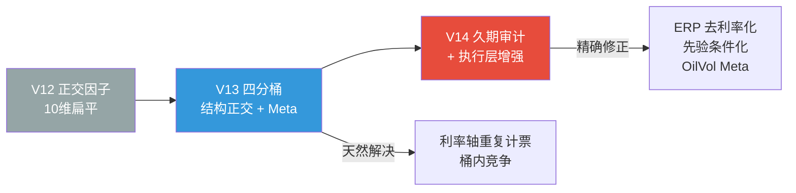

# V14 架构评审议程：久期偏差审计、跨桶张力检测、执行层增强与能源 Meta 信号

> **版本**: v14.0-REVIEW-DRAFT  
> **创建日期**: 2026-04-03  
> **前序**: v12.0-SPEC-LOCKED → v13-SRD-LOCKED  
> **触发来源**: 第三方量化专家审计 + 内部正交因子调研  
> **状态**: 📋 架构评审议程（未锁版）

---

## 0. 背景与动机

### 0.1 问题定义

V12/V13 架构在设计 10 维正交因子体系时，正确地消除了因子间的**线性共线性**（如删除 `yield_absolute`、DXY 等），但忽略了一个更隐蔽的结构性风险：

> **久期偏差 (Duration Bias)**：10 个因子中有 7 个与利率直接或间接相关。在 "Higher for Longer" 利率环境中，利率居高不下会导致这 7 个因子同时发出"偏紧"信号——即使实体经济可能仍然健康——从而使贝叶斯后验系统性偏向 LATE_CYCLE / BUST，产生结构性过度防御。

这不是"因子是否正交"的问题，而是"正交空间的轴线分布是否均匀"的问题。

### 0.2 调研证据摘要

| 调研发现 | 数据 | 来源 |
| :--- | :--- | :--- |
| 7/10 因子与利率直接或间接相关 | 因子分类审计 | 内部调研 |
| 利率上行期 QQQ 仍有 +17.19% 年化回报 | 2010-2026 条件回测 | 定量实证 |
| 利率上行 vs 下行期，Oil RVol 条件相关性符号翻转 | -0.21 vs +0.32 | 定量实证 |
| OilVol/VIX 无方向性预测力但预测波动率 | Q5 std 是 Q1 的 2.2 倍 | 五分位分析 |
| 油价 ROC 与铜金比 ROC 相关性 0.47-0.59 | 全周期/近期 | 相关性矩阵 |
| Oil RVol 独立于 VIX+TreasuryVol+Spread (R²=12.8%) | 回归分解 | 定量实证 |
| 滞涨 (BE↑+Capex↓) 在 2010-2026 未导致 QQQ 灾难 | QQQ fwd63d=+23.56% | 四象限分析 |
| 滞涨交互项增量 R² 仅 +0.0013 | 回归分解 | 定量实证 |
| 滞涨特征极端性不高于其他 regime (3.26 vs 3.40) | Z-score 绝对值和 | 定量实证 |
| 严重滞涨 (score>2) 在 16 年中仅 8 天 | 样本统计 | 历史窗口分析 |

---

## 1. 评审议题 (Review Items)

### 1.1 [P0] 久期偏差审计与量化

**目标**: 量化 7/10 因子在不同利率 regime 下的共振效应，评估 "Higher for Longer" 下的系统误判率。

**具体任务**:

- [ ] **利率 regime 条件回测**：将 2010-2026 历史按 real_yield 126d 变化方向分为"上行期"和"下行期"，分别运行完整贝叶斯回测，对比两个子集的：
  - Top-1 Accuracy
  - Brier Score
  - Mean Entropy
  - 极端 Regime 误判率（利率上行期将 MID_CYCLE 误判为 LATE/BUST 的比例）
- [ ] **因子共振矩阵**：在利率上行期计算 7 个利率敏感因子的条件协方差矩阵，确认是否存在系统性共振（同步恶化）
- [ ] **过度防御代价量化**：如果利率上行期系统频繁输出 LATE_CYCLE/BUST，计算"如果跟随建议减仓"的机会成本 vs "如果维持仓位"的尾部风险

**验收标准**:

| 指标 | 预期 |
| :--- | :--- |
| 利率上行期 LATE/BUST 误判率 | 量化并记录 (预期 > 20%) |
| 利率上行期 vs 下行期 Accuracy 差 | 量化 (预期上行期更低) |
| 因子共振系数 | 量化条件协方差对角线比率 |

---

### 1.2 [P1] ERP 公式去利率化评估

**目标**: 评估将 ERP 公式从 `E/P − Real_Yield` 改为纯 `E/P` 对系统行为的影响。

**背景**: 当前 ERP 公式的分母是 Real_Yield，意味着 `erp_absolute` 与 `real_yield_structural_z` 之间存在数学上的反向共线性。在利率上行期，Real_Yield 上升导致 ERP 下降，形成利率轴的双重计票。

**具体任务**:

- [ ] **Ablation 测试**：在 V13 四分桶框架下，对比以下三个 ERP 变体：
  - A: `erp_absolute = E/P − Real_Yield` (现状)
  - B: `erp_absolute = E/P` (纯估值)
  - C: `erp_absolute = E/P − Breakeven` (扣除通胀而非实际利率)
- [ ] **评估指标**: 全量回测 + 利率条件回测，特别关注 2022 H1 和 2023-2024 Higher-for-Longer 窗口

**决策矩阵**:

| 方案 | 优点 | 缺点 | 候选 |
| :--- | :--- | :--- | :--- |
| A: E/P − RY | 理论完整 | 利率双重计票 | 现状基线 |
| B: 纯 E/P | 消除利率计票 | 丧失"相对于国债的性价比"信息 | ⭐ 首选候选 |
| C: E/P − BE | 保留通胀维度 | 与 breakeven_accel 可能共线 | 备选 |

---

### 1.3 [P1] 先验矩阵 Regime-Aware 条件化

**目标**: 在 V13 的气候态先验机制中，引入利率 regime 感知。

**背景**: V12 的 P-1 原则（先验与似然分离）严禁篡改似然权重，但允许修改先验转移矩阵。如果系统检测到当前处于持续高利率环境（real_yield 126d EWMA 处于历史 >+1σ），可以适当调整先验中 LATE_CYCLE → BUST 的转移概率。

**具体任务**:

- [ ] 定义"利率 regime"的量化判据（如 real_yield 126d EWMA Z > 1.0）
- [ ] 设计先验矩阵调整规则（只调转移概率，不动初始先验）
- [ ] 回测验证：调整后的先验是否降低利率上行期的误报率，同时不损害 2020 COVID 的极端 Regime 召回率

---

### 1.4 [P2] OilVol/VIX 作为执行层 Meta-Awareness 信号

**目标**: 将 OilVol/VIX 比率作为 V13 `execution_router.py` 元监控的候选外挂信号。

**背景**: OilVol/VIX 不适合作为 GaussianNB 的推断层输入（符号翻转、无方向性预测力），但它作为**不确定性放大器**有独立价值——当 OilVol/VIX > 2.5 时，说明能源市场的恐慌程度远超股票市场，可能暗示供给侧冲击尚未被股市充分消化。

**具体任务**:

- [ ] 在 `execution_router.py` 的散度计算 $D_{meta}$ 中，增加 OilVol/VIX 作为辅助输入
- [ ] 当 OilVol/VIX > 阈值（待回测确定）时，增大 $D_{meta}$，强化系统的保守倾向
- [ ] 关键约束：OilVol/VIX 信号只影响执行层的减速/刹车，不影响推断层的后验概率

**数据合约**:

| 字段 | 来源 | 频率 | 计算 |
| :--- | :--- | :--- | :--- |
| `oil_rvol_21d` | yfinance `CL=F` → 21d rolling std × √252 × 100 | 日 | 已实现波动率（年化%） |
| `oil_vix_ratio` | `oil_rvol_21d` / VIX | 日 | 能源/股票波动率比率 |

**PIT 规则**: Tier 1 (日频市场数据)，`effective_date = observation_date + BDay(1)`

---

### 1.5 [P3] GPR 作为季度架构审视参考

**目标**: 将 GPR 纳入季度架构评审的外部参考指标，不进入日频系统。

**具体任务**:

- [ ] 在季度架构评审流程中，增加"GPR 水位检查"步骤
- [ ] 当 GPR 处于历史 >+2σ 时，在评审报告中标记"地缘风险升高"，提示架构师关注供给侧冲击的尾部风险
- [ ] 不写入自动化代码，仅作为文档化的审视流程

---

### 1.6 [P2] Cross-Bucket Tension Detector (跨桶张力检测器)

**目标**: 在 V13 四分桶执行层中，检测 Growth Bucket 与 Inflation Bucket 的联合恶化（滞涨象限），触发执行层减速。

**背景**: 第三方量化专家建议对"通胀反弹+增长停滞"进行概率定价。定量调研发现：

- 滞涨作为独立因子或 regime 不成立（交互 R²=0.0013；严重滞涨仅 8 天样本）
- GaussianNB 的条件独立性假设无法感知两个因子同时恶化的交互效应
- 滞涨的特征极端性（3.26）不高于其他 regime，Shannon 熵不会自动加大防御
- V13 四分桶架构天然提供了 Growth x Inflation 的交叉矩阵

**四象限宏观 Regime 实证 (2010-2026)**:

| 象限 | 定义 | 天数 | QQQ fwd63d | 最差 63d |
| :--- | :--- | :---: | :---: | :---: |
| GOLDILOCKS | 通胀下 增长上 | 202 | +11.25% | -21.07% |
| REFLATION | 通胀上 增长上 | 188 | +12.29% | -30.48% |
| DISINFLATION | 通胀下 增长下 | 179 | +27.32% | -11.85% |
| STAGFLATION | 通胀上 增长下 | 216 | +23.56% | -20.83% |

**设计草案**:

```python
def compute_cross_bucket_tension(growth_bucket: float, inflation_bucket: float) -> float:
    """
    Growth-Inflation 跨桶张力检测器。
    当 Growth 下行且 Inflation 上行时产生张力 (Fed 既不能松也不能紧)。
    Returns: tension in [0, 1]
    """
    growth_stress = max(0.0, -growth_bucket)
    inflation_stress = max(0.0, inflation_bucket)
    raw_tension = (growth_stress * inflation_stress) ** 0.5
    return min(1.0, raw_tension / 2.0)
```

**执行层影响**:

| 张力 | 动作 |
| :--- | :--- |
| `< 0.3` | 无影响 |
| `0.3 - 0.6` | `deployment_state` 降级一档 (BASE -> SLOW) |
| `>= 0.6` | 降级一档 + D_meta 增加惩罚项 |

**关键约束**: 检测器在推断层之外运行，不污染 GaussianNB 后验。它是安全阀，不是因子。

**具体任务**:

- [ ] 在 V13 `execution_router.py` 中实现 `compute_cross_bucket_tension()`
- [ ] 回测校准张力阈值（0.3/0.6 为初始猜测，待数据验证）
- [ ] 确认 2020 COVID 和 2022 H1 窗口中检测器的行为符合预期
- [ ] 确认 Goldilocks/Disinflation 窗口不产生误报

**永久否决的替代方案**:

| 方案 | 状态 | 理由 |
| :--- | :--- | :--- |
| STAGFLATION 作为第 5 个 regime | 否决 | 样本约为 0；方差坍缩；违反 P-7 |
| 滞涨交互项作为第 11 个因子 | 否决 | 增量 R²=0.0013；增加维度代价 |

---

### 1.7 [P1] Fat-Tail Event Radar (肥尾事件雷达) — 系统第四维输出

**目标**: 在 `target_beta`、`deployment_state`、`regime_probabilities` 之外，增加第四维输出 `tail_risk_radar`，为用户提供"如果坏事发生，最可能是什么类型的坏事"的概率分布。

**背景**: 当系统输出 LATE_CYCLE 60% 时，用户无法区分"温和减速"和"信用危机在酝酿"。肥尾雷达在不改变推断层的前提下，将因子 Z-scores 映射为 10 类具名尾部风险的条件指示器。

**设计原则**:

- 纯展示层：不影响 `target_beta` 或 `deployment_state`
- 零新因子：全部基于现有 10 个因子的 Z-score 条件组合
- 非归一化：输出是条件指示器，概率之和不必等于 1

**10 类肥尾场景**:

| 场景 | 触发条件 | 物理含义 |
| :--- | :--- | :--- |
| T1 滞涨陷阱 | BE_accel > 0 AND Capex < 0 | Fed 两难：不能松也不能紧 |
| T2 信用危机 | Spread_21d > 1.5 AND Spread_abs > 1.0 AND Liquidity < -0.5 | 融资链断裂 |
| T3 套息解体 | USDJPY_roc < -1.0 AND Spread > 0.5 AND CuAu < 0 | 全球去杠杆 |
| T4 估值压缩 | Real_Yield > 1.5 AND ERP < -0.5 | 贴现率杀 |
| T5 通缩崩溃 | BE_accel < -1.5 AND Capex < -1.0 AND Spread > 1.5 | 全面衰退 |
| T6 国债失灵 | MOVE > 2.0 AND Real_Yield 极端 | 贴现率假设崩溃 |
| T7 流动性枯竭 | Liquidity < -1.5 AND Spread > 0.5 | 流动性螺旋 |
| T8 成长预期坍塌 | ERP < -1.5 AND Capex < -1.0 | 戴维斯双杀 |
| T9 再通胀换仓 | BE_accel > 1.5 AND CuAu > 1.0 AND Real_Yield > 1.0 | 资金虹吸至旧经济 |
| T10 融涨无备 | Spread_abs < -1.5 AND ERP < -1.5 AND MOVE < -1.0 | 极度脆弱的泡沫顶峰 |

**概率计算**: 每个条件通过高斯 CDF 渐变激活，场景概率取几何平均（要求所有条件同时满足）。

**具体任务**:

- [ ] 创建 `tail_risk_radar.py` 实现 10 场景概率计算
- [ ] 回测验证：2020-03 COVID 应触发 T2/T5 > 50%；2022 H1 应触发 T4 > 50%
- [ ] JSON 输出集成到 `web_exporter.py`
- [ ] Dashboard UI 雷达可视化

**详细设计**: 见 `./V14_FAT_TAIL_RADAR_DESIGN.md`

---

## 2. 与 V13 SRD 的关系

V14 的议题**不替代** V13 SRD 的实施，而是在 V13 完成后的下一轮架构演进：



| 层级 | V13 已覆盖 | V14 新增 |
| :--- | :--- | :--- |
| 推断层 | 四分桶压缩（降低利率轴权重） | ERP 公式去利率化 |
| 先验层 | 气候态先验（消灭拉普拉斯偏差） | Regime-Aware 先验条件化 |
| 执行层 | Meta-Awareness 散度监控 | OilVol/VIX 辅助散度 + 跨桶张力检测器 |
| 风控层 | 算术加权 + 合法前值 | — |
| 审计层 | — | 久期偏差量化审计 + GPR 季度参考 |
| 展示层 | 10 因子热力图 + regime 仪表板 | Fat-Tail Event Radar 肥尾雷达 (第四维输出) |

---

## 3. 永久否决清单变更记录

本次调研新增以下条目至 V12 规格书 §3.4：

| 新增条目 | 否决层级 | 调研编号 |
| :--- | :--- | :--- |
| WTI/Brent 油价 (Level/ROC) | 🔴 永久否决 | RES-2026-04-001 |
| OVX / Oil RVol (推断层) | 🔴 否决推断层；🟡 保留执行层候选 | RES-2026-04-002 |
| GPR 地缘政治风险指数 | 🔴 永久否决 (日频系统) | RES-2026-04-003 |
| STAGFLATION 独立 regime (5-class) | 🔴 否决 | RES-2026-04-004 |
| 滞涨交互因子 (GaussianNB 第 11 因子) | 🔴 否决 | RES-2026-04-004 |

---

## 4. 调研证据索引

| 编号 | 文件 | 内容 |
| :--- | :--- | :--- |
| RES-2026-04-001 | `brain/599d06ce/.../oil_energy_factor_research.md` | 石油因子基础调研 (七维分析) |
| RES-2026-04-002 | `brain/599d06ce/.../energy_vol_gpr_duration_bias_research.md` | 能源波动率、GPR、久期偏差深度调研 |
| RES-2026-04-004 | `brain/599d06ce/.../stagflation_tail_risk_research.md` | 滞涨尾部风险定量分析 + 跨桶张力检测器设计 |
| RES-2026-04-005 | `./V14_FAT_TAIL_RADAR_DESIGN.md` | 肥尾事件雷达完整设计 (第四维输出) |

---

## 5. 签字

**架构评审发起人**: Quantitative Strategy Expert (Internal)  
**外部审计触发**: 第三方量化专家建议  
**日期**: 2026-04-03  
**状态**: 待 V13 完成后启动

---

© 2026 QQQ Entropy 决策系统开发组
