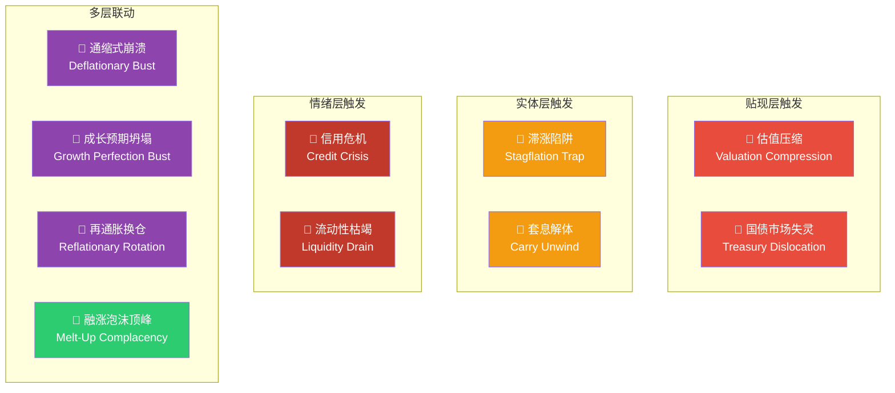
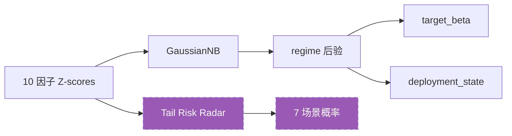

# 设计文档：Fat-Tail Event Radar（肥尾事件雷达）

> **日期**: 2026-04-03  
> **定位**: 系统第四维输出 — 与 `target_beta`、`deployment_state`、`regime_probabilities` 平行  
> **架构层**: 展示层 (Presentation Layer) — 不影响推断层或执行层  
> **触发**: 用户建议 — "列一个肥尾事件列表，给概率分布，作为第三维输出"

---

## 0. 核心概念

### 0.1 当前系统的三维输出

```text
维度 1: target_beta        → "存量仓位应该有多少 Beta"
维度 2: deployment_state   → "增量资金的节奏 (FAST/BASE/SLOW/PAUSE)"
维度 3: regime_probability → "当前处于哪个周期阶段" (4-class posterior)
```

### 0.2 缺失的第四维

> 用户知道系统说"减仓"，但不知道**为什么**要减仓。  
> 系统说 "LATE_CYCLE 60%"，但 LATE_CYCLE 可以是：  
> - 温和减速（铜金比下行但信用还行）→ 可以忍  
> - 信用危机在酝酿（利差飙升 + 流动性枯竭）→ 必须跑  
> - 滞涨陷阱（通胀升温但增长停滞）→ 无处可逃  

**第四维**就是回答："如果坏事发生，最可能是什么类型的坏事？"

```text
维度 4: tail_risk_radar    → "各类肥尾事件的当前概率分布"
```

### 0.3 设计原则

| 原则 | 约束 |
| :--- | :--- |
| **纯展示** | 不影响 `target_beta`、`deployment_state` 的任何计算 |
| **零新因子** | 全部基于现有 10 个因子的 Z-score 组合 |
| **零新数据** | 不引入任何新数据源 |
| **非概率** | 输出是"条件指示器"而非贝叶斯后验（不归一化为 Σ=1） |
| **PIT 合规** | 继承底层因子的 PIT 规则 |

---

## 1. 肥尾事件目录 (Fat-Tail Catalog)

### 1.1 七类肥尾场景



### 1.2 场景因子映射

| # | 肥尾事件 | 因子组合条件 | 物理含义 | 对 QQQ 的杀伤机制 |
| :--- | :--- | :--- | :--- | :--- |
| **T1** | 滞涨陷阱 | `breakeven_accel_z > 0` AND `core_capex_z < 0` | 通胀升温 + 增长停滞 → Fed 既不能松也不能紧 | 盈利下行 + 估值下行双杀 |
| **T2** | 信用危机 | `spread_21d_z > 1.5` AND `spread_abs_z > 1.0` AND `liquidity_z < -0.5` | 信用利差飙升 + 流动性萎缩 | 融资链断裂 → 被动抛售 |
| **T3** | 套息解体 | `usdjpy_roc_z < -1.0` AND `spread_21d_z > 0.5` AND `copper_gold_z < 0` | 日元升值 → 全球杠杆平仓 | 系统性去杠杆 |
| **T4** | 估值压缩 | `real_yield_z > 1.5` AND `erp_z < -0.5` | 实际利率飙升 + 股权溢价被压缩 | 贴现率升高直接杀长久期资产 |
| **T5** | 通缩式崩溃 | `breakeven_accel_z < -1.5` AND `core_capex_z < -1.0` AND `spread_21d_z > 1.5` | 通胀预期崩溃 + 实体萎缩 + 信用恶化 | 全面衰退 (2008/2020 型) |
| **T6** | 国债市场失灵 | `move_21d_z > 2.0` AND (`real_yield_z > 2.0` OR `real_yield_z < -2.0`) | 国债波动率爆发 + 收益率极端 | 贴现率假设本身崩溃 |
| **T7** | 流动性枯竭 | `liquidity_z < -1.5` AND `spread_21d_z > 0.5` | Fed 缩表 + 信用开始收紧 | 被动基金流出 → 流动性螺旋 |
| **T8** | 成长预期坍塌 | `erp_z < -1.5` AND `core_capex_z < -1.0` | 估值极度完美 + 资本开支退潮 | 戴维斯双杀 (极其危险) |
| **T9** | 再通胀换仓 | `breakeven_accel_z > 1.5` AND `copper_gold_z > 1.0` AND `real_yield_z > 1.0` | 旧经济狂热 + 实际利率飙升 | 资金从科技虹吸至周期股 |
| **T10**| 融涨泡沫顶峰 | `spread_abs_z < -1.5` AND `erp_z < -1.5` AND `move_21d_z < -1.0` | 市场无负面声音，风险定价归零 | 微小冲击可致雪崩，极其脆弱 |

---

## 2. 概率计算方法论

### 2.1 设计哲学

**不是贝叶斯后验**。这些"概率"本质上是**因子条件指示器** (Factor-Conditional Indicators)，衡量"当前因子状态与该场景的模板有多接近"。

```text
P(scenario_i) = 场景 i 的所有触发条件同时满足的程度

不是: P(scenario_i | data)  ← 需要完整的概率模型
而是: Proximity(current_factors, scenario_i_template)  ← 距离度量
```

### 2.2 计算公式

每个场景由若干触发条件组成，每个条件 $c_j$ 产生一个激活度 $a_j \in [0, 1]$：

$$a_j = \Phi\left(\frac{z_{factor} - \mu_{threshold}}{\sigma_{fuzz}}\right)$$

其中：
- $z_{factor}$ ：当前因子 Z-score
- $\mu_{threshold}$ ：触发阈值（如 $z > 1.5$ 则 $\mu = 1.5$）
- $\sigma_{fuzz}$ ：模糊宽度（默认 0.5），控制激活的渐变而非硬切换
- $\Phi$ ：标准正态 CDF

对于"因子需要为负"的条件（如 `capex_z < 0`），使用 $1 - \Phi$。

场景总概率使用**几何平均**（要求所有条件同时满足）：

$$P_{scenario} = \left(\prod_{j=1}^{k} a_j\right)^{1/k}$$

### 2.3 为什么用几何平均而不是乘积

- **乘积**：任何一个条件为 0 都会直接归零，过于严格
- **算术平均**：单个极端条件可以拉高总分，不够保守
- **几何平均**：要求所有条件都有一定程度的激活才能产生高分——物理上合理

---

## 3. 实现草案

### 3.1 Python 实现

```python
import numpy as np
from scipy.stats import norm

class TailRiskRadar:
    """
    肥尾事件雷达：基于现有因子 Z-score 计算 10 类尾部风险的条件指示器。
    纯展示层，不影响推断层或执行层。
    """
    
    SCENARIOS = {
        'stagflation_trap': {
            'name': '滞涨陷阱',
            'name_en': 'Stagflation Trap',
            'icon': '🌋',
            'conditions': [
                ('breakeven_accel_z', 'above', 0.0, 0.5),   # 通胀加速
                ('core_capex_z', 'below', 0.0, 0.5),        # 增长停滞
            ],
            'description': 'Fed 既不能松也不能紧。盈利 + 估值双杀。'
        },
        'credit_crisis': {
            'name': '信用危机',
            'name_en': 'Credit Crisis',
            'icon': '💣',
            'conditions': [
                ('spread_21d_z', 'above', 1.5, 0.5),        # 利差飙升
                ('spread_absolute_z', 'above', 1.0, 0.5),   # 绝对水位高
                ('liquidity_z', 'below', -0.5, 0.5),         # 流动性萎缩
            ],
            'description': '融资链断裂。被动抛售螺旋。'
        },
        'carry_unwind': {
            'name': '套息解体',
            'name_en': 'Carry Unwind',
            'icon': '🌊',
            'conditions': [
                ('usdjpy_roc_z', 'below', -1.0, 0.5),       # 日元急升
                ('spread_21d_z', 'above', 0.5, 0.5),        # 信用开始紧
                ('copper_gold_z', 'below', 0.0, 0.5),       # 全球需求走弱
            ],
            'description': '全球杠杆平仓。系统性去杠杆风暴。'
        },
        'valuation_compression': {
            'name': '估值压缩',
            'name_en': 'Valuation Compression',
            'icon': '📉',
            'conditions': [
                ('real_yield_z', 'above', 1.5, 0.5),        # 实际利率飙升
                ('erp_z', 'below', -0.5, 0.5),              # 股权溢价被压缩
            ],
            'description': '贴现率直接杀长久期成长股。2022 H1 重演。'
        },
        'deflationary_bust': {
            'name': '通缩式崩溃',
            'name_en': 'Deflationary Bust',
            'icon': '❄️',
            'conditions': [
                ('breakeven_accel_z', 'below', -1.5, 0.5),  # 通胀预期崩溃
                ('core_capex_z', 'below', -1.0, 0.5),       # 实体萎缩
                ('spread_21d_z', 'above', 1.5, 0.5),        # 信用恶化
            ],
            'description': '全面衰退。2008/2020 模式。'
        },
        'treasury_dislocation': {
            'name': '国债市场失灵',
            'name_en': 'Treasury Dislocation',
            'icon': '⚡',
            'conditions': [
                ('move_21d_z', 'above', 2.0, 0.5),          # 国债波动率爆发
                ('real_yield_z', 'extreme', 2.0, 0.5),      # 收益率极端(上或下)
            ],
            'description': '贴现率假设本身崩溃。流动性真空。'
        },
        'liquidity_drain': {
            'name': '流动性枯竭',
            'name_en': 'Liquidity Drain',
            'icon': '🏜️',
            'conditions': [
                ('liquidity_z', 'below', -1.5, 0.5),        # Fed 缩表
                ('spread_21d_z', 'above', 0.5, 0.5),        # 信用开始收紧
            ],
            'description': '被动基金流出。流动性螺旋。'
        },
        'growth_bust': {
            'name': '成长坍塌',
            'name_en': 'Growth Perfection Bust',
            'icon': '💥',
            'conditions': [
                ('erp_z', 'below', -1.5, 0.5),              # 极度完美估值
                ('core_capex_z', 'below', -1.0, 0.5),       # 资本开支退潮
            ],
            'description': '戴维斯双杀。极高估值撞上盈利预期崩溃。'
        },
        'reflation_rotation': {
            'name': '再通胀换仓',
            'name_en': 'Reflationary Rotation',
            'icon': '🔄',
            'conditions': [
                ('breakeven_accel_z', 'above', 1.5, 0.5),   # 通胀强烈加速
                ('copper_gold_z', 'above', 1.0, 0.5),       # 实体工业狂热
                ('real_yield_z', 'above', 1.0, 0.5),        # 实际利率上行
            ],
            'description': '旧经济复苏，资金从科技长久期抽离。'
        },
        'melt_up': {
            'name': '融涨顶峰',
            'name_en': 'Melt-Up Complacency',
            'icon': '🎈',
            'conditions': [
                ('spread_absolute_z', 'below', -1.5, 0.5),  # 信用定价完美
                ('erp_z', 'below', -1.5, 0.5),              # 股权定价完美
                ('move_21d_z', 'below', -1.0, 0.5),         # 波动率死亡
            ],
            'description': '死寂的极度狂热。任何微小冲击都会引发踩踏。'
        },
    }
    
    @staticmethod
    def _activation(z_value: float, direction: str, 
                    threshold: float, fuzz: float) -> float:
        """计算单个条件的激活度 ∈ [0, 1]"""
        if direction == 'above':
            return float(norm.cdf((z_value - threshold) / fuzz))
        elif direction == 'below':
            return float(norm.cdf((threshold - z_value) / fuzz))
        elif direction == 'extreme':
            # 极端 = 上极端 OR 下极端
            a_up = float(norm.cdf((z_value - threshold) / fuzz))
            a_dn = float(norm.cdf((-threshold - z_value) / fuzz))
            return max(a_up, a_dn)
        return 0.0
    
    @classmethod
    def compute(cls, factor_zscores: dict) -> dict:
        """
        计算所有场景的概率指示器。
        
        Args:
            factor_zscores: 当前因子 Z-scores，如 {
                'breakeven_accel_z': 0.5,
                'core_capex_z': -0.3,
                'spread_21d_z': 1.2,
                ...
            }
        
        Returns:
            {
                'stagflation_trap': {
                    'probability': 0.35,
                    'name': '滞涨陷阱',
                    'icon': '🌋',
                    'level': 'ELEVATED',
                    'conditions': [
                        {'factor': 'breakeven_accel_z', 'value': 0.5, 
                         'activation': 0.84, 'status': 'TRIGGERED'},
                        ...
                    ]
                },
                ...
            }
        """
        results = {}
        for key, scenario in cls.SCENARIOS.items():
            activations = []
            condition_details = []
            
            for factor, direction, threshold, fuzz in scenario['conditions']:
                z = factor_zscores.get(factor, 0.0)
                a = cls._activation(z, direction, threshold, fuzz)
                activations.append(a)
                condition_details.append({
                    'factor': factor,
                    'value': round(z, 3),
                    'threshold': threshold,
                    'activation': round(a, 3),
                    'status': 'TRIGGERED' if a > 0.7 else 
                              'WARMING' if a > 0.3 else 'COLD'
                })
            
            # 几何平均
            prob = float(np.prod(activations) ** (1.0 / len(activations)))
            
            # 风险等级
            if prob >= 0.7:
                level = 'CRITICAL'
            elif prob >= 0.5:
                level = 'HIGH'
            elif prob >= 0.3:
                level = 'ELEVATED'
            elif prob >= 0.15:
                level = 'MODERATE'
            else:
                level = 'LOW'
            
            results[key] = {
                'probability': round(prob, 4),
                'name': scenario['name'],
                'name_en': scenario['name_en'],
                'icon': scenario['icon'],
                'level': level,
                'description': scenario['description'],
                'conditions': condition_details,
            }
        
        return results
    
    @classmethod
    def format_radar(cls, results: dict) -> str:
        """格式化为人类可读的雷达输出"""
        lines = ['╔══════════════════════════════════════════╗']
        lines.append('║       FAT-TAIL EVENT RADAR (肥尾雷达)     ║')
        lines.append('╠══════════════════════════════════════════╣')
        
        # 按概率排序
        sorted_items = sorted(results.items(), 
                             key=lambda x: x[1]['probability'], reverse=True)
        
        for key, r in sorted_items:
            bar_len = int(r['probability'] * 20)
            bar = '█' * bar_len + '░' * (20 - bar_len)
            level_colors = {
                'CRITICAL': '🔴', 'HIGH': '🟠', 'ELEVATED': '🟡',
                'MODERATE': '🔵', 'LOW': '⚪'
            }
            icon = level_colors.get(r['level'], '⚪')
            lines.append(
                f'║ {r["icon"]} {r["name"]:<10} {icon} {r["probability"]:>5.1%} '
                f'[{bar}] ║'
            )
        
        lines.append('╚══════════════════════════════════════════╝')
        return '\n'.join(lines)
```

### 3.2 JSON 输出格式

```json
{
  "tail_risk_radar": {
    "timestamp": "2026-04-03T00:00:00Z",
    "max_risk": "valuation_compression",
    "max_probability": 0.42,
    "scenarios": {
      "stagflation_trap": {
        "probability": 0.18,
        "level": "MODERATE",
        "icon": "🌋",
        "name": "滞涨陷阱",
        "conditions": [
          {"factor": "breakeven_accel_z", "value": 0.3, "activation": 0.73, "status": "TRIGGERED"},
          {"factor": "core_capex_z", "value": 0.1, "activation": 0.42, "status": "WARMING"}
        ]
      },
      "credit_crisis": {"probability": 0.05, "level": "LOW"},
      "carry_unwind": {"probability": 0.12, "level": "LOW"},
      "valuation_compression": {"probability": 0.42, "level": "ELEVATED"},
      "deflationary_bust": {"probability": 0.02, "level": "LOW"},
      "treasury_dislocation": {"probability": 0.08, "level": "LOW"},
      "liquidity_drain": {"probability": 0.15, "level": "MODERATE"},
      "growth_bust": {"probability": 0.05, "level": "LOW"},
      "reflation_rotation": {"probability": 0.04, "level": "LOW"},
      "melt_up": {"probability": 0.10, "level": "LOW"}
    }
  }
}
```

### 3.3 Dashboard UI 中的可视化

```text
┌─────────────────────────────────────────────┐
│  存量仓位          增量资金          当前 Regime  │
│  Beta: 0.65       SLOW 🟡         LATE_CYCLE  │
├─────────────────────────────────────────────┤
│                                             │
│         ⚡ 肥尾事件雷达 (Tail Risk Radar)      │
│                                             │
│  📉 估值压缩     🟡 42%  [████████░░░░░░░░░░░░] │
│  🌋 滞涨陷阱     🔵 18%  [███░░░░░░░░░░░░░░░░░] │
│  🏜️ 流动性枯竭   🔵 15%  [███░░░░░░░░░░░░░░░░░] │
│  🌊 套息解体     ⚪ 12%  [██░░░░░░░░░░░░░░░░░░] │
│  ⚡ 国债失灵     ⚪  8%  [█░░░░░░░░░░░░░░░░░░░] │
│  💣 信用危机     ⚪  5%  [█░░░░░░░░░░░░░░░░░░░] │
│  💥 成长坍塌     ⚪  5%  [█░░░░░░░░░░░░░░░░░░░] │
│  🔄 再通胀换仓   ⚪  4%  [█░░░░░░░░░░░░░░░░░░░] │
│  ❄️ 通缩崩溃     ⚪  2%  [░░░░░░░░░░░░░░░░░░░░] │
│  🎈 融涨顶峰     ⚪  1%  [░░░░░░░░░░░░░░░░░░░░] │
│                                             │
│  最高风险: 📉 估值压缩 (Real Yield Z=+1.8)    │
└─────────────────────────────────────────────┘
```

---

## 4. 资产组合穿透分析 (Tech Mega-Cap Transmissive Risk)

QQQ（纳斯达克 100）作为长久期、高资本开支、Mega-cap 科技股主导的资产组合，其定价模型（DCF）由三大核心引擎驱动：**分子端（EPS/盈利/AI Capex）**、**分母端（真实无风险利率/ERP）**、**流动性端（被动资金/美元潮汐）**。

不同的肥尾事件击穿这三大引擎的路径完全不同。以下是针对 QQQ/QLD 的定向杀伤穿透图谱：

### 4.1 核心定价三要素受损矩阵

| 肥尾事件 | 估值分母端 (Duration) | 盈利分子端 (EPS/Capex) | 系统流动性 (Flows) | QQQ 跌幅形态 |
| :--- | :--- | :--- | :--- | :--- |
| **估值压缩** | 💥 剧烈受损 (RY飙升) | ⚪ 安全 (盈利仍在) | ⚪ 中性 | **缓慢流血** ("慢熊") |
| **套息解体** | ⚪ 中性或受益 | ⚪ 静态安全 | 💥 突然抽干 | **闪崩/V型反转** (剧烈去杠杆) |
| **通缩崩溃** | 🟢 受益 (降息预期) | 💥 深度受损 | 💥 信用冻结死锁 | **断崖暴跌** (盈利预期崩溃) |
| **滞涨陷阱** | 💥 温和受损 (降息落空) | 💥 温和受损 | ⚪ 中性 | **阴跌震荡** (双重挤压) |
| **信用危机** | ⚪ 中性 | �� 传导受损 | 💥 剧烈受损 | **无差别崩盘** (流动性虹吸) |
| **流动性枯竭** | 💥 风险溢价飙升 | ⚪ 中性 | 💥 被动赎回螺旋 | **中小盘崩，巨头补跌** |
| **国债失灵** | 💥 估值锚丢失 | ⚪ 中性 | 💥💥 抵押品链条断裂 | **极高波动率，失去理性** |

### 4.2 具体传导机制 (针对 QQQ)

1. **Duration Shock (久期冲击 — T4/T1)**：`估值压缩` 等事件直接杀伤 QQQ 的远期现金流贴现。因为科技股久期长，对 Real Yield 高度敏感。但只要巨头 (MAG7) 的资产负债表健康、AI 资本开支还在，这就变成了**"杀估值、不杀逻辑"**。策略上，这不意味着立刻空仓脱逃，但绝对不应加杠杆（如将 QLD 降为 QQQ），并让系统用时间换空间消化高利率。
2. **Earnings Shock (盈利冲击 — T5)**：`通缩式崩溃` 直接否定了科技巨头高增长的定价逻辑。企业削减 Capex 会瞬间打破收入神话。这是真正的**"杀逻辑"**，长久期科技股会迎来分子分母的双杀（尽管后期会有降息预期对冲）。系统会坚定切入 BUST，必须执行最高级别防守。
3. **Liquidity/Plumbing Shock (管道冲击 — T2/T3/T6/T7)**：如`套息解体` 或 `国债失灵`。这种冲击与科技股目前的业务好坏**毫无关系**。资金因后院起火不得不抛售流动性最好的资产（Mega-Cap Tech）来补缴保证金。特点是速度极快，常伴随流动性真空和 V 型反转。策略上，虽然基本面没变，但不可盲目接飞刀，必须等待 `execution_router` 散度指标和短期波动率（MOVE/VIX）退潮才能增配。

---

## 5. 场景详细设计卡片

### T1: 滞涨陷阱 (Stagflation Trap) 🌋

| 属性 | 值 |
| :--- | :--- |
| **触发因子** | `breakeven_accel_z` > 0, `core_capex_z` < 0 |
| **物理含义** | 通胀加速但实体经济停滞 → Fed 货币政策陷入两难 |
| **对 QQQ 杀伤** | 盈利下行（Capex 弱）+ 估值下行（通胀升 → 不降息）= 双杀 |
| **历史参考** | 1974 石油危机、2022 H1 局部特征 |
| **历史实证** | 2010-2026 温和滞涨下 QQQ fwd63d = +23.56%（不可怕，但方向最差） |
| **用户行动参考** | 减少长久期成长股敞口；考虑实物资产对冲 |

---

### T2: 信用危机 (Credit Crisis) 💣

| 属性 | 值 |
| :--- | :--- |
| **触发因子** | `spread_21d_z` > 1.5, `spread_absolute_z` > 1.0, `liquidity_z` < -0.5 |
| **物理含义** | 信用利差飙升 + 流动性萎缩 → 融资链断裂 |
| **对 QQQ 杀伤** | 被动抛售螺旋 → 无差别抛售（优质股也被卖） |
| **历史参考** | 2008 GFC、2020 COVID 第一阶段 |
| **用户行动参考** | 现金为王；暂停一切增量部署 |

---

### T3: 套息解体 (Carry Unwind) 🌊

| 属性 | 值 |
| :--- | :--- |
| **触发因子** | `usdjpy_roc_z` < -1.0, `spread_21d_z` > 0.5, `copper_gold_z` < 0 |
| **物理含义** | 日元套息交易逆转 → 全球杠杆基金被迫去杠杆 |
| **对 QQQ 杀伤** | 跨境资金流出美股 → 成长股流动性溢价蒸发 |
| **历史参考** | 2024 年 8 月日元闪崩、1998 LTCM |
| **用户行动参考** | 关注 USD/JPY 日线异动；准备对冲头寸 |

---

### T4: 估值压缩 (Valuation Compression) 📉

| 属性 | 值 |
| :--- | :--- |
| **触发因子** | `real_yield_z` > 1.5, `erp_z` < -0.5 |
| **物理含义** | 实际利率飙升 + 股权风险溢价被压缩 → 长久期资产被逐出 |
| **对 QQQ 杀伤** | 纯估值杀 — 盈利可能没问题，但 P/E 被压缩 |
| **历史参考** | 2022 全年、2018 Q4 |
| **用户行动参考** | 确认盈利支撑是否仍在；关注 ERP 反弹信号 |

---

### T5: 通缩式崩溃 (Deflationary Bust) ❄️

| 属性 | 值 |
| :--- | :--- |
| **触发因子** | `breakeven_accel_z` < -1.5, `core_capex_z` < -1.0, `spread_21d_z` > 1.5 |
| **物理含义** | 通胀预期崩溃 + 实体萎缩 + 信用恶化 → 全面衰退 |
| **对 QQQ 杀伤** | 盈利估算崩溃 + 信用传导 → 最严重等级 |
| **历史参考** | 2008 GFC、2020 COVID 第一阶段 |
| **用户行动参考** | 触发系统 BUST → 仓位降至最低；等待信用利差企稳 |

---

### T6: 国债市场失灵 (Treasury Dislocation) ⚡

| 属性 | 值 |
| :--- | :--- |
| **触发因子** | `move_21d_z` > 2.0, `real_yield_z` 极端 (>2.0 或 <-2.0) |
| **物理含义** | 国债波动率爆发 + 收益率出现不可解释的极端运动 → 贴现率假设崩溃 |
| **对 QQQ 杀伤** | 所有基于 DCF 的估值模型同时失灵 |
| **历史参考** | 2020-03 国债市场流动性危机、2023 硅谷银行 |
| **用户行动参考** | 关注 Fed 紧急干预信号 |

---

### T7: 流动性枯竭 (Liquidity Drain) 🏜️

| 属性 | 值 |
| :--- | :--- |
| **触发因子** | `liquidity_z` < -1.5, `spread_21d_z` > 0.5 |
| **物理含义** | Fed 缩表 + 信用开始收紧 → 系统流动性被抽干 |
| **对 QQQ 杀伤** | 被动基金流出 → 流动性差的中小成长股先崩 |
| **历史参考** | 2018 Q4 QT、2022 缩表周期 |
| **用户行动参考** | 向 Mega-cap 集中仓位；避免小盘成长 |

---

### T8: 成长预期坍塌 (Growth Perfection Bust) 💥

| 属性 | 值 |
| :--- | :--- |
| **触发因子** | `erp_z` < -1.5, `core_capex_z` < -1.0 |
| **物理含义** | 市场给予极度完美的估值，但实体资本开支突然断崖式退潮 |
| **对 QQQ 杀伤** | 最致命的戴维斯双杀。杀盈利的同时，极低的 ERP 无法提供任何估值缓冲 |
| **历史参考** | 2000 互联网泡沫破裂初期 |
| **用户行动参考** | 触发极度防守；必须清仓或对冲；跌幅深不见底 |

---

### T9: 再通胀换仓 (Reflationary Rotation) 🔄

| 属性 | 值 |
| :--- | :--- |
| **触发因子** | `breakeven_accel_z` > 1.5, `copper_gold_z` > 1.0, `real_yield_z` > 1.0 |
| **物理含义** | 旧经济实体需求爆发，大宗商品狂暴，导致实际利率强力抬升 |
| **对 QQQ 杀伤** | 相对失血。资金向顺周期/低估值/短久期资产转移，导致 QQQ 估值阴跌且大幅跑输旧经济 |
| **历史参考** | 2021 年初周期股脉冲、2024 年大宗双击阶段 |
| **用户行动参考** | 等待 QQQ 回稳；配置大宗商品或宽基指数做对冲 |

---

### T10: 融涨泡沫顶峰 (Melt-Up Complacency) 🎈

| 属性 | 值 |
| :--- | :--- |
| **触发因子** | `spread_absolute_z` < -1.5, `erp_z` < -1.5, `move_21d_z` < -1.0 |
| **物理含义** | 全市场几乎彻底丧失风险感知，没有人在进行避险，流动性杠杆拉满 |
| **对 QQQ 杀伤** | 系统本身处于脆弱极值。任何微小利空都会引发拥挤踩踏和自动平仓螺旋 |
| **历史参考** | 2018 年初" Volmageddon" 前夕、2021 年末美股顶峰 |
| **用户行动参考** | 严禁增量资金入局 (PAUSE)；随时准备应付 10%+ 的快速回调 |

---

## 6. 与现有架构的关系

### 6.1 不增加任何复杂性



Tail Risk Radar 是一个**平行的只读分支**——它读取因子 Z-scores（与推断层共享输入），但不写入任何推断层或执行层的状态。

### 6.2 与其他 V14 议题的协同

| V14 议题 | 与雷达的关系 |
| :--- | :--- |
| **P0 久期偏差审计** | 雷达的 T4「估值压缩」在利率上行期会持续亮灯，帮助用户理解"为什么系统偏保守" |
| **P1 ERP 去利率化** | 如果 ERP 公式变更，T4 的触发条件需要同步调整 |
| **P2 OilVol/VIX Meta** | OilVol/VIX 可以作为 T6「国债市场失灵」的辅助指标 |
| **P2 跨桶张力检测器** | 与 T1「滞涨陷阱」逻辑重叠，但一个影响执行层，一个纯展示 |

### 6.3 数据流

```text
macro_collector.py
    ↓ (raw data)
probability_seeder.py
    ↓ (Z-scores)
    ├── bayesian_inference.py → regime posterior → target_beta
    ├── execution_router.py  → D_meta → deployment_state
    └── tail_risk_radar.py   → scenario indicators → JSON/UI (新增)
```

---

## 7. 验收标准

| AC 编号 | 测试 | 条件 |
| :--- | :--- | :--- |
| **AC-TR-1** | 所有场景概率 ∈ [0, 1] | 输入任意 Z-score 范围 [-8, 8] |
| **AC-TR-2** | 默认状态（Z=0）所有场景概率 < 0.15 | 无虚警 |
| **AC-TR-3** | 2020-03 COVID 数据 → T2/T5 概率 > 0.5 | 回测验证，已知危机必须被捕捉 |
| **AC-TR-4** | 2022 H1 数据 → T4 概率 > 0.5 | 回测验证，估值压缩必须亮灯 |
| **AC-TR-5** | 雷达计算 < 1ms | 纯 numpy 运算，无性能问题 |
| **AC-TR-6** | 雷达输出不影响 target_beta | 完全隔离测试 |

---

## 8. 优先级与实现建议

| 优先级 | 行动 |
| :--- | :--- |
| **V13** | 在 `web_exporter.py` 输出中预留 `tail_risk_radar` 字段（空对象） |
| **V14 P1** | 实现 `tail_risk_radar.py` + 回测验证 7 个场景 |
| **V14 P1** | Dashboard UI 集成（雷达可视化） |
| **V14 P2** | 基于用户反馈校准阈值和模糊宽度 |

---

© 2026 QQQ Entropy 量化策略研究组
