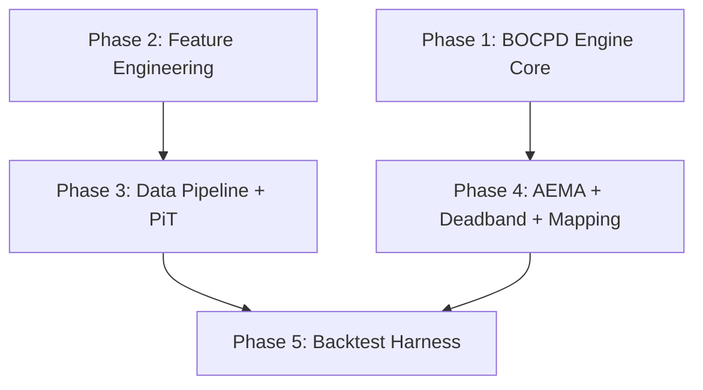

# ADD: ED+BOCPD POC 实现 — 面向 Coding Agent 的架构设计文档

> **源规格书**：[SRD_v1_complete.md](file:///Users/weizhang/.gemini/antigravity/brain/2aec81b0-493d-4973-8c1d-a9f7c5da6ca5/artifacts/SRD_v1_complete.md) (v1.2)  
> **系统定位**：中期 QLD/QQQ 波段择时系统（3 个月以上持仓周期，年化交易 2-4 次）  
> **目标**：在现有 topo-math 仓库中搭建可通过 Docker 运行的 POC 回测引擎  
> **工作目录**：`/Users/weizhang/w/cycle-monitor-workspace/topo-math/`

---

## 0. 总图：模块依赖与实现顺序



**严格依赖**：Phase 1 和 Phase 2 可以并行开发（无数据依赖）。Phase 3 依赖 Phase 2 的特征接口。Phase 4 依赖 Phase 1 的引擎接口。Phase 5 是终端集成，依赖所有前置模块。

---

## 1. 目录布局

```
src/
  liquidity/                      # <-- 新建顶层模块
    __init__.py
    config.py                     # 参数注册表（JSON 加载）
    engine/
      __init__.py
      bocpd.py                    # BOCPD 核心引擎 (Phase 1)
      nig.py                      # NIG 共轭更新（纯函数）(Phase 1)
      hazard.py                   # Hazard 函数预计算 (Phase 1)
      student_t.py                # Student-t log-pdf (Phase 1)
    signal/
      __init__.py
      ed_accel.py                 # 特征值离散度加速度 (Phase 2)
      spread_anomaly.py           # 买卖价差异常 Z-score (Phase 2)
      fisher_rho.py               # Fisher 变换滚动相关性 (Phase 2)
      macro_hazard.py             # 宏观 Hazard 率合成 (Phase 2)
    data/
      __init__.py
      pit_aligner.py              # PiT 时间戳对齐引擎 (Phase 3)
      trading_calendar.py         # yfinance-first 交易日历锚定 + Lookback Padding (Phase 3)
      fred_loader.py              # FRED 宏观数据加载 (Phase 3)
      price_loader.py             # yfinance 价格加载 (Phase 3)
    control/
      __init__.py
      aema.py                     # 非对称 EMA 滤波 (Phase 4)
      deadband.py                 # 非对称执行死区 (Phase 4)
      leverage_map.py             # 双决策映射 (Phase 4)
      allocator.py                # QLD/QQQ/Cash 配比 (Phase 4)
      hold_period.py              # 最低 QLD 持仓期约束 (Phase 4)
    backtest/
      __init__.py
      runner.py                   # 回测主循环 (Phase 5)
      nav.py                      # 两步 NAV 更新 (Phase 5)
      slippage.py                 # 滑点模型 (Phase 5)
      attribution.py              # 归因报告 (Phase 5)
      validation.py               # 独立验证锚点 FPR 评估 (Phase 5)
    resources/
      bocpd_params.json           # 参数注册表 (Phase 1)

tests/
  unit/
    liquidity/
      __init__.py
      test_bocpd_invariants.py    # P0 结构不变量 (Phase 1)
      test_bocpd_scenarios.py     # P1 场景断言 (Phase 1)
      test_nig.py                 # NIG 更新纯函数 (Phase 1)
      test_hazard.py              # Hazard 预计算 (Phase 1)
      test_ed_accel.py            # ED 特征 (Phase 2)
      test_spread_anomaly.py      # 价差特征 (Phase 2)
      test_fisher_rho.py          # Fisher 特征 (Phase 2)
      test_pit_aligner.py         # PiT 对齐 (Phase 3)
      test_aema.py                # AEMA 滤波 (Phase 4)
      test_deadband.py            # 死区逻辑 (Phase 4)
      test_nav.py                 # NAV 更新 (Phase 5)
  integration/
    liquidity/
      test_backtest_smoke.py      # 端到端烟雾测试 (Phase 5)
```

---

## 2. Phase 1: BOCPD Engine Core

> **目标**：纯数学引擎，零外部数据依赖。全部使用合成数据验证。

### 2.1 参数注册表

[NEW] `src/liquidity/resources/bocpd_params.json`

```json
{
  "hazard": {
    "R_MAX": 504,
    "R_STABLE": 63,
    "KAPPA_HAZARD": 5
  },
  "nig_priors": {
    "ed_accel":      {"mu_0": 0.0,  "kappa_0": 5, "alpha_0": 2.5, "beta_0": 1.5},
    "spread_anomaly": {"mu_0": 0.0,  "kappa_0": 5, "alpha_0": 2.5, "beta_0": 1.5},
    "fisher_rho":    {"mu_0": 0.20, "kappa_0": 5, "alpha_0": 2.5, "beta_0": 0.09}
  },
  "aema": {
    "alpha_up": 0.50,
    "alpha_down": 0.08,
    "circuit_breaker": 0.70
  },
  "deadband": {
    "delta_down": 0.05,
    "delta_up": 0.30,
    "recovery_coeff": 0.15
  },
  "hold_period": {
    "min_qld_hold_days": 63
  },
  "mapping": {
    "sigma_calm": 0.18,
    "sigma_stress": 0.45,
    "sigma_target": 0.36
  },
  "execution": {
    "s0_bps": 3,
    "s1_bps": 2,
    "sigma_normal": 0.18
  },
  "macro_hazard": {
    "lambda_floor": 0.002,
    "lambda_ceil": 0.016,
    "rank_lookback": 504,
    "weights": {
      "walcl": 0.25,
      "rrp": 0.25,
      "tga": 0.25,
      "fra_ois": 0.25
    }
  }
}
```

### 2.2 核心模块接口

#### [NEW] `src/liquidity/engine/nig.py`

```python
"""NIG 共轭更新 — 纯函数，无状态"""
import numpy as np

def update_nig(
    old_stats: np.ndarray,   # (N, D, 4)  [mu, kappa, alpha, beta]
    x_t: np.ndarray,         # (D,)
) -> np.ndarray:             # (N, D, 4)
    """SRD 3.4: 在线递归 NIG 更新。"""

def predictive_logpdf(
    suff_stats: np.ndarray,  # (N, D, 4)
    x_t: np.ndarray,         # (D,)
) -> np.ndarray:             # (N,) — 三维联合对数密度
    """SRD 3.2: 条件独立 Student-t 联合对数密度。"""
```

#### [NEW] `src/liquidity/engine/hazard.py`

```python
import numpy as np

def precompute_g_r(
    r_max: int = 504,
    r_stable: int = 63,
    kappa: int = 5,
) -> np.ndarray:             # (r_max + 1,)
    """SRD 2.2: 游程长度调制函数 g(r)。预计算，引擎初始化时调用一次。"""

def compute_hazard(
    g_r: np.ndarray,          # (R_MAX+1,)
    lambda_macro: float,
    r_max: int = 504,
) -> np.ndarray:             # (R_MAX+1,)  已 clip 到 [0,1]，h[R_MAX]=1.0
    """SRD 2.1: h(r,t) = lambda_macro * g(r)，含 R_MAX 强制截断。"""
```

#### [NEW] `src/liquidity/engine/bocpd.py`

```python
import numpy as np
from dataclasses import dataclass, field

@dataclass
class BOCPDState:
    """BOCPD 引擎的完整持久化状态。可序列化到磁盘以支持跨会话恢复。"""
    run_length_probs: np.ndarray   # (R_MAX+1,)
    suff_stats: np.ndarray          # (R_MAX+1, N_DIMS, 4)
    t: int = 0

class BOCPDEngine:
    """SRD 第二、三章的完整实现。"""

    def __init__(self, config: dict):
        """从 bocpd_params.json 加载配置并初始化状态。"""

    def update(self, x_t: np.ndarray, lambda_macro: float) -> float:
        """
        单步更新。SRD 8.2 五步核心循环。

        Args:
            x_t: (3,) 三维观测 [ED_accel, Spread, Fisher_rho]
            lambda_macro: 当日宏观 hazard 率

        Returns:
            p_cp_raw: 原始变点后验 P(r_t=0)
        """

    def get_state(self) -> BOCPDState:
        """导出当前状态（用于持久化和测试断言）。"""

    def set_state(self, state: BOCPDState) -> None:
        """加载外部状态（用于跨会话恢复和测试注入）。"""
```

### 2.3 测试数据策略

#### P0 级: 全确定性

```python
# tests/unit/liquidity/test_bocpd_invariants.py

DETERMINISTIC_CALM = np.array([
    [0.1, -0.05, 0.22],
    [-0.08, 0.03, 0.19],
    [0.05, -0.02, 0.21],
    [0.02, 0.01, 0.20],
    [-0.03, 0.04, 0.18],
])  # 5 步全确定性，手工编写，每个值已知

# 断言对象: INV-1, INV-2, INV-4, INV-6
# 精度: atol=1e-12（解析解级别）
```

#### P1 级: 确定性 + 冲击

```python
# tests/unit/liquidity/test_bocpd_scenarios.py

# 前 20 步使用手工全零序列
CALM_20 = np.zeros((20, 3))  # 完全确定，无随机性

# 第 21 步注入 +4σ 冲击
SHOCK = np.array([4.0, 4.0, 4.0])

# 断言对象: SC-1 到 SC-6
# 精度: 数值断言 atol=1e-6，定性断言（>、<）无阈值问题
```

### 2.4 Docker 验收命令

```bash
docker-compose run --rm test pytest tests/unit/liquidity/ -v --tb=short -x
```

### 2.5 验收标准

- [ ] 所有 P0 级不变量测试通过（INV-1, INV-2, INV-4, INV-6）
- [ ] 所有 P1 级场景测试通过（SC-1, SC-2, SC-4, SC-5, SC-6）
- [ ] `ruff check src/liquidity/engine/` 零警告
- [ ] 代码行覆盖率 > 95%（`engine/` 目录）

---

## 3. Phase 2: Feature Engineering

> **目标**：三个特征的纯计算函数。输入为 DataFrame，输出为 `np.ndarray`。

### 3.1 数据源映射

| SRD 变量 | 免费数据源 | 获取方式 | 覆盖范围 |
|---------|----------|---------|---------|
| **ED 加速度** | QQQ 成分股日收益率 | yfinance（NDX 100 成分股收盘价） | 2001-至今 |
| **买卖价差异常** | VIX 指数作为代理 | FRED: `VIXCLS` 或 yfinance `^VIX` | 2001-至今 |
| **Fisher($\rho$)** | QQQ 与 TLT 的滚动相关性 | yfinance（QQQ, TLT 日收盘） | 2002-至今 |

> [!IMPORTANT]
> **价差代理**：真实的逐笔买卖价差数据不免费。用 VIX 作为流动性压力的代理变量——VIX 飙升时买卖价差显著扩大（相关性 > 0.7）。POC 阶段验证管线逻辑，实盘部署时替换成订阅级的实际价差数据。

### 3.2 模块接口

#### [NEW] `src/liquidity/signal/ed_accel.py`

```python
import pandas as pd
import numpy as np

def compute_ed(returns: pd.DataFrame, window: int = 60) -> pd.Series:
    """
    计算特征值离散度（ED）。
    
    Args:
        returns: 成分股日收益率 DataFrame，columns = tickers
        window: 滚动窗口（交易日）
    Returns:
        ED 时间序列，index = 日期
    """

def compute_ed_accel(ed_series: pd.Series, median_window: int = 10) -> pd.Series:
    """
    SRD 3.1 d1: ED 加速度。
    10 日中位数滤波后差分。
    """
```

#### [NEW] `src/liquidity/signal/spread_anomaly.py`

```python
import pandas as pd

def compute_spread_anomaly(
    vix: pd.Series,
    lookback: int = 252,
) -> pd.Series:
    """
    SRD 3.1 d2: 买卖价差异常 Z-score。
    POC 使用 VIX 作为代理。实盘替换为真实价差。

    公式: Z = (VIX_t - mean_252) / std_252
    """
```

#### [NEW] `src/liquidity/signal/fisher_rho.py`

```python
import pandas as pd
import numpy as np

def compute_fisher_rho(
    series_a: pd.Series,  # 例如 QQQ 日收益率
    series_b: pd.Series,  # 例如 TLT 日收益率
    window: int = 20,
) -> pd.Series:
    """
    SRD 3.1 d3: Fisher z-变换后的滚动相关性。
    rho = rolling_corr(a, b, 20)
    Fisher(rho) = 0.5 * ln((1+rho)/(1-rho))

    SRD 3.5 约束: 窗口禁止在变点处截断。
    """
```

### 3.3 测试策略

使用预计算的确定性矩阵验证 ED 的特征值计算和 Fisher 变换的数值精度。

### 3.4 验收标准

- [ ] 纯函数，无网络调用
- [ ] 全部输出为 `pd.Series`（index=Date），无 NaN 泄漏
- [ ] 对已知合成矩阵的 ED 计算误差 < 1e-10

---

## 4. Phase 3: Data Pipeline + PiT Alignment

> **目标**：从免费数据源拉取数据，应用 SRD 第五章的 PiT 偏移规则。

### 4.1 数据源详情

| SRD 变量 | FRED Series ID | PiT 偏移 | 备注 |
|---------|---------------|---------|------|
| Fed Reserves (H.4.1) | `WALCL` | T-1（周五生效） | 周四发布，阶梯填充 |
| RRP | `RRPONTSYD` | T+0 | 15:30 ET 发布 |
| TGA | `WTREGEN` | T+0 | 内容为 T-1 |
| SOFR Rate | `SOFR` | T-1 | 次日发布 |
| VIX (代理 Spread) | `VIXCLS` | T+0 | 收盘时已知 |
| QQQ / QLD / TLT | yfinance | T+0 | 收盘 OHLC |

> **复用现有基础设施**：`src/collector/macro.py` 的 `fetch_fred_data()` 和 `src/collector/price.py` 的 `fetch_price_data()` 已存在且可复用。新建 `src/liquidity/data/` 作为 PiT 对齐的封装层。

### 4.2 模块接口

#### [NEW] `src/liquidity/data/pit_aligner.py`

```python
import pandas as pd
from typing import TypedDict

class PiTConfig(TypedDict):
    series_id: str
    offset_days: int               # PiT 偏移量
    fill_method: str               # 'ffill' | 'staircase'
    freq: str                      # 'daily' | 'weekly'

PIT_RULES: dict[str, PiTConfig] = {
    "WALCL":     {"series_id": "WALCL",     "offset_days": 1, "fill_method": "staircase", "freq": "weekly"},
    "RRPONTSYD": {"series_id": "RRPONTSYD", "offset_days": 0, "fill_method": "ffill",     "freq": "daily"},
    "WTREGEN":   {"series_id": "WTREGEN",   "offset_days": 0, "fill_method": "ffill",     "freq": "weekly"},
    "SOFR":      {"series_id": "SOFR",      "offset_days": 1, "fill_method": "ffill",     "freq": "daily"},
    "VIXCLS":    {"series_id": "VIXCLS",    "offset_days": 0, "fill_method": "ffill",     "freq": "daily"},
}

def apply_pit_offset(
    raw_df: pd.DataFrame,
    config: PiTConfig,
    trading_calendar: pd.DatetimeIndex,
) -> pd.Series:
    """
    对原始数据应用 PiT 偏移和填充规则。
    
    SRD 5.2: 偏移表实现。
    SRD 5.3: H.4.1 阶梯函数。
    SRD 5.4: 缺失值前向填充。
    """

def build_pit_aligned_panel(
    start_date: str,
    end_date: str,
) -> pd.DataFrame:
    """
    构建完整的 PiT 对齐面板数据。

    Returns:
        DataFrame, columns = [date, WALCL, RRPONTSYD, WTREGEN, SOFR, VIXCLS,
                              QQQ_Open, QQQ_Close, QLD_Open, QLD_Close, TLT_Close,
                              ED_ACCEL, SPREAD_ANOMALY, FISHER_RHO]
    """
```

#### [NEW] `src/liquidity/data/fred_loader.py`

```python
"""封装 src/collector/macro.py，增加 PiT 偏移处理。"""
import pandas as pd

def load_fred_series(
    series_id: str,
    start_date: str,
    end_date: str,
) -> pd.DataFrame:
    """
    加载 FRED 数据并保持 observation_date 原始时间戳。
    复用 src.collector.macro.fetch_fred_data()。
    """
```

#### [NEW] `src/liquidity/data/price_loader.py`

```python
"""封装 yfinance，提供 OHLC 和成分股收益率。"""
import pandas as pd

def load_ohlc(
    tickers: list[str],
    start_date: str,
    end_date: str,
) -> dict[str, pd.DataFrame]:
    """加载多个标的的 OHLC 数据。"""

def load_ndx_constituent_returns(
    start_date: str,
    end_date: str,
    top_n: int = 50,  # 简化：取前 50 大市值成分股
) -> pd.DataFrame:
    """
    加载 NDX 成分股日收益率矩阵。
    columns = ticker symbols, index = trading dates
    POC 简化：使用固定的前 50 大成分股列表（硬编码），避免实时获取成分变更。
    """
```

### 4.3 验收标准

- [ ] 全部数据源可通过 Docker 拉取（带 `--env-file .env` 提供 `FRED_API_KEY`）
- [ ] PiT 偏移测试：对每个变量验证 `available_at >= decision_time`
- [ ] 阶梯填充测试：H.4.1 数据在非发布日保持上一发布值
- [ ] 面板数据无 NaN（预热期后）

---

## 5. Phase 4: AEMA + Deadband + Mapping

> **目标**：从 $P_{cp}^{\text{raw}}$ 到 $L_{\text{actual}}$ 的完整控制链。

### 5.1 模块接口

#### [NEW] `src/liquidity/control/aema.py`

```python
class AEMA:
    """SRD 4.1: 非对称 EMA 滤波器 + 熔断器。"""

    def __init__(self, alpha_up: float = 0.50, alpha_down: float = 0.08,
                 circuit_breaker: float = 0.70):
        self.p_smooth: float = 0.0

    def update(self, p_cp_raw: float) -> float:
        """返回平滑后的 P_cp（或熔断绕过后的原始值）。"""
```

> **关键参数 (v1.2)**：`alpha_down = 0.08`（半衰期 ~8.3 天），确保 QLD 退出后需要 2-3 周的持续平静信号才开始恢复。

#### [NEW] `src/liquidity/control/leverage_map.py`

```python
def compute_leverage(
    p_cp_smooth: float,
    sigma_calm: float = 0.18,
    sigma_stress: float = 0.45,
    sigma_target: float = 0.36,
) -> float:
    """SRD 4.2: L = (1 - P) * sigma_target / sigma_hat"""
```

#### [NEW] `src/liquidity/control/deadband.py`

```python
def apply_deadband(
    l_target: float,
    l_current: float,
    delta_down: float = 0.05,
    delta_up: float = 0.30,
    recovery_coeff: float = 0.15,
) -> float:
    """SRD 4.4: 非对称执行死区（v1.2 加宽版）。返回 L_actual。"""
```

> **关键参数 (v1.2)**：`delta_up = 0.30`，`recovery_coeff = 0.15`。QLD 回入极度保守——触发门槛高（0.30），恢复速度慢（15%/天）。

#### [NEW] `src/liquidity/control/hold_period.py`

```python
class QLD HoldPeriodGuard:
    """SRD 4.5: 最低 QLD 持仓期约束。"""

    def __init__(self, min_days: int = 63, circuit_breaker: float = 0.70):
        self.days_in_qld: int = 0
        self.has_qld: bool = False

    def check(
        self, l_actual: float, p_cp_raw: float, l_current: float
    ) -> float:
        """
        在最低持仓期内，只有熔断器 (P_raw > 0.70) 可以触发 QLD 退出。
        常规去杠杆信号被忽略。

        Returns:
            可能被修正的 L_actual
        """
```

#### [NEW] `src/liquidity/control/allocator.py`

```python
from typing import TypedDict

class Allocation(TypedDict):
    QLD: float
    QQQ: float
    Cash: float
    L: float

def allocate(L: float) -> Allocation:
    """SRD 4.3: L >= 1 用 QLD（3 个月以上持仓），L < 1 用 QQQ + Cash。"""
```

### 5.2 测试策略

使用参数化 pytest 覆盖临界点：

```python
@pytest.mark.parametrize("p_raw, p_prev, expected_alpha", [
    (0.5, 0.3, 0.50),   # 上升 -> alpha_up
    (0.2, 0.4, 0.08),   # 下降 -> alpha_down (v1.2)
    (0.8, 0.3, None),    # 熔断 -> 绕过
])
def test_aema_asymmetry(p_raw, p_prev, expected_alpha): ...

@pytest.mark.parametrize("days_in_qld, p_raw, expect_hold", [
    (10, 0.3, True),     # 持仓期内 + 非熔断 -> 保持
    (10, 0.8, False),    # 持仓期内 + 熔断 -> 允许退出
    (70, 0.3, False),    # 超过持仓期 -> 正常死区逻辑
])
def test_qld_hold_period(days_in_qld, p_raw, expect_hold): ...
```

### 5.3 验收标准

- [ ] AEMA: 上升快（0.50）/下降极慢（0.08）的不对称性通过参数化测试
- [ ] 熔断器: P_raw > 0.70 时绕过 AEMA 直接输出
- [ ] 死区: 去杠杆 |ΔL| > 0.05 立即全额；加杠杆 |ΔL| > 0.30 恢复 15%
- [ ] 最低持仓期: 63 天内常规去杠杆被忽略，熔断除外
- [ ] 映射函数: P=0 -> L=2.0, P=1 -> L=0, P=0.70 -> L~0.29

---

## 6. Phase 5: Backtest Harness

> **目标**：完整的日频回测循环，输出 NAV 曲线和归因报告。

### 6.1 核心接口

#### [NEW] `src/liquidity/backtest/nav.py`

```python
from typing import TypedDict

class NAVUpdate(TypedDict):
    nav_pre: float           # 隔夜结算后
    nav_close: float         # 日内结算后
    c_true: float            # 物理交易成本
    gap_attribution: float   # 归因指标（不参与 NAV）
    r_overnight: float
    r_intraday: float
    l_old: float
    l_new: float

def two_step_nav(
    nav_t: float,
    l_old: float,
    l_new: float,
    open_price: float,
    close_t: float,
    close_t1: float,
    slippage: float,
) -> NAVUpdate:
    """
    SRD 6.3: 两步 NAV 更新公式（无双重扣除）。
    
    r_overnight = open_price / close_t - 1
    r_intraday  = close_t1 / open_price - 1
    """
```

#### [NEW] `src/liquidity/backtest/slippage.py`

```python
def compute_slippage(sigma_hat: float, s0: float = 0.0003, s1: float = 0.0002,
                      sigma_normal: float = 0.18) -> float:
    """SRD 6.2: Slippage = s0 + s1 * sigma_hat / sigma_normal"""
```

#### [NEW] `src/liquidity/backtest/runner.py`

```python
import pandas as pd
from dataclasses import dataclass

@dataclass
class BacktestResult:
    nav_series: pd.Series              # 日频 NAV 曲线
    leverage_series: pd.Series         # 日频杠杆
    p_cp_series: pd.Series             # P_cp 原始 + 平滑
    allocation_series: pd.DataFrame    # 日频 QLD/QQQ/Cash 配比
    attribution_df: pd.DataFrame       # 每次调仓的归因报告
    qld_swing_log: pd.DataFrame        # QLD 波段记录：进入日/退出日/持仓天数/波段收益
    segment_name: str

def run_segment(
    panel: pd.DataFrame,               # PiT 对齐后的面板
    config: dict,                       # bocpd_params.json
    segment_name: str,
    burnin_days: int = 504,
) -> BacktestResult:
    """
    对单个结构区段运行完整回测。
    
    SRD 7.1: 跨区段不共享状态。
    SRD 7.2: 初始化协议。
    """
```

### 6.2 Docker 服务

在 `docker-compose.yml` 中新增：

```yaml
  liquidity-test:
    image: qqq-monitor:py313
    build: .
    volumes:
      - .:/app
    environment:
      - PYTHONPATH=/app
    command: pytest tests/unit/liquidity/ tests/integration/liquidity/ -v --tb=short

  liquidity-backtest:
    image: qqq-monitor:py313
    build: .
    volumes:
      - .:/app
      - ./data:/app/data
      - ./artifacts:/app/artifacts
    env_file:
      - .env
    environment:
      - PYTHONPATH=/app
    command: python -m src.liquidity.backtest.runner
```

### 6.3 验收标准

- [ ] 两步 NAV: 隔夜用 L_old，日内用 L_new（确定性场景解析验证）
- [ ] NAV 无双重扣除: Gap 仅记录在 attribution，不从 NAV 扣除
- [ ] 滑点模型: 正常期 ~5bps，危机期 ~9bps
- [ ] 端到端烟雾测试: 50 天合成数据完整跑通，NAV 序列非 NaN

---

## 7. 通用工程约束

### 7.1 Docker 铁律

所有编译、测试、回测**必须**通过 Docker 容器运行：

```bash
# 单元测试
docker-compose run --rm liquidity-test

# 完整回测
docker-compose run --rm liquidity-backtest
```

**禁止**直接在宿主机上运行 `pytest`、`pip install` 或 `python -m`。

### 7.2 代码质量

- `ruff check src/liquidity/ --fix` 零警告
- `ruff format src/liquidity/` 格式化通过
- 单个函数不超过 200 行
- 无全局状态、无隐式共享
- 所有副作用（IO、网络请求）隔离在 `data/` 层

### 7.3 TDD 流程

1. **先写测试**：每个新函数先写 failing test
2. **再写实现**：让测试通过（green）
3. **再重构**：在绿色覆盖下清理

### 7.4 Git 纪律

- 每个 Phase 完成后执行 `git status` 审计
- 禁止在未提交变更的情况下声称 Phase 完成
- 分支命名：`feature/liquidity-phase-{N}`

---

## 8. 实现顺序 Checklist

```
Phase 1 — BOCPD Engine Core
  [ ] bocpd_params.json (参数注册表)
  [ ] nig.py + test_nig.py (纯函数)
  [ ] hazard.py + test_hazard.py (预计算)
  [ ] student_t.py (对数密度)
  [ ] bocpd.py + test_bocpd_invariants.py (P0)
  [ ] test_bocpd_scenarios.py (P1)
  [ ] Docker 验收

Phase 2 — Feature Engineering (可与 Phase 1 并行)
  [ ] ed_accel.py + test_ed_accel.py
  [ ] spread_anomaly.py + test_spread_anomaly.py
  [ ] fisher_rho.py + test_fisher_rho.py
  [ ] Docker 验收

Phase 3 — Data Pipeline
  [ ] fred_loader.py (复用现有 macro.py)
  [ ] price_loader.py (封装 yfinance)
  [ ] pit_aligner.py + test_pit_aligner.py
  [ ] build_pit_aligned_panel 集成
  [ ] Docker 验收

Phase 4 — Control Chain
  [ ] aema.py + test_aema.py (alpha_down=0.08)
  [ ] leverage_map.py
  [ ] deadband.py + test_deadband.py (delta_up=0.30, recovery=0.15)
  [ ] hold_period.py + test (63 天最低持仓 + 熔断例外)
  [ ] allocator.py
  [ ] Docker 验收

Phase 5 — Backtest Harness
  [ ] slippage.py
  [ ] nav.py + test_nav.py
  [ ] attribution.py
  [ ] runner.py
  [ ] docker-compose.yml 新服务
  [ ] test_backtest_smoke.py (端到端)
  [ ] Docker 验收 + git status 审计
```
