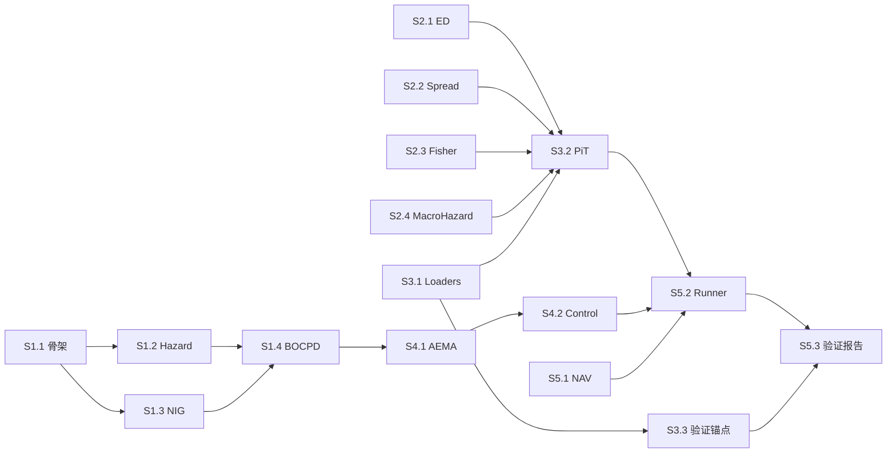

# ED+BOCPD POC — User Stories & Tasks

> **源文档**：[SRD v1.2](file:///Users/weizhang/.gemini/antigravity/brain/2aec81b0-493d-4973-8c1d-a9f7c5da6ca5/artifacts/SRD_v1_complete.md) · [ADD](file:///Users/weizhang/.gemini/antigravity/brain/2aec81b0-493d-4973-8c1d-a9f7c5da6ca5/artifacts/ADD_bocpd_poc.md)  
> **工作目录**：`/Users/weizhang/w/cycle-monitor-workspace/topo-math/`  
> **分支策略**：每个 Phase 一个分支 `feature/liquidity-phase-{N}`

---

## 通用工程约束（适用于所有 Story）

每个 Story 交付前**必须**满足以下条件，否则不算完成：

| ID | 约束 | 验证命令 |
|----|------|---------|
| G-1 | Docker 内执行 | `docker-compose run --rm test pytest tests/unit/liquidity/ -v --tb=short` |
| G-2 | ruff 零警告 | `docker-compose run --rm test ruff check src/liquidity/ --fix` |
| G-3 | ruff 格式化 | `docker-compose run --rm test ruff format src/liquidity/` |
| G-4 | 无宿主机安装 | 禁止 `pip install`、`npx`、`npm install` |
| G-5 | git 审计 | Phase 完成时 `git status` 无未提交变更 |
| G-6 | 函数长度 | 单函数不超过 200 行 |

---

## Phase 1: BOCPD Engine Core

> **前置依赖**：无  
> **可并行**：Phase 2

---

### Story 1.1: 参数注册表与项目骨架

**作为** coding agent，**我需要** 创建 `src/liquidity/` 模块骨架和参数注册表 JSON，**以便** 后续所有模块有统一的配置入口和 import 路径。

**Tasks**:

- [ ] **T1.1.1** 创建目录结构：
  ```
  src/liquidity/__init__.py
  src/liquidity/config.py
  src/liquidity/engine/__init__.py
  src/liquidity/signal/__init__.py
  src/liquidity/data/__init__.py
  src/liquidity/control/__init__.py
  src/liquidity/backtest/__init__.py
  src/liquidity/resources/
  tests/unit/liquidity/__init__.py
  tests/integration/liquidity/__init__.py
  ```

- [ ] **T1.1.2** 创建 `src/liquidity/resources/bocpd_params.json`，内容严格按 ADD 2.1 节的 JSON 结构。

- [ ] **T1.1.3** 实现 `src/liquidity/config.py`：
  ```python
  import json
  from pathlib import Path

  def load_config() -> dict:
      """加载 bocpd_params.json 并返回 dict。"""
      path = Path(__file__).parent / "resources" / "bocpd_params.json"
      with open(path) as f:
          return json.load(f)
  ```

- [ ] **T1.1.4** 写一个冒烟测试 `tests/unit/liquidity/test_config.py`：
  - 验证 `load_config()` 返回 dict 且包含 `"hazard"`, `"nig_priors"`, `"aema"`, `"deadband"`, `"hold_period"`, `"mapping"`, `"execution"`, `"macro_hazard"` 八个顶层 key。
  - 验证参数值：`config["aema"]["alpha_down"] == 0.08`，`config["deadband"]["delta_up"] == 0.30`，`config["hold_period"]["min_qld_hold_days"] == 63`，`config["macro_hazard"]["lambda_floor"] == 0.002`。

**AC**:
- `docker-compose run --rm test pytest tests/unit/liquidity/test_config.py -v` 通过
- 所有 `__init__.py` 存在且 import 不报错

---

### Story 1.2: Hazard 函数预计算

**作为** coding agent，**我需要** 实现 SRD 第二章的游程长度调制函数 $g(r)$ 和 hazard 向量计算，**以便** BOCPD 引擎可以在每步获取正确的先验变点概率。

**Tasks**:

- [ ] **T1.2.1** 实现 `src/liquidity/engine/hazard.py`，包含两个纯函数：
  - `precompute_g_r(r_max=504, r_stable=63, kappa=5) -> np.ndarray`
    - SRD 2.2: `g(r) = 1 + kappa/(r+1)` 当 `r < r_stable`，否则 `g(r) = 1`
    - 返回 shape `(r_max + 1,)`
  - `compute_hazard(g_r, lambda_macro, r_max=504) -> np.ndarray`
    - SRD 2.1: `h = clip(lambda_macro * g_r, 0, 1)`
    - **强制截断**: `h[r_max] = 1.0`（SRD 2.3）
    - 返回 shape `(r_max + 1,)`

- [ ] **T1.2.2** 先写测试 `tests/unit/liquidity/test_hazard.py`：
  - `g_r[0] == 1 + 5/1 == 6.0`
  - `g_r[62] == 1 + 5/63 ≈ 1.0794`（初始收敛区最后一步）
  - `g_r[63] == 1.0`（稳态区起点）
  - `g_r[504]` 存在且为 `1.0`
  - `len(g_r) == 505`
  - `compute_hazard(g_r, lambda_macro=0.01)[504] == 1.0`（强制截断）
  - `all(0 <= h <= 1)`

**AC**:
- 所有断言 `atol=1e-12`
- 函数为纯函数、无副作用

---

### Story 1.3: NIG 共轭更新纯函数

**作为** coding agent，**我需要** 实现 SRD 3.4 节的在线递归 NIG 更新和 SRD 3.2 节的 Student-t 预测密度，**以便** BOCPD 引擎可以在每步计算似然和更新充分统计量。

**Tasks**:

- [ ] **T1.3.1** 实现 `src/liquidity/engine/nig.py`，包含两个纯函数：
  - `update_nig(old_stats: np.ndarray, x_t: np.ndarray) -> np.ndarray`
    - 输入 `old_stats` shape `(N, D, 4)` → `[mu, kappa, alpha, beta]`
    - 输入 `x_t` shape `(D,)`
    - 在线递归公式（SRD 3.4，逐行对齐）：
      ```
      kappa_new = kappa_old + 1
      mu_new = (kappa_old * mu_old + x_t) / kappa_new
      alpha_new = alpha_old + 0.5
      beta_new = beta_old + 0.5 * kappa_old * (x_t - mu_old)**2 / kappa_new
      ```
    - 返回 shape `(N, D, 4)`

  - `predictive_logpdf(suff_stats: np.ndarray, x_t: np.ndarray) -> np.ndarray`
    - 计算三维条件独立 Student-t 联合对数密度
    - `nu = 2 * alpha`，`sigma2 = beta * (kappa + 1) / (alpha * kappa)`
    - 返回 shape `(N,)` — 三个维度的 log-pdf 求和

- [ ] **T1.3.2** 先写测试 `tests/unit/liquidity/test_nig.py`：
  - **确定性数据**：先验 `(mu=0, kappa=5, alpha=2.5, beta=1.5)`，观测 `x=4.0`
  - 解析验证（SRD SC-4 地面真值）：
    - `kappa_new == 6`
    - `mu_new == 4.0/6 ≈ 0.6667`
    - `alpha_new == 3.0`
    - `beta_new == 1.5 + 0.5 * 5 * 16.0 / 6 ≈ 8.1667`
  - **多步确定性**：20 步全零后，`kappa[r=20] == 25`，`alpha[r=20] == 12.5`（线性增长 INV-6）
  - **logpdf 非 NaN**：对任意合法输入，`predictive_logpdf` 输出有限

**AC**:
- 解析精度 `atol=1e-10`
- 向量化实现（不使用 Python for 循环遍历 N）

---

### Story 1.4: BOCPD 引擎核心 — 五步循环

**作为** coding agent，**我需要** 实现 SRD 第八章的 BOCPD 引擎类，**以便** 输入三维观测和宏观 hazard 后输出变点后验概率 $P_{cp}$。

**前置**：Story 1.2 + 1.3 完成。

**Tasks**:

- [ ] **T1.4.1** 实现 `src/liquidity/engine/bocpd.py`：
  - `BOCPDState` dataclass：`run_length_probs (505,)`, `suff_stats (505, 3, 4)`, `t: int`
  - `BOCPDEngine.__init__(self, config: dict)`：
    - 从 config 加载 hazard 参数和 NIG 先验
    - 预计算 `g_r` 向量
    - 初始化状态：`probs[0] = 1.0`，`suff_stats[:] = prior`
  - `BOCPDEngine.update(self, x_t, lambda_macro) -> float`：
    - 五步核心循环（SRD 8.2）：
      1. 计算预测密度 `predictive_logpdf`
      2. 计算 hazard 向量 `compute_hazard`
      3. 后验更新：`new[0] = sum(probs * hazard * pred)`，`new[1:] = probs[:-1] * (1-hazard[:-1]) * pred[:-1]`
      4. 归一化
      5. NIG 更新：`new_stats[0] = prior`，`new_stats[1:] = update(old[:-1], x_t)` （SRD 8.4 偏移保护）
    - 返回 `new_probs[0]`（即 $P_{cp}^{\text{raw}}$）
  - `get_state()` / `set_state()`

- [ ] **T1.4.2** 先写测试 `tests/unit/liquidity/test_bocpd_invariants.py`（P0 级）：
  - 使用 5 步手工确定性数据 `DETERMINISTIC_CALM`（ADD 2.3 节）
  - 每步断言：
    - **INV-1**: `abs(sum(probs) - 1.0) < 1e-12`
    - **INV-2**: `all(probs >= 0)`
    - **INV-4**: `suff_stats[0] == prior`（全 4 个参数精确匹配）
    - **INV-6**: `kappa[k] == kappa_0 + k`（对 k=0,1,2,3,4 逐项验证）

- [ ] **T1.4.3** 先写测试 `tests/unit/liquidity/test_bocpd_scenarios.py`（P1 级）：
  - 20 步全零 + 第 21 步 `[4.0, 4.0, 4.0]` 冲击
  - **SC-1**: 冲击后 `p_cp > 0.3`
  - **SC-2**: `probs[0] > probs[21]`（长游程坍塌）
  - **SC-4**: `r=1` 的 NIG 精确值 `mu=0.6667, kappa=6, alpha=3.0, beta=8.1667`（ED 维度）
  - **SC-6**: 三维同时冲击的 `p_cp` > 单维度冲击的 `p_cp`

**AC**:
- 所有 P0 + P1 测试通过
- 56 KB 内存预算（505 × 3 × 4 × 8byte + 505 × 8byte × 2）
- 覆盖率 > 95%（`engine/` 目录）

---

## Phase 2: Feature Engineering

> **前置依赖**：无（可与 Phase 1 并行）

---

### Story 2.1: 特征值离散度加速度（ED Accel）

**作为** coding agent，**我需要** 实现 SRD 3.1 d1 的 ED 加速度特征，**以便** BOCPD 引擎可以接收协方差结构变化速率作为输入。

**Tasks**:

- [ ] **T2.1.1** 实现 `src/liquidity/signal/ed_accel.py`：
  - `compute_ed(returns: pd.DataFrame, window: int = 60) -> pd.Series`
    - 滚动窗口内计算协方差矩阵的特征值
    - ED = `max(eigenvalue) / sum(eigenvalues)` — 归一化最大特征值占比
    - 返回 `pd.Series`，index = Date
  - `compute_ed_accel(ed_series: pd.Series, median_window: int = 10) -> pd.Series`
    - 10 日滚动中位数后差分：`ed.rolling(10).median().diff()`

- [ ] **T2.1.2** 先写测试 `tests/unit/liquidity/test_ed_accel.py`：
  - 构造一个确定性 3×3 协方差矩阵（已知特征值 `[6, 3, 1]`），验证 `ED = 6/10 = 0.6`，精度 `atol=1e-10`
  - 输入全零矩阵时，ED 应返回 NaN（退化情况）
  - 输出 Series 的 index 是 DatetimeIndex

**AC**:
- 纯函数，无网络调用
- 输出无意外 NaN（预热窗口内的 NaN 是预期的）

---

### Story 2.2: 买卖价差异常（Spread Anomaly）

**作为** coding agent，**我需要** 实现 SRD 3.1 d2 的价差异常 Z-score，**以便** BOCPD 引擎可以接收做市商退出程度信号。

**Tasks**:

- [ ] **T2.2.1** 实现 `src/liquidity/signal/spread_anomaly.py`：
  - `compute_spread_anomaly(vix: pd.Series, lookback: int = 252) -> pd.Series`
    - POC 使用 VIX 作为代理
    - `Z = (VIX_t - rolling_mean_252) / rolling_std_252`
  - 注意 `min_periods` 应设置为 `lookback // 2`，避免预热期过长

- [ ] **T2.2.2** 先写测试 `tests/unit/liquidity/test_spread_anomaly.py`：
  - 构造常数序列 `[20.0] * 300`，验证 Z ≈ 0（标准差为零时用 `std + eps` 防 NaN）
  - 构造阶跃序列（前 252 天 = 15，第 253 天突跳到 40），验证 Z > 3

**AC**:
- 纯函数
- 常数输入不产生 NaN（需处理 std=0 的退化情况）

---

### Story 2.3: Fisher 变换滚动相关性

**作为** coding agent，**我需要** 实现 SRD 3.1 d3 的 Fisher(ρ) 特征，**以便** BOCPD 引擎可以检测 ED 与价差的同步化程度。

**Tasks**:

- [ ] **T2.3.1** 实现 `src/liquidity/signal/fisher_rho.py`：
  - `compute_fisher_rho(series_a, series_b, window=20) -> pd.Series`
    - `rho = series_a.rolling(window).corr(series_b)`
    - `fisher = 0.5 * np.log((1 + rho) / (1 - rho))`
    - 边界处理：`rho` clip 到 `(-0.9999, 0.9999)` 防无穷大
  - **SRD 3.5 约束**：窗口禁止截断。函数内部不接受任何"变点"参数。

- [ ] **T2.3.2** 先写测试 `tests/unit/liquidity/test_fisher_rho.py`：
  - 完美正相关 `(a == b)` → `rho ≈ 1.0` → `fisher` 为有限正大值（被 clip 保护）
  - 独立随机序列（固定种子） → `rho ≈ 0` → `fisher ≈ 0`
  - 函数签名中不存在 `changepoint` 或 `reset` 参数

**AC**:
- 纯函数，无变点反馈
- Fisher 输出全部有限（无 inf、无 NaN 在有效窗口后）

---

### Story 2.4: 宏观 Hazard 率合成 (lambda_macro)

**作为** coding agent，**我需要** 实现从四个宏观变量（Fed Reserves, RRP, TGA, FRA-OIS）到标量 hazard 率 $\lambda_{\text{macro}}$ 的合成模块，**以便** BOCPD 引擎的先验变点概率能根据宏观流动性环境动态调整。

**背景**：四个宏观变量量级差异巨大（万亿美元 vs 基点利差），更新频率不同（日频 vs 周频），需要无分布假设的归一化方法。

**Tasks**:

- [ ] **T2.4.1** 在 `bocpd_params.json` 中新增 `macro_hazard` 配置块：
  ```json
  "macro_hazard": {
    "lambda_floor": 0.002,
    "lambda_ceil": 0.016,
    "rank_lookback": 504,
    "weights": {
      "walcl": 0.25,
      "rrp": 0.25,
      "tga": 0.25,
      "fra_ois": 0.25
    }
  }
  ```

- [ ] **T2.4.2** 实现 `src/liquidity/signal/macro_hazard.py`，包含四个纯函数：

  ```python
  def directional_transform(walcl, rrp, tga, fra_ois) -> dict[str, pd.Series]:
      """
      Step 1: 方向变换——统一为 "紧缩 = 正方向"。

      - WALCL: -pct_change(20d)  # 储备缩减 = 紧缩
      - RRP:   -pct_change(5d)   # RRP 下降 = 缓冲垫缩减
      - TGA:   +pct_change(20d)  # 财政部囤现金 = 抽取流动性
      - FRA-OIS: 直接使用 level   # 利差本身就是紧缩信号
      """

  def rolling_percentile_rank(signal, lookback=504) -> pd.Series:
      """
      Step 2: 滚动百分位数排名，输出 [0, 1]。
      无分布假设，自然消除量纲差异。
      """

  def composite_stress(
      ranks: dict[str, pd.Series],
      weights: dict[str, float],
  ) -> pd.Series:
      """
      Step 3: 加权复合。输出 [0, 1]。
      """

  def map_to_hazard(
      composite: pd.Series,
      lambda_floor: float = 0.002,
      lambda_ceil: float = 0.016,
  ) -> pd.Series:
      """
      Step 4: 线性映射到 hazard 率。
      lambda = floor + (ceil - floor) * composite
      安全约束: ceil=0.016，与 g(0)=6.0 相乘后 h(0,t)=0.096 < 1.0
      """
  ```

- [ ] **T2.4.3** 先写测试 `tests/unit/liquidity/test_macro_hazard.py`：
  - **方向变换**：WALCL 从 100 降到 95 → `signal > 0`（紧缩方向）
  - **百分位排名**：在均匀分布 `[0,1,...,503]` 上，最大值的 rank == 1.0，最小值的 rank ≈ 0.0
  - **复合**：等权 `[0.5, 0.5, 0.5, 0.5]` → `composite == 0.5`
  - **Hazard 映射**：`composite=0.0` → `lambda=0.002`，`composite=1.0` → `lambda=0.016`
  - **安全边界**：`lambda_ceil * g_r[0]` = `0.016 * 6.0 = 0.096 < 1.0`
  - **NaN 防御**：当某个变量全是 NaN 时，该变量的权重应自动重分配到其他变量

**AC**:
- 纯函数，无网络调用
- 输出始终在 `[lambda_floor, lambda_ceil]` 范围内
- lambda_ceil × g_r[0] < 1.0（hazard 不越界）
- 每个步骤可独立测试（方向变换、排名、复合、映射）

---

## Phase 3: Data Pipeline + PiT Alignment

> **前置依赖**：Phase 2（signal 模块的接口）

---

### Story 3.1: FRED 和价格数据加载器

**作为** coding agent，**我需要** 封装现有的 FRED 和 yfinance 数据获取，**以便** PiT 对齐器有标准化的数据输入。

**Tasks**:

- [ ] **T3.1.1** 实现 `src/liquidity/data/fred_loader.py`：
  - `load_fred_series(series_id, start_date, end_date) -> pd.DataFrame`
  - 复用 `src.collector.macro.fetch_fred_data()`
  - 返回 DataFrame 带 `observation_date` + 值列

- [ ] **T3.1.2** 实现 `src/liquidity/data/price_loader.py`：
  - `load_ohlc(tickers, start_date, end_date) -> dict[str, pd.DataFrame]`
  - `load_ndx_constituent_returns(start_date, end_date, top_n=50) -> pd.DataFrame`
  - POC 简化：硬编码前 50 成分股 ticker 列表

- [ ] **T3.1.3** 写冒烟测试（标记 `@pytest.mark.external_service`）：
  - 验证 `WALCL`、`RRPONTSYD`、`VIXCLS` 可获取且非空
  - 验证 QQQ、QLD、TLT OHLC 可获取且有 Open/Close 列

**AC**:
- 数据获取在 Docker 内通过 `--env-file .env` 运行
- 网络失败时抛出明确异常（不静默返回 None 然后后续 NaN 传染）

---

### Story 3.2: PiT 对齐引擎 + Lookback Padding

**作为** coding agent，**我需要** 实现 SRD 第五章的 PiT 时间戳偏移和填充逻辑，并内置 Lookback Padding 机制，**以便** 生成严格无前视偏差、零 NaN 的面板数据。

> [!CAUTION]
> **致命漏洞防护**：`macro_hazard` 需要 `rolling(504)`, `spread_anomaly` 需要 `rolling(252)`, `ed_accel` 需要 `rolling(60)+rolling(10)`。如果数据获取起点 == 回测起点，前 504 天的特征全部为 NaN，直接污染 BOCPD 引擎的 `suff_stats` 矩阵。必须将"获取数据的起点"与"系统运行的起点"严格脱钩。

**架构：yfinance-first 日历锚定**

```
┌─────────────────────────────────────────────────────────────────┐
│  Step 1: 粗取 QQQ OHLC (start_date - 800 cal days → end_date) │
│          → QQQ index = 交易日历真相源                           │
├─────────────────────────────────────────────────────────────────┤
│  Step 2: 从 QQQ index 中定位 start_date 对应的位置 idx          │
│          padded_start = trading_days[idx - MAX_LOOKBACK]        │
│          MAX_LOOKBACK = 504 (所有滚动窗口中最大的那个)           │
├─────────────────────────────────────────────────────────────────┤
│  Step 3: 用 padded_start (日历日期) 获取全部 FRED 和 yfinance   │
│          FRED 日历日 → reindex 到 trading_days → ffill          │
├─────────────────────────────────────────────────────────────────┤
│  Step 4: 在 padded 全量面板上计算 rolling 特征                  │
│          → rolling(504) 在 padded_start 处有足够历史            │
├─────────────────────────────────────────────────────────────────┤
│  Step 5: 裁剪到 [start_date, end_date]                         │
│          assert panel.isna().sum().sum() == 0  ← NaN 关门断言  │
│          → 送入 BOCPD 的第 0 天绝对干净                        │
└─────────────────────────────────────────────────────────────────┘
```

**Tasks**:

- [ ] **T3.2.1** 实现 `src/liquidity/data/pit_aligner.py` 核心 PiT 逻辑：
  - `PiTConfig` TypedDict
  - `PIT_RULES` 字典（ADD 4.2 节完整内容）
  - `apply_pit_offset(raw_df, config, trading_calendar) -> pd.Series`
    - 偏移：日期后推 `offset_days` 个交易日
    - 填充：`ffill` 或 `staircase`（H.4.1 专用）

- [ ] **T3.2.2** 实现交易日历锚定模块 `src/liquidity/data/trading_calendar.py`：
  ```python
  import pandas as pd

  MAX_LOOKBACK: int = 504  # 所有滚动窗口中最大的窗口
  CALENDAR_BUFFER: int = 800  # 日历日缓冲（504 交易日 ≈ 730 日历日 + 余量）

  def build_trading_calendar(
      start_date: str,
      end_date: str,
  ) -> pd.DatetimeIndex:
      """
      从 yfinance 获取 QQQ 价格索引作为交易日历真相源。
      获取范围: (start_date - CALENDAR_BUFFER cal days) → end_date
      返回: 精确的交易日序列
      """

  def compute_padded_start(
      trading_days: pd.DatetimeIndex,
      target_start: str,
      lookback: int = MAX_LOOKBACK,
  ) -> pd.Timestamp:
      """
      在交易日历中定位 target_start，然后向前回退 lookback 个交易日。
      返回: padded_start（一个精确的日历日期，不是近似值）
      """
  ```

- [ ] **T3.2.3** 实现带 Padding 的面板构建 `build_pit_aligned_panel`：
  ```python
  def build_pit_aligned_panel(
      start_date: str,
      end_date: str,
  ) -> pd.DataFrame:
      """
      构建完整的 PiT 对齐面板数据（已裁剪，零 NaN）。

      内部流程:
      1. build_trading_calendar → 交易日序列
      2. compute_padded_start → padded_start
      3. 用 padded_start 获取 FRED + yfinance 全量数据
      4. PiT 对齐 → 重采样到交易日历
      5. 在 padded 面板上计算全部滚动特征
      6. 裁剪到 [start_date, end_date]
      7. NaN 关门断言

      Returns:
          DataFrame[start_date:end_date], columns = [
              QQQ_Open, QQQ_Close, QLD_Open, QLD_Close, TLT_Close,
              WALCL, RRPONTSYD, WTREGEN, SOFR, VIXCLS,
              ED_ACCEL, SPREAD_ANOMALY, FISHER_RHO, LAMBDA_MACRO
          ]
          保证: 零 NaN
      """
  ```

- [ ] **T3.2.4** 实现 NaN 关门断言（在 `build_pit_aligned_panel` 返回前强制执行）：
  ```python
  def _assert_no_nan(panel: pd.DataFrame, start_date: str, end_date: str) -> None:
      """
      NaN 关门检查。如果裁剪后的面板有任意 NaN，
      立即抛出 ValueError 并报告受污染的列名和行数。
      这是物理安全阀，不是可跳过的 warning。
      """
      trimmed = panel.loc[start_date:end_date]
      nan_cols = trimmed.columns[trimmed.isna().any()].tolist()
      if nan_cols:
          nan_counts = trimmed[nan_cols].isna().sum().to_dict()
          raise ValueError(
              f"NaN contamination in panel after padding! "
              f"Affected columns: {nan_counts}. "
              f"This means MAX_LOOKBACK={MAX_LOOKBACK} is insufficient "
              f"or data source has gaps."
          )
  ```

- [ ] **T3.2.5** 先写测试 `tests/unit/liquidity/test_pit_aligner.py`：
  - **偏移测试**：SOFR（offset=1）的数据在 T 日不可用，T+1 日才可用
  - **阶梯填充**：模拟周四发布的 H.4.1，验证周五-周三保持该值
  - **休市处理**：美股休市日面板无行（不填充伪数据）
  - **Padding 充分性**：用 `start_date=2010-01-04` 构建面板，验证返回数据的第一行日期 == `2010-01-04`（不是更早）
  - **NaN 关门回归测试**：构造一个故意不充分的 padding（`MAX_LOOKBACK=10`），验证 `_assert_no_nan` 抛出 `ValueError`
  - **日历精度**：验证 `compute_padded_start("2020-01-02", 504)` 返回的日期恰好是 2020-01-02 往前第 504 个交易日（大约 2017-12-28 附近），精确到日

**AC**:
- 对每个变量验证 `available_at >= decision_time`
- 偏移后面板无前视偏差
- **裁剪后面板零 NaN**（`_assert_no_nan` 通过）
- FRED 日历日到交易日的对齐由 yfinance 价格索引驱动，不使用 `timedelta` 近似
- `LAMBDA_MACRO` 列在输出面板中存在且完整

---

### Story 3.3: 验证锚点数据加载与标注 (Validation Anchors)

**作为** coding agent，**我需要** 加载 SRD 7.5 中定义的独立验证锚点（Treasury Fails 和 SOFR Volume），**以便** 回测评估可以用物理上独立的指标来验证系统的假阳性率（FPR），而这些指标绝对不参与 BOCPD 的信号路径。

> **架构铁律**：这些数据仅作为回测评估的标签，绝对不能作为信号输入或 hazard 率的输入。如果将验证数据混入信号路径，会产生自我指涉的循环验证，丧失独立性。

**Tasks**:

- [ ] **T3.3.1** 在 `src/liquidity/data/fred_loader.py` 中新增两个验证变量的加载支持：
  - Treasury Settlement Fails：NY Fed 数据，偏移 T-10 工作日
  - SOFR Volume：FRED series `SOFRVOLUME`，偏移 T-1

- [ ] **T3.3.2** 实现 `src/liquidity/backtest/validation.py`：
  ```python
  from typing import TypedDict

  class StressLabel(TypedDict):
      date: str
      treas_fails_elevated: bool   # Fails > 历史 90th 百分位
      sofr_vol_spike: bool         # Volume > 历史 95th 百分位
      is_stress_period: bool       # 任一为 True

  def label_stress_periods(
      treas_fails: pd.Series,
      sofr_volume: pd.Series,
      fails_threshold_pct: float = 0.90,
      sofr_threshold_pct: float = 0.95,
  ) -> pd.DataFrame:
      """
      根据独立验证锚点标注压力期。
      输出: DataFrame, 每行 = 1 个交易日，列 = [treas_fails_elevated, sofr_vol_spike, is_stress_period]
      """

  def compute_fpr(
      p_cp_series: pd.Series,
      stress_labels: pd.DataFrame,
      threshold: float = 0.30,
  ) -> dict:
      """
      计算假阳性率：在独立标注的非压力期内，P_cp > threshold 的天数占比。

      Returns:
          {"fpr": float, "calm_days": int, "false_alarms": int,
           "stress_days": int, "true_alarms": int, "detection_rate": float}
      """
  ```

- [ ] **T3.3.3** 先写测试 `tests/unit/liquidity/test_validation.py`：
  - **假阳性率**：构造 100 天非压力期，P_cp 全部 = 0.01，验证 FPR == 0
  - **检测率**：构造 10 天压力期，P_cp 全部 = 0.5，验证 detection_rate == 1.0
  - **模块隔离**：确认 `validation.py` 不 import `signal/` 或 `engine/` 下的任何模块（防止意外耦合）

**AC**:
- Treasury Fails 和 SOFR Volume 不在 `build_pit_aligned_panel` 的输出列中（不进入信号路径）
- `validation.py` 不 import `bocpd.py`、`aema.py` 或任何 signal 模块
- FPR 计算逻辑与 P_cp 生成逻辑完全解耦

---

## Phase 4: Control Chain

> **前置依赖**：Phase 1（BOCPD 引擎的 `p_cp_raw` 输出）

---

### Story 4.1: AEMA 滤波器

**作为** coding agent，**我需要** 实现 SRD 4.1 节的非对称 EMA 滤波器，**以便** 原始 $P_{cp}$ 被平滑为适合中期波段决策的信号。

**Tasks**:

- [ ] **T4.1.1** 实现 `src/liquidity/control/aema.py`：
  - `AEMA` 类，`__init__` 接收 `alpha_up=0.50, alpha_down=0.08, circuit_breaker=0.70`
  - `update(p_cp_raw) -> float`：
    - `p_raw > p_smooth` → 使用 `alpha_up`
    - 否则 → 使用 `alpha_down`
    - 熔断器：`p_raw > circuit_breaker` → 直接返回 `p_raw`，同时更新内部状态

- [ ] **T4.1.2** 先写测试 `tests/unit/liquidity/test_aema.py`：
  - 参数化测试（上升/下降/熔断三种场景）
  - `alpha_down=0.08` 的半衰期验证：从 `p=0.5` 连续输入 `p_raw=0.0`，验证 ~8.3 步后衰减 50%
  - 熔断器测试：`p_raw=0.8` 时输出 == 0.8（不被平滑）

**AC**:
- `alpha_down` 默认值为 `0.08`（SRD v1.2）
- 无状态泄漏（每个实例独立）

---

### Story 4.2: 杠杆映射 + 死区 + 持仓约束

**作为** coding agent，**我需要** 实现 SRD 4.2-4.5 节的完整控制链（映射→死区→持仓约束→配比），**以便** 系统输出 QLD/QQQ/Cash 的目标仓位。

**Tasks**:

- [ ] **T4.2.1** 实现 `src/liquidity/control/leverage_map.py`：
  - `compute_leverage(p_cp_smooth, sigma_calm=0.18, sigma_stress=0.45, sigma_target=0.36) -> float`
  - SRD 4.2: `L = (1 - P) * sigma_target / sigma_hat`
  - 关键值验证：`P=0 → L=2.0`，`P=1 → L=0`，`P=0.5 → L ≈ 0.571`

- [ ] **T4.2.2** 实现 `src/liquidity/control/deadband.py`：
  - `apply_deadband(l_target, l_current, delta_down=0.05, delta_up=0.30, recovery_coeff=0.15) -> float`
  - SRD 4.4 (v1.2)：三分支逻辑

- [ ] **T4.2.3** 实现 `src/liquidity/control/hold_period.py`：
  - `QLDHoldPeriodGuard` 类，跟踪 QLD 持仓天数
  - `check(l_actual, p_cp_raw, l_current) -> float`
  - SRD 4.5：63 天内常规去杠杆忽略，熔断（>0.70）除外

- [ ] **T4.2.4** 实现 `src/liquidity/control/allocator.py`：
  - `allocate(L) -> Allocation`
  - SRD 4.3：`L >= 1` → QLD = L-1, QQQ = 2-L；`L < 1` → QQQ = L, Cash = 1-L

- [ ] **T4.2.5** 先写测试 `tests/unit/liquidity/test_deadband.py`：
  - | l_current | l_target | expected_output | 场景 |
    |-----------|----------|-----------------|------|
    | 1.5 | 1.48 | 1.5 | 死区内不动 |
    | 1.5 | 1.0 | 1.0 | 去杠杆立即全额 |
    | 0.5 | 1.2 | 0.5 | 死区内不动（ΔL=0.7 > 0.30 但…等下）|
  - 实际：`l_target - l_current = 0.7 > 0.30` → `0.5 + 0.15 * 0.7 = 0.605`
  - 持仓约束：`days=10, p_raw=0.3` → 保持；`days=10, p_raw=0.8` → 允许退出

**AC**:
- 映射函数：P=0 → L=2.0, P=1 → L=0
- 死区：`delta_up=0.30, recovery_coeff=0.15`（SRD v1.2）
- 持仓约束：63 天，熔断例外
- 配比：L=1.5 → QLD=0.5, QQQ=0.5, Cash=0

---

## Phase 5: Backtest Harness

> **前置依赖**：Phase 1 + 2 + 3 + 4 全部完成

---

### Story 5.1: 滑点模型 + 两步 NAV

**作为** coding agent，**我需要** 实现 SRD 第六章的滑点公式和两步 NAV 更新，**以便** 回测产生精确的净值曲线。

**Tasks**:

- [ ] **T5.1.1** 实现 `src/liquidity/backtest/slippage.py`：
  - `compute_slippage(sigma_hat, s0=0.0003, s1=0.0002, sigma_normal=0.18) -> float`
  - SRD 6.2: `Slippage = s0 + s1 * sigma_hat / sigma_normal`

- [ ] **T5.1.2** 实现 `src/liquidity/backtest/nav.py`：
  - `NAVUpdate` TypedDict（ADD 6.1 节完整字段）
  - `two_step_nav(nav_t, l_old, l_new, open_price, close_t, close_t1, slippage) -> NAVUpdate`
  - SRD 6.3：
    - 步骤 1：`nav_pre = nav_t * (1 + l_old * r_overnight)`
    - 步骤 2：`nav_close = nav_pre * (1 - c_true) * (1 + l_new * r_intraday)`
    - `c_true = |l_new - l_old| * slippage`
  - Gap 仅记录在 `gap_attribution`，**不参与 NAV**

- [ ] **T5.1.3** 先写测试 `tests/unit/liquidity/test_nav.py`：
  - 确定性场景：`nav=100, l_old=1.5, l_new=1.5, open=101, close_t=100, close_t1=102`
    - `r_overnight = 101/100 - 1 = 0.01`
    - `nav_pre = 100 * (1 + 1.5 * 0.01) = 101.5`
    - `c_true = 0`（无调仓）
    - `r_intraday = 102/101 - 1 ≈ 0.0099`
    - `nav_close ≈ 101.5 * 1 * (1 + 1.5 * 0.0099) ≈ 103.007`
  - **无双重扣除验证**：确认 `c_true` 只包含 `|ΔL| * slippage`，不含 gap

**AC**:
- 确定性场景精度 `atol=1e-6`
- Gap 不从 NAV 扣除（SRD 6.3 修正条款）

---

### Story 5.2: 回测主循环 + Docker 服务

**作为** coding agent，**我需要** 将所有模块集成为日频回测循环，**以便** 可以对历史数据运行 QLD 波段择时策略并评估表现。

**前置**：Story 5.1 完成。

**Tasks**:

- [ ] **T5.2.1** 实现 `src/liquidity/backtest/attribution.py`：
  - 记录每次调仓的归因信息
  - 记录 QLD 波段进出日志（进入日、退出日、持仓天数、波段收益）

- [ ] **T5.2.2** 实现 `src/liquidity/backtest/runner.py`：
  - `BacktestResult` dataclass（ADD 6.1 节）
  - `run_segment(panel, config, segment_name, burnin_days=504) -> BacktestResult`
  - 主循环逻辑（每个交易日）：
    1. 提取三维观测 `[ED_ACCEL, SPREAD_ANOMALY, FISHER_RHO]`
    2. 从面板读取预计算的 `lambda_macro`（由 Story 2.4 的 `macro_hazard.py` 在 PiT 面板构建时已计算）
    3. `p_cp_raw = bocpd.update(x_t, lambda_macro)`
    4. `p_cp_smooth = aema.update(p_cp_raw)`
    5. `l_target = compute_leverage(p_cp_smooth)`
    6. `l_actual = apply_deadband(l_target, l_current)`
    7. `l_actual = hold_guard.check(l_actual, p_cp_raw, l_current)`
    8. `allocation = allocate(l_actual)`
    9. `nav_update = two_step_nav(...)`
    10. 记录所有状态
  - SRD 7.1：跨区段不共享状态
  - SRD 7.2：初始化协议（BOCPD 稳态先验 τ=126，AEMA 前 20 天中位数）

- [ ] **T5.2.3** 在 `docker-compose.yml` 中添加 `liquidity-test` 和 `liquidity-backtest` 服务（ADD 6.2 节）

- [ ] **T5.2.4** 写端到端冒烟测试 `tests/integration/liquidity/test_backtest_smoke.py`：
  - 使用 50 天确定性合成面板（手工构造，不涉及网络）
  - 验证：
    - NAV 序列无 NaN
    - NAV 序列长度 == 面板长度 - burnin
    - 所有 allocation 的 QLD + QQQ + Cash ≈ 1.0（`atol=1e-6`）
    - QLD 波段日志中所有波段持仓天数 >= 63（最低持仓期）或由熔断退出

- [ ] **T5.2.5** `git status` 审计 + 全量回归：
  ```bash
  docker-compose run --rm liquidity-test
  ```

**AC**:
- 50 天合成数据端到端通过
- QLD 波段日志正确记录
- docker-compose.yml 新服务可正常启动
- `git status` 干净

---

### Story 5.3: 独立验证报告

**作为** coding agent，**我需要** 将 Story 3.3 的验证锚点与回测结果对齐生成 FPR 报告，**以便** 评估系统在物理上独立的标尺下的表现。

**前置**：Story 5.2 + Story 3.3 完成。

**Tasks**:

- [ ] **T5.3.1** 在 `runner.py` 的 `BacktestResult` 中新增 `validation_report: dict | None`

- [ ] **T5.3.2** 在 `run_segment()` 报告生成后，如果验证数据可用，调用 `compute_fpr()` 并写入 `validation_report`

- [ ] **T5.3.3** 写整合测试：
  - 构造合成面板 + 合成验证标签
  - 验证 `validation_report["fpr"]` 是有效的浮点数
  - 验证结果与手工计算一致

**AC**:
- 验证报告包含 FPR、检测率、平静期天数、假警报天数
- 验证数据与信号数据完全解耦

---

## 依赖矩阵



## 执行建议

| 时间线 | 执行 | 说明 |
|-------|------|------|
| Week 1 | S1.1 → S1.2 + S1.3 (并行) → S1.4 | BOCPD 引擎闭环 |
| Week 1 | S2.1 + S2.2 + S2.3 + S2.4 (并行) | 快时钟特征 + 慢时钟合成 |
| Week 2 | S3.1 → S3.2 + S3.3 (并行) | 数据管线 + 验证锚点 |
| Week 2 | S4.1 → S4.2 | 控制链 |
| Week 3 | S5.1 → S5.2 → S5.3 | 回测集成 + 独立验证 |
